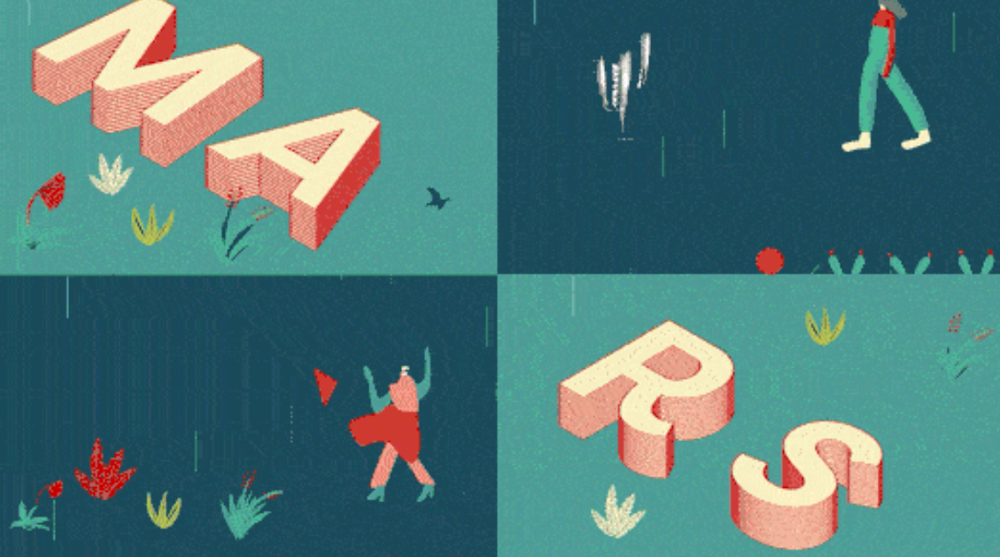

# Cours 5

## Illustrator - intermédiaire

<!-- MM a ajouté ceci car on doit présenter le TP1 au cours 5 -->
# 2025 Présentation TP1
## Partie 1 remise le 26-27 février (le jour de votre cours)
[TP1 : Partie 1 illustrations (Illustrator)](https://tim-montmorency.com/compendium/582-214-animation2d-jf-mm/exercice_ai/travail1.html)
## Partie 2 remise le 19-20 mars (le jour de votre cours)
[TP1 : Partie 2 animations (After effects)](https://tim-montmorency.com/compendium/582-214-animation2d-jf-mm/exercices_ae/travail1.html) 

### Exportation et crayon

- <a href="https://cmontmorency365.sharepoint.com/:v:/s/TIM-582214-Animation2d77/ERSReehDFyBBhkRuuu-IZuAB3g1PvdYW3C3dVaeMAA4rwQ?e=DAE16t">Exportation</a>
- <a href="https://cmontmorency365.sharepoint.com/:v:/s/TIM-582214-Animation2d77/EdlQKYC_ZdNFlN6W7cq54kQBx3evpB7o0TitXQJEt3PhJA?e=yDenP2">Crayon (N)</a>
- <a href="https://cmontmorency365.sharepoint.com/:v:/s/TIM-582214-Animation2d77/Ef1TjjvjbjhAtZ8e69VC-UcByeZDRGWB510iZODaHbimuA?e=AYxsmx">Shaper</a>
- <a href="https://cmontmorency365.sharepoint.com/:v:/s/TIM-582214-Animation2d77/EVQXT9fceRlGie7B72m9r7kB2HO8KaT1kRVhvWu2yvV0QA?e=wEvZsD">Simplifier les contours</a>
   

[🛠️ Crayon et shaper](exercice_ai/05_crayon_shaper.md){ .md-button }    

      
### Pinceau, découpe et vectorisation

- <a href="https://cmontmorency365.sharepoint.com/:v:/s/TIM-582214-Animation2d77/EeAcTCH7CUZKk6CTkwhG8-8B371RWYGBXqiUseW9LAPJlw?e=jmHAt8">Pinceau (B)</a>
- <a href="https://cmontmorency365.sharepoint.com/:v:/s/TIM-582214-Animation2d77/Eaj8dcdB3IlEvz_zXQ6QmxQBUiJDGSGWzRMFp95_vIWiCg?e=Fr2HLA">Jonction</a>
- <a href="https://cmontmorency365.sharepoint.com/:v:/s/TIM-582214-Animation2d77/ESwTH2I8Do9MkjRnKNnodHABW-DFUVG36G02AtTJyBw7GA?e=Vn0DiO">Gomme (Maj +E)</a>
- <a href="https://cmontmorency365.sharepoint.com/:v:/s/TIM-582214-Animation2d77/EYJAvExXxTZMtSkvOcHpmY4BFB9vIRqNkXUIPnRLT8MG1w?e=d9i3S6">Cutter</a>
- <a href="https://cmontmorency365.sharepoint.com/:v:/s/TIM-582214-Animation2d77/EVYeu9N1iG9MrndylAX0FCEBYlPJXMPRPQ5BPm0N4Jf6rw?e=uX8L5i">Vectoriser les contours</a>
   
[🛠️ Papillon](exercice_ai/06_papillon.md){ .md-button }      

[🛠️ Pinceau](exercice_ai/06_pinceau.md){ .md-button }    
      
### Couleurs

- <a href="https://cmontmorency365.sharepoint.com/:v:/s/TIM-582214-Animation2d77/Ea783BGLQzRBgjwFvcAyOJwBYcbMshlxCp12LoJcARYxSw?e=oQGVWK">Palettes de couleur</a>
- <a href="https://cmontmorency365.sharepoint.com/:v:/s/TIM-582214-Animation2d77/EZNNl0cu2UFNjXKl-TvCnLYBXAmQNyVYQieAOLXZ1tL3oA?e=ZNElRZ">Dégradé linéaire</a>
- <a href="https://cmontmorency365.sharepoint.com/:v:/s/TIM-582214-Animation2d77/ETebMpCBOyNMucE0tQ2Fk9wBZ3QxjLDA_IE6lofPqVHnEw?e=SxmJfe">Dégradé point ligne</a>
- <a href="https://cmontmorency365.sharepoint.com/:v:/s/TIM-582214-Animation2d77/EQ3-rGmHAAZBgEp60EqLqEYBsnU2yMeGLbnd6PqUscIx3g?e=SCfPT1">Filet</a>
- <a href="https://cmontmorency365.sharepoint.com/:v:/s/TIM-582214-Animation2d77/EdohoqrJg_BKkGef_AdV5cYBGI4ULInbsE701imTzFYpXQ?e=dbjH0E">Pipette (I)</a>

   

[🛠️ Nuancier](exercice_ai/07_nuancier.md){ .md-button }    
      
### Transformations et marionnette

- <a href="https://cmontmorency365.sharepoint.com/:v:/s/TIM-582214-Animation2d77/EdBWqucj7k9Dh5_jn3fYoCMB0_qZHEyl9ACh9kt5m8bF2w?e=NMhSBa">Rotation (R)</a>
- <a href="https://cmontmorency365.sharepoint.com/:v:/s/TIM-582214-Animation2d77/EVA2GDg_Ry5OqiqITnUHteIBIqhtsjnvK2Tn-dDnhCVm7w?e=ESdBKh">Miroir (O)</a>
- <a href="https://cmontmorency365.sharepoint.com/:v:/s/TIM-582214-Animation2d77/EZrlGGsydSFGvRTQiMmKk2sBOBh-CVRvqsgl064-3y1xwA?e=EygQh5">Mise à l'échelle</a>
- <a href="https://cmontmorency365.sharepoint.com/:v:/s/TIM-582214-Animation2d77/EezPmr0wvPZOngNTrsMfL-cB_W0o5dfSxYFgOG4ukwH1yw?e=KNXifs">Transformation manuelle (E)</a>
- <a href="https://cmontmorency365.sharepoint.com/:v:/s/TIM-582214-Animation2d77/EeGkbYSu5qhKpEkrqKIeTFEBbDaJ8iIOuG_Bwd1RErqSrg?e=4AyZ7D">Marionnette</a>
- <a href="https://cmontmorency365.sharepoint.com/:v:/s/TIM-582214-Animation2d77/EbffAjE-YKVJgwiDrsyj6oUB5TwGqv1eoJH6DNpA_4F7TA?e=vAlCCc">Marionnette filet</a>
   

[🛠️ Marionnette](exercice_ai/08_marionnette.md){ .md-button }    
      
### Alignement

- <a href="https://cmontmorency365.sharepoint.com/:v:/s/TIM-582214-Animation2d77/EZj0BIRpahBOhBFsRbp5bhsB3Tqi7PdKLrqhN1uFF16M0Q?e=OTxr5u">Pathfinder</a>
- <a href="https://cmontmorency365.sharepoint.com/:v:/s/TIM-582214-Animation2d77/EXc4p7G-tdtLib26nMAzxdABOWhH7mXFBMbFxPMWZTZ4KQ?e=xQgc5c">Alignement</a>
- <a href="https://cmontmorency365.sharepoint.com/:v:/s/TIM-582214-Animation2d77/EXW12cP0Y7FAhWo7D1LXOKkBa6cCvPUSEfJ-bkwRD5iTyg?e=qElAnj">Répartition</a>
   

[🛠️ Pathfinder](exercice_ai/09_pathfinder.md){ .md-button }    
      
### Masques

- <a href="https://cmontmorency365.sharepoint.com/:v:/s/TIM-582214-Animation2d77/EeeL6EuK-iBFpZI-Jt3RcBgBxRHPRwgJkhDs-hjFkU0hKA?e=AQ2U2G">Écrêtage</a>
- <a href="https://cmontmorency365.sharepoint.com/:v:/s/TIM-582214-Animation2d77/EXK9TJqqjEFFn0Wc9ZgFZhIBGhOdfNSoxoXmJRJtQPJJkA?e=q9rtSz">Masque, Transparence</a>
   

[🛠️ Masques](exercice_ai/10_masques.md){ .md-button }        

[🛠️ Transparence](exercice_ai/10_transparence.md){ .md-button }    

### Typographie   

- <a href="https://cmontmorency365.sharepoint.com/:v:/s/TIM-582214-Animation2d77/EY32kr9fiIBKk6377mmLce4B0_gSdA9FPrqZuup9MkJIAw?e=1TF1SI">Typographie (T)</a>
- <a href="https://cmontmorency365.sharepoint.com/:v:/s/TIM-582214-Animation2d77/EaKBbLH7h-FDiwKI-FGe5AkBqraWHZlF1Ec0192Ctjw3eg?e=shhqmb">Paragraphe</a>
- <a href="https://cmontmorency365.sharepoint.com/:v:/s/TIM-582214-Animation2d77/EShlgqaZhONJkmNl81kxbx8Bl9jVH0iWfnlji4nEW6oUOA?e=5CV4Qf">Activation des polices</a>
- <a href="https://cmontmorency365.sharepoint.com/:v:/s/TIM-582214-Animation2d77/ESzwupB5CgBMqzWMgS6_CXcBh5iB6h0wXK3QYmZCTALSvg?e=ZRHnrk">Texte captif horizontal</a>
- <a href="https://cmontmorency365.sharepoint.com/:v:/s/TIM-582214-Animation2d77/EbU9cAE0CrRLiPjL2sq9X_wBrzs3ey_2mCmVN8gjAmmGXQ?e=UtW8iM">Texte captif vertical</a>
 
[🛠️ Mise en page](exercice_ai/11_mise_page.md){ .md-button }          

[🛠️ Typographie](exercice_ai/11_typographie.md){ .md-button }          
      
### Précisions sur le travail 1

- <a href="https://cmontmorency365.sharepoint.com/:f:/s/TIM-582214-Animation2d77/EhR-OzQO_t1KkGjAf0Wu6nMB38jUZ55LbFHtxw4f33XqFg?e=eZSTew">Nomenclature des calques</a>
- <a href="https://cmontmorency365.sharepoint.com/:v:/s/TIM-582214-Animation2d77/EWhHJDR4d8dLqQk6Ydf5JwIByxBq09dSlQE-TyI3ey6nsQ?e=aE9ct2">Effet isométrique</a> 
    
 - Précisions: 
  - Police: Filson bold
  - Rotation 3d - Isométrique haut
  - Distorsion et transformation: Transformation de l'image avec 15 copies et un décalage vertical de 16 pixels.
    
- <a href="https://cmontmorency365.sharepoint.com/:v:/s/TIM-582214-Animation2d77/EZakrA8bd5pDl5icN3ZK-fUBBsJ8RFupt5gy5ARiQodK-A?e=Xdl0zu">Fenêtre aspect pour modifier les effets</a>
- <a href="https://cmontmorency365.sharepoint.com/:v:/s/TIM-582214-Animation2d77/Eer-AKJaa51Il5nqJTM7UbABHoNzo-lIuMaDOoveaLOarQ?e=5RYdSY">Vectorisation (cactus)</a>
 
[💼 Travail 1](exercice_ai/travail1.md){ .md-button }     

## Devoir

  

  <small>Devoir formatif</small> 
  **[TP0](./exercices_ae/tp0/tp0.md){.stretched-link .back}**

