# Cours 6

## De Illustrator à After Effects

Dans Illustrator 
1 - Séparer les éléments à animer sur des calques individuels ([:material-play-circle: Séparation des calques animés](https://cmontmorency365.sharepoint.com/:v:/s/TIM-582214-Animation2d77/ERC8vR9l20BLpguxQ-27JOABlZ5BHqBPrMKReA9RR14vGQ?e=1B2vQt) )  

2- "Décomposer en calques" Si tout est sur un seul calque, sélectionnez ce calque, ouvrez le menu du panneau Calques (icône menu en haut à droite) et choisissez Décomposer en calques (séquence). 

3- Extraire les sous-calques : Après la décomposition, les éléments restent des "sous-calques". Vous devez impérativement les glisser-déposer en dehors du calque parent pour qu'ils deviennent des calques principaux. 

4- Nommer vos calques. [:material-play-circle: Nomenclature des calques](https://cmontmorency365.sharepoint.com/:v:/s/TIM-582214-Animation2d77/Eea10yK5n49Im7lS5wwrmU4B2s_D1WXRAE4q_WH_ECWHww?e=q5R6ay)   

Dans After Effects 
5- Importer le fichier par Fichier > Importer > Fichier (ctrl+i), ou glicer le fichier. 

6- Dans le menu "Importer sous", choisissez Composition - Conserver les tailles de calque. 
 

  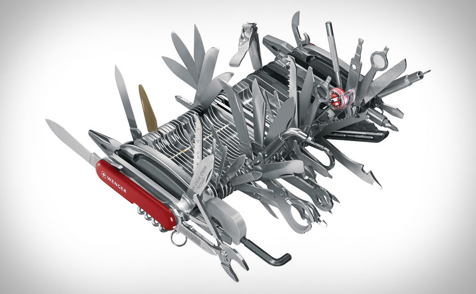

  <small>Demo</small> 
  **[Le couteau suisse](./exercice_ai/suisse.ai)** 
  <small>Ajuster le vectoriel, vérifier la cohérence des positions et anticiper l'animation Synchronisation avec l'[effet sonore](./assets/audio/lala.mp3)</small>

### Dans After Effetcs: importer un fichier Illustrator  

#### Gestion des calques dans AE

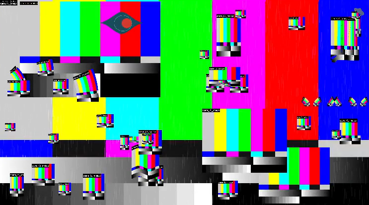

Clic droit > Remplacer le métrage > Fichier (choisir le fichier Illustrator) : ça devrait régler beaucoup de cas de figure.

[:material-play-circle: Liens manquants](https://cmontmorency365.sharepoint.com/:v:/s/TIM-582214-Animation2d77/ES3nv_1D8ZdAsKPArJnWVLkBJ-5M9t8wkd7EeCbRdg5Ngg?e=sfyJuF) (Ex: fichié renommé ou déplacé)

[:material-play-circle: Modifications Illustrator post-importation](https://cmontmorency365.sharepoint.com/:v:/s/TIM-582214-Animation2d77/EVIfgqGazEhAqd99_-3SOjcBEfhfyuZHQwNUMgWdS5WGaA?e=YOLCxB)

[:material-play-circle: Modifier le nom d'un calque Illustrator post-importation](https://cmontmorency365.sharepoint.com/:v:/s/TIM-582214-Animation2d77/EQcjlwgo8Z1OijsfHEX-8jsBhjyJH8zxQryYEYHGwlGlbQ?e=bESBVt)

[:material-play-circle: Importer un seul calque](https://cmontmorency365.sharepoint.com/:v:/s/TIM-582214-Animation2d77/Eeix9K7ueJ5ItEfsMcrURvABXeyOgUtv61gWlol4vSlgrQ?e=ekA3yb)

[:material-play-circle: Conversion calque illustrator en calque de forme](https://cmontmorency365.sharepoint.com/:v:/s/TIM-582214-Animation2d77/EUyUFWWUoVdAmD3oXbSUD0sB8rC3YJgeHFVlIU41NPRWvA?e=Mlt4vS) 

Dans le panneau montage, clic-droit > Créer > Créer des formes à partir du calque vectoriel.

## Audio

{ .w-100 }

[:material-play-circle: Niveaux audio](https://cmontmorency365.sharepoint.com/:v:/s/TIM-582214-Animation2d77/EYbpj09zkD1GhDBl7317eG0BPrqEIQO99a4xpBsyZSaCHw?e=c5fFq5)

{ data-zoom-image }

<!-- 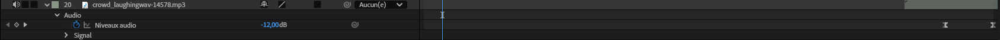{ data-zoom-image } -->

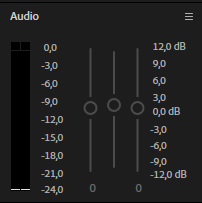{ data-zoom-image }

### Marqueurs

Pour la synchronisation de l'audio avec l'animation, il est très utile d'utiliser des marqueurs. Pour en ajouter, cliquez : `Calque > Marqueurs > Ajouter un repère`. Ainsi, même lorsque tous les calques sont réduits, on peut toujours visualiser où se situent les repères afin syncroniser les animations et les sons ponctuels. 

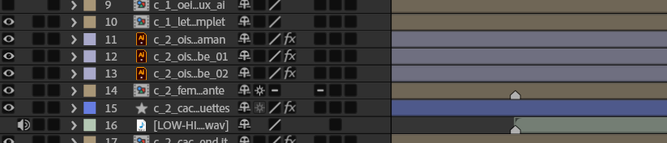{ data-zoom-image }

<!-- [:material-play-circle: Son entre les compositions](https://cmontmorency365.sharepoint.com/:v:/s/TIM-582214-Animation2d77/EcEavxk_TbpHhxotp2CIcNsBJkUQZJN3yt5sDIsLc2hqcA?e=DBw3ZB) -->
<!-- [:material-play-circle: Master](https://cmontmorency365.sharepoint.com/:v:/s/TIM-582214-Animation2d77/EdYh6hVPDCxHhf6VA7zWbR8BEyczlnp2lYrVGSK6BAVJHw?e=lrhqIm) -->
<!-- [:material-play-circle: Raccourcis clavier](https://cmontmorency365.sharepoint.com/:v:/s/TIM-582214-Animation2d77/EX-VYq5wHelAhHneg7d7tXwBwgwljY5y4djXpmZSItBsKA?e=lAtSjz) -->

<!-- 
## Exercice couteau suisse
Téléchargez les fichiers  **[Le couteau suisse](./assets/images/suisse.eps)** 
- [ ] Dans Illustrator, ajuster les calques dans after effects.
- [ ] Dans Illustrator, le dessin vectoriel, vérifier la cohérence des positions et anticiper l'animation
- [ ] Dans After Effects (AE), importer le fichier illustrator selon les règles. 
- [ ] Animer l'ouverture et fermerture des outils. (Il est possible que vous ayez à retourner dans Illustrator pour ajuster le vecteur du calque pour la cohérence)
- [ ] Synchroniser avec l'[effet sonore](./assets/audio/lala.mp3)
-->

## Exportation de projet After Effets en format vidéo

[:material-play-circle: Exportation](https://cmontmorency365.sharepoint.com/:v:/s/TIM-582214-Animation2d77/EeWZd6JaVOhGnr8mxzEdcaEB5Zp3XG9HCr5FkgMZ32SXuA?e=f5Nt2e)

### Diffusion web et réseaux sociaux

Format : H.264 puis "YouTube 1080p Full HD" ou "Vimeo 1080p Full HD"

### Qualité professionnelle avec compression

Format : Quicktime puis Apple ProRes 422 / 4444 (idéal pour montage et étalonnage)

### Archivage haute qualité

Format : Quicktime puis CineForm ou DNxHR/DNxHD (Haute qualité, mais fichiers lourds)
Préréglage : "GoPro CineForm YUV 10 bits" ou "DNxHR HQX 10-bit"

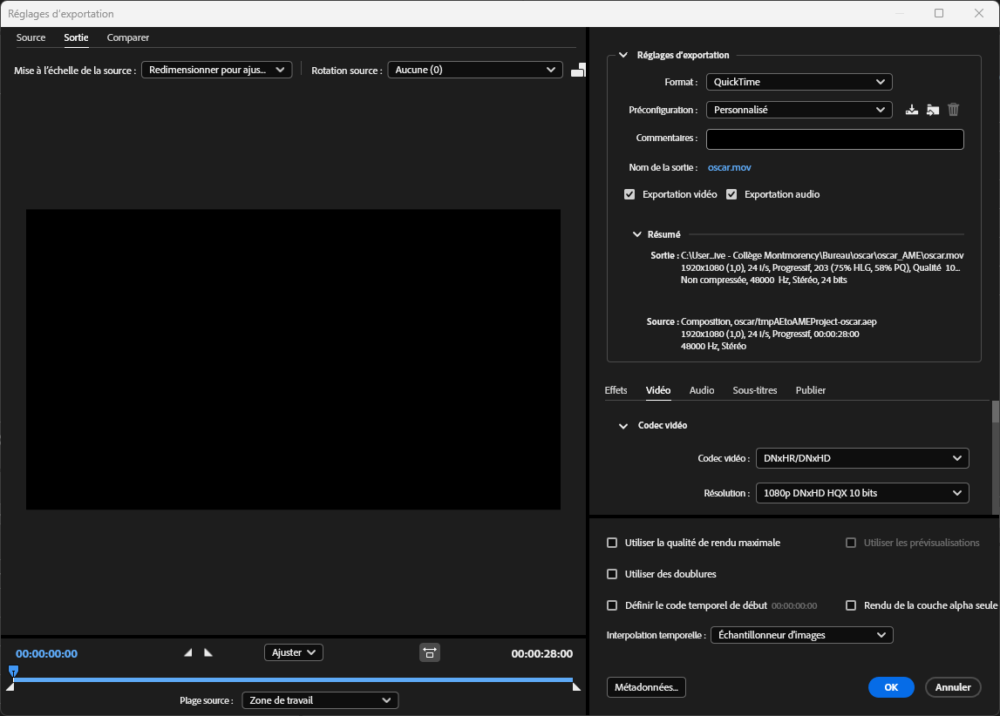{ data-zoom-image }

## Typographie cinétique

La typographie cinétique (de l’anglais _kinetic typography_) est une technique d’animation impliquant la **présentation dynamique d’un texte** dans le temps, souvent **associée à un son** ou à des **vidéos musicales**, afin de transmettre ou de renforcer un message. 

Elle utilise le mouvement, la **taille**, les changements de **couleur** et d’autres effets visuels pour ajouter une couche de sens et d’émotion aux mots écrits. 

Il s’agit d’une méthode populaire dans les **films**, les **publicités** et les **présentations vidéo** pour capter l’attention et accroître l’engagement du public.

{ .w-100 }

Bref, de l'animation de texte.

### 20 inspirations de typographies cinétiques très intéressantes

  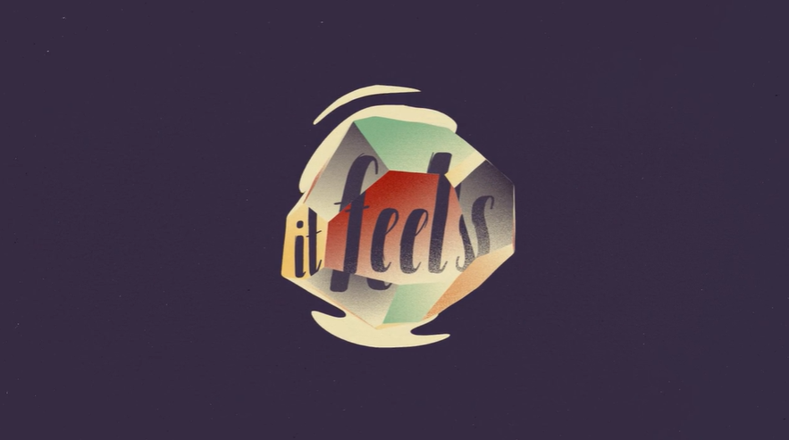

  Les meilleures typographies cinétiques : 20 exemples à voir absolument  
  [:material-book-open-page-variant: Feuilleter l'œuvre complète](https://www.creativebloq.com/typography/examples-kinetic-typography-11121304){ .stretched-link }

  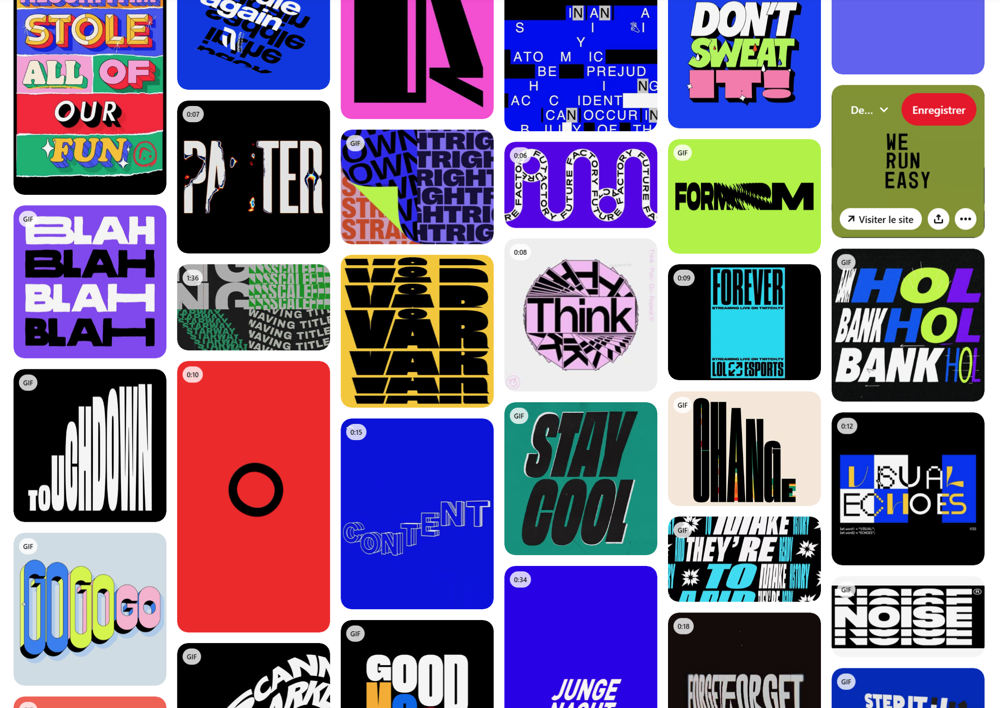

  Pinterest: kinetic typography in motion design  
  [:material-book-open-page-variant: Feuilleter l'œuvre complète](https://ca.pinterest.com/search/pins/?q=kinetic%20typography%20motion%20graphics){ .stretched-link }

### Animer le texte dans After Effects

  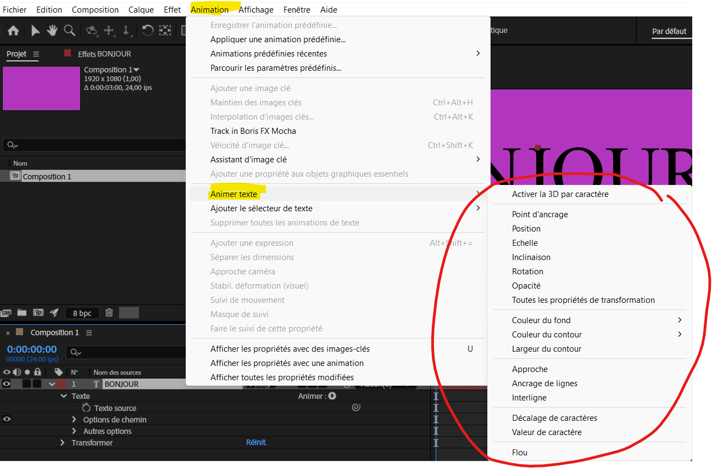{ data-zoom-image }
  
  **Animation manuelle** 
  <small>Dans le panneau de montage (timeline), sélectionnez le calque texte à animer. Clic-droit sur celui-ci. 
  Dans le menu du haut **Animation > Animer texte** et sélectionnez une propriété animable parmi celles présentées. 
  Ou encore dans la timeline, développez le calque texte, vous verez un bouton "Animer :material-play-circle:"</small>

  { data-zoom-image }

  **Animations prédéfinies** 
  <small>Dans la panneau `Effets et paramètres prédéfinis > Animations prédéfinis > Text`, vous trouverez une grande variété d'effets d'animation de texte classés par type d'effet.</small>  

[:material-play-circle: Les bases de l'animation de la typo](https://cmontmorency365-my.sharepoint.com/:v:/g/personal/mariem_ouellet_cmontmorency_qc_ca/EZO6MEi5qIZCo1PNIj6sursBKSeowDLB5CYnfQCFMUXZ1w?nav=eyJyZWZlcnJhbEluZm8iOnsicmVmZXJyYWxBcHAiOiJPbmVEcml2ZUZvckJ1c2luZXNzIiwicmVmZXJyYWxBcHBQbGF0Zm9ybSI6IldlYiIsInJlZmVycmFsTW9kZSI6InZpZXciLCJyZWZlcnJhbFZpZXciOiJNeUZpbGVzTGlua0NvcHkifX0&e=1NAXxr)

[:material-play-circle: Le safe-title](https://cmontmorency365-my.sharepoint.com/:v:/g/personal/mariem_ouellet_cmontmorency_qc_ca/EW1JXLIAIN5Kipc65xXTO0wBLB2WxBHujdn-bqLCEo5JiQ?nav=eyJyZWZlcnJhbEluZm8iOnsicmVmZXJyYWxBcHAiOiJPbmVEcml2ZUZvckJ1c2luZXNzIiwicmVmZXJyYWxBcHBQbGF0Zm9ybSI6IldlYiIsInJlZmVycmFsTW9kZSI6InZpZXciLCJyZWZlcnJhbFZpZXciOiJNeUZpbGVzTGlua0NvcHkifX0&e=eIK4XJ)

<!-- 
À développer (pour le moment ce n'est pas un exercice)
[🛠️ Expérimentation typographie](exercices_ae/09_experimentation_typo.md){ .md-button }

Texte tracé avec l'anim style line-art (à venir)
TODO

Non on ne le garde pas mais je le remplacerais par l'anim style line-art (à venir)
[🛠️ Typographie et masque](exercices_ae/09_typo_masque.md){ .md-button }       

[🛠️ Texturing](exercices_ae/09_texturing.md){ .md-button }       

Peut-être mais je ceherche autre chose.
[🛠️ Lettres en 3D](exercices_ae/09_3d_lettre.md){ .md-button }   

Penser à ajouter l'exploration de 3 presets d'animation de texte.

Inspirations:
https://www.creativebloq.com/typography/examples-kinetic-typography-11121304
https://www.linearity.io/blog/kinetic-typography/

-->
### Considérations pour l'animation de la typographie

 - Déterminer l'**audience et le message**, ce qu'on veut communiquer par le mouvement
 - Techniques d'animation: **explorez plusieurs techniques** d'animation typographique, choisissez ensuite les techniques qui complètent bien le contenu.
 - **Choix typographique**: Sélectionnez la police la plus appropriée pour votre animation
 - Le **débit et le rythme** de vos animations doivent être minutieusement travaillés afin de créer une fluidité et un effet engageant
 - Restez **cohérent** du début à la fin au niveau des techniques d'animation, du rythme et du style visuel.

## Modes de fusion

Les modes de fusion des calques contrôlent la manière dont chaque calque se fond ou interagit avec les calques qu’il recouvre. 

[Modes de fusion (blending modes) dans After Effects](https://helpx.adobe.com/ca_fr/after-effects/using/blending-modes-layer-styles.html)

Pour accéder aux modes de fusion[^fusion], sélectionner un calque. Si la colonne des modes de fusion n’est pas visible : Cliquez sur le bouton Agrandir ou réduire le panneau Mode de fusion (ou simplement ++f4++).

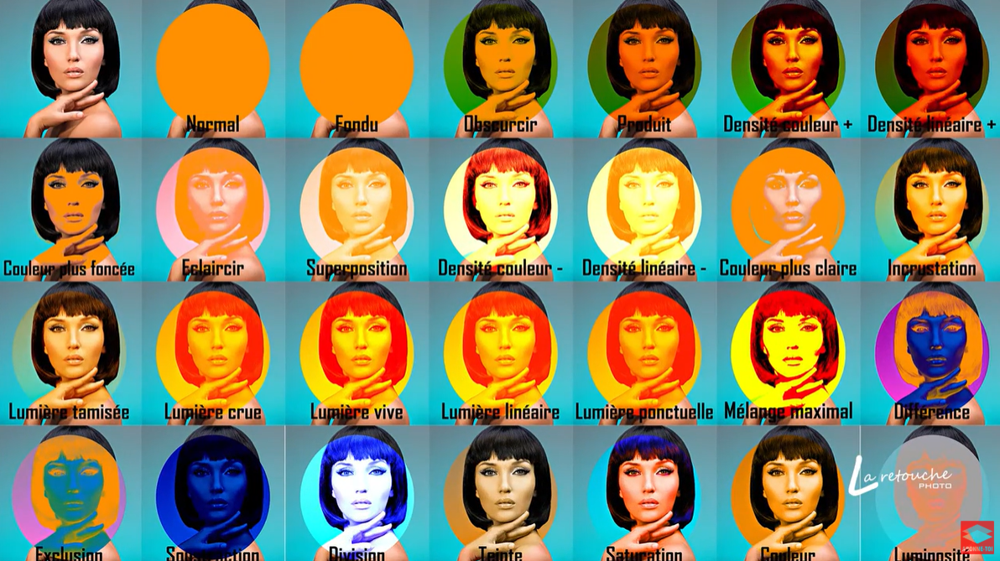

[^fusion]: <https://www.la-retouche-photo.com/photoshop-cours-005-les-modes-de-fusion/>

## Exercices

  

  <small>Exercice - After Effects</small> 
  **[Typography audacieuse](./exercices_ae/typo-audacieuse/typo.md){.stretched-link .back}**

  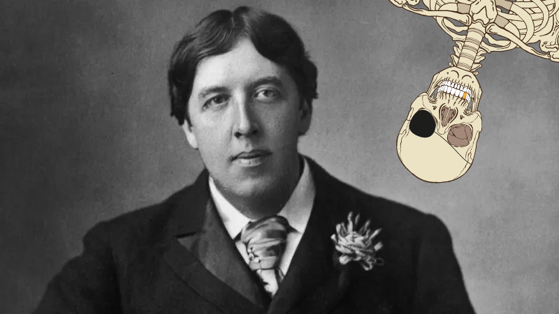

  <small>Exercice - Illustrator & After Effects</small> 
  **[Oscar Wilde fait du yoga](./exercices_ae/oscar/oscar.md){.stretched-link .back}**

