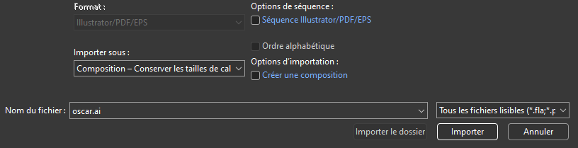
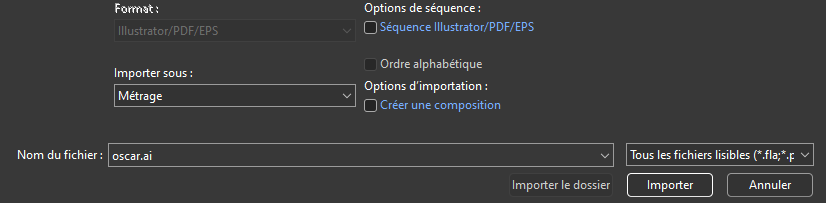
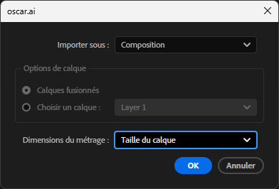
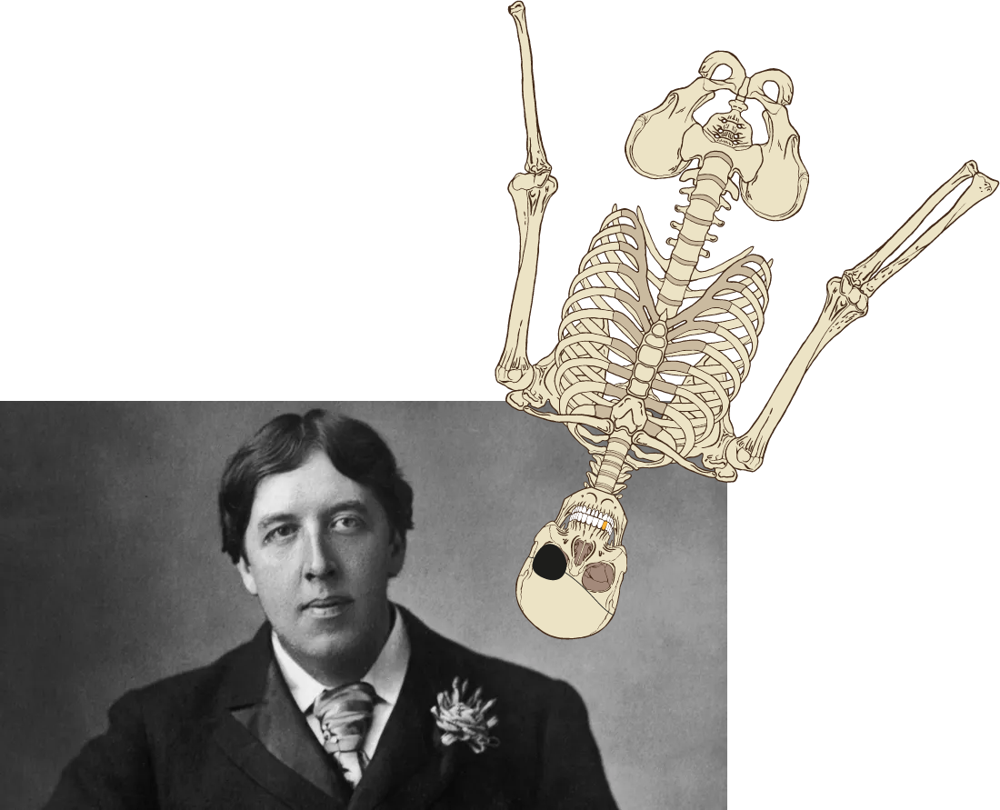
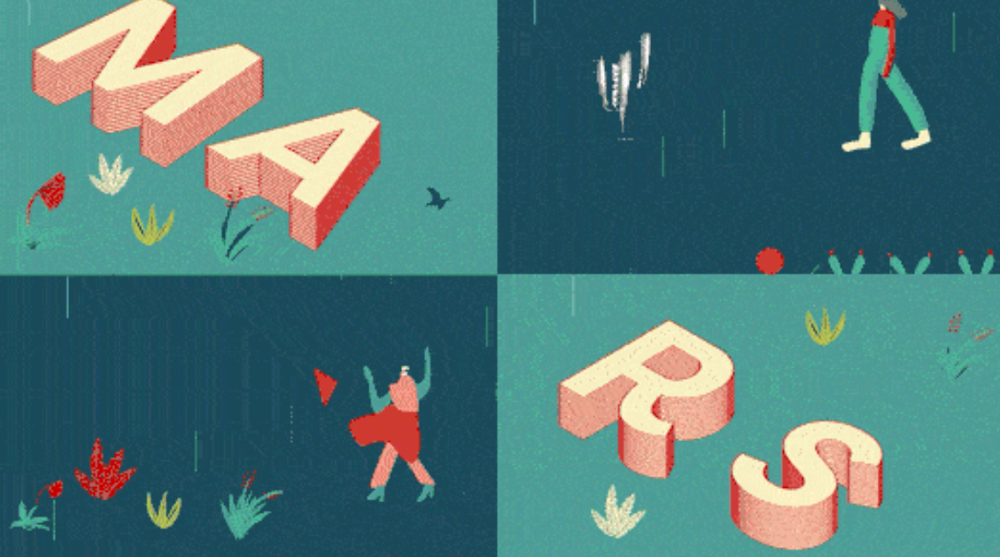

# Cours 6

[STOP]

## Préparation des calques Illustrator

Afin de séparer chaque éléments sur chaque calque, vous devez d'abord créer les calques et glisser chaque éléments sur un calque indépendant.

[:material-play-circle: Séparation des calques animés](https://cmontmorency365.sharepoint.com/:v:/s/TIM-582214-Animation2d77/ERC8vR9l20BLpguxQ-27JOABlZ5BHqBPrMKReA9RR14vGQ?e=1B2vQt)

[:material-play-circle: Nomenclature des calques](https://cmontmorency365.sharepoint.com/:v:/s/TIM-582214-Animation2d77/Eea10yK5n49Im7lS5wwrmU4B2s_D1WXRAE4q_WH_ECWHww?e=q5R6ay)

[Demo :material-download:](./assets/images/suisse.eps)

### Options d'importation

`Fichier > Importer > Fichier` (++ctrl+i++)

**Composition** : After Effects crée une composition qui conserve chacune des couches de votre fichier Illustrator en tant que calque individuel.

**Métrage** (ou Footage) : Le fichier est importé comme une image unique, sans distinction de calques.

Si on a choisi l'option "Métrage" une nouvelle fenêtre apparaîtra. On peut alors choisir **Composition** si on a oublié de le faire initialement.

### Gestion des calques

[:material-play-circle: Liens manquants](https://cmontmorency365.sharepoint.com/:v:/s/TIM-582214-Animation2d77/ES3nv_1D8ZdAsKPArJnWVLkBJ-5M9t8wkd7EeCbRdg5Ngg?e=sfyJuF)

[:material-play-circle: Modifications post-importation dans Illustrator](https://cmontmorency365.sharepoint.com/:v:/s/TIM-582214-Animation2d77/EVIfgqGazEhAqd99_-3SOjcBEfhfyuZHQwNUMgWdS5WGaA?e=YOLCxB)

[:material-play-circle: Modifier le nom d'un calque](https://cmontmorency365.sharepoint.com/:v:/s/TIM-582214-Animation2d77/EQcjlwgo8Z1OijsfHEX-8jsBhjyJH8zxQryYEYHGwlGlbQ?e=bESBVt)

[:material-play-circle: Importer un seul calque](https://cmontmorency365.sharepoint.com/:v:/s/TIM-582214-Animation2d77/Eeix9K7ueJ5ItEfsMcrURvABXeyOgUtv61gWlol4vSlgrQ?e=ekA3yb)

[:material-play-circle: Conversion calque illustrator en calque de forme](https://cmontmorency365.sharepoint.com/:v:/s/TIM-582214-Animation2d77/EUyUFWWUoVdAmD3oXbSUD0sB8rC3YJgeHFVlIU41NPRWvA?e=Mlt4vS)

## Audio

{ .w-100 }

[:material-play-circle: Niveaux audio](https://cmontmorency365.sharepoint.com/:v:/s/TIM-582214-Animation2d77/EYbpj09zkD1GhDBl7317eG0BPrqEIQO99a4xpBsyZSaCHw?e=c5fFq5)

{ data-zoom-image }

{ data-zoom-image }

<!-- [:material-play-circle: Son entre les compositions](https://cmontmorency365.sharepoint.com/:v:/s/TIM-582214-Animation2d77/EcEavxk_TbpHhxotp2CIcNsBJkUQZJN3yt5sDIsLc2hqcA?e=DBw3ZB) -->
<!-- [:material-play-circle: Master](https://cmontmorency365.sharepoint.com/:v:/s/TIM-582214-Animation2d77/EdYh6hVPDCxHhf6VA7zWbR8BEyczlnp2lYrVGSK6BAVJHw?e=lrhqIm) -->
<!-- [:material-play-circle: Raccourcis clavier](https://cmontmorency365.sharepoint.com/:v:/s/TIM-582214-Animation2d77/EX-VYq5wHelAhHneg7d7tXwBwgwljY5y4djXpmZSItBsKA?e=lAtSjz) -->

## Exportation

[:material-play-circle: Exportation](https://cmontmorency365.sharepoint.com/:v:/s/TIM-582214-Animation2d77/EeWZd6JaVOhGnr8mxzEdcaEB5Zp3XG9HCr5FkgMZ32SXuA?e=f5Nt2e)

### Diffusion web et réseaux sociaux

Format : H.264 puis "YouTube 1080p Full HD" ou "Vimeo 1080p Full HD"

### Qualité professionnelle avec compression

Format : Quicktime puis Apple ProRes 422 / 4444 (idéal pour montage et étalonnage)

### Archivage haute qualité

Format : Quicktime puis CineForm ou DNxHR/DNxHD (Haute qualité, mais fichiers lourds)
Préréglage : "GoPro CineForm YUV 10 bits" ou "DNxHR HQX 10-bit"

{ data-zoom-image }

## Typographie kinétique

[🛠️ Expérimentation typographie](exercices_ae/09_experimentation_typo.md){ .md-button }       
    
[🛠️ Modes de couleur](exercices_ae/09_modes_couleur.md){ .md-button }       
    
[🛠️ Typographie et masque](exercices_ae/09_typo_masque.md){ .md-button }       
    
[🛠️ Texturing](exercices_ae/09_texturing.md){ .md-button }       
    
[🛠️ Lettres en 3D](exercices_ae/09_3d_lettre.md){ .md-button }       

## Exercices

[🛠️ Expérimentation typographie](exercices_ae/09_experimentation_typo.md){ .md-button }

[🛠️ Modes de couleur](exercices_ae/09_modes_couleur.md){ .md-button }

[🛠️ Typographie et masque](exercices_ae/09_typo_masque.md){ .md-button }

[🛠️ Texturing](exercices_ae/09_texturing.md){ .md-button }

[🛠️ Lettres en 3D](exercices_ae/09_3d_lettre.md){ .md-button }

[Effets](exercices_ae/08_effets.md){ .md-button }

[🛠️ Devoir balle](exercices_ae/devoir_balle.md){ .md-button }

[🛠️ Devoir 4](exercices_ae/devoir_c4.md){ .md-button }

[💼 Travail 1](exercices_ae/travail1.md){ .md-button }

  

  <small>Exercice - Illustrator & After Effects</small> 
  **[Oscar Wilde fait du yoga](./exercices_ae/oscar/oscar.md){.stretched-link .back}**

## Devoir

  

  <small>Devoir sommatif groupes Jean-François - 18 mars</small> 
  **[TP1](./exercices_ae/tp1/tp1.md){.stretched-link .back}**

[STOP]

https://www.vecteezy.com/vector-art/102486-free-swiss-knife-vector
