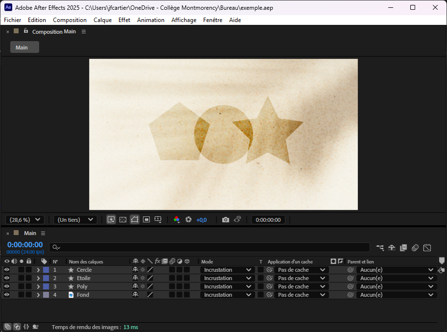
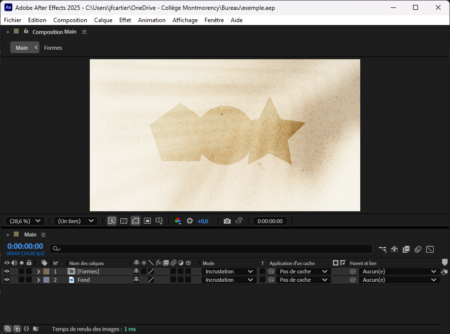
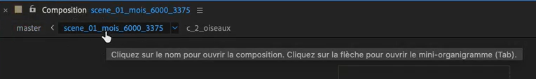
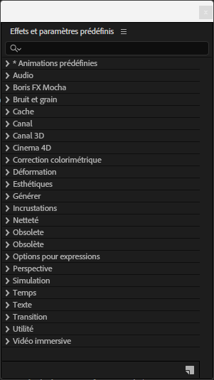
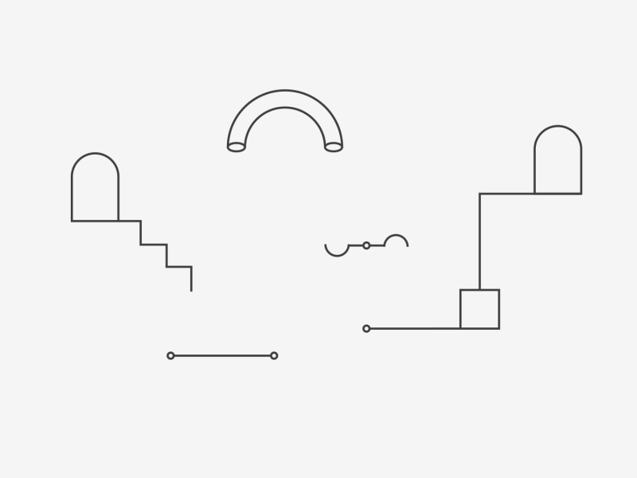
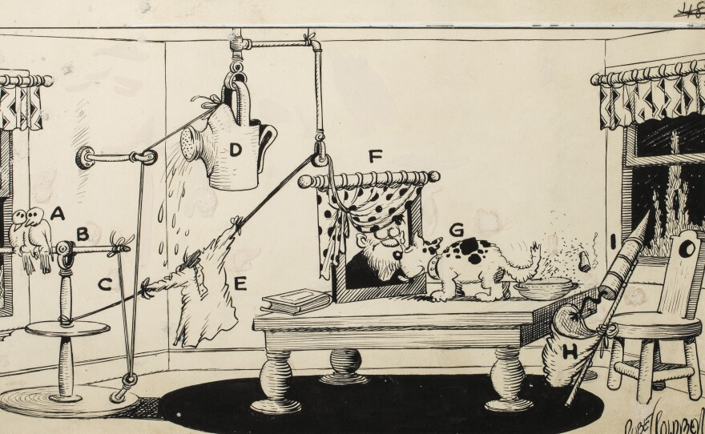

# Cours 7

[STOP]

<!--
## Séquencer les animations

[:material-play-circle: La zone de travail dans la timeline](https://cmontmorency365-my.sharepoint.com/:v:/g/personal/mariem_ouellet_cmontmorency_qc_ca/ESkwPAiMOC1KvhoHRoScMNUBPbiw45mgTxsGss_vhAQgfQ)

[:material-play-circle: Séquencer les animations Partie 1](https://cmontmorency365-my.sharepoint.com/:v:/g/personal/mariem_ouellet_cmontmorency_qc_ca/EXLI0Z36AAhNvjQZcU3nvBcB0pYrLPEYPH1LIL56CGvcBQ)

[:material-play-circle: Séquencer les animations Partie 2](https://cmontmorency365-my.sharepoint.com/:v:/g/personal/mariem_ouellet_cmontmorency_qc_ca/EXLI0Z36AAhNvjQZcU3nvBcB0pYrLPEYPH1LIL56CGvcBQ)

[:material-play-circle: Time Stretch](https://cmontmorency365-my.sharepoint.com/:v:/g/personal/mariem_ouellet_cmontmorency_qc_ca/EUqKO4P5OotDuxeQKwbDftsB1zWa6whp9V4T6itVkG99og)
-->

## Précomposition


La **précomposition**[^precomp] dans Adobe After Effects est une technique permettant de regrouper plusieurs calques dans une composition distincte.

[^precomp]: [Précomposition, imbrication et prérendu](https://helpx.adobe.com/ca_fr/after-effects/using/precomposing-nesting-pre-rendering.html)

[:material-play-circle: Précomposition et imbrication](https://cmontmorency365-my.sharepoint.com/:v:/g/personal/mariem_ouellet_cmontmorency_qc_ca/EWQ4WuQ6SWdIomq2DZZK-EMBVBpY1IfLrNoWf-K7c_14Bw?nav=eyJyZWZlcnJhbEluZm8iOnsicmVmZXJyYWxBcHAiOiJPbmVEcml2ZUZvckJ1c2luZXNzIiwicmVmZXJyYWxBcHBQbGF0Zm9ybSI6IldlYiIsInJlZmVycmFsTW9kZSI6InZpZXciLCJyZWZlcnJhbFZpZXciOiJNeUZpbGVzTGlua0NvcHkifX0&e=sPeETG)

[:material-play-circle: Audio avec précomposition](https://cmontmorency365-my.sharepoint.com/:v:/g/personal/mariem_ouellet_cmontmorency_qc_ca/EV2fHOfLhhZAlsbMaYDncFoBxGaiufyjvZUEnB7WIAcVGQ?nav=eyJyZWZlcnJhbEluZm8iOnsicmVmZXJyYWxBcHAiOiJPbmVEcml2ZUZvckJ1c2luZXNzIiwicmVmZXJyYWxBcHBQbGF0Zm9ybSI6IldlYiIsInJlZmVycmFsTW9kZSI6InZpZXciLCJyZWZlcnJhbFZpZXciOiJNeUZpbGVzTGlua0NvcHkifX0&e=ss0tV7)

Cela réduit considérablement l'**encombrement** dans la fenêtre de montage et permet d'appliquer des **effets** ou **transformations** à un groupe de calques.

<div class="grid grid-1-1" markdown>
  { data-zoom-image }

  { data-zoom-image }
</div>

### Comment ça marche ?

1. **Sélectionnez les calques** à regrouper dans la fenêtre de montage.
2. Faites un **clic droit** sur la sélection et choisissez **"Précomposition…"** ou utilisez le raccourci ++ctrl+shift+c++ (Windows) / ++cmd+shift+c++ (Mac).
3. **Nommez la précomposition** de façon cohérente pour faciliter son identification ultérieure.
4. Choisissez l'une des options suivantes :
   - **Déplacer tous les attributs dans la nouvelle composition** : Les effets et transformations restent appliqués à l'intérieur de la précomposition.
   - **Tout laisser dans la composition actuelle** : Les effets et transformations restent appliqués à la composition principale.

Pour modifier une précomposition, **double-cliquez** simplement dessus.

Pour visualiser la hiérarchie des compositions, utilisez le fil d'ariane en haut de la fenêtre de composition ou consultez l'organigramme des compositions avec la touche ++Tab++.

{ data-zoom-image }

### Classification

```txt
Projet
├──📁 01_medias
├──📁 02_compositions
|    ├──📁 01_main_composition
|    ├──📁 02_travail_composition
|    └──📁 03_pre_composition 
...
```


## Zoom-in dans une scène

Précomposition et animation de l'échelle (scale). C'est aussi simple que ça !


## Effets

Les effets permettent de modifier l’apparence, le comportement ou les propriétés d’un calque.

{ data-zoom-image }

### Animations prédéfinies

{ data-zoom-image }

#### Adobe Express


#### Backgrounds
Créez un calque de type **Solide** qui couvre la composition et attribuez-lui un effet de type **Background**


#### Behaviors


#### Image - Special Effects


#### Synthetics


#### Text


#### Transition - Movement


### Deformation

After Effects comprend un large éventail d’effets de Déformation, sous la forme de modules externes natifs et tiers, permettant de déformer (transformer) une image. Les effets Déformation offrent la possibilité de corriger ou de stabiliser les images avec une déformation d’Obturation déroulante[^disto].

[^disto]: <https://helpx.adobe.com/ca_fr/after-effects/using/distort-effects.html>

#### CC Bend It

Pour une application plus efficace de cet effet, convertissez votre calque en précomposition.

[:material-play-circle: CC Bend It](https://cmontmorency365-my.sharepoint.com/:v:/g/personal/mariem_ouellet_cmontmorency_qc_ca/Efhv75n1BrVPmWeN2ehsqokBNP10n5Rm3CcwD2A4tZl2mw?nav=eyJyZWZlcnJhbEluZm8iOnsicmVmZXJyYWxBcHAiOiJPbmVEcml2ZUZvckJ1c2luZXNzIiwicmVmZXJyYWxBcHBQbGF0Zm9ybSI6IldlYiIsInJlZmVycmFsTW9kZSI6InZpZXciLCJyZWZlcnJhbFZpZXciOiJNeUZpbGVzTGlua0NvcHkifX0&e=zhK5Cd)

#### CC Bender


#### CC Flo Motion

Pour une application plus efficace de cet effet, ajoutez un calque d'effets et appliquez l'effet sur ce calque.


#### CC Ripple Pulse

Pour appliquer l'effet, ajouter des keyframes à Pulse Level et ajustez également l'amplitude pour que l'effet ne soit pas trop subtile.

<!-- 
#### CC Blobbylize
https://www.youtube.com/watch?v=WPo-dkPiynI
Effet de texture métallique

#### CC Griddler
https://www.youtube.com/watch?v=SN6yteIc88k
Effet de grille et rotation des tuiles

#### CC Lens
https://www.youtube.com/watch?v=HhY6NqWRU_M
Comme un fish-eye

#### CC Page Turn
https://www.youtube.com/watch?v=fybg41bOoLE
Effet de page tournée

#### CC Power Pin
https://www.youtube.com/watch?v=NeUrbL0oadc
Déformation par perspective

#### CC Power Pin
https://www.youtube.com/watch?v=wxOL7Cjm-is
Comme un skew

#### CC Smear
https://www.youtube.com/watch?v=w6PkkWRpZpQ
Comme un doight qu'on déplace sur de l'ancre

#### CC Split
Sépare le calque en 2 comme une plaie

#### CC Split 2
Même chose que CC Split, mais avec un contrôle sur l'ouverture de chaque côté

#### CC Tiler
Comme un background-repeat en CSS. On y controle aussi l'échelle

#### Fluidité 
https://www.youtube.com/watch?v=EHlmVsp-JPs
Ressemble aux outils de Photoshop

#### Remodeler
https://www.youtube.com/watch?v=Rp6iKBfOfgg
Distortion graduelle entre un départ et un arrivé pour le même calque
Demande une notion de masque

#### Renflement
Déformation style fisheye

#### Réparation obturateur déroulant
Utilisez l’effet Réparation d’obturateur déroulant pour supprimer la distorsion causée par une caméra instable et un sujet en mouvement.

#### Spérisation
Effet de sphère incrustée

#### Stabilisation de déformation
POur les vidéos

#### 
-->

#### Compensation optique


#### Onde progressive


[:material-play-circle: Onde progressive](https://cmontmorency365-my.sharepoint.com/:v:/g/personal/mariem_ouellet_cmontmorency_qc_ca/Ee6E4po4fPdGgkofOCBMpNEBV-L-Z5JYP7KzE11ZSnKtZA?nav=eyJyZWZlcnJhbEluZm8iOnsicmVmZXJyYWxBcHAiOiJPbmVEcml2ZUZvckJ1c2luZXNzIiwicmVmZXJyYWxBcHBQbGF0Zm9ybSI6IldlYiIsInJlZmVycmFsTW9kZSI6InZpZXciLCJyZWZlcnJhbFZpZXciOiJNeUZpbGVzTGlua0NvcHkifX0&e=rdLAaH)

#### Turbulence


Configurer simplement le décalage.

### Esthétiques

Exemple :

* CC Burn Film
* CC Vignette

### Générer

Exemple :

* CC LightBurst 2.5
* Dégradé 4 couleurs

### Netteté

Ex : Flou gaussien

### Perspective

Exemple : 

* CC Cylinder
* CC Sphere
* Ombre portée

### Simulation

#### CC Ball Action


#### CC Pixel Polly


#### CC Rainfall


[:material-play-circle: CC Rainfall](https://cmontmorency365-my.sharepoint.com/:v:/g/personal/mariem_ouellet_cmontmorency_qc_ca/EZrTdLKiEIZIkb6NWBwpcSgBOqlgqUWUU8Dg2Ol2pe74DA?nav=eyJyZWZlcnJhbEluZm8iOnsicmVmZXJyYWxBcHAiOiJPbmVEcml2ZUZvckJ1c2luZXNzIiwicmVmZXJyYWxBcHBQbGF0Zm9ybSI6IldlYiIsInJlZmVycmFsTW9kZSI6InZpZXciLCJyZWZlcnJhbFZpZXciOiJNeUZpbGVzTGlua0NvcHkifX0&e=TlIfI7)

[:material-play-circle: Splash](https://cmontmorency365-my.sharepoint.com/:v:/g/personal/mariem_ouellet_cmontmorency_qc_ca/EVpqrd0DdFJOmTa_X01ZroUBIIZ7ZV-0Bxjltr7EyfC3aA?nav=eyJyZWZlcnJhbEluZm8iOnsicmVmZXJyYWxBcHAiOiJPbmVEcml2ZUZvckJ1c2luZXNzIiwicmVmZXJyYWxBcHBQbGF0Zm9ybSI6IldlYiIsInJlZmVycmFsTW9kZSI6InZpZXciLCJyZWZlcnJhbFZpZXciOiJNeUZpbGVzTGlua0NvcHkifX0&e=U2ZM6W)

[:material-play-circle: Expression](https://cmontmorency365-my.sharepoint.com/:v:/g/personal/mariem_ouellet_cmontmorency_qc_ca/ESO3vKfL-CdNuI_53ihNw-UBGaEtOgBDWKTdo5H07Fu3sw?nav=eyJyZWZlcnJhbEluZm8iOnsicmVmZXJyYWxBcHAiOiJPbmVEcml2ZUZvckJ1c2luZXNzIiwicmVmZXJyYWxBcHBQbGF0Zm9ybSI6IldlYiIsInJlZmVycmFsTW9kZSI6InZpZXciLCJyZWZlcnJhbFZpZXciOiJNeUZpbGVzTGlua0NvcHkifX0&e=RPN4NG) 

#### CC Star Burst


### Transition

#### CC Grid Wipe


<!--
#### CC Hair
https://www.youtube.com/watch?v=Jw6P4lnFT6I
-->

!!! info "Vous en voulez plus !?"

    Et bien c'est votre chance, voici une série de tutoriels pour [15 effets d'animations](https://cmontmorency365-my.sharepoint.com/:f:/g/personal/mariem_ouellet_cmontmorency_qc_ca/EgSlyZzm2LZBk4qd09ymzw4B3po1iwPcpWXeuNVJWFRS-A?e=iokzaN).



Crédit: [Machine Loop par Lera Shadova](https://dribbble.com/shots/3873973-Machine-loop)


## Exercice

[Onde Progressive](exercices_ae/08_ondeProgressive.md){ .md-button .back }

[Bend It](exercices_ae/08_bendIt.md){ .md-button .back }

<div class="grid grid-1-2" markdown>
  

</div>
