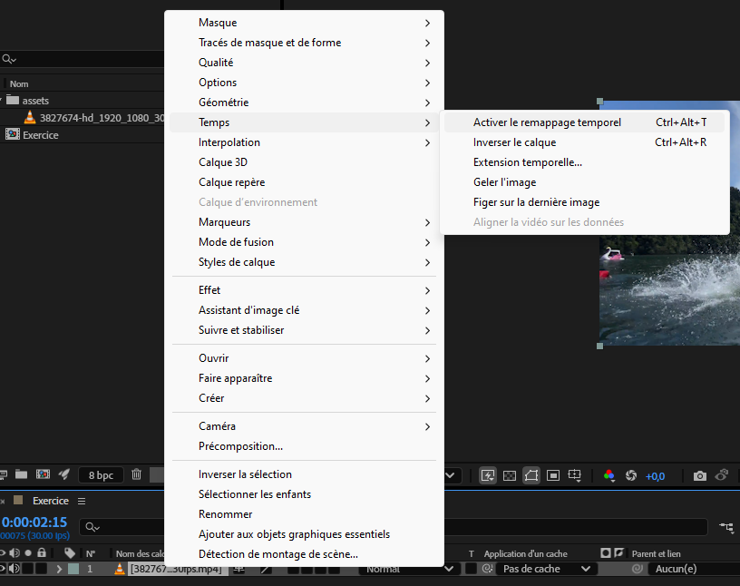
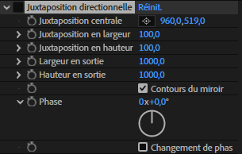
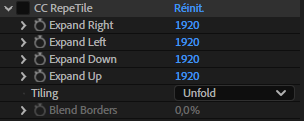
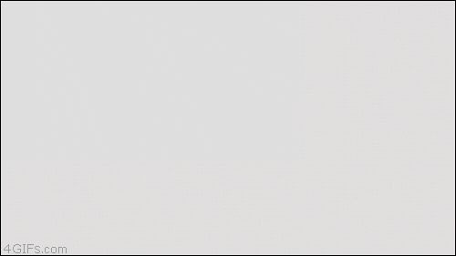
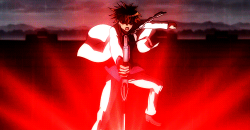

# Cours 8

[STOP]

## Plan de match

- Retour sur le cours jusqu'à maintenant
- Regard sur les notions et évaluations à venir
- Présentation de ressources sur l'animation et After Effects
- Les masques
- Présentation de quelques effets (vitesse de lecture, tuiles et transitions)
- La notion de parallaxe, les caméras et les calques en disposition 3d
- Présentation des TP
- Devoir

## Retour sur le cours

- Comment se passe votre session?
- Retour sur les notions (quels sont les éléments importants? quelle est votre appréciation de l'animation et de After Effects?)

## Notions et évaluations à venir

### Notions 

- Masques
- Parallaxe et caméra
- Notions de scénarisation et préproduction
- Éditeur de courbes
- Expressions
- Particules
- Des effets, des effets et des effets

### Évaluations

- TP2 : Animation d'une scène en parallaxe (présentation d'une oeuvre multimédia existante comme  un film ou un jeu) individuel (ou en équipe de 2) 
- Synthèse : Animation d'un très court métrage (explication d'un sujet) en équipe de 2

## Nouvelles ressources

### Video Copilot (site web)

[Video Copilot](https://www.videocopilot.net/) est un site web qui représente une ressource très reconnue et très estimée par la communauté dans le domaine de l'animation, du motion design et des effets spéciaux (VFX). Le site est surtout reconnu pour ses tutoriels animés par Andrew Kramer : un pionner dans le domaine. La plateforme offre également des extensions pour After Effects comme des effets premiums (Optical flare, Element 3D, etc.), mais aussi gratuits (Saber, FX console, Sure Target, Color Vibrance, etc.). Bien qu'on se concentre sur le motion design dans le cadre du cours, plusieurs tuto sont utiles pour apprendre les bases d'After Effects, mais aussi plusieurs sont pertinents pour ajouter ou améliorer vos vidéos.      

### Corridor crew (chaîne Youtube)

[Corridor Crew](https://www.youtube.com/@CorridorCrew) est une chaîne Youtube principalement connue pour ses capsules d'analyse sur les effets spéciaux (VFX Artists React), mais aussi sur l'animation (Animators React). Ses derniers sont très appréciés par l'industrie et ils ont l'habitude de recevoir des vétérans dans leurs capsules comme Andrew Kramer, Adam Savage ainsi que des superviseurs de grandes entreprises d'effets spéciaux (Bad Robot, ILM, Weta, Rodeo FX, etc.). Bien qu'il n'y ait pas de tutoriel en soi, la chaîne propose tout de même de l'apprentissage concret par des analyses d'effets, une approche pédagogique accessible, des  démonstrations pratiques ainsi que des professionnels qui explique leur choix, méthodes et défis.    

## Les masques

Un masque est une forme appliquée à un calque pour masquer une partie de son contenu. 

Il est souvent utilisé pour créer des effets de transition, révéler du texte ou des images, ou appliquer des modifications localisées.

Vous avez aussi déjà vu ce concept dans le cours de Photoshop.

[:material-play-circle: Masque](https://cmontmorency365-my.sharepoint.com/:v:/g/personal/jfcartier_cmontmorency_qc_ca/EYDK-EAzAEdMjdwlkX8gluQBym5K49hF_bpY_-LRvu0DKw)

### Création de masque

1. Sélectionner le calque à masquer.
1. Choisir un des outils de dessin (**formes** ou **plume**).
1. Dessiner la forme du masque sur le calque.
1. Ajuster les points d’ancrage si nécessaire.

### Propriétés

Les masques possèdent plusieurs propriétés accessibles dans le panneau Timeline sous le calque concerné.

* Mode de masque : addition, soustraction. Les autres modes sont surtout utile lorqu'il y a deux masques sur le même calques. 
* Contour progressif (feather) : crée un effet de flou sur les bords.
  * Il est également possible d'utiliser la plume de contour progressif !
* Opacité : Ajuste la transparence du masque.
* Expansion : Agrandit ou réduit la zone du masque.

### Masque de suivi

### Alignement du masque

Il est possible de déplacer le masque vectoriel manuellement, mais pour ce faire, il faut d'abord sélectionner les points d'ancrage. Quant à l'alignement, ce n'est pas possible, car cette fonctionnalité fonctionne seulement pour les calques. Il faudrait alors créer ce qu'on appelle un cache (matte).

## Matte

Un [cache](https://helpx.adobe.com/ca_fr/after-effects/using/track-mattes-and-traveling-mattes.html) (ou matte) permet d’utiliser un calque comme masque pour un autre. Il existe deux modes de cache :

### Alpha

Utilise la transparence du calque supérieur. Opaque lorsque la valeur de pixels de la couche alpha est égale à 100 %.

Ex: Utiliser un texte avec une transparence pour masquer une vidéo derrière lui.

### Luma

Utilise les valeurs de luminosité du calque supérieur. Opaque lorsque la valeur de luminance d’un pixel est de 100 %.

Utiliser une vidéo en noir et blanc pour créer un effet de masque progressif sur une image.

### Création de matte

1. Placer un calque au-dessus de celui à masquer.
1. Sélectionner le calque inférieur.
1. Dans la colonne Application d'un cache, choisir le calque qui doit servir de matte.

## Vitesse de lecture vidéo

**Activer le remappage temporel** : Permet de lisser la vitesse de lecture à l'aide de keyframes.

**Extension temporelle...** : Modifie la vitesse de lecture de la vidéo, en accéléré ou au ralenti.

Raccourci pertinent : ++ctrl+shift+d++ pour couper un calque vidéo en 2 à la position de la tête de lecture.

## Quelques techniques pour l'exercice AMV

[Tableau de traduction des effets](https://www.blog-motion-design.hellohubert.fr/2021/08/12/after-effects-liste-des-effets-en-anglais-traduit-en-francais/)

### Tuiles

Avant : 

Après :

Outils : **Juxstaposition directionnelle** (Motion Tile) ou **CC Repetile**.

### Wiggle

Outils : Tremblement - position et Tremblement - rotation

Si vous utilisez CC Repetile par exemple, vous devez placer les effets wiggle après.

### Transition "Punch zoom"

Pour effectuer cette transition, on utilise deux outils de base (scale, alpha) et l'effet Flou gaussien.

Encore mieux que le flou gaussien, utilisez le flou objectif appareil photo.

### Transition en glitch

Le concept est de prendre 2 clips et d'en faire une précomposition.

Puis, on duplique la précomposition 3 fois puis à chaque claque, on applique Décalage des couches.

On change ensuite le mode de chaque précomposition à Écran.

Finalement, on anime dans la plage de transition, chaque calque avec un effet de Tremblement - position.

### Transition pan

Pour cet effet, il faut simplement modifier la position de droite à gauche des deux clips tout en utilisant CC Repetile.

Pour un effet plus jolie, ne pas oublier la gestion des ease et le flou de mouvement.

### Intensité

Ajoutez par exemple un Flou encadré accéléré lorsqu'une action rapide est effectuée. Idéalement, on ajuste horizontalement ou verticalement pour orienter le flou !

Avant : 

Après :

Aussi, on peut très bien utiliser l'effet Echo pour ajouter encore plus d'intensité !

## Prochainement

* Formules d'animation (expression)
* Système de particules
* TP2 

## Devoir

<!--
Après un TP plus formatif que créatif, c'est enfin le moment d'exprimer sa créativité !!

  

  <small>Exercice - After Effects</small> 
  **[Rube Goldberg](./exercices_ae/rube_goldberg/rube.md){.stretched-link .back}**

  

  <small>Exercice - After Effects</small> 
  **[AMV](./exercices_ae/amv/amv.md){.stretched-link .back}**

[🛠️ Cinéma](exercices_ae/04_cinema.md){ .md-button }
[🛠️ Masque](exercices_ae/04_masque.md){ .md-button }
[🛠️ Typographie et masque](exercices_ae/09_typo_masque.md){ .md-button }
[🛠️ Texturing](exercices_ae/09_texturing.md){ .md-button }

[Vidéo initiale](https://www.pexels.com/video/man-jumps-into-the-water-3827674/)
-->
