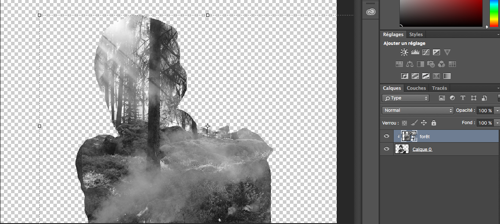
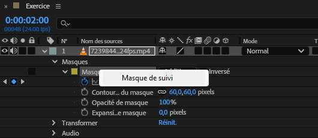
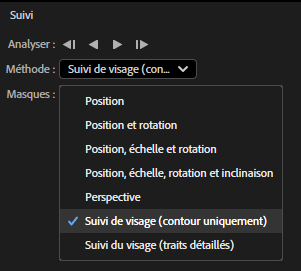
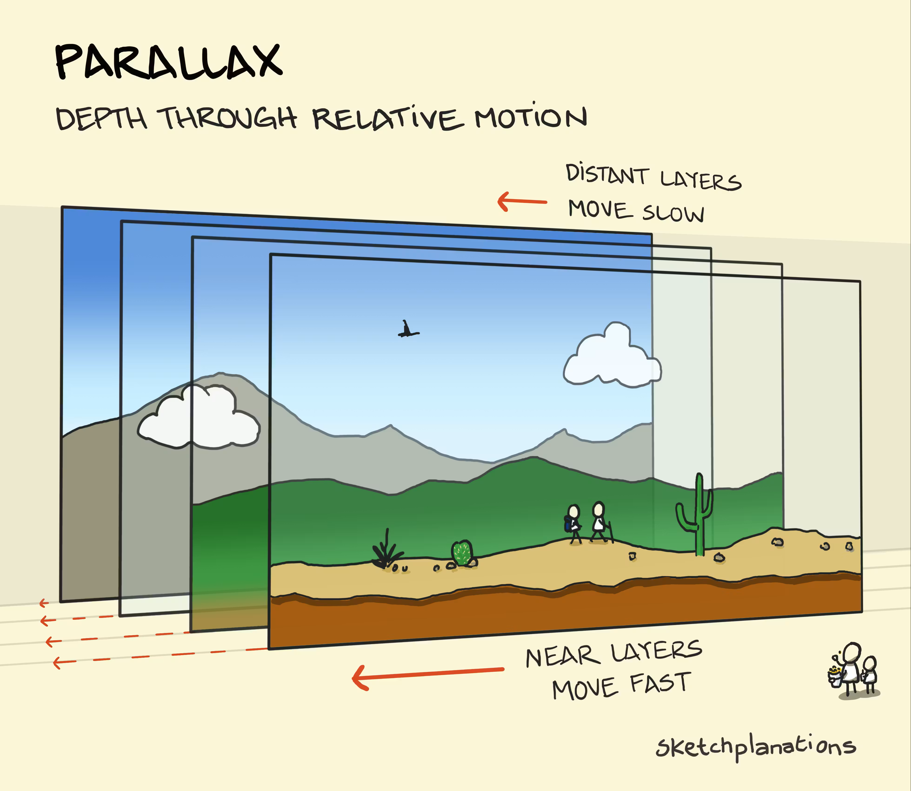
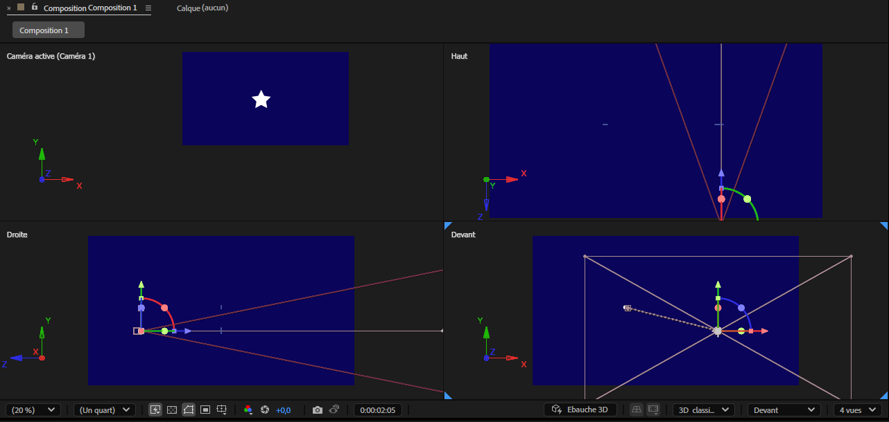
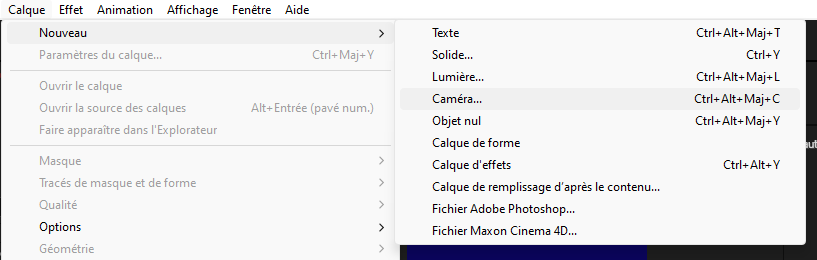
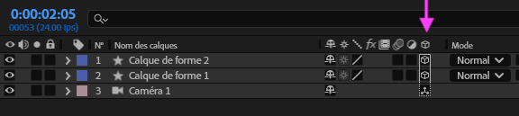

# Cours 8

[STOP]

## Plan de match

- Retour sur le cours jusqu'à maintenant
- Regard sur les notions et évaluations à venir
- Présentation de ressources sur l'animation et After Effects
- Les masques
- La notion de parallaxe, les caméras et les calques en disposition 3d
- Devoir
- Présentation des TP

## Retour sur le cours

- Comment se passe votre session?
- Retour sur les notions (quels sont les éléments importants? quelle est votre appréciation de l'animation et de After Effects?)

## Notions et évaluations à venir

### Notions 

#### Cours 8
- Masques
- Parallaxe et caméra
  
#### Cours 9
- Notions de scénarisation et préproduction
- Éditeur de courbes et modulation de la vitesse 
- Expressions

#### Cours 10
- Particules
- Suivi (tracking)

#### À tous les cours
- Des effets, des effets et des effets

### Évaluations

- TP2 : Animation d'une scène en parallaxe (présentation d'une oeuvre multimédia existante comme  un film ou un jeu) individuel (ou en équipe de 2) 
- Synthèse : Animation d'un très court métrage (explication d'un sujet) en équipe de 2

## Nouvelles ressources

### Video Copilot (site web)

[Video Copilot](https://www.videocopilot.net/) est un site web qui représente une ressource très reconnue et très estimée par la communauté dans le domaine de l'animation, du motion design et des effets spéciaux (VFX). Le site est surtout reconnu pour ses tutoriels animés par Andrew Kramer : un pionner dans le domaine. La plateforme offre également des extensions pour After Effects comme des effets premiums (Optical flare, Element 3D, etc.), mais aussi gratuits (Saber, FX console, Sure Target, Color Vibrance, etc.). Bien qu'on se concentre sur le motion design dans le cadre du cours, plusieurs tuto sont utiles pour apprendre les bases d'After Effects, mais aussi plusieurs sont pertinents pour ajouter ou améliorer vos vidéos.      

### Corridor crew (chaîne Youtube)

[Corridor Crew](https://www.youtube.com/@CorridorCrew) est une chaîne Youtube principalement connue pour ses capsules d'analyse sur les effets spéciaux (VFX Artists React), mais aussi sur l'animation (Animators React). Ses derniers sont très appréciés par l'industrie et ils ont l'habitude de recevoir des vétérans dans leurs capsules comme Andrew Kramer, Adam Savage ainsi que des superviseurs de grandes entreprises d'effets spéciaux (Bad Robot, ILM, Weta, Rodeo FX, etc.). Bien qu'il n'y ait pas de tutoriel en soi, la chaîne propose tout de même de l'apprentissage concret par des analyses d'effets, une approche pédagogique accessible, des  démonstrations pratiques ainsi que des professionnels qui explique leur choix, méthodes et défis.    

## Les masques

Un masque est une forme appliquée à un calque pour masquer (ou découper) une partie de son contenu. 

Il est souvent utilisé pour créer des effets de transition, révéler du texte ou des images, ou appliquer des modifications localisées.

Vous avez aussi déjà vu ce concept dans le cours de Photoshop.

[:material-play-circle: Masque](https://cmontmorency365-my.sharepoint.com/:v:/g/personal/jfcartier_cmontmorency_qc_ca/EYDK-EAzAEdMjdwlkX8gluQBym5K49hF_bpY_-LRvu0DKw)

### Création de masques

1. Sélectionner le calque à masquer.
1. Choisir un des outils de dessin (**formes** ou **plume**).
1. Dessiner la forme du masque sur le calque.
1. Ajuster les points d’ancrage si nécessaire.

### Propriétés

Les masques possèdent plusieurs propriétés accessibles dans le panneau Timeline sous le calque concerné.

* Mode de masque : addition, soustraction. Les autres modes sont surtout utile lorqu'il y a deux masques sur le même calques. 
* Contour progressif (feather) : crée un effet de flou sur les bords.
  * Il est également possible d'utiliser la plume de contour progressif !
* Opacité : Ajuste la transparence du masque.
* Expansion : Agrandit ou réduit la zone du masque.

## Exercice ajout d'un masque 

[Dossier de départ :material-download:](./exercices_ae/masques-gc.zip){ .md-button .md-button--primary }

## Matte

Un [cache](https://helpx.adobe.com/ca_fr/after-effects/using/track-mattes-and-traveling-mattes.html) (ou matte) permet d’utiliser un calque comme masque pour un autre. En gros, un masque découpe **dans** un calque et un matte découpe **avec** un calque. Il existe deux modes de cache :

### Alpha

Utilise la transparence du calque supérieur. Opaque lorsque la valeur de pixels de la couche alpha est égale à 100 %.

Ex: Utiliser un texte avec une transparence pour masquer une vidéo derrière lui.

### Luma

Utilise les valeurs de luminosité du calque supérieur. Opaque lorsque la valeur de luminance d’un pixel est de 100 %.

Utiliser une vidéo en noir et blanc pour créer un effet de masque progressif sur une image.

### Création de matte

1. Placer un calque au-dessus de celui à masquer.
1. Sélectionner le calque inférieur.
1. Dans la colonne Application d'un cache, choisir le calque qui doit servir de matte.

## Exercice ajout d'un cache 

### Masque de suivi

### Alignement du masque

Il est possible de déplacer le masque vectoriel manuellement, mais pour ce faire, il faut d'abord sélectionner les points d'ancrage. Quant à l'alignement, ce n'est pas possible, car cette fonctionnalité fonctionne seulement pour les calques. Il faudrait alors créer ce qu'on appelle un cache (matte).

## Parallaxe et Caméra

La parallaxe c'est le décalage d'un objet par rapport à un autre lorsque l'observateur change de point de vue. En vidéo, on voit les objets proches bouger plus vite et les objets loin bouger plus lentement. Sans parallaxe, une image est plate comme un dessin : [exemple](https://www.youtube.com/watch?v=2z4OTRFuLP8). Néanmoins, il est possible de créer un effet de parallaxe pour donner vie à nos images dans After Effects. Pour y arriver, il est nécessaire de disposer des calques en relation de distance et d'animer une caméra. Pour se pratiquer, nos allons faire un exercice simple.  

1. Télécharger le dossier de départ
2. Découper les claques dans Photoshop
3. Importer les calques dans After Effects
4. Disposer les calques dans l'espace 3d
5. Ajouter et animer une caméra

{ data-zoom-image }

Pour activer le mode caméra, il suffit d'ajouter un calque de caméra.

{ data-zoom-image }

Ensuite, activer les options 3d des calques qui doivent être affectés par la caméra.

{ data-zoom-image }

Finalement, pour bien voir ce qui se produit et pour bien animer le tout, il est préférable de changer la disposition des vues de 1 vue à 4 vues.

{ data-zoom-image }

## Regarder vos TP??

## Devoir

- Masques et mattes
- Caméra et parallaxe

