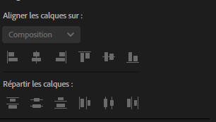
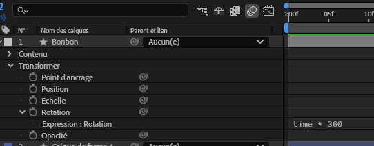
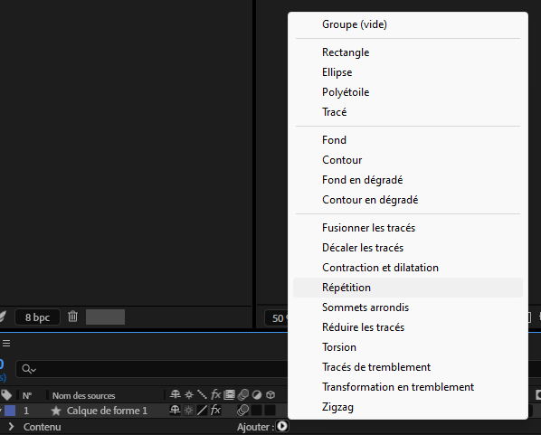
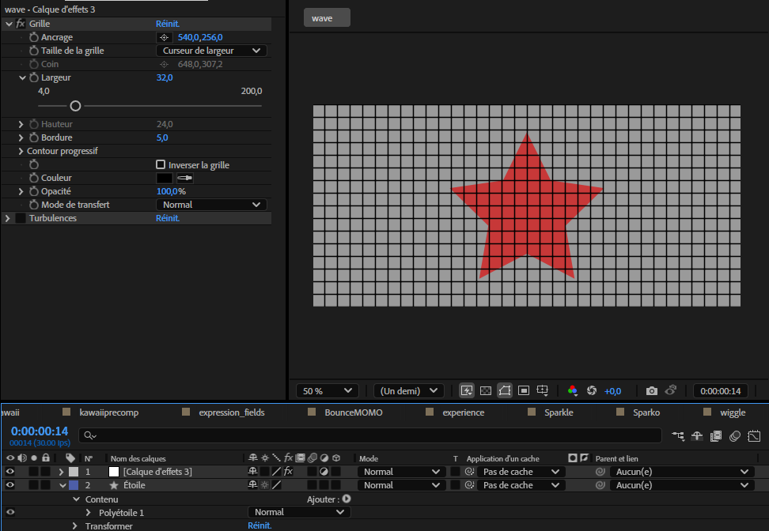
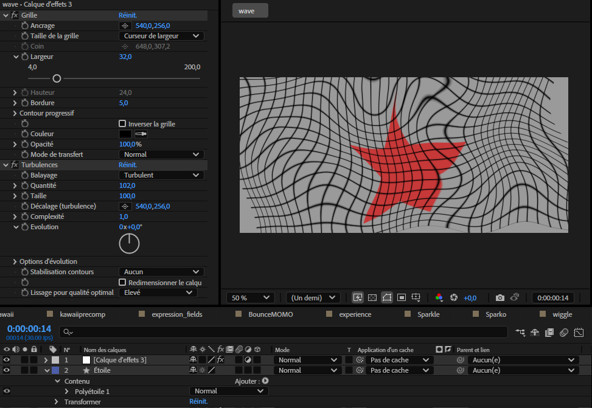
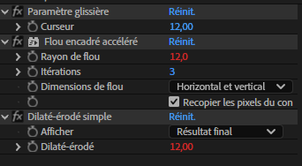
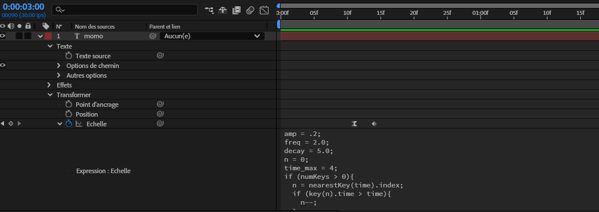

# Cours 9

## Retour sur les 12 principes de l'animation
[Cours 2](./cours02.html#lorigine)

## Courbes temporelles et spatiales (timing)
<!-- https://www.youtube.com/watch?v=HpVtzOtaHlg -->

[:material-play-circle: Éditeur de graphique (graph editor)](https://cmontmorency365-my.sharepoint.com/:v:/g/personal/mariem_ouellet_cmontmorency_qc_ca/EY0GAEKJYR9DsCPY7jjrF8cB4I1E5fM8Sm_FjQxlRsw9SQ?e=BgYJMZ&nav=eyJyZWZlcnJhbEluZm8iOnsicmVmZXJyYWxBcHAiOiJTdHJlYW1XZWJBcHAiLCJyZWZlcnJhbFZpZXciOiJTaGFyZURpYWxvZy1MaW5rIiwicmVmZXJyYWxBcHBQbGF0Zm9ybSI6IldlYiIsInJlZmVycmFsTW9kZSI6InZpZXcifX0%3D)¸

[:material-play-circle: Éditer les courbes de vitesse](https://cmontmorency365-my.sharepoint.com/:v:/g/personal/mariem_ouellet_cmontmorency_qc_ca/EctinuyOULZBnaicYDWPIZEBsTTw0CuinbDUXpMz3r9_ow?e=6G4P4B&nav=eyJyZWZlcnJhbEluZm8iOnsicmVmZXJyYWxBcHAiOiJTdHJlYW1XZWJBcHAiLCJyZWZlcnJhbFZpZXciOiJTaGFyZURpYWxvZy1MaW5rIiwicmVmZXJyYWxBcHBQbGF0Zm9ybSI6IldlYiIsInJlZmVycmFsTW9kZSI6InZpZXcifX0%3D)


[:material-play-circle: Explode Out et Into the Wall](https://cmontmorency365-my.sharepoint.com/:v:/g/personal/mariem_ouellet_cmontmorency_qc_ca/ESwLmiwfV1NMkiZj-d-TqOoBx2cbg8z3wrO_9QX6s6jqNg?e=HWXYdv&nav=eyJyZWZlcnJhbEluZm8iOnsicmVmZXJyYWxBcHAiOiJTdHJlYW1XZWJBcHAiLCJyZWZlcnJhbFZpZXciOiJTaGFyZURpYWxvZy1MaW5rIiwicmVmZXJyYWxBcHBQbGF0Zm9ybSI6IldlYiIsInJlZmVycmFsTW9kZSI6InZpZXcifX0%3D)


## Les effets prédéfinis
[Effets prédéfinis (cours 7)](https://tim-montmorency.com/compendium/582-214-animation2d-jf-mm/cours07.html#effets)


## Alignement et distribution



La distribution se trouve dans le panneau "Aligner".


## Expressions

Quelques expressions québécoises

> Avoir les mains pleines de pouces<br>
> Avoir l’air d’la chienne à Jacques<br>
> Avoir de l’eau dans la cave<br>
> Se tirer une bûche<br>
> Attacher sa tuque

---

Blague à part, en After Effetcs une expression est un **bout de code** basé sur le langage **JavaScript** qu’on peut appliquer à une propriété de calque pour l'animer.

### Ajouter une expression

1. Sélectionner la propriété à animer (ex : Position, Opacité).
1. Maintenir enfoncée la touche ++alt++ sur Windows, ou ++option++ sur Mac, puis cliquer sur le chronomètre ⏱️.
1. Entrer ou coller l'expression dans le champ apparu sous la propriété.

[:material-play-circle: Introduction aux expressions](https://cmontmorency365.sharepoint.com/:v:/s/TIM-582214-Animation2d77/ERfo6EK5c0FHhW9JricGkIQBFeFnX6_-npLcTO8uqqJ4_w?e=eVerR2)


#### Time

La variable `time` est utilisée dans les expressions pour représenter le **temps actuel de la composition en secondes**.

> Par exemple, à 0.5 secondes, `time` vaut 0.5

Appliquée sur la rotation, l'expression ci-dessous permet de modifier la rotation de 360 degrés par seconde et ce, sans aucun keyframe !

```js
time * 360
```

Exemple : 

{ data-zoom-image }


Si on veut appliquer cette méthode à la position ou à l’échelle, il faut soit séparer les deux dimensions, soit insérer les valeurs dans un tableau :

```js
// x et y
[time * 100, time * 100]
```


### Fonction loopOut()


La fonction `loopOut()` permet d'effectuer une boucle automatiquement, sans avoir à copier les images clés à répétition.

[:material-play-circle: LoopOut](https://cmontmorency365.sharepoint.com/:v:/s/TIM-582214-Animation2d77/Efe2JQiXykRNmmTNkxiPZ-4BAlDB7F7THCPlvwNaTKAqow?e=wLXP8A)


#### Cycle

Par défaut, `loopOut()` applique une boucle de type "cycle" si aucun paramètre n’est fourni.

Autrement dit, `loopOut("cycle")` est identique à `loopOut()`.


#### Pingpong
On peut aussi appliquer l'argument "pingpong" pour créer un effet d'aller-retour :

```js
loopOut("pingpong")
```

Cependant, cette méthode n’est pas toujours nécessaire. On peut obtenir un effet similaire avec des images clés bien placées.

Utiliser `loopOut()` sans paramètre permet parfois de réduire la complexité du projet. KISS 👄


#### Autres modes

* "continue" : continue l’animation en extrapolant la vitesse des dernières images clés.
* "offset" : répète l’animation en conservant la position de fin comme point de départ suivant.

Attention avec l'offset. Si la valeur à la fin de son animation est à 0, il s'arrêtera!

### Fonction wiggle()


La fonction `wiggle()` permet d'ajouter un effet de tremblement.

Elle recoit 2 paramètres:

* La **frequence** du tremblement par seconde (ex: 4)
* L'**amplitude** du tremblement ou l'intensité (ex: 40)

La fonction `wiggle()` permet d’ajouter un effet de tremblement.

Elle reçoit deux paramètres :

* La **fréquence** (ex. : 4 tremblements par seconde)
* L’**amplitude** (ex. : 40 pixels de variation)

```js
wiggle(4, 40);
```

[:material-play-circle: "Wiggle"](https://cmontmorency365.sharepoint.com/:v:/s/TIM-582214-Animation2d77/EXPup2WiGjlNqT7tguOtZwsBMcTmzJwpHC-sFfDGUw2dcg?e=RD7Zs5)


!!! info "Copier/coller"

    Lorsqu'on clic droit sur une propriété affectée par une expression, on peut cliquer sur "Copier l'expression seulement".

    Sur un autre calque, ont peut alors faire un coller ++ctrl+v++ pour appliquer la même expression.

    Il est aussi possible de coller l'expression sur une autre propriété. 


## Effets sur les calques de forme

{ data-zoom-image }


---
[:material-play-circle: Capsule: Animation sur forme concentrique](https://cmontmorency365-my.sharepoint.com/:v:/g/personal/mariem_ouellet_cmontmorency_qc_ca/EbjkS3ZpK4pOqTfqduLE-XQBcfNvtW3SF9qQV0lld__Mbw?nav=eyJyZWZlcnJhbEluZm8iOnsicmVmZXJyYWxBcHAiOiJPbmVEcml2ZUZvckJ1c2luZXNzIiwicmVmZXJyYWxBcHBQbGF0Zm9ybSI6IldlYiIsInJlZmVycmFsTW9kZSI6InZpZXciLCJyZWZlcnJhbFZpZXciOiJNeUZpbGVzTGlua0NvcHkifX0&e=xAXrXm)
Pour créer une explosion

1. Créer une forme
1. Dans la transformation de la forme, ajuster la position à 0,0
1. Centrer le point d'encrage sur la forme
1. Centrer la forme dans la composition
1. Cliquer sur Ajouter et sélectionner Répétition
1. Modifier le nombre de copies à 12
1. Dans la transformation de la répétition, ajuster la position à 0,0
1. Dans la transformation de la répétition, ajuster la rotation à 360 / 12
1. Enfin, dans le tracé de la forme, changer la position Y à une valeur inférieure

!!! info "Avec un tracé"

    Il est également possible d'utiliser un tracé.

    Cliquer sur Ajouter et sélectionner Réduire les tracés.
    
    Ainsi, on peut modifier aussi la longeur des traits.

## Visualiser les déformations

Utiliser simplement la grille





## Ligne et effet onde progressive


## Blob


[:material-play-circle: Capsule: comment créer des liquides blobs](https://cmontmorency365-my.sharepoint.com/:v:/g/personal/mariem_ouellet_cmontmorency_qc_ca/EXZOJcUwlZtBrN5igf_43e4BLenw8aL7jSQRSGbJ6zCFSw?nav=eyJyZWZlcnJhbEluZm8iOnsicmVmZXJyYWxBcHAiOiJPbmVEcml2ZUZvckJ1c2luZXNzIiwicmVmZXJyYWxBcHBQbGF0Zm9ybSI6IldlYiIsInJlZmVycmFsTW9kZSI6InZpZXciLCJyZWZlcnJhbFZpZXciOiJNeUZpbGVzTGlua0NvcHkifX0&e=yjx5hh)




## Exercices

<div class="grid grid-1-2" markdown>
  

  <small>Exercice - After Effects</small><br>
  **[:melting_face:](./exercices_ae/fonte/index.md){.stretched-link .back}**
</div>

-----

## Devoirs pour le prochain cours
Écouter les capsules sur 15 effets dans AE

[:material-play-circle: 15 différents effets à explorer](https://cmontmorency365-my.sharepoint.com/:f:/g/personal/mariem_ouellet_cmontmorency_qc_ca/EgSlyZzm2LZBk4qd09ymzw4B3po1iwPcpWXeuNVJWFRS-A?e=83exwr)

+

Groupe Marie-Michelle
<div class="grid grid-1-2" markdown>
  

  <small>Exercice - After Effects</small><br>
  **[Préparation au Kino - Classe Marie-Michelle](./exercices_ae/kino-preparation-mm/index.md){.stretched-link .back}**
</div>

Groupe Jean-François
<div class="grid grid-1-2" markdown>
  

  <small>Exercice - After Effects</small><br>
  **[Préparation au Kino](./exercices_ae/kino-preparation/index.md){.stretched-link .back}**
</div>


[STOP]

[🛠️ Loop Out](exercices_ae/07_loopOut.md)

[🛠️ Expressions](exercices_ae/07_expressions.md)

## Animation complexe avec le graph editor

https://www.youtube.com/watch?v=HpVtzOtaHlg

### Variables

```js
a = 100
```

### Conditions (if)

L'instruction `if` permet d’exécuter une action seulement si une condition est vraie. 

C'est utile pour déclencher un comportement seulement dans certaines situations, comme lorsque le temps dépasse une certaine valeur, ou si une case à cocher est activée.

```js
if (time > 2) {
  100
} else {
  0
}
```

### Expression complexe




```js
amp = .1;        // amplitude de l’oscillation : plus c’est haut, plus ça rebondit fort
freq = 2.0;      // fréquence de l’oscillation : nombre d’oscillations par seconde
decay = 8.0;     // atténuation : plus c’est haut, plus le rebond s'arrête vite
n = 0;           // index du keyframe actif
time_max = 4;    // durée maximale pendant laquelle l'effet s'applique après un keyframe

// Vérifie s’il y a des keyframes
if (numKeys > 0){
  n = nearestKey(time).index; // trouve l’index de la keyframe la plus proche du temps actuel
  if (key(n).time > time){
    n--; // si elle est dans le futur, on prend la précédente (celle « avant »)
  }
}

// Calcule le temps écoulé depuis le dernier keyframe
if (n == 0){ 
	t = 0; // si aucun keyframe avant maintenant, t = 0 → pas d’effet
}else{
	t = time - key(n).time; // temps écoulé depuis le dernier keyframe
}

// Si on est après un keyframe, et dans la fenêtre de rebond autorisée
if (n > 0 && t < time_max){
	v = velocityAtTime(key(n).time - thisComp.frameDuration/10);  // vitesse du calque juste avant le keyframe
	// Applique une oscillation basée sur la vitesse + une sinusoïde + une atténuation exponentielle
	value + v * amp * Math.sin(freq * t * 2 * Math.PI) / Math.exp(decay * t);
}else{
	value;   // sinon, on retourne la valeur normale de la propriété
}

```

References

Burst : https://www.youtube.com/watch?v=4UtNW5FFXT8
Repeater : https://www.youtube.com/watch?v=WLFO4nBLpDw
Blob : https://www.youtube.com/watch?v=M4qnk40aBls
Sine : https://www.youtube.com/watch?v=DY73Kyk0T7A