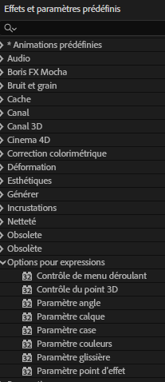

# Cours 9 

[STOP]

## Retour sur les 12 principes de l'animation

[Cours 2](./cours02.md)

## Alignement et distribution


## Expressions

Quelques expressions québécoises

> Avoir les mains pleines de pouces<br>
> Avoir l’air d’la chienne à Jacques<br>
> Avoir de l’eau dans la cave<br>
> Se tirer une bûche<br>
> Attacher sa tuque

Blague à part, en After Effetcs une expression est un **bout de code** basé sur le langage **JavaScript** qu’on peut appliquer à une propriété de calque pour l'animer.

### Ajouter une expression

1. Sélectionner la propriété à animer (ex : Position, Opacité).
1. Maintenir enfoncée la touche ++alt++ sur Windows, ou ++option++ sur Mac, puis cliquer sur le chronomètre ⏱️.
1. Entrer ou coller l'expression dans le champ apparu sous la propriété.

[:material-play-circle: Introduction aux expressions](https://cmontmorency365.sharepoint.com/:v:/s/TIM-582214-Animation2d77/ERfo6EK5c0FHhW9JricGkIQBFeFnX6_-npLcTO8uqqJ4_w?e=eVerR2)

### Variable Time

{ data-zoom-image }

La variable `time` est utilisée dans les expressions pour représenter le **temps actuel de la composition en secondes**.

> Par exemple, à 0.5 secondes, `time` vaut 0.5

Appliquée sur la rotation, l'expression ci-dessous permet de modifier la rotation de 360 degrés par seconde et ce, sans aucun keyframe !

```js
time * 360
```

Résultat : 


Si on veut appliquer cette méthode à la position ou à l’échelle, il faut soit séparer les deux dimensions, soit insérer les valeurs dans un tableau :

```js
// x et y
[time * 100, time * 100]
```

### loopOut()


La fonction `loopOut()` permet d'effectuer une boucle automatiquement, sans avoir à copier les images clés à répétition.

[:material-play-circle: LoopOut](https://cmontmorency365.sharepoint.com/:v:/s/TIM-582214-Animation2d77/Efe2JQiXykRNmmTNkxiPZ-4BAlDB7F7THCPlvwNaTKAqow?e=wLXP8A)

#### Cycle

Par défaut, `loopOut()` applique une boucle de type "cycle" si aucun paramètre n’est fourni.

Autrement dit, `loopOut("cycle")` est identique à `loopOut()`.

#### Pingpong

On peut aussi appliquer l'argument "pingpong" pour créer un effet d'aller-retour :

```js
loopOut("pingpong")
```

Cependant, cette méthode n’est pas toujours nécessaire. On peut obtenir un effet similaire avec des images clés bien placées.

Utiliser `loopOut()` sans paramètre permet parfois de réduire la complexité du projet. KISS 👄

#### Autres modes

* "continue" : continue l’animation en extrapolant la vitesse des dernières images clés.
* "offset" : répète l’animation en conservant la position de fin comme point de départ suivant.

Attention avec l'offset. Si la valeur à la fin de son animation est à 0, il s'arrêtera!

### wiggle()

La fonction `wiggle()` permet d'ajouter un effet de tremblement.

Elle recoit 2 paramètres:

* La **frequence** du tremblement par seconde (ex: 4)
* L'**amplitude** du tremblement ou l'intensité (ex: 40)

La fonction `wiggle()` permet d’ajouter un effet de tremblement.

Elle reçoit deux paramètres :

* La **fréquence** (ex. : 4 tremblements par seconde)
* L’**amplitude** (ex. : 40 pixels de variation)

```js
wiggle(4, 40);
```

[:material-play-circle: "Wiggle"](https://cmontmorency365.sharepoint.com/:v:/s/TIM-582214-Animation2d77/EXPup2WiGjlNqT7tguOtZwsBMcTmzJwpHC-sFfDGUw2dcg?e=RD7Zs5)

### posterizeTime()

Cette expression permet de modifier le framerate sur un calque spécifique.

```js
posterizeTime(12); // Pour 12 fps
```

On retrouve aussi cette fonction en tant qu’effet : `Effet > Temps > Postérisation temporelle`

Pour créer l'effet dans la vidéo ci-dessous, on ajoute simplement un effet de Turbulences au calque. Il est même possible d'ajouter une expression pour automatiser la déformation en appliquant `random(1000)` à la propriété Générateur aléatoire de l'effet.


### Options pour expressions



!!! info "Copier/coller"

    Lorsqu'on clic droit sur une propriété affectée par une expression, on peut cliquer sur "Copier l'expression seulement".

    Sur un autre calque, ont peut alors faire un coller ++ctrl+v++ pour appliquer la même expression.

    Il est aussi possible de coller l'expression sur une autre propriété. 

## Expression complexe


```js
amp = .1;        // amplitude de l’oscillation : plus c’est haut, plus ça rebondit fort
freq = 2.0;      // fréquence de l’oscillation : nombre d’oscillations par seconde
decay = 8.0;     // atténuation : plus c’est haut, plus le rebond s'arrête vite
n = 0;           // index du keyframe actif
time_max = 4;    // durée maximale pendant laquelle l'effet s'applique après un keyframe

// Vérifie s’il y a des keyframes
if (numKeys > 0){
  n = nearestKey(time).index; // trouve l’index de la keyframe la plus proche du temps actuel
  if (key(n).time > time){
    n--; // si elle est dans le futur, on prend la précédente (celle « avant »)
  }
}

// Calcule le temps écoulé depuis le dernier keyframe
if (n == 0){ 
	t = 0; // si aucun keyframe avant maintenant, t = 0 → pas d’effet
}else{
	t = time - key(n).time; // temps écoulé depuis le dernier keyframe
}

// Si on est après un keyframe, et dans la fenêtre de rebond autorisée
if (n > 0 && t < time_max){
	v = velocityAtTime(key(n).time - thisComp.frameDuration/10);  // vitesse du calque juste avant le keyframe
	// Applique une oscillation basée sur la vitesse + une sinusoïde + une atténuation exponentielle
	value + v * amp * Math.sin(freq * t * 2 * Math.PI) / Math.exp(decay * t);
}else{
	value;   // sinon, on retourne la valeur normale de la propriété
}

```


## Effets sur les calques de forme

{ data-zoom-image }


## Exercices

[🛠️ Loop Out](exercices_ae/07_loopOut.md)

[🛠️ Expressions](exercices_ae/07_expressions.md)

## Préparation au Kino

> Faire bien avec rien,<br>
> faire mieux avec peu,<br>
> mais le faire maintenant ![^kino]

[^kino]: <https://fr.wikipedia.org/wiki/Kino_(mouvement)>

Technicité

* 3 compositions de 1080 × 1080, en 24 fps
* Même durée pour chaque animation
* Export final : 3240 × 1080
* Chaque animation doit être bouclable (la première et la dernière image doivent être identiques)

Esthétisme

* Style graphique et palette de couleurs cohérents
* Thématique spécifique donnée la journée même
* Style motion design avec formes simples et tracés

Style recherché : [A](https://www.pinterest.ca/loraboisvert/bauhaus/inspiration-1/), [B](https://www.pinterest.ca/loraboisvert/bauhaus/inspiration-2/), [C](https://9-squares.tumblr.com/)

[STOP]

## Animation complexe avec le graph editor

https://www.youtube.com/watch?v=HpVtzOtaHlg

### Variables

```js
a = 100
```

### Conditions (if)

L'instruction `if` permet d’exécuter une action seulement si une condition est vraie. 

C'est utile pour déclencher un comportement seulement dans certaines situations, comme lorsque le temps dépasse une certaine valeur, ou si une case à cocher est activée.

```js
if (time > 2) {
  100
} else {
  0
}
```