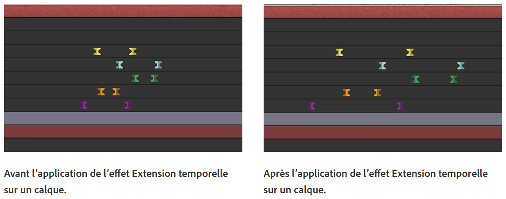
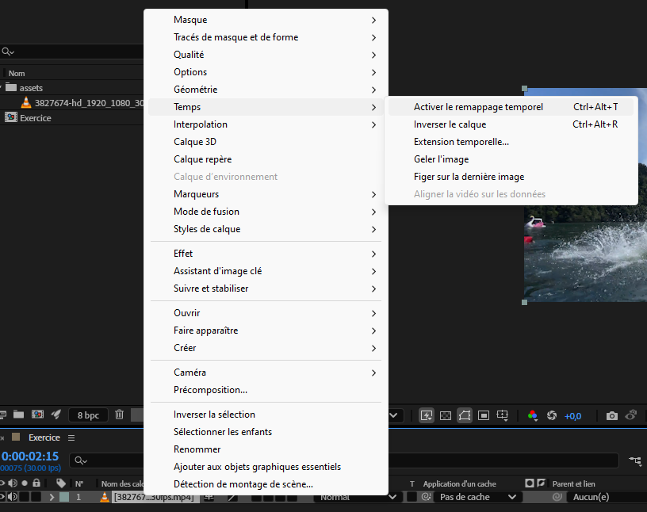

[STOP]
# Cours 10

## Suivi et masquage avancé

## Vitesse de lecture vidéo

### Extention temporelle: ralentir ou accélérer une animation

[:material-play-circle: Time stretch manuel](https://cmontmorency365-my.sharepoint.com/:v:/g/personal/mariem_ouellet_cmontmorency_qc_ca/EUqKO4P5OotDuxeQKwbDftsB1zWa6whp9V4T6itVkG99og?nav=eyJyZWZlcnJhbEluZm8iOnsicmVmZXJyYWxBcHAiOiJPbmVEcml2ZUZvckJ1c2luZXNzIiwicmVmZXJyYWxBcHBQbGF0Zm9ybSI6IldlYiIsInJlZmVycmFsTW9kZSI6InZpZXciLCJyZWZlcnJhbFZpZXciOiJNeUZpbGVzTGlua0NvcHkifX0&e=M65Fms)

L’**extension temporelle** désigne l’accélération ou le ralentissement d’un calque complet selon un facteur identique. Lorsque vous appliquez une extension temporelle à un calque dans le temps, le son et les images d’origine du métrage (ainsi que toutes les images clés lui appartenant) sont redistribués sur la nouvelle durée du calque. Bref, utilisez cette commande si vous souhaitez que le calque ainsi que toutes ses images clés soient affectés par la nouvelle durée.

### Étendre un calque dans le temps

* Sélectionnez un calque dans le panneau Montage ou Composition.
* Choisissez Calque > Temps > Extension temporelle.
* Dans la boîte de dialogue Extension temporelle, saisissez une nouvelle durée pour le calque.

### Remappage temporel

Vous pouvez étendre, compresser, lire vers l’arrière ou figer une partie de la durée d’un calque à l’aide d’un processus appelé **Remappage temporel**. Par exemple, si vous utilisez un métrage représentant une personne en train de marcher, vous pouvez lire le métrage de la personne vers l’avant, puis lire quelques images vers l’arrière pour faire reculer la personne, puis lire à nouveau vers l’avant pour que la personne reprenne sa marche. Le remappage temporel est idéal pour les scènes combinant ralenti, accéléré et marche arrière.

**Activer le remappage temporel** : Permet de lisser la vitesse de lecture à l'aide de keyframes.

## Particules

1. Créer d'abord un calque Solide.
1. Glisser l'effet « CC Particle Systems II » sur le calque Solide.
1. Appuyer sur « Play » pour voir le résultat !
1. Ensuite, il suffit vraiment de tester les configurations des particules, c'est assez simple :)

[:material-play-circle: CC Particle Systems II](https://cmontmorency365-my.sharepoint.com/:v:/g/personal/mariem_ouellet_cmontmorency_qc_ca/EUBYih1QFqRHiMZH08s9ki0Bx-c4GXne5gH8KkRaw35lzQ)

[:material-play-circle: CC Particle World](https://cmontmorency365-my.sharepoint.com/:v:/g/personal/mariem_ouellet_cmontmorency_qc_ca/EV97SLGemdRHu37KC_UXrDsBplE0EAYlrL4UIRHq4sHMAw)

[:material-play-circle: CC Particle World (suite)](https://cmontmorency365-my.sharepoint.com/:v:/g/personal/mariem_ouellet_cmontmorency_qc_ca/EUjyQMxags1GrbCIk1gIk1cB_RdTowjzT7Vktx8slWyeIw)

[Particle Systems II + CC Particle World | Jake In Motion - YouTube](https://www.youtube.com/watch?v=7Fp9207Ds5I)

## Temps de travail sur le TP2
