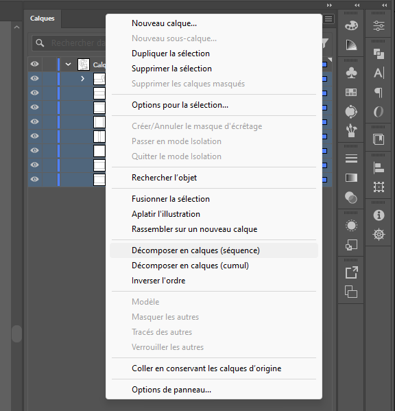
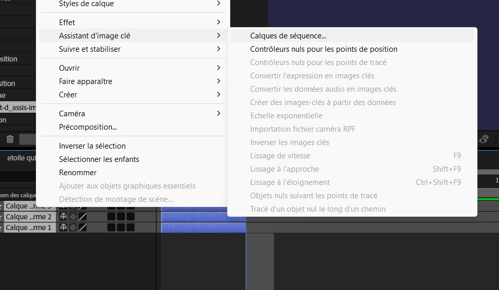
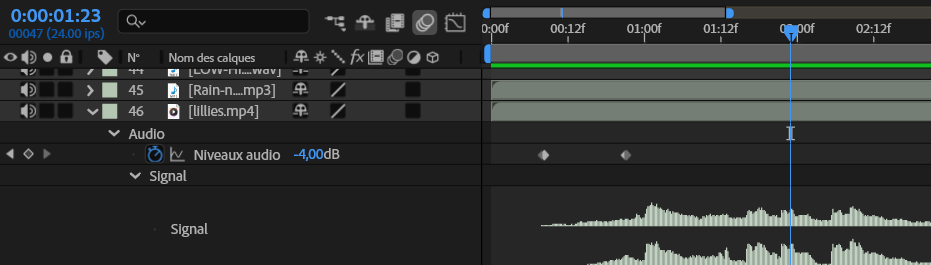

[STOP]
# Cours 10

## Line art

[:material-play-circle: Line art - Tutoriel 1/2](https://cmontmorency365-my.sharepoint.com/:v:/r/personal/mariem_ouellet_cmontmorency_qc_ca/Documents/01_cours/Cours%20Animation%202D/animation%202D%202025/02_capsules_video/02_capsules_after_effects/31_effets/06_animation_line_art/01_animation_line_art_visage.mov?csf=1&web=1&nav=eyJyZWZlcnJhbEluZm8iOnsicmVmZXJyYWxBcHAiOiJPbmVEcml2ZUZvckJ1c2luZXNzIiwicmVmZXJyYWxBcHBQbGF0Zm9ybSI6IldlYiIsInJlZmVycmFsTW9kZSI6InZpZXciLCJyZWZlcnJhbFZpZXciOiJNeUZpbGVzTGlua0NvcHkifX0&e=sM7mSg)

[:material-play-circle: Line art - Tutoriel 2/2](https://cmontmorency365-my.sharepoint.com/:v:/r/personal/mariem_ouellet_cmontmorency_qc_ca/Documents/01_cours/Cours%20Animation%202D/animation%202D%202025/02_capsules_video/02_capsules_after_effects/31_effets/06_animation_line_art/02_animation_line_art_fleur.mov?csf=1&web=1&nav=eyJyZWZlcnJhbEluZm8iOnsicmVmZXJyYWxBcHAiOiJPbmVEcml2ZUZvckJ1c2luZXNzIiwicmVmZXJyYWxBcHBQbGF0Zm9ybSI6IldlYiIsInJlZmVycmFsTW9kZSI6InZpZXciLCJyZWZlcnJhbFZpZXciOiJNeUZpbGVzTGlua0NvcHkifX0&e=erARCl)

## Illustrator 🫠

{ data-zoom-image }

Pour transformer rapidement des groupes en calques dans Adobe Illustrator, suivez ces étapes :

1. **Sélection des groupes** : Dans le panneau Calques, sélectionnez les groupes que vous souhaitez convertir en calques distincts. 
1. **Accès au menu des options** : Cliquez sur l’icône de menu (représentée par trois lignes horizontales) en haut à droite du panneau Calques. 
1. **Décomposition en calques** : Choisissez l’option « Décomposer en calques (séquence) ». Cette commande répartit chaque élément du groupe sur son propre calque, facilitant ainsi leur gestion individuelle.  
1. **Réorganisation des calques** : Les nouveaux calques créés sont imbriqués sous le calque principal. Pour les déplacer au niveau supérieur, sélectionnez-les et faites-les glisser en dehors du calque parent, ou utilisez la commande « Rassembler sur un nouveau calque » pour les regrouper.  

Source : <https://helpx.adobe.com/lu_fr/illustrator/using/layers.html>

## Séquencer une animation

Couper un calque vidéo en 2 à la position de la tête de lecture: ++ctrl+shift+d++ 

Séquencer (mettre bout à bout) des calques :  
Sélection des calques. Clic-droit. Assistant d'image-clé/Calqus de séquence.

Résultat :

## Vitesse de lecture vidéo

### Extention temporelle: ralentir ou accélérer une animation

[:material-play-circle: Time stretch manuel](https://cmontmorency365-my.sharepoint.com/:v:/g/personal/mariem_ouellet_cmontmorency_qc_ca/EUqKO4P5OotDuxeQKwbDftsB1zWa6whp9V4T6itVkG99og?nav=eyJyZWZlcnJhbEluZm8iOnsicmVmZXJyYWxBcHAiOiJPbmVEcml2ZUZvckJ1c2luZXNzIiwicmVmZXJyYWxBcHBQbGF0Zm9ybSI6IldlYiIsInJlZmVycmFsTW9kZSI6InZpZXciLCJyZWZlcnJhbFZpZXciOiJNeUZpbGVzTGlua0NvcHkifX0&e=M65Fms)

L’**extension temporelle** désigne l’accélération ou le ralentissement d’un calque complet selon un facteur identique. Lorsque vous appliquez une extension temporelle à un calque dans le temps, le son et les images d’origine du métrage (ainsi que toutes les images clés lui appartenant) sont redistribués sur la nouvelle durée du calque. Bref, utilisez cette commande si vous souhaitez que le calque ainsi que toutes ses images clés soient affectés par la nouvelle durée.

### Étendre un calque dans le temps

* Sélectionnez un calque dans le panneau Montage ou Composition.
* Choisissez Calque > Temps > Extension temporelle.
* Dans la boîte de dialogue Extension temporelle, saisissez une nouvelle durée pour le calque.

### Remappage temporel

Vous pouvez étendre, compresser, lire vers l’arrière ou figer une partie de la durée d’un calque à l’aide d’un processus appelé **Remappage temporel**. Par exemple, si vous utilisez un métrage représentant une personne en train de marcher, vous pouvez lire le métrage de la personne vers l’avant, puis lire quelques images vers l’arrière pour faire reculer la personne, puis lire à nouveau vers l’avant pour que la personne reprenne sa marche. Le remappage temporel est idéal pour les scènes combinant ralenti, accéléré et marche arrière.

**Activer le remappage temporel** : Permet de lisser la vitesse de lecture à l'aide de keyframes.

## Particules

1. Créer d'abord un calque Solide.
1. Glisser l'effet « CC Particle Systems II » sur le calque Solide.
1. Appuyer sur « Play » pour voir le résultat !
1. Ensuite, il suffit vraiment de tester les configurations des particules, c'est assez simple :)

[:material-play-circle: CC Particle Systems II](https://cmontmorency365-my.sharepoint.com/:v:/g/personal/mariem_ouellet_cmontmorency_qc_ca/EUBYih1QFqRHiMZH08s9ki0Bx-c4GXne5gH8KkRaw35lzQ)

[:material-play-circle: CC Particle World](https://cmontmorency365-my.sharepoint.com/:v:/g/personal/mariem_ouellet_cmontmorency_qc_ca/EV97SLGemdRHu37KC_UXrDsBplE0EAYlrL4UIRHq4sHMAw)

[:material-play-circle: CC Particle World (suite)](https://cmontmorency365-my.sharepoint.com/:v:/g/personal/mariem_ouellet_cmontmorency_qc_ca/EUjyQMxags1GrbCIk1gIk1cB_RdTowjzT7Vktx8slWyeIw)

[Particle Systems II + CC Particle World | Jake In Motion - YouTube](https://www.youtube.com/watch?v=7Fp9207Ds5I)

## Temps de travail sur le TP2
