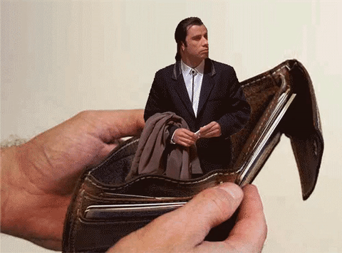
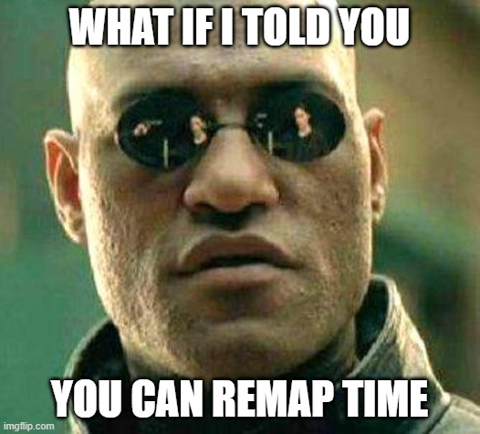

# Cours 10

## Ordre du jour

- [Suivi et masquage avancé](#suivi-et-masquage-avancé)
- [Vitesse de lecture vidéo](#vitesse-de-lecture-vidéo)
- [Particules](#particules)
- [Temps de travail sur le TP2](#temps-de-travail-sur-le-tp2)

## Suivi et masquage avancé

### Animation du tracé de masque

Comme nous l'avons vu au cours 8, il est possible d'ajouter des masques ou des caches à nos calques pour en dissimuler une partie. Pour allez plus loin, nous verrons comment il est possible de d'animer le déplacement du tracé de nos masques. Pour ce faire, il suffit d'ajouter des keyframes sur la propriété tracé du masque. On peut donc ajouter/retirer des points d'ancrage et déplacer notre tracé et celui-ci sera animé. 

### Exercice dévoilement d'un texte par animation d'un tracé de masque

Faire une nouvelle composition de 10 sec., ajouter un titre et le dévoiler par animation d'un tracé de masque.

### Suivi ou *motion tracking*

Une autre méthode pour faire l'analyse d'un mouvement est l'utilisation de l'outil de Suivi de mouvement. Cet outil peut être utile pour masquer un élément en appliquant un autre par dessus (ex: remplacer un écran de téléphone), pour faire suivre un élément par un autre (ex: une bulle qui suit un personnage) ou encore pour stabiliser une caméra qui tremble. Le suivi peut se faire en 1 points, 2 points, 4 points ou en 3d selon ce qu'on désire suivre (position, échelle, rotation, perspective ou intégration 3d). Bien que nous pourrions dédier un cours complet au suivi de mouvement, nous allons simplement nous intéresser au suivi de position et de perspective. Pour y arriver, les étapes sont les suivantes :   

- Appliquer des points de suivi sur notre vidéo
- Analyser le mouvement
- Appliquer le suivi à un objet nul
- Attacher le calque désiré à l'objet nul par lien de parenté
- Déplacer le point d'ancrage au besoin

### Exercice suivi de position d'un personnage 

[Dossier de départ :material-download:](./assets/images/cours11-gc/suivi-position.zip){ .md-button .md-button--primary }

### Rotoscopie et Roto-brush

La rotoscopie est un processus pour isoler un sujet de son arrière-plan très souvent dans l'objectif de l'intégrer sur une autre composition. 

Bien que cette procédure ait longtemps été faite en utilisant un tracé de courbe de bézier image par image, nous disposons maintenant d'un outil intelligent pour réduire considérablement cette lourde tâche : la *roto-brush*. Pour l'utiliser, les étapes sont les suivantes : 

- S'assurer que la composition possède le même *framerate* que la vidéo importée 
- Sélectionner la *roto-brush* à gauche de l'outil *puppet-pin*
- Double cliquer sur le calque pour ouvrir la fenêtre de *roto-brush*
- Utiliser la brosse pour sélectionner le sujet 
- Faire avancer la lecture pour analyser les images
- Utiliser la fonction Geler lorsque terminé
- Attendre l'analyse

Pour de meilleurs résultats, on peut utiliser les fonctions Améliorer le contour ou contour progressif. Aussi, il arrive très souvent qu'il y ait des erreurs de propagation où notre sujet change trop busquement de direction : il faut alors naviguer manuellement à cet endroit et reprendre la détection. Autrement, il est toujours idéal d'utiliser des images avec un fort contraste pour faciliter l'analyse.

## Vitesse de lecture vidéo

### Extension temporelle: ralentir ou accélérer une animation

[:material-play-circle: Time stretch manuel](https://cmontmorency365-my.sharepoint.com/:v:/g/personal/mariem_ouellet_cmontmorency_qc_ca/EUqKO4P5OotDuxeQKwbDftsB1zWa6whp9V4T6itVkG99og?nav=eyJyZWZlcnJhbEluZm8iOnsicmVmZXJyYWxBcHAiOiJPbmVEcml2ZUZvckJ1c2luZXNzIiwicmVmZXJyYWxBcHBQbGF0Zm9ybSI6IldlYiIsInJlZmVycmFsTW9kZSI6InZpZXciLCJyZWZlcnJhbFZpZXciOiJNeUZpbGVzTGlua0NvcHkifX0&e=M65Fms)

L’**extension temporelle** désigne l’accélération ou le ralentissement d’un calque complet selon un facteur identique. Lorsque vous appliquez une extension temporelle à un calque dans le temps, le son et les images d’origine du métrage (ainsi que toutes les images clés lui appartenant) sont redistribués sur la nouvelle durée du calque. Bref, utilisez cette commande si vous souhaitez que le calque ainsi que toutes ses images clés soient affectés par la nouvelle durée.

### Étendre un calque dans le temps

* Sélectionnez un calque dans le panneau Montage ou Composition.
* Choisissez Calque > Temps > Extension temporelle.
* Dans la boîte de dialogue Extension temporelle, saisissez une nouvelle durée pour le calque.

### Remappage temporel

Vous pouvez étendre, compresser, lire vers l’arrière ou figer une partie de la durée d’un calque à l’aide d’un processus appelé **Remappage temporel**. Par exemple, si vous utilisez un métrage représentant une personne en train de marcher, vous pouvez lire le métrage de la personne vers l’avant, puis lire quelques images vers l’arrière pour faire reculer la personne, puis lire à nouveau vers l’avant pour que la personne reprenne sa marche. Le remappage temporel est idéal pour les scènes combinant ralenti, accéléré et marche arrière.

**Activer le remappage temporel** : Permet de lisser la vitesse de lecture à l'aide de keyframes.

### Exercice remappage temporel 

[Dossier de départ :material-download:](./assets/images/cours11-gc/time-remap.zip){ .md-button .md-button--primary }

## Particules

Les particules dans After Effects sont un sujet assez complexe qui mériteraient leur propre cours. Bien qu'il existe de nombreux systèmes de particules (Particular, CC Particle World, CC Particle System 2, etc.), la logique commune repose sur les paramètres suivants : 

- Émetteur (position d'émission) 
- *Birth rate* (combien naissent par seconde?) 
- Longévité (combien de temps elles restent "vivantes"?) 
- Vélocité (à quelle vitesse elles partent?) 
- Animation (dans quelle direction elles partent?)    
- Types de particules (lignes, sphère, polygones, étoiles, etc.)

Après, le reste est du raffinement (couleurs, gravité, rayon, etc.)  

1. Créer d'abord un calque Solide.
1. Glisser l'effet « CC Particle Systems II » sur le calque Solide.
1. Appuyer sur « Play » pour voir le résultat !
1. Ensuite, il suffit vraiment de tester les configurations des particules, c'est assez simple :)

[:material-play-circle: CC Particle Systems II](https://cmontmorency365-my.sharepoint.com/:v:/g/personal/mariem_ouellet_cmontmorency_qc_ca/EUBYih1QFqRHiMZH08s9ki0Bx-c4GXne5gH8KkRaw35lzQ)

[:material-play-circle: CC Particle World](https://cmontmorency365-my.sharepoint.com/:v:/g/personal/mariem_ouellet_cmontmorency_qc_ca/EV97SLGemdRHu37KC_UXrDsBplE0EAYlrL4UIRHq4sHMAw)

[:material-play-circle: CC Particle World (suite)](https://cmontmorency365-my.sharepoint.com/:v:/g/personal/mariem_ouellet_cmontmorency_qc_ca/EUjyQMxags1GrbCIk1gIk1cB_RdTowjzT7Vktx8slWyeIw)

[Particle Systems II + CC Particle World | Jake In Motion - YouTube](https://www.youtube.com/watch?v=7Fp9207Ds5I)

## Temps de travail sur le TP2
