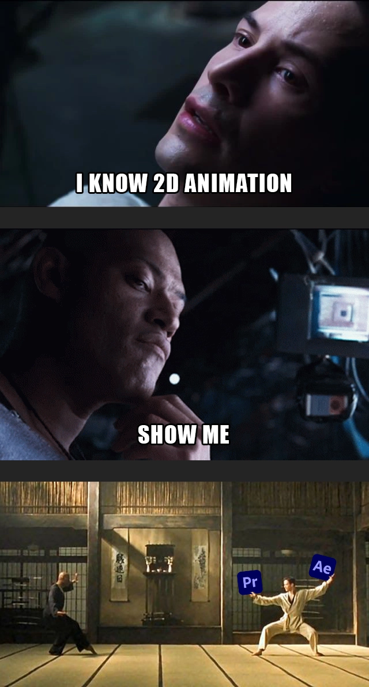

# Cours 11

## Ordre du jour

- [Présentation du concours d'essai audiovisuel](#présentation-du-concours-dessai-audiovisuel)
- [Retour sur le montage vidéo](#retour-sur-le-montage-vidéo)
- [Outils additionnels dans Illustrator](#outils-additionnels-dans-illustrator)
- [Rigging et arborescence](#rigging-et-arborescence)
- [Travailler en équipe avec After Effects](#travailler-en-équipe-avec-after-effects)
- [Présentation du travail synthèse](#présentation-du-travail-synthèse)

## Présentation du concours d'essai audiovisuel

Le fameux concours d'essais audiovisuels aura encore lieu cette année !
 
Ce concours est une belle occasion d'obtenir une bourse en argent (jusqu'à 175$) et de bonifier votre portfolio ! 
 
Date limite de remise : 10 mai 2026 
 
Vous trouverez [ici](https://cmontmorency365.sharepoint.com/:b:/r/sites/TIM-programmeTIM752/Documents%20partages/Concours%20essais%20audiovisuels/Appel%20a%20candidature%202026.pdf?csf=1&web=1&e=UCFoag) les détails de l'appel aux candidatures.
 
Des questions? Adressez-les à Lora Boisvert ou à Thomas O Fredericks

## Retour sur le montage vidéo

Tel que mentionné dans les cours précédant, After Effects n'est pas un outil de montage vidéo, mais bien d'intégration (compositing), de conception d'effets spéciaux visuels (VFX) et de conception graphique animée (motion design). Malgré que le montage soit possible, il reste que ce n'est pas l'outil idéal. Pour travailler de manière optimale, il est préférable d'exporter nos compositions dans un logiciel de montage comme Adobe Premiere Pro ou Davinci Resolve. 

### Intégration dans Premiere Pro

Sans doute la méthode la plus facile, pour faire le montage de nos compositions dans Premiere Pro, il suffit de les importer directement dans Premiere Pro au format After Effects (.aep). Ensuite, il est possible de modifier dans After Effects et de sauvegarder pour actualiser automatiquement dans Premiere Pro sans avoir à exporter ou faire de rendu au préalable.

### Intégration dans Davinci Resolve

Bien que la méthode est assez semblable pour travailler dans Davinci Resolve, il suffit d'exporter un rendu (au format .mp4 par exemple). Par contre, le processus est à recommencer à chaque fois qu'une composition est modifiée dans After Effects. 

### Démonstration

## Outils additionnels dans Illustrator

### Outil concepteur de formes

Pour faciliter la création de formes sans passer par les courbes de bézier, il est possible d'utiliser l'outil concepteur de formes. C'est un outil puissant qui permet d'ajouter/soustraire des formes simples (ellipses, rectangles, polygone, etc.) de manière intuitive. Pour y arriver, il suffit de suivre les étapes suivantes : 

- Dessiner des formes superposées
- Sélectionner toutes les formes désirées
- Sélectionner l'outil concepteur de formes à partir de la boîte à outils
- Glisser sur les zones à ajouter
- Maintenir la touche ALT et glisser sur les zones à retirer
- Maintenir la touche ALT et cliquer sur une zone à retirer

Cet outil est souvent plus simple à utiliser que les courbes de bézier puisqu'il est visuel. Il est vraiment utile pour créer des logos à partir de formes simples dont voici quelques exemples : 

- [logos simples](https://www.instagram.com/reel/DTVNCNyE174/)
- [logos en cercles](https://www.youtube.com/shorts/t7llHTsmx5c)
- [logo complexe](https://www.youtube.com/results?search_query=shape+builder+tool+illustrator+eagle)

#### Exercice création d'un symbole yin yang

### Vectorisation

Parfois, on souhaite travailler à partir d'une image matricielle et de faire le tracé par nous-même. Bien que cela est entièrement possible, ce processus peut s'avérer assez long. Dans la plupart des cas, il est préférable d'automatiser le tout. Pour y arriver, nous pouvons simplement utiliser la vectorisation dans Illustrator. Cette procédure repose sur la fonction vectorisation dynamique (Objet > Vectorisation dynamique > Créer ou Objet > Vectorisation dynamique > Créer et étendre), par contre ces outils offrent peu de contrôle. Pour plus de personnalisation, il est idéal d'utiliser la fenêtre (Fenêtre > Vectorisation dynamique). À partir de cette fenêtre, il est possible de :

- Choisir un paramètre prédéfini (image haute/basse fidelité, 3 couleurs, 6 couleurs, 16 couleurs, etc)
- Déterminer le niveau de détails
- Avoir une prévisualisation 
- Étendre (ajouter des points d'ancrage)

Bien que la vectorisation peut être utile dans plusieurs cas, il est important de prendre en compte les éléments suivants : 

- Certaines images ne donneront jamais de résultats satisfaisants
- Il est très possible qu'il y ait tellement de points d'ancrage que l'image sera difficile à modifier
- Il est toujours idéal de travailler à partir d'un contraste élevé 
- Une plus grande résolution est souhaitable pour conserver un niveau de détails élevés, par contre la longueur du traitement sera proportionnelle au poids de l'image.

#### Exercice vectorisation d'une image 

[Dossier de départ :material-download:](./assets/images/cours11-gc/vectorisation.zip){ .md-button .md-button--primary }

### Rappel des méthodes d'exportation vers After Effects 

À titre de rappel, chaque élément que l'on désire animer dans After Effects doit être sur son propre calque. Pour y arriver, il faut cliquer sur un calque puis sur les options et décomposer en calque (séquence). Finalement, il faut séparer les éléments. Une fois dans After Effects, on importe le fichier Illustrator (.ai) sous forme de composition. Une fois dans After Effects et selon nos besoins, il est possible de convertir les calques en formes à partir du menu Créer, transformer en formes.   

## Rigging et arborescence 

Pour animer facilement des articulations ou des mécanismes sans avoir à déplacer chaque élément de manière indépendante, il est idéal de créer un squelette numérique. Ce processus est appelé le *rigging* et permet de gagner énormément de temps en liant les membres (ou pièces) d'un ensemble (ex: lorsqu'on bouge le bras, l'avant-bras suit de manière automatique). Dans After Effects, il est nécessaire de maîtriser les concepts de points d'ancrage et de parenté, mais surtout de bien comprendre l'arborescence ou la hiérarchie de nos squelettes. 

### Exercice création et animation d'un bras

## Travailler en équipe avec After Effects

### Synchronisation des médias

Pour assurer une synchronisation des médias (images, vidéos, audio, etc.), voici la méthode avec OneDrive qui a été testée jeudi le 17 avril 2025.

* Tous les membres de l'équipe doivent être connectés à OneDrive (assurez vous que le logo OneDrive :material-microsoft-onedrive: en bas à droite de la barre Windows soit bleu sans × rouge)
* Tous les membres de l'équipe doivent avoir la même version d'After Effects
* Un membre de l'équipe doit créer un dossier des médias du projet sur son OneDrive. Il doit ensuite partager les accès d'écriture à ses coéquipiers.
* Les coéquipiers doivent "Synchroniser" le dossier des médias sur leur ordinateur. Cette étape est importante, car il faudra remapper les médias dans After Effects sur le dossier créé avec la synchronisation. Pour synchroniser le dossier partagé, vous pouvez suivre ces étapes :
  * Ouvrez Teams.
  * Dans la barre latérale de gauche, cliquez sur "OneDrive". S'il n'y figure pas, trouvez le en cliquant sur le bouton à 3 points (:material-dots-horizontal:).
  * Dans l'onglet de gauche "Partagé", vous devriez voir le dossier partagé de vos médias. Cliquez dessus.
  * Enfin, cliquez sur le lien "Synchroniser" situé tout en haut.
  * Pour situer l'emplacement du dossier synchronisé sur votre ordinateur, il devrait se situer dans le dossier «Collège Montmorency».
* Ouvrez le projet d'équipe After Effects. À cette étape, vous devrier voir les médias brisés.
* Double-cliquez sur l'un des médias et une fenêtre de remappage s'ouvrira.
* Cliquer sur le bouton "Nouveau mappage de médias..." et choissez le dossier synchronisé dans «Collège Montmorency».
* Fermer la fenêtre.
* Redémarrez After Effects au besoin.

Si cette méthode ne fonctionne toujours pas, je vous recommande de m'écrire sur Teams ou d'en parler avec un des TTP.

!!! bug "Nomenclature des médias"

    Évitez les espaces, les caractères accentués et les caractères speciaux dans les noms de fichier.

## Présentation du travail synthèse

