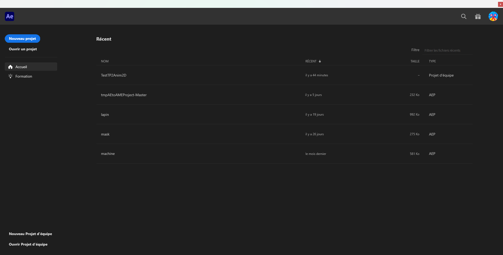
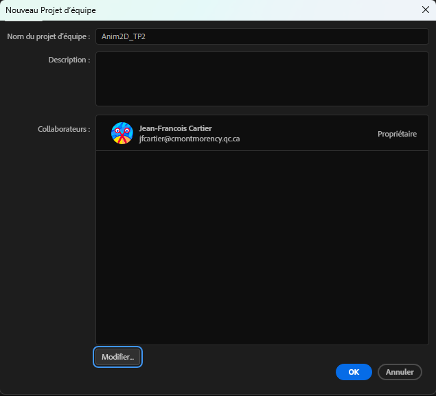
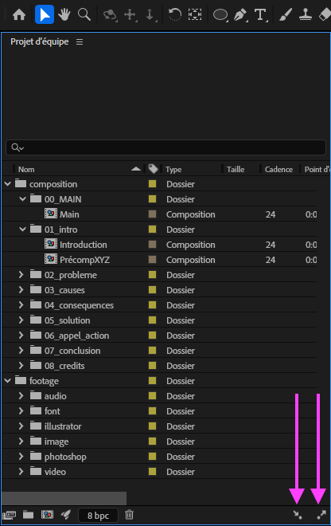

[STOP]

# Cours 11

## Travailler en équipe avec After Effects

### Synchronisation des médias

Pour assurer une synchronisation des médias (images, vidéos, audio, etc.), voici la méthode avec OneDrive qui a été testée jeudi le 17 avril 2025.

* Tous les membres de l'équipe doivent être connectés à OneDrive (assurez vous que le logo OneDrive :material-microsoft-onedrive: en bas à droite de la barre Windows soit bleu sans × rouge)
* Tous les membres de l'équipe doivent avoir la même version d'After Effects
* Un membre de l'équipe doit créer un dossier des médias du projet sur son OneDrive. Il doit ensuite partager les accès d'écriture à ses coéquipiers.
* Les coéquipiers doivent "Synchroniser" le dossier des médias sur leur ordinateur. Cette étape est importante, car il faudra remapper les médias dans After Effects sur le dossier créé avec la synchronisation. Pour synchroniser le dossier partagé, vous pouvez suivre ces étapes :
  * Ouvrez Teams.
  * Dans la barre latérale de gauche, cliquez sur "OneDrive". S'il n'y figure pas, trouvez le en cliquant sur le bouton à 3 points (:material-dots-horizontal:).
  * Dans l'onglet de gauche "Partagé", vous devriez voir le dossier partagé de vos médias. Cliquez dessus.
  * Enfin, cliquez sur le lien "Synchroniser" situé tout en haut.
  * Pour situer l'emplacement du dossier synchronisé sur votre ordinateur, il devrait se situer dans le dossier «Collège Montmorency».
* Ouvrez le projet d'équipe After Effects. À cette étape, vous devrier voir les médias brisés.
* Double-cliquez sur l'un des médias et une fenêtre de remappage s'ouvrira.
* Cliquer sur le bouton "Nouveau mappage de médias..." et choissez le dossier synchronisé dans «Collège Montmorency».
* Fermer la fenêtre.
* Redémarrez After Effects au besoin.

Si cette méthode ne fonctionne toujours pas, je vous recommande de m'écrire sur Teams ou d'en parler avec un des TTP.

!!! bug "Nomenclature des médias"

    Évitez les espaces, les caractères accentués et les caractères speciaux dans les noms de fichier.

## Présentation du travail synthèse
