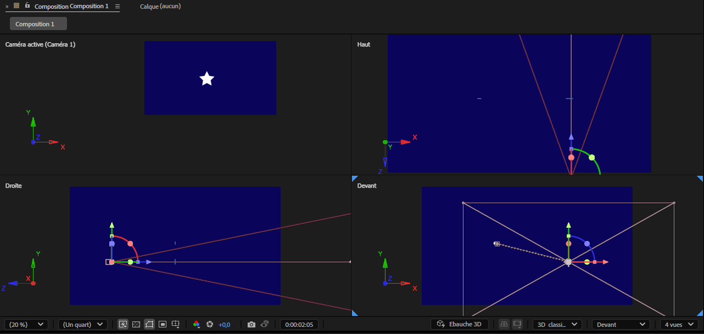
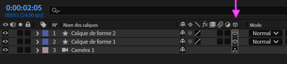

# Cours 11  <small>Groupe de Marie-Michelle</small>

## Élections fédérales du Canada 2025

Lundi 28 avril 2025

Vous devriez recevoir votre carte d’information de l’électeur d’ici le 22 avril.

{ data-zoom-image }

Si vous n'avez pas reçu de carte d'information de l'électeur ou si elle contient des erreurs : <https://ereg.elections.ca/fr/ereg/index>

### La Boussole électorale

La Boussole électorale est un outil développé par des politologues pour vous aider à comparer vos opinions avec celles des partis.

{ data-zoom-image }

{ data-zoom-image }

[boussole.radio-canada.ca](https://boussole.radio-canada.ca/){ .md-button .md-button--primary }

[Pourquoi cette élection est cruciale pour les jeunes ?](https://ici.radio-canada.ca/info/videos/1-10332551/pourquoi-cette-election-est-cruciale-pour-jeunes)

## Line art

[:material-play-circle: Line art - Tutoriel 1/2](https://cmontmorency365-my.sharepoint.com/:v:/r/personal/mariem_ouellet_cmontmorency_qc_ca/Documents/01_cours/Cours%20Animation%202D/animation%202D%202025/02_capsules_video/02_capsules_after_effects/31_effets/06_animation_line_art/01_animation_line_art_visage.mov?csf=1&web=1&nav=eyJyZWZlcnJhbEluZm8iOnsicmVmZXJyYWxBcHAiOiJPbmVEcml2ZUZvckJ1c2luZXNzIiwicmVmZXJyYWxBcHBQbGF0Zm9ybSI6IldlYiIsInJlZmVycmFsTW9kZSI6InZpZXciLCJyZWZlcnJhbFZpZXciOiJNeUZpbGVzTGlua0NvcHkifX0&e=sM7mSg)

[:material-play-circle: Line art - Tutoriel 2/2](https://cmontmorency365-my.sharepoint.com/:v:/r/personal/mariem_ouellet_cmontmorency_qc_ca/Documents/01_cours/Cours%20Animation%202D/animation%202D%202025/02_capsules_video/02_capsules_after_effects/31_effets/06_animation_line_art/02_animation_line_art_fleur.mov?csf=1&web=1&nav=eyJyZWZlcnJhbEluZm8iOnsicmVmZXJyYWxBcHAiOiJPbmVEcml2ZUZvckJ1c2luZXNzIiwicmVmZXJyYWxBcHBQbGF0Zm9ybSI6IldlYiIsInJlZmVycmFsTW9kZSI6InZpZXciLCJyZWZlcnJhbFZpZXciOiJNeUZpbGVzTGlua0NvcHkifX0&e=erARCl)

## Camera

{ data-zoom-image }

Pour activer le mode caméra, il suffit d'ajouter un calque de caméra.

{ data-zoom-image }

Ensuite, activer les options 3d des calques qui doivent être affectés par la caméra.

{ data-zoom-image }

Finalement, pour bien voir ce qui se produit et pour bien animer le tout, il est préférable de changer la disposition des vues de 1 vue à 4 vues.

{ data-zoom-image }

## Vitesse de lecture vidéo

**Activer le remappage temporel** : Permet de lisser la vitesse de lecture à l'aide de keyframes.

**Extension temporelle...** : Modifie la vitesse de lecture de la vidéo, en accéléré ou au ralenti.

Raccourci pertinent : ++ctrl+shift+d++ pour couper un calque vidéo en 2 à la position de la tête de lecture.

## Quelques techniques pour l'exercice AMV

[Tableau de traduction des effets](https://www.blog-motion-design.hellohubert.fr/2021/08/12/after-effects-liste-des-effets-en-anglais-traduit-en-francais/)

### Tuiles

Avant : 

Après :

Outils : **Juxstaposition directionnelle** (Motion Tile) ou **CC Repetile**.

### Wiggle

Outils : Tremblement - position et Tremblement - rotation

Si vous utilisez CC Repetile par exemple, vous devez placer les effets wiggle après.

### Transition "Punch zoom"

Pour effectuer cette transition, on utilise deux outils de base (scale, alpha) et l'effet Flou gaussien.

Encore mieux que le flou gaussien, utilisez le flou objectif appareil photo.

### Transition en glitch

Le concept est de prendre 2 clips et d'en faire une précomposition.

Puis, on duplique la précomposition 3 fois puis à chaque claque, on applique Décalage des couches.

On change ensuite le mode de chaque précomposition à Écran.

Finalement, on anime dans la plage de transition, chaque calque avec un effet de Tremblement - position.

### Transition pan

Pour cet effet, il faut simplement modifier la position de droite à gauche des deux clips tout en utilisant CC Repetile.

Pour un effet plus jolie, ne pas oublier la gestion des ease et le flou de mouvement.

### Intensité

Ajoutez par exemple un Flou encadré accéléré lorsqu'une action rapide est effectuée. Idéalement, on ajuste horizontalement ou verticalement pour orienter le flou !

Avant : 

Après :

Aussi, on peut très bien utiliser l'effet Echo pour ajouter encore plus d'intensité !

## Exercice

C'est le moment d'exprimer sa créativité !!

  

  <small>Exercice - After Effects</small> 
  **[AMV](./exercices_ae/amv/amv.md){.stretched-link .back}**

## Projet final

  

  **[TP2 - Préproduction](./exercices_ae/projet-final-mm/index.md){.stretched-link .back}**

