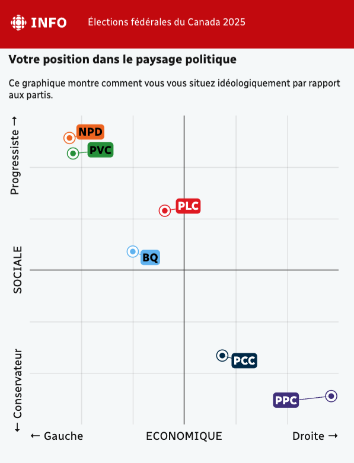
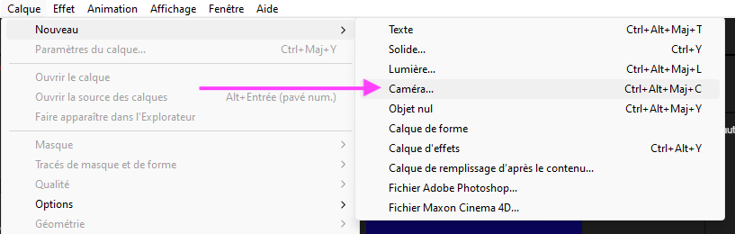
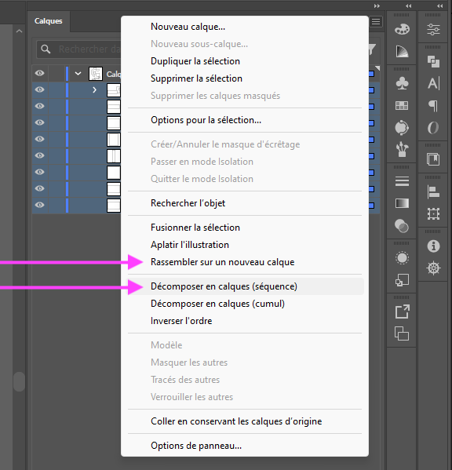

# Cours 11

## Élections fédérales du Canada 2025

Lundi 28 avril 2025

Vous devriez recevoir votre carte d’information de l’électeur d’ici le 22 avril.

{ data-zoom-image }

Si vous n'avez pas reçu de carte d'information de l'électeur ou si elle contient des erreurs : <https://ereg.elections.ca/fr/ereg/index>

### La Boussole électorale

La Boussole électorale est un outil développé par des politologues pour vous aider à comparer vos opinions avec celles des partis.

{ data-zoom-image }

{ data-zoom-image }

[boussole.radio-canada.ca](https://boussole.radio-canada.ca/){ .md-button .md-button--primary }

[Pourquoi cette élection est cruciale pour les jeunes ?](https://ici.radio-canada.ca/info/videos/1-10332551/pourquoi-cette-election-est-cruciale-pour-jeunes)

## Camera

{ data-zoom-image }

Pour activer le mode caméra, il suffit d'ajouter un calque de caméra.

{ data-zoom-image }

Ensuite, activer les options 3d des calques qui doivent être affectés par la caméra.

{ data-zoom-image }

Finalement, pour bien voir ce qui se produit et pour bien animer le tout, il est préférable de changer la disposition des vues de 1 vue à 4 vues.

{ data-zoom-image }

## Line art

[:material-play-circle: Line art - Tutoriel 1/2](https://cmontmorency365-my.sharepoint.com/:v:/r/personal/mariem_ouellet_cmontmorency_qc_ca/Documents/01_cours/Cours%20Animation%202D/animation%202D%202025/02_capsules_video/02_capsules_after_effects/31_effets/06_animation_line_art/01_animation_line_art_visage.mov?csf=1&web=1&nav=eyJyZWZlcnJhbEluZm8iOnsicmVmZXJyYWxBcHAiOiJPbmVEcml2ZUZvckJ1c2luZXNzIiwicmVmZXJyYWxBcHBQbGF0Zm9ybSI6IldlYiIsInJlZmVycmFsTW9kZSI6InZpZXciLCJyZWZlcnJhbFZpZXciOiJNeUZpbGVzTGlua0NvcHkifX0&e=sM7mSg)

[:material-play-circle: Line art - Tutoriel 2/2](https://cmontmorency365-my.sharepoint.com/:v:/r/personal/mariem_ouellet_cmontmorency_qc_ca/Documents/01_cours/Cours%20Animation%202D/animation%202D%202025/02_capsules_video/02_capsules_after_effects/31_effets/06_animation_line_art/02_animation_line_art_fleur.mov?csf=1&web=1&nav=eyJyZWZlcnJhbEluZm8iOnsicmVmZXJyYWxBcHAiOiJPbmVEcml2ZUZvckJ1c2luZXNzIiwicmVmZXJyYWxBcHBQbGF0Zm9ybSI6IldlYiIsInJlZmVycmFsTW9kZSI6InZpZXciLCJyZWZlcnJhbFZpZXciOiJNeUZpbGVzTGlua0NvcHkifX0&e=erARCl)

## Illustrator 🫠

{ data-zoom-image }

Pour transformer rapidement des groupes en calques dans Adobe Illustrator, suivez ces étapes :

1. **Sélection des groupes** : Dans le panneau Calques, sélectionnez les groupes que vous souhaitez convertir en calques distincts. 
1. **Accès au menu des options** : Cliquez sur l’icône de menu (représentée par trois lignes horizontales) en haut à droite du panneau Calques. 
1. **Décomposition en calques** : Choisissez l’option « Décomposer en calques (séquence) ». Cette commande répartit chaque élément du groupe sur son propre calque, facilitant ainsi leur gestion individuelle.  
1. **Réorganisation des calques** : Les nouveaux calques créés sont imbriqués sous le calque principal. Pour les déplacer au niveau supérieur, sélectionnez-les et faites-les glisser en dehors du calque parent, ou utilisez la commande « Rassembler sur un nouveau calque » pour les regrouper.  

Source : <https://helpx.adobe.com/lu_fr/illustrator/using/layers.html>

## Devoir

  

  **[TP2 - Préproduction](./exercices_ae/tp2/index.md){.stretched-link .back}**

