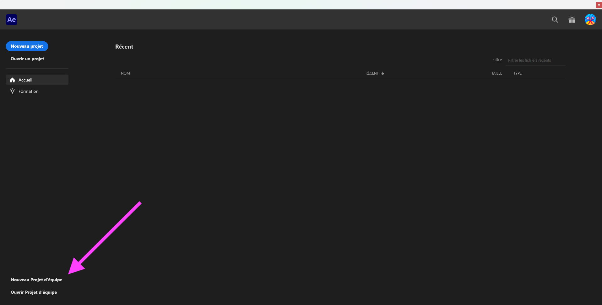

# Cours 12

## Particules

1. Créer d'abord un calque Solide.
1. Glisser l'effet « CC Particle Systems II » sur le calque Solide.
1. Appuyer sur « Play » pour voir le résultat !
1. Ensuite, il suffit vraiment de tester les configurations des particules, c'est assez simple :)

[:material-play-circle: CC Particle Systems II](https://cmontmorency365-my.sharepoint.com/:v:/g/personal/mariem_ouellet_cmontmorency_qc_ca/EUBYih1QFqRHiMZH08s9ki0Bx-c4GXne5gH8KkRaw35lzQ)

[:material-play-circle: CC Particle World](https://cmontmorency365-my.sharepoint.com/:v:/g/personal/mariem_ouellet_cmontmorency_qc_ca/EV97SLGemdRHu37KC_UXrDsBplE0EAYlrL4UIRHq4sHMAw)

[:material-play-circle: CC Particle World (suite)](https://cmontmorency365-my.sharepoint.com/:v:/g/personal/mariem_ouellet_cmontmorency_qc_ca/EUjyQMxags1GrbCIk1gIk1cB_RdTowjzT7Vktx8slWyeIw)

[Particle Systems II + CC Particle World | Jake In Motion - YouTube](https://www.youtube.com/watch?v=7Fp9207Ds5I)

## Travailler en équipe avec After Effects

### Mise en place du OneDrive de projet pour l'équipe
[:material-play-circle: Coéquipier no1: Création et partage du dossier de projet sur ton One Drive.](https://cmontmorency365-my.sharepoint.com/:v:/g/personal/mariem_ouellet_cmontmorency_qc_ca/ES_MgtexRztIioFl9iEvFZYBIfG55ggOdPrPp4r3V6_a6g?nav=eyJyZWZlcnJhbEluZm8iOnsicmVmZXJyYWxBcHAiOiJPbmVEcml2ZUZvckJ1c2luZXNzIiwicmVmZXJyYWxBcHBQbGF0Zm9ybSI6IldlYiIsInJlZmVycmFsTW9kZSI6InZpZXciLCJyZWZlcnJhbFZpZXciOiJNeUZpbGVzTGlua0NvcHkifX0&e=or4lcH)

[:material-play-circle: Coéquipier no2: accéder au dossier partagé par le coéquipier no1.](https://cmontmorency365-my.sharepoint.com/:v:/g/personal/mariem_ouellet_cmontmorency_qc_ca/EUNNUH9b_nlAlhuuajYsFAMBeaSNsCWQhrCVyZ-H92ftTg?nav=eyJyZWZlcnJhbEluZm8iOnsicmVmZXJyYWxBcHAiOiJPbmVEcml2ZUZvckJ1c2luZXNzIiwicmVmZXJyYWxBcHBQbGF0Zm9ybSI6IldlYiIsInJlZmVycmFsTW9kZSI6InZpZXciLCJyZWZlcnJhbFZpZXciOiJNeUZpbGVzTGlua0NvcHkifX0&e=GscOb7)

### Création du projet d'équipe dans After Effects

### Ajouter un collaborateur (co-équipier)

### Envoyer (push) et récupérer (pull)

### Synchronisation des médias externes (png, jpg, audio, fichier Illustrator etc).

Pour assurer une synchronisation des médias (images, vidéos, audio, etc.), voici la méthode avec OneDrive qui a été testée jeudi le 17 avril 2025.

* Tous les membres de l'équipe doivent être connectés à OneDrive (assurez vous que le logo OneDrive :material-microsoft-onedrive: en bas à droite de la barre Windows soit bleu sans × rouge).
* Tous les membres de l'équipe doivent avoir accès d'écriture au dossier de projet commun.
* Tous les membres de l'équipe doivent avoir la même version d'After Effects.
* Un membre de l'équipe doit créer un dossier des médias du projet sur son OneDrive. Il doit ensuite partager les accès d'écriture à ses coéquipiers.
* En plus de partager un même dossier de projet commun, tous les oéquipiers doivent **Synchroniser** le dossier des médias sur leur ordinateur courant. Cette étape est importante, car il faudra remapper les médias dans After Effects sur le dossier créé avec la synchronisation. Pour synchroniser le dossier partagé, vous pouvez suivre ces étapes :
  * Ouvrez Teams.
  * Dans la barre latérale de gauche, cliquez sur **OneDrive**. S'il n'y figure pas, trouvez le en cliquant sur le bouton à 3 points (:material-dots-horizontal:).
  * Dans l'onglet de gauche **Partagé**, vous devriez voir le dossier partagé de vos médias. Cliquez dessus.
  * Enfin, cliquez sur le lien ***Synchroniser** situé tout en haut.
  * Pour situer l'emplacement du dossier synchronisé sur votre ordinateur, il devrait se situer dans le dossier «Collège Montmorency».
* Ouvrez le projet d'équipe After Effects. À cette étape, vous devrier voir les médias brisés.
* Double-cliquez sur l'un des médias et une fenêtre de remappage s'ouvrira.
* Cliquer sur le bouton **Nouveau mappage de médias...** et choissez le dossier synchronisé dans «Collège Montmorency».
* Fermer la fenêtre.
* Redémarrez After Effects au besoin.

Si cette méthode ne fonctionne toujours pas, je vous recommande de m'écrire sur Teams ou d'en parler avec un des TTP.

!!! bug "Nomenclature des médias"

    Ne jamais utiliser les espaces, les caractères accentués et les caractères speciaux dans les noms de fichier. Vous devez aussi éviter les tirets pour éviter des problèmes de syncronisation avec le projet d'équipe After Effects.

## Projet final

  

  **[Projet final - Groupe Marie-Michelle](./exercices_ae/projet-final-mm/index.md){.stretched-link .back}**

