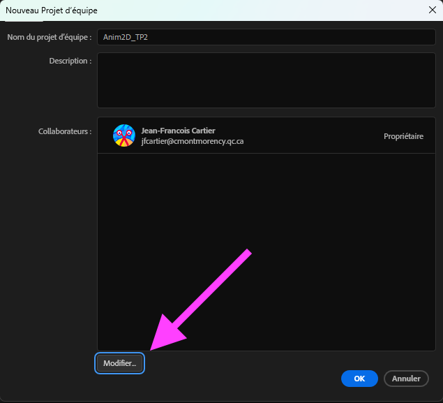

# Cours 12

## Particules

1. Créer d'abord un calque Solide.
1. Glisser l'effet « CC Particle Systems II » sur le calque Solide.
1. Appuyer sur « Play » pour voir le résultat !
1. Ensuite, il suffit vraiment de tester les configurations des particules, c'est assez simple :)

[:material-play-circle: CC Particle Systems II](https://cmontmorency365-my.sharepoint.com/:v:/g/personal/mariem_ouellet_cmontmorency_qc_ca/EUBYih1QFqRHiMZH08s9ki0Bx-c4GXne5gH8KkRaw35lzQ)

[:material-play-circle: CC Particle World](https://cmontmorency365-my.sharepoint.com/:v:/g/personal/mariem_ouellet_cmontmorency_qc_ca/EV97SLGemdRHu37KC_UXrDsBplE0EAYlrL4UIRHq4sHMAw)

[:material-play-circle: CC Particle World (suite)](https://cmontmorency365-my.sharepoint.com/:v:/g/personal/mariem_ouellet_cmontmorency_qc_ca/EUjyQMxags1GrbCIk1gIk1cB_RdTowjzT7Vktx8slWyeIw)

[Particle Systems II + CC Particle World | Jake In Motion - YouTube](https://www.youtube.com/watch?v=7Fp9207Ds5I)

## Travailler en équipe avec After Effects

Synchronisation des médias : <https://www.schoolofmotion.com/blog/saving-and-sharing-after-effects-projects>

Pour synchoniser les médias utilisés, il est recommandé que chaque membre de l'équipe partage son dossier de footage lorsqu'il l'ajoute dans le projet. Ainsi, les médias seront bien référencés dans After Effects. 

## Devoir

  

  **[TP2 - Animation](./exercices_ae/tp2/index.md){.stretched-link .back}**

