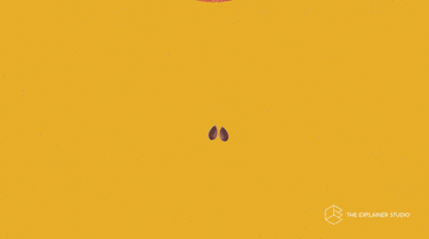

# Cours 14     

!!! success "Concours audiovisuel🎬🏆🎉"

    Ce projet d'animation est une excellente occasion de participer au [**concours  🏆audio-visuel 2025**](https://teams.microsoft.com/l/channel/19%3A5e5f45d314944e9dad487ce033ea4f3e%40thread.tacv2/Concours%20essais%20audiovisuels?groupId=924057af-2255-4c2a-8ce7-f0a1809ad4a4&tenantId=ffa995c7-10de-4ec8-95db-28ed0576455d). Date limite de participation le 21 mai 2025 (vous n'avez qu'à déposer votre projet dans un dossier indiqué dans les consignes du concours). Visionnement et remise de prix vendredi le 23 mai de 10h à midi au C1712 (Grand studio).

## Projet final groupe Marie-Michelle

  

  **[Projet final - Groupe Marie-Michelle](./exercices_ae/projet-final-mm/index.md){.stretched-link .back}**

[STOP]

Temps alloué au développement du TP2 sous supervision 
