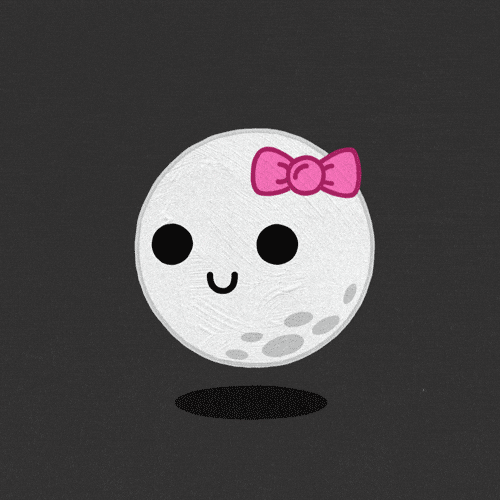
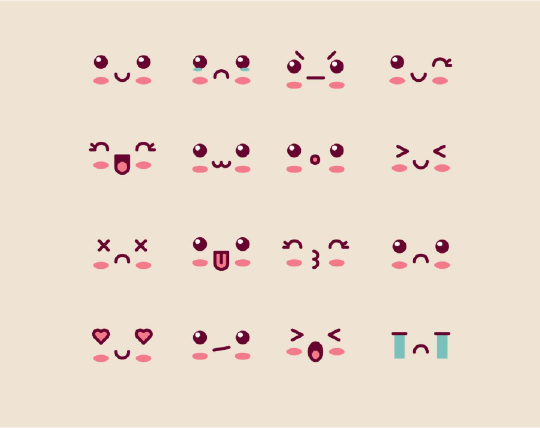
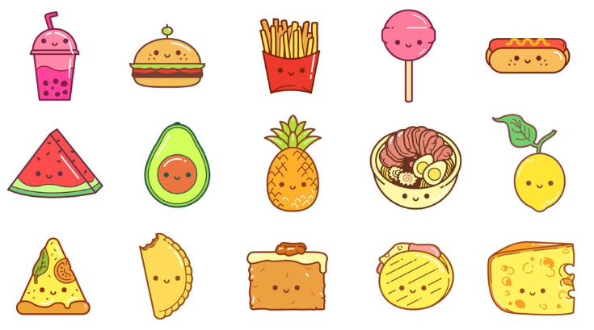

# Kawaii

{ .w-100 }

Dans cet exercice, vous allez mettre en pratique vos connaissances pour dessiner des personnages dans le style Kawaii (adjectif japonais signifiant « mignon »[^kawaii]). 

Ce style est largement utilisé dans les mangas, les dessins animés et même les jeux vidéo, comme [Boomerang Fu](https://store.steampowered.com/app/965680/Boomerang_Fu/).

[^kawaii]: <https://fr.wikipedia.org/wiki/Kawaii>

## Consignes

Vous devez réaliser un personnage Kawaii en deux étapes.

🎨🎨🎨 Laissez parler votre créativité ! 🎨🎨🎨

### Expressions

Utilisez des formes simples pour dessiner 4 différentes émotions.

Exemple : 

- [ ] Bonheur
- [ ] Colère
- [ ] Tristesse
- [ ] Surprise

### Corps

Dessinez un corps **en forme de nourriture** en respectant le style Kawaii (formes arrondies et mignonnes).

Appliquez ensuite l’une des expressions faciales que vous avez créées sur votre personnage.

Exemple : 

- [ ] Dessiner un corps en forme de nourriture
