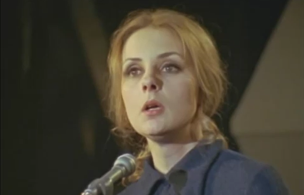

# Speak White

{ .w-100 }

"Speak White"[^speakwhite] est un poème engagé de Michèle Lalonde, publié en 1968, qui dénonce la domination culturelle, économique et linguistique exercée par les anglophones sur les francophones au Québec. L'expression "speak white" était une insulte utilisée au Canada pour réprimander les francophones s’exprimant en français en public, leur ordonnant de parler en anglais, la langue dominante associée au pouvoir et à la réussite.

Le poème critique cette oppression linguistique et l'élargit pour inclure d’autres formes d’injustices sociales et coloniales à travers le monde, notamment aux États-Unis, en Algérie, au Vietnam et en Afrique. Il met en lumière la manière dont la langue anglaise a été historiquement utilisée pour imposer un ordre social et économique inégalitaire, où certaines voix sont privilégiées tandis que d’autres sont réduites au silence.

Lalonde joue sur le contraste entre l’anglais, associé au pouvoir, à l’économie et à la domination, et le français, qui devient dans ce contexte la langue des opprimés, des travailleurs et des laissés-pour-compte. Le poème exprime une revendication identitaire et une dénonciation de l’impérialisme culturel, réaffirmant que les Québécois ne sont "pas seuls" dans leur lutte, en écho aux mouvements de libération et de résistance ailleurs dans le monde.

[^speakwhite]: <https://en.wikipedia.org/wiki/Speak_White>

## Consignes

L'objectif de cet exercice est de mettre en valeur graphiquement un poème **de votre choix** avec les outils suivants : 

- [ ] Texte
- [ ] Dégradé
- [ ] Mouvement de marionnette
- [ ] (facultatif) Effet 3D

🎨🎨🎨 Laissez aller votre créativité ! 🎨🎨🎨
