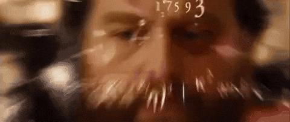

# AMV

Les AMV (Anime Music Videos) sont des **montages vidéo** de **courte durée** qui **synchronisent** des extraits d’**animés** avec une **musique**.

Ressources : [animemusicvideos.org](https://www.animemusicvideos.org/forum/viewforum.php?f=164) | [Discord](https://discord.gg/P5ytbDR) | [Reddit](https://www.reddit.com/r/amv)

## Exemples

## Analyse

Afin de mieux comprendre ce que représente le concept de transition dans une AMV (Anime music video) :

* Réduisez la vitesse de lecture d'une vidéo x0.25 de sa vitesse initiale. 
* Au besoin, importer la vidéo dans **After Effects** ou **DaVinci** pour visionner un frame à la fois.
* Observez le comportement des animations dans l'exemple suivant :

## Objectif

Créer une AMV qui combine **technique** et **créativité** pour raconter une histoire ou transmettre une émotion. 

❗ Attention, **il ne s’agit pas que d'un simple montage vidéo**. Voici les principes clés à explorer : 

- **Rythme et synchronisation** : Adapter les coupes et les effets au tempo de la musique.
- **Speed ramping** : Ralentis et accélérations pour dynamiser la vidéo.
- **Transitions dynamiques** : Zoom, rotation, flou de mouvement, etc.
- **Effets visuels** : Déformation, lumières, glow.
- **Étalonnage des couleurs** : Harmoniser les teintes pour une ambiance spécifique.
- **Motion design** : Typographies animées, overlays graphiques.
- **Masking et tracking** : Séparation d’éléments pour des effets plus poussés.

## Sources vidéo

!!! info "Droits d’auteur"

    L'utilisation de clips non libres de droits est autorisée **uniquement à des fins pédagogiques**. La diffusion publique des vidéos créées est interdite.

### Télécharger des clips d’anime

- [Anime Clips](https://animeclips.online/clips/)

### Télécharger des textures libres de droits

- [Pixabay](https://pixabay.com/videos/search/texture/) ([Licence](https://pixabay.com/service/license-summary/))
- [Pexels](https://www.pexels.com/search/videos/texture/) ([Licence](https://www.pexels.com/license/))

## Sources audio

- [Pixabay Music](https://pixabay.com/music/)
- Styles suggérés :
  - **[Lofi](https://pixabay.com/music/search/lofi/)** pour une ambiance calme
  - **[Drill beat](https://pixabay.com/music/search/drill%20beat/)** ou **[Hard beat](https://pixabay.com/music/search/hard%20beat/)** pour plus de dynamisme

## Consignes

### Mettre la table

- [ ] Créer une nouvelle composition **30 fps**
- [ ] Format : **1080x1920 (vertical), 1920x1080 (horizontal) ou carré**
- [ ] Durée : **5 à 30 secondes**
- [ ] Magazinez une ou plusieurs pistes audio. Rien de vous empêche d'ajouter des effets sonores également.
- [ ] Magazinez vos sources vidéos
- [ ] Ajoutez dans votre composition la piste audio principale
- [ ] Ajoutez les clips de sorte à ce qu'ils suivent le rythme de la piste audio principale.
- [ ] Isolez chaque clip dans des précompositions

### Effets et transitions

- [ ] Modifier la **vitesse** d’au moins un clip
- [ ] Ajouter une **transition** entre chaque clip
- [ ] Ajouter des **mouvements** en modifiant la position, la rotation et/ou l'échelle
- [ ] Ajouter minimum **trois effets visuels**

---

!!! warning "Considérations légales"

    L’utilisation de matériel protégé par le droit d’auteur est encadrée par la Loi. Toutefois, elle prévoit certaines exceptions à des fins éducatives, notamment dans le cadre d’une salle de classe ou d’un établissement d’enseignement.

    Dans le contexte de cet exercice :

    * L'utilisation de clips non libres de droits est permise uniquement à des fins pédagogiques.
    * La diffusion publique des vidéos résultantes est interdite. Cela inclut toute publication sur Internet (YouTube, réseaux sociaux, sites web, etc.).
    * Les œuvres produites doivent être utilisées uniquement dans le cadre du cours et ne peuvent être partagées en dehors du contexte académique.