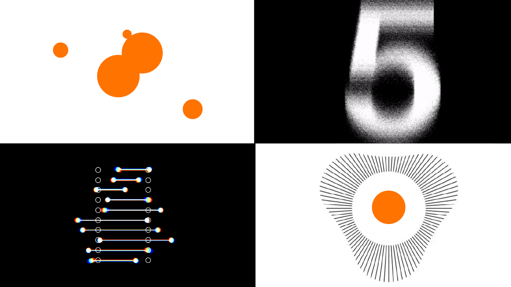

# Kino

!!! tip "Opportunité"
    Gardez en tête que c'est le genre de projet que vous pourrez soumettre au concours audio-visuel pour la fin mai. Ça vaut la peine d'y mettre son plein potentiel. Ça fait aussi un beau projet à préesnter dans votre futur portfolio. 
<!--https://squidfunk.github.io/mkdocs-material/reference/admonitions/-->

{ .w-100 }

L’objectif du Kino est de créer une courte œuvre d’animation composée de **quatre** mini-animations en **noir, blanc et une autre couleur** de **5 secondes** chacune, rassemblées dans une mosaïque finale (2x2).

!!! Abstract "Petits trucs"
1. Pour bien gérer votre temps (temps total **3h20**, excepté les assouplissements), prévoyez environ **45 minutes par animation**.
1. Effectuez d'abord 4 animations simples et peaufinez-les par la suite. Ainsi, vous aurez une base de travail assez rapidement. Je vous propose donc d'attribuer d'abord 20 min/case pour commencer les animations simples de chaque case. Ensuite, peaufinez chacune d'elles avec 25 minutes supplémentaires par case. Vous pouvez utiliser un des deux minuteurs physiques mis à votre disposition ou encore un outil de type [Pomodoro](https://pomofocus.io/) pour minuter votre temps et bien le gérer.
1. Prévoyez un petit moment (minimum 10 minutes) avant la fin du Kino pour l'exportation de votre vidéo.

[Inspirations pour vos animations](https://pin.it/6Pyc6fTbV)

## Consignes
Sélectionnez une et une seule couleur vive.

Toutes les animations doivent être :

- [ ] **Bouclables** : le dernier keyframe doit être identique au premier. (==4 points==)
- [ ] **Uniquement en noir, blanc et ponctué de votre couleur vive sélectionnée (une seule)** (aucun niveau de gris). (==2 points==)
- [ ] **Créatives et engageantes** (originalité). (==4 points==)
- [ ] **Fluides et convaincantes** (qualité d’animation / lissage de vitesse bien travaillé). (==4 points==)

---

- [ ] Il y a 4 animations (4 cases). Chacune des 4 animations doit intégrer au minimum **un** des concepts suivants. Vous pouvez répéter ces concepts sur plusieurs cases mais chaque case doit contenir au moins un concept unique parmis les suivants: (==4 points==)

* Écrasement et étirement (12 principes de l’animation)
* Anticipation (12 principes de l’animation)
* Effet d’After Effects (déformation, flou, esthétique, etc.) (panneau d'effets)
* Morphage
* Concept de répétition (tel que présenté au cours 10)
* Masquage
* Animation line art

---

- [ ] Respect global des consignes : (==2 points==)

### Préparation

- [ ] Créez une composition master nommée « Main » : 1920 × 1080 px, 24 fps, 5 secondes.
- [ ] Créez 4 autres pré-compositions nommées « A », « B », « C » et « D » : 960 × 540 px, 24 fps, 5 secondes chacune.

### Animation A

{ .w-50 }

- [ ] Utilisation exclusive de cercles.

### Animation B

{ .w-50 }

- [ ] Animation faite à base de chiffres ou de lettres de l’alphabet. Si vous inscrivez un mot, ce doit être en français uniquement.

### Animation C

{ .w-50 }

- [ ] Utilisation de n'importe quelles formes sauf le cercle.

### Animation D

{ .w-50 }

- [ ] Animation libre (sans restriction).

### Exportation

- [ ] Sauvegardez votre projet !
- [ ] Assemblez les compositions A, B, C et D dans la composition « Main » de sorte à former une mosaïque de 2x2.
- [ ] Exporter la composition finale en H264 - Vimeo 1080p - 1920px x 1080px
- [ ] Nommer le fichier vidéo avec la nomenclature suivante : `NOM-PRENOM_kino_582-214MO.mp4`
- [ ] Créez un dossier contenant votre fichier de travail .aep, vos médias externes si applicables et votre fichier vidéo exporté (le .mp4). Nommez votre dossier `NOM-PRENOM_kino_582-214MO` et compressez le en .zip
- [ ] Déposez la .zip dans le devoir Teams « Kino » du groupe Animation 2D.

## Barème de notation

| Critère                                                                     | Points     |
|-----------------------------------------------------------------------------|------------|
| 4 animations bouclable (loop parfaite)                                      | 4 pts      |
| Noir et blanc et une autre couleur vive uniquement (pas de niveaux de gris) | 2 pts      |
| Créativité et originalité                                                   | 4 pts      |
| Fluidité et qualité de l’animation                                          | 4 pts      |
| Intégration des concepts d’animation                                        | 4 pts      |
| Respect global des consignes                                                | 2 pts      |
| **Total**                                                                   | **20 pts** |

[STOP]

https://pixabay.com/music/upbeat-space-120280/
