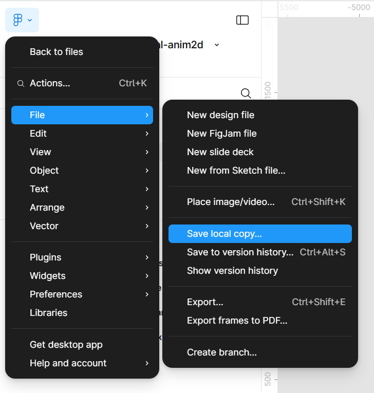
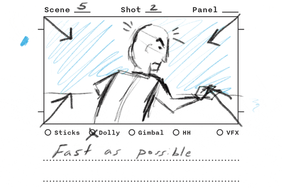
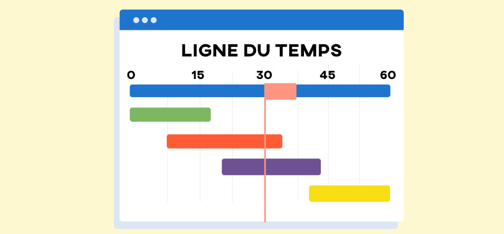
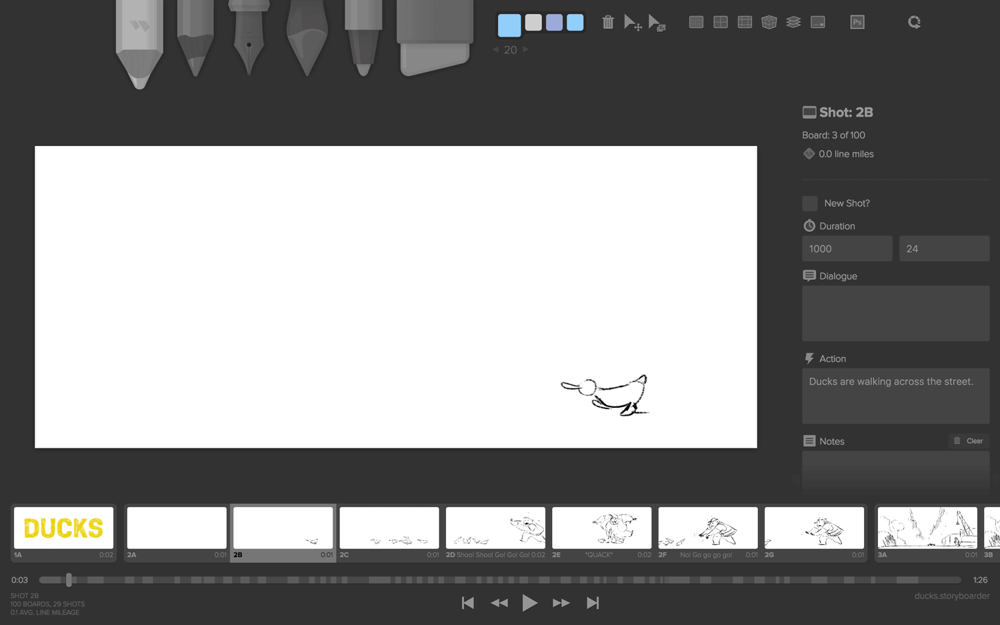
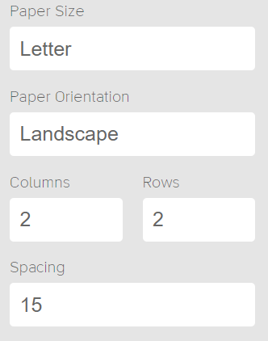

# Projet final - Préproduction <br><small>Groupe de Marie-Michelle</small>

*[TTS]: Text To Speech

Assurément la partie la plus importante du projet, la préproduction vise à faire toute la planification nécessaire pour commencer l'animation du **projet final**.

!!! tip "Sauvegardes 💾"

    Pour la préproduction, il est important d'être bien organisé(e).

    Enregistrez quelque part (par exemple un document Word) tous les médias et URLs consultés, et ce, autant pour la portion brainstorming que pour la recherche et la création de médias. Vous en aurez besoin plus tard.


## Classement final des fichiers du projet

[Dossier de départ :material-download:](./dossier-de-depart.zip){ .md-button .md-button--primary }

```txt
votre-nom-et-prenom_tp_0_582-214MO
│
├──📁 00_references
│   └──01-inspirations (ce sont les inspirations et non les médias que vous allez utiliser pour animer)
│   │   ├──references-et-inspirations.docx
│   │   ├──📄 inspiration01.jpg
│   └───├──📄 inspiration02.png
│   └──02-sujet_moodboard_script_scenario
│   └───├──description-projet.docx
│   └───├──moodboard.pdf
│   └───├──script.docx
│   └───├──scenario.pdf
├──📁 01_medias (ce sont les médias qui sont utilisés dans vos animations After Effects)
│   ├──📁 01_images
│   │   ├──📁 01_illustrator
│   │   │   └──📄 fichier-illustration.ai
│   │   ├──📁 02_png
│   │   │   ├──📁 photographies
│   │   │   │   └──📄 photo1.jpg
│   │   │   └──📁 vectorisations
│   │   │       └──📄 fichier-vecteur.svp
│   │   └──📁 03_psd
│   ├──📁 02_audios
│   │   ├──📁 00_mixes
│   │   ├──📁 01_voix
│   │   │   └──📄 narration.mp3
│   │   ├──📁 02_ambiances
│   │   ├──📁 03_bruitages
│   │   ├──📁 04_effets_sonores
│   │   └──📁 05_musiques
│   ├──📁 03_videos
│   └──📁 04_fonts
│       └──📄 ma-police-titre.otf
│       └──📄 ma-police-texte-courant.otf
├──📁 02_ae
│   └──📄 mon-fichier-de-travail.aep
└──📁 03_exportation
│   └──📄 mon-fichier-exporte-en-video.mp4
```


## Mise en place du OneDrive de projet pour l'équipe
[:material-play-circle: Coéquipier no1: Création et partage du dossier de projet sur ton One Drive.](https://cmontmorency365-my.sharepoint.com/:v:/g/personal/mariem_ouellet_cmontmorency_qc_ca/ES_MgtexRztIioFl9iEvFZYBIfG55ggOdPrPp4r3V6_a6g?nav=eyJyZWZlcnJhbEluZm8iOnsicmVmZXJyYWxBcHAiOiJPbmVEcml2ZUZvckJ1c2luZXNzIiwicmVmZXJyYWxBcHBQbGF0Zm9ybSI6IldlYiIsInJlZmVycmFsTW9kZSI6InZpZXciLCJyZWZlcnJhbFZpZXciOiJNeUZpbGVzTGlua0NvcHkifX0&e=or4lcH)

[:material-play-circle: Coéquipier no2: accéder au dossier partagé par le coéquipier no1.](https://cmontmorency365-my.sharepoint.com/:v:/g/personal/mariem_ouellet_cmontmorency_qc_ca/EUNNUH9b_nlAlhuuajYsFAMBeaSNsCWQhrCVyZ-H92ftTg?nav=eyJyZWZlcnJhbEluZm8iOnsicmVmZXJyYWxBcHAiOiJPbmVEcml2ZUZvckJ1c2luZXNzIiwicmVmZXJyYWxBcHBQbGF0Zm9ybSI6IldlYiIsInJlZmVycmFsTW9kZSI6InZpZXciLCJyZWZlcnJhbFZpZXciOiJNeUZpbGVzTGlua0NvcHkifX0&e=GscOb7)

<br>


## Brainstorm et inspiration

{.w-100}

Un brainstorming est une séance de génération d'idées sans jugement. L’objectif est d’explorer des pistes variées avant de faire un choix.

Il existe plein de [techniques de _brainstorming_](https://asana.com/fr/resources/brainstorming-techniques).
 <br>
Pour orienter votre brainstorming, voici quelques sujets à considérer :

* Quel est le sujet* à expliquer ?
* Quel est l'intention (humoristique, éducatif, engagé)* ?
* Quel est le public cible ?
* Quel est le nom du projet ?

*<small>Restriction: Ne pas faire une publicité commerciale. Ce doit être engagé (une cause sociale par exemple), éducatif et/ou humoristique.</small>
<br> 

- [ ] Inscrire votre sujet [dans ce fichier Excel, dans la colonne D](https://cmontmorency365-my.sharepoint.com/:x:/g/personal/mariem_ouellet_cmontmorency_qc_ca/ESPtsDKJDPlNqTAfpmQNQT0BYV5jNZDCXQgwPg6iVncX0w?e=OjUnJM) et **envoyer le sujet par Teams à Marie-Michelle dès que possible afin qu'elle l'approuve avant d'aller de l'avant**.
- [ ] Créer un fichier Word **description-projet.docx** en y inscrivant la réponse au 4 questions (sujet, intention etc.)
- [ ] Créer un autre fichier Word **references-et-inspirations.docx** en y inscrivant tous les médias et URLs consultés, et ce, autant pour la portion brainstorming que pour la recherche et la création de médias. Vous en aurez besoin plus tard.

---

Voici une liste de vidéo explainer pour vous aider à faire vos choix :

* [Tableau Pinterest d'_explainer videos_ intéressants](https://ca.pinterest.com/kidsynthetique/explainer-video/)
* [Understanding Perception: How We Experience the Meaning We Create](https://motionographer.com/2015/09/18/understanding-perception-how-we-experience-the-meaning-we-create/)
* [Rutger Bregman on Taxes](https://vimeo.com/367769463)
* [Agora - Collage Explainer Video](https://vimeo.com/732074954)
* [Reddit's New Mobile App](https://www.youtube.com/watch?v=cCnTVd9nMoY)
* [What is Ahrefs?](https://www.youtube.com/watch?v=krzF3YhmSMw)
* [ow to become 37.78 times better at anything](https://www.youtube.com/watch?v=PZ7lDrwYdZc)
* [Why Your Brain Blinds You For 2 Hours Every Day](https://www.youtube.com/watch?v=wo_e0EvEZn8)
* [How Alcohol Changes Your Body](https://www.youtube.com/watch?v=KWQpV9_kUUM)
* [What would happen if you didn’t drink water?](https://www.youtube.com/watch?v=9iMGFqMmUFs)
* [The science of laughter](https://www.youtube.com/watch?v=Xu-QfE_1ksk)
* [Animation vs. Physics](https://www.youtube.com/watch?v=ErMSHiQRnc8)
* [Eat Local](https://vimeo.com/444376751)
* [The Power of Privacy](https://vimeo.com/204530288)
* Vous pouvez continuer d'explorer d'autres genres ici : [https://vimeo.com/search?q=explainer%20video](https://vimeo.com/search?q=explainer%20video)
* Et consulter les gagnants "Staff Picks" de Vimeo dans le genre: [https://vimeo.com/search?type=clip&q=explainer&collection=staffpick](https://vimeo.com/search?type=clip&q=explainer&collection=staffpick)


### Esthétique

Dans la phase de brainstorming, vous devrez également penser à l'aspect graphique de votre animation.

Il existe de nombreux styles possible. Voici une liste suggérée :

* Animation 2D (style bande dessinée)
* Motion Graphics (vectoriel avec des formes simples, comme le kino)
* Kinetic text (animation de texte)
* Whiteboard animation (simulation d'un dessin synchro avec l'audio)
* Collage animation (à la south park)

- [ ] Faire un choix sur l'esthétique recherchée et l'inscrire dans votre fichier Word **description-projet.docx**.

## Moodboard

{.w-100}

Un **moodboard** (planche d'inspiration) est un assemblage visuel qui évoque l'ambiance recherchée pour votre projet.

Il contient des images, palettes de couleurs et typographies qui traduisent l’esthétique souhaitée. De plus, dans ce cas-ci, il vous est demandé d'y ajouter aussi des inspirations d'animation 2d / effets animés ainsi que des inspirations de transitions entre scènes.

[Gabarit à télécharger et à importer dans votre compte Figma :material-download:](https://www.figma.com/design/vHcKwq0iGJ4hYlLRumIxyu/gabarit-moodboard-projet-final-anim2d?node-id=0-1&t=t7Y9fgZBV20gTBIs-1){ .md-button .md-button--primary }



- [ ] Faire un moodboard à partir du modèle fourni.
- [ ] L'exporter en png **moodboard.pdf** ou pdf **moodboard.pdf**

### Palette de couleur

Utiliser un outil de palette de couleurs tel que [Coolors](https://coolors.co/) ou [Adobe Colors](https://color.adobe.com/fr/). Notez qu'il est primordial que votre palette de couleur soit harmonieuse et constante sur tout le visuel de votre animation, du début à la fin.

## Recherche et création de médias

{.w-100}

### Narration du script

- [ ] Faire ou faire faire la **narration** de votre script. Pour la synthèse vocale :
  * [TTS - Elevenlabs](https://elevenlabs.io/)
  * [Edge TTS | Hugging Face](https://huggingface.co/spaces/innoai/Edge-TTS-Text-to-Speech). Essayez : fr-CA-ThierryNeural - fr-CA (Male), il est pas mal ;)

### Trames et les effets sonores

- [ ] Trouver les **trames et les effets sonores** (libres de droits) nécessaires pour accompagner les animations :
  * [Banques de sons acquises par le département TIM](https://cmontmorency365-my.sharepoint.com/:f:/g/personal/timmontmorency_cmontmorency_qc_ca1/EpYjUtlJJqpFiWedxFbbDY0BWlZ3kcjUMrTFk_UEgHjw2Q?e=MXj8Ca)
  * [Pixabay](https://pixabay.com/)
  * [Mixkit](https://mixkit.co/)
  * [Falling Forever | Bandcamp](https://fallingforever.bandcamp.com/)

### Polices de caractères

- [ ] Trouver des **polices de caractères** :
  * Police Adobe (disponible via la panneau _Caractère_ d'Illustrator, Photoshop ou After Effects)
  * [Fontesk](https://fontesk.com/license/free-for-commercial-use,free-for-personal-use/)
  * [Google Fonts](https://fonts.google.com/)
  * [Fontshare](https://www.fontshare.com/)
  * [Pousse ta fonte](https://www.poussetafonte.com/) (sélectionner le filtre "Free 🔥")
  * [Font Squirrel](https://www.fontsquirrel.com/)
  * [Dafont](https://www.dafont.com/fr/)

### Visuels

- [ ] Trouver et télécharger des **visuels (images, illustrations, icônes, photographies)** :
  <small>(Pour le moodboard nul besoin qu'elle soient libres de droits. Par contre pour vos médias finaux utilisés dans l'animation de votre projet, elles doivent être illustrées par vous-même ou elles doivent être libres de droits, voici des librairies où vous pouvez trouver des médias libres de droit)</small> :
  * [Pixabay](https://pixabay.com/)
  * [Unsplash](https://unsplash.com/)
  * [Pexels](https://www.pexels.com/fr-fr/)
  * [Open Verse](https://openverse.org/)
  * [Flat Icon](https://www.flaticon.com/fr/)
  * [Vecteezy](https://www.vecteezy.com/)
  * [SVG Repo](https://www.svgrepo.com/)
  * [NounProject](https://thenounproject.com/)

### Animations

- [ ] Trouver des inspirations d'**animations 2d, d'effets animés et de transitions** :
  * Voir la liste d'inspiration d'explainer vidéo plus haut dans cette page.
  * Vous pouvez aussi être inspirés par le style de d'autres animation que celle qui sont présentées ci-haut.


!!! warning "IMPORTANT CONCERNANT LES CRÉDITS ET DROITS D'AUTEUR"
    À chaque fois que vous récupérez un élément visuel, prenez en note:
    * l'outil,
    * le logiciel,
    * le site web,
    * le URL de la page où vous avez récupéré ou généré le visuel.
    Vous devez aussi nommer le nom de l'artiste/photographe/illustrateur ainsi que ses **informations d'attribution**. Ces informations vous permettrons de donner les crédits légaux à qui de droit dans le générique de fin du court métrage.

!!! danger "VISUELS GÉNÉRÉS PAR INTELLIGENCE ARTIFICIELLE (IA)"
    Cette provient des règle du plan de cours <br>
    Le matériel visuel, sonore ou textuel crée par une IA est considéré comme ayant étant «_créé par l’IA_». En ce sens, il doit être cité correctement en mentionnant le **nom et la version de l’IA**. NE PAS LE MENTIONNER CONSTITUE DU PLAGIAT. Il faut aussi mentionner textuellement la **requête utilisée pour générer le contenu** (le _prompt_). Ceci devra faire partie de votre générique de fin du court métrage.


## Scénario (storyboard)

[:material-play-circle: Capsule vidéo scénario (utilisation du logiciel Storyboarder)](https://cmontmorency365-my.sharepoint.com/:v:/g/personal/mariem_ouellet_cmontmorency_qc_ca/EbqKu84IPcdMgUuJRAdIsucBQgc-Uy3fJEYqGmEf-B_vMg?nav=eyJyZWZlcnJhbEluZm8iOnsicmVmZXJyYWxBcHAiOiJPbmVEcml2ZUZvckJ1c2luZXNzIiwicmVmZXJyYWxBcHBQbGF0Zm9ybSI6IldlYiIsInJlZmVycmFsTW9kZSI6InZpZXciLCJyZWZlcnJhbFZpZXciOiJNeUZpbGVzTGlua0NvcHkifX0&e=Wtb177)

{.w-100}

Un storyboard est un outil de planification visuelle utilisé pour représenter scène par scène une vidéo ou une animation.

Dans cette partie, vous devrez d'abord rédiger un scénario (appelé structure narrative) et ensuite dessiner un storyboard.

### Structure narrative

| Étape                         | Fonction narrative                           | Contenu typique                                             |
|-------------------------------|----------------------------------------------|-------------------------------------------------------------|
| **1. Accroche**               | Susciter l’émotion ou la curiosité           | Une question, une stat choc, une image frappante            |
| **2. Problème**               | Montrer l’enjeu ou le besoin                 | Exposer une situation problématique ou injuste              |
| **3. Causes**                 | Expliquer pourquoi le problème existe        | Contexte social, historique ou structurel                   |
| **4. Conséquences**           | Montrer ce qui se passe si rien ne change    | Impacts humains, environnementaux, économiques ou sociaux   |
| **5. Solution / Changement**  | Proposer une prise de conscience ou solution | Action individuelle ou collective possible                  |
| **6. Appel à l’action**       | Donner une direction claire au spectateur    | Ce que chacun peut faire maintenant                         |
| **7. Ouverture / Conclusion** | Imaginer un futur meilleur                   | Montrer une version positive du monde si on agit            |
| **8. Crédits**                | n/a                                          | n/a                                                         |

### Ligne du temps

{.w-100}

Sur une feuille de papier ou à l'ordinateur, commencez par faire une ligne du temps horizontale de 0 à 60 secondes.

Placez ensuite chacune des étapes dans votre ligne du temps.

Pour chaque étape, écrivez les grandes lignes de votre histoire. Les informations à raconter et comment les présenter.

!!! info "Petit truc"

    Une approche efficace pour gérer le temps consiste à rédiger d’abord le script, générer la narration à partir de ce texte (via synthèse vocale avec ElevenLabs par exemple) puis, déterminer ensuite comment il s’intégrera dans l’animation.

- [ ] Téléchargez et intallez le logiciel [Storyboarder](https://wonderunit.com/storyboarder/)



!!! example "Utilisation du logiciel Storyboarder"

    [:material-play-circle: Capsule vidéo Storyboarder](https://cmontmorency365-my.sharepoint.com/:v:/g/personal/mariem_ouellet_cmontmorency_qc_ca/EbqKu84IPcdMgUuJRAdIsucBQgc-Uy3fJEYqGmEf-B_vMg?nav=eyJyZWZlcnJhbEluZm8iOnsicmVmZXJyYWxBcHAiOiJPbmVEcml2ZUZvckJ1c2luZXNzIiwicmVmZXJyYWxBcHBQbGF0Zm9ybSI6IldlYiIsInJlZmVycmFsTW9kZSI6InZpZXciLCJyZWZlcnJhbFZpZXciOiJNeUZpbGVzTGlua0NvcHkifX0&e=Wtb177)


- [ ] Dans Storyboarder, pour chaque plan:
  * inscrivez le **contenu narratif** dans le champ **dialogue**
  * imaginez et dessinez (grossièrement) les **visuels** pour chaque plan (restez réaliste ;))
  * inscrivez la **durée du plan** dans le champ **duration**
  * inscrivez **l'action et l'animation** (ce qui se passe et ce qui s'anime, en incluant les mouvement de caméra) dans le champs **Action**

- [ ] En rédigeant votre **storyboard**, esquissez à quoi devra ressembler l'animation prévue. Vous pouvez également ajouter des liens dans le champ **Action** pour illustrer l'intention.

- [ ] Sauvegardez le fichier de travail en le nommant **scenario.storyboarder** et exportez le en PDF **scenario.pdf** avec les spécifications suivantes:



### Exemple de scénario

**Titre** : Une minute pour l’océan

Source : [canadiangeographic.ca](https://canadiangeographic.ca/articles/plastic-to-outweigh-all-of-the-fish-in-the-ocean-by-2050/)

**1. Accroche**

* **Narration** : Chaque minute, un camion entier de plastique est déversé dans l’océan — ce qui représente entre 8 et 10 millions de tonnes, annuellement ! (8 sec)
* **Visuel** : Un gros camion jaune. Les déchets tombent dans une mer calme qui devient trouble.
* :material-image-edit: Images ou URLs pour illustrer le visuel.

**2. Problème**

* **Narration** : Tortues, baleines, oiseaux marins. Des centaines d’espèces sont victimes de cette marée de plastique.
* **Visuel** : Tortue avec une paille dans le nez. Oiseau piégé dans un attache canettes. Fondu lent vers une mer polluée.
* :material-image-edit: Images ou URLs pour illustrer le visuel.

**3. Causes**

* **Narration** : Tout commence avec notre consommation. C'est l'emballages à usage unique, les objets jetables ou encore, le manques de tri qui explique sa présence en mer.
* **Visuel** : Sac en plastique d'épicerie avec des fruits qui s'y ajoutent. Pluie de produits de plastique avec des mains qui tentent d'attraper les items.
* :material-image-edit: Images ou URLs pour illustrer le visuel.

**4. Conséquences**

* **Narration** : Si rien ne change, en 2050, il y aura plus de plastique que de poissons dans les océans.
* **Visuel** : Animation de calendrier. Projection futuriste : bancs de bouteilles, océans envahis de déchets. Poissons à 3 yeux.
* :material-image-edit: Images ou URLs pour illustrer le visuel.

**5. Solution / Changement**

* **Narration** : Mais il est encore temps d’agir. Refuser, réduire, réutiliser… Chaque geste compte.
* **Visuel** : Gourde en métal, sac en tissu, marché sans emballages.
* :material-image-edit: Images ou URLs pour illustrer le visuel.

**6. Appel à l’action**

* **Narration** : À l’école, à la maison, dans ton quartier : tu peux faire la différence, dès aujourd’hui.
* **Visuel** : Plage nettoyée, jeunes qui sensibilisent leur entourage.
* :material-image-edit: Images ou URLs pour illustrer le visuel.

**7. Ouverture / Conclusion**

* **Narration** : Un océan sans plastique, c’est possible. Un monde plus propre commence par une seule action.
* **Visuel** : Mer limpide, faune marine en santé, texte à l’écran : « L’océan, c’est la vie. Protégeons-le. »
* :material-image-edit: Images ou URLs pour illustrer le visuel.

**8. Crédits**

* **Animations** : Nos noms
* **Visuels** : Nos noms ET/OU les crédits des auteurs / sites sur lesquels vous avez trouvés les visuels ET/OU outil d'intelligence artificielle (nom + version + prompt)


## Remise 1

Cette remise est formative.

Dépot jeudi le **24 avril avant le cours à 14h15**

Fichiers à remettre:

* Sujet dans un Word nommé **description-projet.docx**
* Inspirations (inscrire les nom et les liens vers vos inspirations) dans Word et nommé  **references-et-inspirations.docx**
* Moodboard créé avec Figma et exporté en  **moodboard.png** ou **moodboard.pdf**
* Script (contenu textuel de la narration) en fichier **script.docx**
* Scénario (storyboard) créé avec le logiciel Storyboarder et exporté en fichier **scenario.pdf**

> Une rétroaction avec l'enseignant(e) sera faite en classe.


## Remise 2

Cette remise est sommative. 

Dépot jeudi le **1er mai avant le cours à 14h15**

Vous devrez avoir **fait évoluer votre script, scénario, moodboard etc.** en fonction de notre rencontre en classe le cours précédent. <br>

De plus, vous devrez aussi **avoir produit tous vos éléments visuels et sonores** et les avoir préparés: 

* Avoir appliqué votre palette de couleurs sur tous les éléments visuels.
* Avoir bien nommé et classé chaque fichier.
* Si vous utilisez Illustrator, les calques doivent avoir été bien nommés.
* Tous les médias doivent être classés dans : [le dossier de projet](./dossier-de-depart.zip).

Fichiers à remettre:

* Sujet dans un Word nommé **description-projet.docx**
* Inspirations (inscrire les nom et les liens vers vos inspirations) dans Word et nommé  **references-et-inspirations.docx**
* Moodboard créé avec Figma et exporté en  **moodboard.png** ou **moodboard.pdf**
* Script (contenu textuel de la narration) en fichier **script.docx**
* Scénario (storyboard) créé avec le logiciel Storyboarder et exporté en fichier **scenario.pdf**
* [Le dossier de projet](./dossier-de-depart.zip) incluant **tous les médias sonores et visuels préparés et classés**.


[^tts]: [:hugging: TTS sur ElevenLabs](https://elevenlabs.io/fr)

[STOP]

Note ce qui manque


https://ourworldindata.org/

Explainer examples : https://www.reddit.com/r/MotionDesign/comments/1cyw7l4/best_explainer_videos_lets_make_a_list/