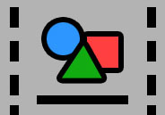
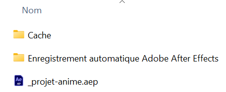

# Projet final - Animation <br><small>Groupe de Marie-Michelle</small>

Maintenant que votre préproduction est complétée, vous pouvez passer à la **production** de votre animation dans After Effects.

## Travailler en équipe avec After Effects
[Voir les consignes de **Projet d'équipe** dans AE au **Cours 12-mm**](https://tim-montmorency.com/compendium/582-214-animation2d-jf-mm/cours12-mm.html#travailler-en-equipe-avec-after-effects)


## Paramètres techniques du projet

* Création d'un **projet d'équipe** After Effects
* Résolution du produit final : 1920 x 1080 px (Full HD)
* Fréquence d’images : 24 fps
* Durée : 60 secondes (excluant le générique)
* Durée du générique : 10 à 20 secondes
* Format d’exportation : H.264 - Vimeo 1080p Full HD

### Structure de projet
<!--  -->

```txt
📁 Compositions
├──📁 00_master
│   └──🎞️ master-composition
├──📁 01_intro
│   ├──🎞️ intro
│   ├──🎞️ precomp-souris
│   └──🎞️ precomp-scene-pluie
├──📁 02_probleme
├──📁 03_causes
├──📁 04_consequences
├──📁 05_solution
├──📁 06_appel-action
├──📁 07_conclusion
└──📁 08_genrique-credits
📁 Footage
├──📁 audio
├──📁 fonts
├──📁 images
├──📁 illustrator
├──📁 photoshop
└──📁 videos
```


C'est dans la composition « master-composition » que vous ferez le montage final de votre projet.

Vous y ajouterez les compositions correspondant à vos différentes scènes, accompagnées de la ou des pistes sonores. C’est aussi dans cette composition que vous appliquerez vos effets de transition pour assurer la fluidité de l’enchaînement.


## Explainer video: Techniques obligatoires à démontrer

Vous devez inclure **toutes** les techniques suivantes :

* [ ] **1- Écrasement et étirement** (Cours 2 - 12 principes de l'animation et exercices "3 principes d'animation" et "Balle de Tennis")
* [ ] **2- Anticipation** (Cours 2 - 12 principes de l'animation)
* [ ] **3- Lissage de vitesse** : 
  * **Lissage** (Cours 2 - Lissage de vitesse)
  * Utilisation obligatoire du **Graph Editor** (Cours 9-mm - Courbes temporelles et spatiales) pour lisser certaines animations et améliorer leur fluidité.
* [ ] **4- Animation sur une trajectoire** (Cours 3 - Animation sur une trajectoire et exercices "Avion" et "Voiture")
* [ ] **5- Outil marionnette** (Cours 3 - Outil Marionnette)
* [ ] **6- Typographie cinétique**
  * Texte et animation du texte (Cours 3 - Calque texte, animation du texte et une partie de l'exercice Gaïa)
  * Typographie cinétique (Cours 6 - Typographie cinétique: animation manuelle, animatios prédéfinies et exercices "Typographie audacieuse" et "Contrast")
* [ ] **7- Animation d'un masque**. (Cours 8 - Les masques)
* [ ] **8- Technique de morphage** qui doit utiliser d'autres formes que les formes de bases d'After Effets (Cours 3 - Morphage vectoriel et exercice effectué en classe au cours 3)
* [ ] **9- Expression** Ajouter au moins une **expression** `loopOut()` (Cours 9-mm - Expressions)
* [ ] **10- Minimum 3 effets différents parmis:** 
  * **Effets et Animations prédéfinies** (Cours 7 - Déformation, Esthétique, Générer, Netteté, Perspective, Simulation, Transition.)
  * et/ou **Particules** (Cours 12-mm). 
  * et/ou **Liste des effets présentés en [capsules vidéos](https://cmontmorency365-my.sharepoint.com/:f:/g/personal/mariem_ouellet_cmontmorency_qc_ca/EgSlyZzm2LZBk4qd09ymzw4B3po1iwPcpWXeuNVJWFRS-A?e=Dulexy)** :
    * Ligne qui se dessine - Line art (Trim path) (06_animation_line_art) 
    * Dégradé 4 couleurs (Fond) (07_degrade_4_couleurs) 
    * Réflexion (mirroir) (11_reflexion) 
    * Liquide (style lava lamp) (12_liquide) 
    * Particules (08_particules) 
    * 3D et flou (basse profondeur de champs, aka tilt-shit) (10_3d) 
    * Lumière, lueur diffuse (01_lumiere_effet_glow.mov) 
    * Lignes qui tremblent – effet dessiné à la main (14_contours_tremblants_effet_dessiné_a_la_main) 
    * Fond avec bruits (09_bruit) 
    * Animation de formes concentriques (13_formes_concentriques) 
    * Onde progressive (02_onde_progressive) 
    * Éclairs électriques (15_lumiere) 


### Notion supplémentaire à ajouter obligatoirement

* [ ] Sélectionnez un tutoriel YouTube (ou autre) de votre choix et intégrez une **technique qui n'a pas été vue en classe**
* [ ] IMPORTANT: Indiquez l’**URL** du tutoriel dans votre documentation.

### Audio

L’ambiance sonore est essentielle pour renforcer la narration visuelle. Ajoutez :

* [ ] Au moins une trame sonore
* [ ] Une narration francophone
* [ ] Des effets sonores judicieux pour accompagner les animations. Par exemple, s'il y a une explosion, il faut l'entendre.

## Crédits et générique de fin (plus d'instructions à venir)

Votre vidéo doit se terminer par un générique qui vont présenter les crédits d'auteur (dont vous-même mais aussi les crédits des autres médias que vous aurez utilisés si applicalble).

Il doit durer entre 10 et 20 secondes.

Il doit inclure :

* [ ] Écran 1 | Titre du projet
* [ ] Écran 2 | Animation 2D : Noms complets des membres de l’équipe
* [ ] Écran 3 (ou plus au besoin) | Animation 2D : Noms complets des membres de l’équipe
* [ ] Avant dernier écran | 
  * Titre du cours
  * Nom de l’enseignant(e)
  * Nom du programme
  * Nom du Cégep
  * Mois - Année
  * [Logos du collège](./logo-cmontmorency.eps)
* Dernier écran | [logo du programme](./logo-tim.eps) animé en motion design (apparition, animation et stabilisation)

Vous devez faire de la **typographie cinétique** pour afficher le texte de chaque écran (bref animer le texte entrant). Vous devez penser à **une transition entre chaque écran**. Le style du générique doit être constant du début à la fin et être harmonieux avec le rythme et le style du reste du film d'animation.


## REMISE: Documents à remettre

* [ ] Vous devez tout d'abord vous assurer d'avoir invité marie-michelle.ouellet@cmontmorency.qc.ca à votre projet d'équipe dans After Effects.

* [ ] Dans le dossier de projet, vous devez ajouter dans le dossier **00_references** un document Word nommé **animations.docx**. Il comprendra :

  * Titre du projet
  * Noms des membres de l’équipe
  * Structure de vos étapes narratives. Ici on cherche à savoir si votre explication est bien structurée.
  * Indiquez, dans cette structure narrative, qui a animé quelle partie.
  * Ajouter aussi un tableau des «&nbsp;[Techniques obligatoires à démontrer](#explainer-video-techniques-obligatoires-a-demontrer)&nbsp;» avec une colonne «&nbsp;Timecode&nbsp;» pour indiquer à quel moment (à quelle seconde) dans la vidéo chacun de ces techniques sont observées (Ex&nbsp;:&nbsp;00:36).
  * Tutoriel Youtube (ou autre) pour la «&nbsp;[Notion supplémentaire à ajouter obligatoirement](#notion-supplementaire-a-ajouter-obligatoirement)&nbsp;» : inclure l’URL complète du tutoriel. Vous devrez aussi indiquer à quel moment (à quelle seconde) dans la vidéo cette technique est observée.

* [ ] Dans le dossier de projet, sous le dossier **00_references** ajoutez les documents que vous aviez déjà fait pour l'étape 1 soient:

  * Sujet final dans un Word nommé **description-projet.docx**
  * Inspirations (liste finale) (inscrire les nom et les liens vers vos inspirations) dans Word et nommé  **references-et-inspirations.docx**
  * Moodboard final réalisé avec le gabarit Figma fourni. SVP remettre le **lien direct vers votre Figma**.
  * Script final (contenu textuel de la narration) en fichier **script.docx**
  * Scénario final (storyboard) créé avec le logiciel Storyboarder (n'oubliez pas de regarder la capsule vidéo qui explique comment l'utiliser et sauvegarder) et exporté en fichier **scenario.pdf**

* [ ] Votre dossier de projet doit aussi inclure tous les médias externes (fichiers image (illustrator, png, svg, jpg, photoshop etc) et fichiers audio) bien classés.

* [ ] Vous devrez faire une copie du fichier de travail After Effects (.aep) dans le dossier **02_ae**. Vous devez l'ouvrir dans After Effects avant la remise et refaire tous les liens vers les médias externes.

* [ ] Exportez votre projet et déposez le ficheir .mp4 dans **03_exportations**. Voir les consignes initiales pour le format d'exportation.

* [ ] Supprimez les caches, les fichiers temporaires (TMP) et les enregistrements automatiques du dossier de projet.

!!! warning "Supprimez les fichiers de **Cache** et les **Enregistrements automatiques**."
    Supprimez les fichiers de **Cache** et les **Enregistrements automatiques** avant la remise. Ils sont lourds et inutiles pour la remise. Merci de respecter cette importante consigne.
    

* [ ] Compressez le dossier de projet en .zip et renommez le: `[noms de famille en ordre alphabétique séparés par un tiret]_[projet-final]_[#cours]`

Exemple :

* 📂 `ouellet-cartier_projet-final_582-214MO`

* [ ] Partagez le lien du projet compressé en .zip dans Teams/Devoirs. Assurez-vous que j'ai bien les droits d'accès au fichier.

## Date limite de remise

Le **21 mai à 14h00** (sera suivi d'une présentation en classe à 14h25).


[STOP]


  [📁 Mode de fusion](https://cmontmorency365.sharepoint.com/:v:/s/TIM-582214-Animation2d77/EZ7goNzRxF1Os89y3U15jF4BLavg3yHNz5357WyT-L2eUQ?e=HRYc0g){ .md-button }
  

  
  [📁 Liquide](https://cmontmorency365.sharepoint.com/:f:/s/TIM-582214-Animation2d77/EkOtH_91pKlAsV4vzSlmOXwBavqbaGHD7lMQgkgxlsVeXw?e=n3979a){ .md-button }

  
  [📁 Onde progressive](https://cmontmorency365.sharepoint.com/:f:/s/TIM-582214-Animation2d77/EtHtcvlNfNRGq9sUcwiMsEcBZpGyFpa0JVI7YoeEQ1Gh6A?e=48kYHX){ .md-button }
  

  [📁 Formes concentriques](https://cmontmorency365.sharepoint.com/:f:/s/TIM-582214-Animation2d77/Es_qhlnLNYFNvOUT_2yloAUB5yd_m9yUf6VfYQx6FMKDJA?e=sBcTAC){ .md-button }
  
  
  [📁 Réduction des tracés](https://cmontmorency365.sharepoint.com/:f:/s/TIM-582214-Animation2d77/Ek9uS3COSVxJqST6a3OE38ABQS2M_Y_Y_nsWIsjc6QaCPg?e=ROOaY4){ .md-button }


Générique doit inclure :

- Titre du projet
- Noms complets des membres de l’équipe

- Titre du cours
- Nom de l’enseignant(e)
- Nom du programme
- Nom du Cégep
- Année
- [Logos du collège](./logo-cmontmorency.eps) et [logo du programme](./logo-tim.eps)

- [ ] Ajouter le générique à la fin de votre vidéo.

### Contraintes visuelles de l'animation 2D - générique

- [ ] Réaliser et animer un générique de type "page à page" et non pas un générique défilant. Donc on veut voir un texte à la fois avec des animations de transitions d'un texte à l'autre.
- [ ] Vous devez respecter le style graphique de votre projet.
- [ ] Vous devez animer l’entrée et la sortie de chaque texte.
- [ ] Vous devez animer l’arrière-plan.
- [ ] Respecter les limites des safe titles.


### Contraintes techniques de l'animation 2D - générique

Vous devez utiliser au moins 2 techniques d'animation parmis les suivantes (différentes de vos techniques pour la mosaïque):   

- [ ] Animation de masque
- [ ] Modes de fusion
- [ ] Animations liquides
- [ ] Onde progressive
- [ ] Animation de formes concentriques
- [ ] Effet de réduction des tracés


Les tutoriels suivants peuvent vous aider pour les techniques:   

[📁 Masque ](https://cmontmorency365.sharepoint.com/:f:/s/TIM-582214-Animation2d77/Ek7FYbr7q-hHg7Qa841ss4IBCVLPRBhKHlmagOIWBltWpQ?e=f8psc0){ .md-button }       

[📁 Mode de fusion](https://cmontmorency365.sharepoint.com/:v:/s/TIM-582214-Animation2d77/EZ7goNzRxF1Os89y3U15jF4BLavg3yHNz5357WyT-L2eUQ?e=HRYc0g){ .md-button }       

[📁 Liquide](https://cmontmorency365.sharepoint.com/:f:/s/TIM-582214-Animation2d77/EkOtH_91pKlAsV4vzSlmOXwBavqbaGHD7lMQgkgxlsVeXw?e=n3979a){ .md-button }       

[📁 Onde progressive](https://cmontmorency365.sharepoint.com/:f:/s/TIM-582214-Animation2d77/EtHtcvlNfNRGq9sUcwiMsEcBZpGyFpa0JVI7YoeEQ1Gh6A?e=48kYHX){ .md-button }       

[📁 Formes concentriques](https://cmontmorency365.sharepoint.com/:f:/s/TIM-582214-Animation2d77/Es_qhlnLNYFNvOUT_2yloAUB5yd_m9yUf6VfYQx6FMKDJA?e=sBcTAC){ .md-button }       

[📁 Réduction des tracés](https://cmontmorency365.sharepoint.com/:f:/s/TIM-582214-Animation2d77/Ek9uS3COSVxJqST6a3OE38ABQS2M_Y_Y_nsWIsjc6QaCPg?e=ROOaY4){ .md-button }       

[📁 Tracer des lignes triples dans illustrator](https://cmontmorency365.sharepoint.com/:f:/s/TIM-582214-Animation2d77/Eu9eP62hzEpBsUWwqQbtwEIBrIxX0R5RNNcw-OwCk6SWPQ?e=sv3nOJ){ .md-button }       

      

### Contraintes de contenu de l'animation 2D - générique
Le générique doit contenir:

- [ ] Titre du film
- [ ] Postes:
- [ ] Animateurs 2D (Vos noms)
- [ ] Avant-avant dernière page: Projet encadré par (nom de votre professeur(e))
- [ ] Dernière page: le logo TIM: logo_tim (animer le logo en style motion design)


## Documentation à remettre

Un document Word (`.docx`) doit accompagner la vidéo. Il comprendra :

- Titre du projet
- Noms des membres de l’équipe
- Structure de vos étapes narratives. Ici on cherche à savoir si votre explication est bien structurée.
- Un tableau des « Techniques obligatoires à démontrer » avec une colonne « Timecode » pour indiquer à quel moment dans la video elles sont observées (Ex : 00:53).
  - Tutoriel externe : inclure l’URL complète

- [ ] Rédiger la documentation

## Remise
La nomenclature des documents à remettre sur Teams doit respecter cette structure : `[noms de famille en ordre alphabétique séparés par un tiret]_[nom_du_travail]_[#travail]_[#cours]`
Exemple :
* 📄 `cartier-ouellet_projet-final_582-214MO.abc`

Voici les fichieers à remttre dans Teams:

* [ ] **Fichier vidéo format .mp4** bien nommé (voir ci haut)
* [ ] **Lien vers le dossier de projet** sur votre OneDrive paratagé.
* [ ] À VENIR..


!!! warning "Supprimez les fichiers de **Cache** et les **Enregistrements automatiques**."
    Supprimez les fichiers de **Cache** et les **Enregistrements automatiques** avant la remise. Ils sont lourds et inutiles pour la remise. Merci de respecter cette importante consigne.
    
