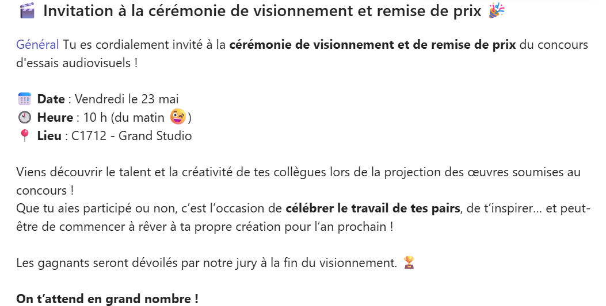

# Projet final - Présentation  <small>Groupe de Marie-Michelle</small>

Chaque équipe devra présenter son projet devant la classe.

Cette présentation vous permet de faire un retour critique sur votre travail, de valoriser votre processus créatif et de partager vos apprentissages avec le reste du groupe.

Date : 21 mai 2025

L'oral doit durer entre 5 et 10 minutes incluant le visionnement de l'animation.

## Contenu de la présentation

* [ ] Visionnement du film d'animation
* [ ] Nom du projet et noms des membres de l’équipe
* [ ] Diffusion de la vidéo finale
* [ ] Intention de départ : Pourquoi avoir choisi ce sujet ou cette approche ?
* [ ] Défis rencontrés et solutions apportées
* [ ] Ce que vous avez appris :
  * Notion supplémentaire (Ex: le tutoriel YouTube)
  * Compétences développées ou consolidées pendant le projet
* [ ] Ce dont vous êtes le plus fier
* [ ] Si c’était à refaire : qu’est-ce que vous feriez différemment ? Quelles améliorations possibles ?

## Modalités

* Présence obligatoire
* Chaque membre de l’équipe doit prendre la parole au moins une fois pendant la présentation

# RAPPEL Concours audiovisuel TIM 2025

## Participation avant le 22 mai

!!! success "Concours audiovisuel🎬🏆🎉"

    Ce projet d'animation 2d est une excellente occasion de participer au [**concours  🏆audio-visuel 2025**](https://teams.microsoft.com/l/channel/19%3A5e5f45d314944e9dad487ce033ea4f3e%40thread.tacv2/Concours%20essais%20audiovisuels?groupId=924057af-2255-4c2a-8ce7-f0a1809ad4a4&tenantId=ffa995c7-10de-4ec8-95db-28ed0576455d). Date limite de participation le 21 mai 2025 (vous n'avez qu'à déposer votre projet dans un dossier indiqué dans les consignes du concours). Ce peut-être un projet audiovisuel de n'importe quelle session, tant qu'il n'a jamais été soumis au même concours lors des années précédentes.

## Invitation à la cérémonie de visionnement et remise de prix le 23 mai à 10ham

