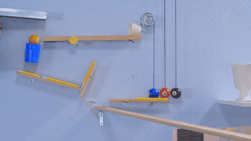

# Rube Goldberg

Rube Goldberg (1883-1970) était un dessinateur et caricaturiste américain célèbre pour ses illustrations de machines complexes[^machine] accomplissant des tâches simples de manière exagérément compliquée.

{ .w-100 }

Aujourd'hui on observe encore l'influence de ses idées : 

* [Publicité de Honda](https://www.youtube.com/watch?v=_ve4M4UsJQo)
* [Vidéoclip de OK go](https://www.youtube.com/watch?v=qybUFnY7Y8w)
* [Chaîne YouTube - Joseph's Machines](https://www.youtube.com/c/JosephsMachines)

[^machine]: <https://en.wikipedia.org/wiki/Rube_Goldberg_machine>

## Objectif

L'objectif de cet exercice est de travailler les animations avec des **transitions fluides** et une belle **synchronisation sonore**.

Vous avez deux options :

- Créer **votre propre machine** de A à Z.
- Reproduire **la machine du professeur** à l'aide du dossier de départ : [dossier de départ](./rube.zip).

## Exemple

## Consignes

### Contruire votre machine

- [ ] Créez une composition **Full HD (1920 x 1080)** en **24 fps** d'une durée entre 10 et 30 secondes.
- [ ] Si vous n'utilisez pas le dossier de départ :
  - Concevez d'abord le design de votre machine dans **Illustrator**.
  - Importez vos calques animables dans **After Effects**.
  - Recherchez des pistes et effets sonores libres de droits ([Pixabay - Sound Effects](https://pixabay.com/sound-effects/)).
- [ ] Réalisez une **animation de base** : placez les **keyframes principales** pour structurer votre animation.
- [ ] Animez ensuite de manière plus détaillée, étape par étape de la machine.

### Ajouter des effets !

- [ ] Appliquez entre **5 et 10 effets**, dont une **déformation**, une **simulation**, une **transition**, un **effet esthétique** et un **effet textuel**. 

Surtout, laissez parler votre créativité !
