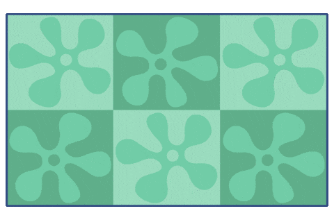

# TP1

L'objectif de ce travail pratique est la mise en pratique de plusieurs concepts d'animations dans un seul et même projet.

## Résultat attendu

:loud_sound: Activez le son !


[Vidéo source](https://cmontmorency365.sharepoint.com/:v:/s/TIM-582214-Animation2d77/EZigptqxGDFLuqCp7ZnqNOABc1tS5Zxa7Dpmn7x8RFDNQw?e=G9oOu8)

## Consignes Illustrator

- [ ] Écouter la vidéo sur la [:material-play-circle: préparation des calques Illustrator](https://cmontmorency365.sharepoint.com/:v:/s/TIM-582214-Animation2d77/EV2wGhwKjstFn8bKoaa8oRkBV48akJFPByqmxeXwjBsTPw?e=5QAPKf)
- [ ] Chaque lettre doit être sur son propre calque (total de 8 calques : `A` `O` `Û` `T` `M` `A` `R` `S`)
- [ ] Cacher ou supprimer les effets de répétition et ne conserver qu’une seule couche par lettre (Aspect)

## Consignes After Effects

:material-folder-open: Structure de fichiers à respecter dans Windows

```txt
Votre-nom-et-prenom_tp_01_582-214MO
├──📁 00_references
├──📁 01_medias
├──📁 02_ae
└──📁 03_exports
```

:material-folder-open: Structure de projet à respecter dans After Effects

Pour charger un projet : `Édition > Préférences > Nouveau projet`.

```txt
Projet
├──📁 01_medias
│   ├──📁 00_importations
│   ├──📁 01_audio
│   ├──📁 02_images
│   ├──📁 03_videos
│   └──📁 04_solides
└──📁 02_compositions
    ├──📁 01_master_composition
    ├──📁 02_travail_composition
    └──📁 03_pre_composition
```

[:material-play-circle: Structure du TP1](https://cmontmorency365-my.sharepoint.com/:v:/r/personal/flpilote_cmontmorency_qc_ca/Documents/01_cours/01_college/cours_animation_2d/tp/01_tp_illustrator_ae/tp2/01_nomenclature/03_nomenclature_interne.mp4)

:material-image-size-select-large: **Composition**

- [ ] Créer une composition en 6000 x 3375 px, durée 28 secondes, 24 fps.
- [ ] Configurer le **Cache des médias et de disque** dans After Effects.
- [ ] Ajouter le zoom avant/arrière.

:material-text-shadow: **Typographie**

- [ ] Dupliquer les calques de lettres pour les animer individuellement.
- [ ] Animer les différentes couches des lettres.
- [ ] Créer une transformation (morph) des lettres `A` `O` vers `M`. `A`

:material-bike-fast: **Vélo** 

- [ ] Animer la rotation des roues.
- [ ] Animer la rotation des pédales.
- [ ] Faire un déplacement latéral du vélo.

:material-bird: **Oiseaux** 

- [ ] Gérer le déplacement des oiseaux.
- [ ] Animer les ailes avec l'outil marionnette.
- [ ] Utiliser le concept de parent-enfant et calque nul pour coordonner les mouvements.

:material-cactus: **La flore** 

- [ ] Utiliser l'effet _CC Bend It_ pour une animation de pliage.

:material-human-female: **Femme géante** 
 
- [ ] Animer la rotation des bras.
- [ ] Gérer la position du personnage.
- [ ] Utiliser l’outil marionnette pour animer les jambes.
- [ ] Ajouter un lissage de vitesse (Ease).
- [ ] Appliquer une onde progressive sur les cheveux.

:material-umbrella-outline: **Femme parapluie** 

- [ ] Animer les bras avec l’outil marionnette.
- [ ] Appliquer une ondulation progressive sur les cheveux et la jupe.

:octicons-eye-24: **Œil** 

- [ ] Déplacer l’œil dans son ensemble.
- [ ] Animer la pupille et son contour.
- [ ] Créer une animation d'ouverture et de fermeture de l'œil.

:material-tennis-ball: **Balle** 

- [ ] Créer l'animation de rebond.
- [ ] Bien gérer la vitesse et son lissage (ease).
- [ ] Gérer la mise à l’échelle pour donner un effet réaliste à la balle.

:fontawesome-solid-cloud-rain: **Pluie** []

- [ ] Simulation de pluie (CC Rainfall).
- [ ] Créer manuellement des éclaboussures

[:material-play-circle: Aide](https://cmontmorency365-my.sharepoint.com/:v:/r/personal/flpilote_cmontmorency_qc_ca/Documents/01_cours/01_college/cours_animation_2d/tp/01_tp_illustrator_ae/tp2/04_pluie/01_pluie.mp4)

:material-speaker: **Audio** 

- [ ] Lecture des pistes `lillies.mp3` et `rain-noise-for-sleep.mp3`.
- [ ] Lecture de l'effet sonore `LOW-HIT_Turner_Round.wav` au moment où la femme géante dépose son pied au sol.
- [ ] Ajustement des décibels des 3 pistes afin d'atteindre une harmonie et une cohérence sonore.

:material-movie-open: **Exportation**  

- [ ] Exporter en H264 - Vimeo 1080p - 1920 x 1080 px - 28 secondes.

!!! example "Export"

    

    Prévoyez du temps pour l'exportation. L'encodage peut facilement prendre plus d’une heure par vidéo.

## Évaluation

Ce travail pratique est **individuel** et représente **30 %** de la note finale.

L’évaluation est notée sur **40 points**

| Sujets d'évaluation    | Points |
|------------------------|--------|
| Composition            | 2      |
| Typographie            | 2      |
| Vélo                   | 3      |
| Oiseaux                | 3      |
| La flore               | 1      |
| Femme géante           | 5      |
| Femme parapluie        | 2      |
| Œil                    | 3      |
| Balle                  | 3      |
| Pluie                  | 2      |
| Audio                  | 2      |
| Exportation            | 1      |
| Rigueur et minutie     | 5      |
| Respect des consignes  | 5      |

## Remise

Date limite : **18 mars à 23 h 59**