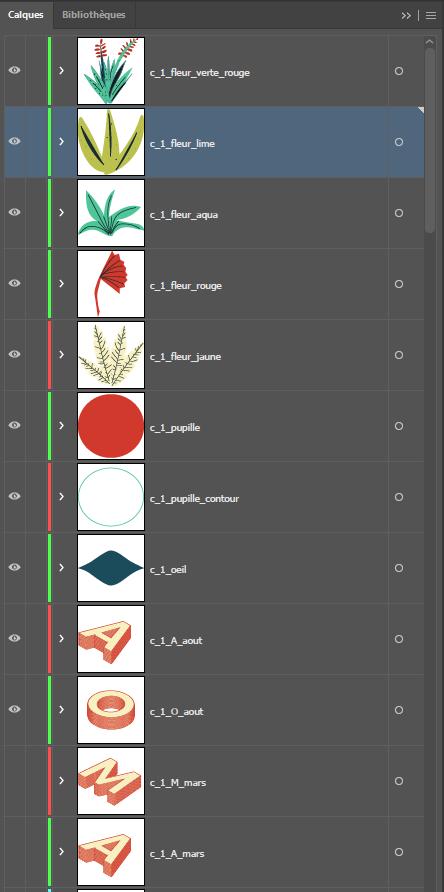
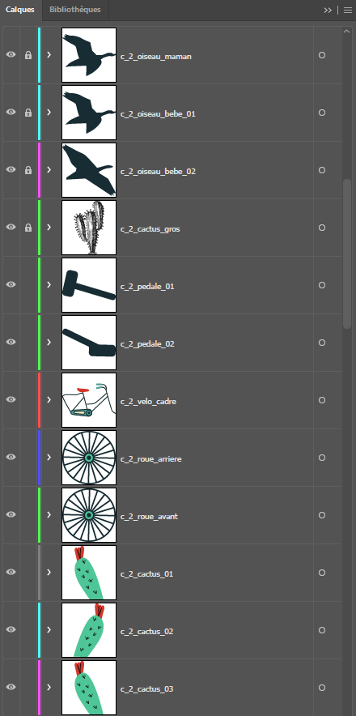
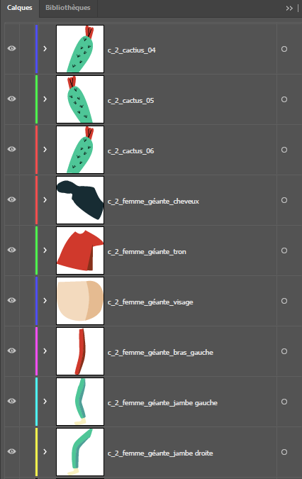
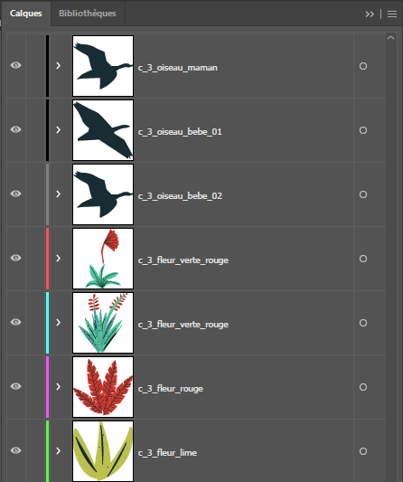
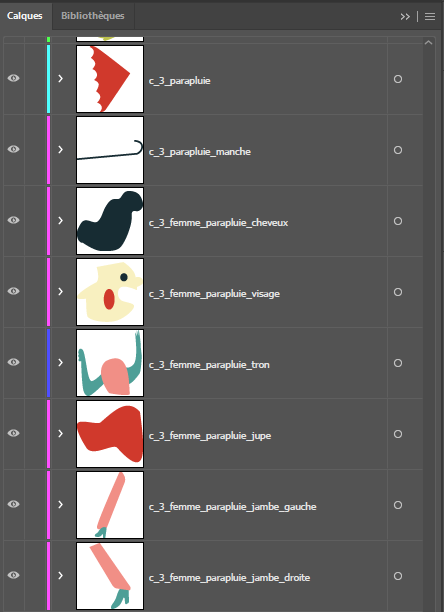
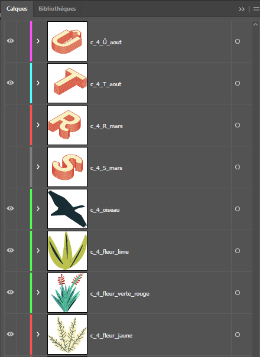
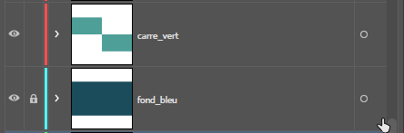

# TP1a 9 Cours de Marie-Michelle

Ce **TP1a** est **évalué** et vaut 15% de la session. 
C'est la partie où on illustre les images fixes pour le TP1 qui sera au final un tableau animé.

## Téléchargement

[Dossier de départ :material-download:](./tp1a-depart.zip){ .md-button .md-button--primary }

```txt
votre-nom-et-prenom_tp_0_582-214MO
│
├──📁 00_references
│   └──📄 reference_tp1_basse-qualite.jpg
├──📁 01_medias
│   ├──📁 01_images
│   │   ├──📁 01_illustrator
│   │   │   └──📄 couleurs.ai
│   │   ├──📁 02_png
│   │   │   ├──📁 photographies
│   │   │   │   └──📄 oiseau.png
│   │   │   └──📁 vectorisations
│   │   │       └──📄 cactus.png
│   │   └──📁 03_psd
│   ├──📁 02_audios
│   │   ├──📁 00_mixes
│   │   ├──📁 01_voix
│   │   ├──📁 02_ambiances
│   │   │   ├──📄 Rain-noise-for-sleep.mp3
│   │   │   └──📄 amb_vent.wav
│   │   ├──📁 03_bruitages
│   │   │   └──📄 Boots On Sand Footsteps.M.mp4.mp4
│   │   ├──📁 04_effets_sonores
│   │   │   └──📄 LOW-HIT_Turner_Round.wav
│   │   └──📁 05_musiques
│   │       └──📄 lillies.mp4
│   ├──📁 03_videos
│   └──📁 04_fonts
│       └──📄 FilsonProBold.otf
├──📁 02_ae
└──📁 03_exportation
```

## Objectif

Reproduire en vectoriel le résultat observé dans `reference_tp1_basse-qualite.jpg` à partir des consignes.

## Consignes

**Format**

- [ ] Taille de la zone de travail : 6000 X 3375 pixels
- [ ] Configurer la palette de couleur à partir des couleurs dans le document `couleurs.ai`

**Nomenclature**

- [ ] Renommer le dossier `tp1a-depart` par `votre-nom-prenom_tp1_582-214MO` 
- [ ] Nommer les calques **sans** majuscule, espace ou caracteres spéciaux
- [ ] Nommer les calques avec le motif suivant : c1_description. (c1 = case 1, c2 = case 2, etc.). Exemples :        
    [1](capture-1.png), [2](capture-2.png), [3](capture-3.png), [4](capture-4.png), [5](capture-5.png), [6](capture-6.png), [fond](capture-bg.png).

[Nomenclature des calques](https://cmontmorency365.sharepoint.com/:f:/s/TIM-582214-Animation2d77/EhR-OzQO_t1KkGjAf0Wu6nMB38jUZ55LbFHtxw4f33XqFg?e=eZSTew)

**Typographie**
- [ ] Installer la police Filson Bold (FilsonProBold.otf)

### Typographie 3D Isométrique   

- [ ] Effet / 3D et matières / 3D (Classique) /Rotation (classique) / isométrique haut (attention l'effet a changé d'endroit).
- [ ] Effet / Distorsion et transformation / Transformation de l'image avec 15 copies avec un décalage vertical de 16 pixels.
      
[:material-play-circle: Capsule vidéo référence](https://cmontmorency365.sharepoint.com/:v:/s/TIM-582214-Animation2d77/EcDgSLdxIqFGtxtUf-NnYUIBydssqkdAZ7lnx6CHJUIw0A?e=KoepdA){ .md-button }   

[:material-play-circle: Capsule vidéo effet isométrique](https://cmontmorency365.sharepoint.com/:v:/s/TIM-582214-Animation2d77/EWhHJDR4d8dLqQk6Ydf5JwIByxBq09dSlQE-TyI3ey6nsQ?e=6DPhiI){ .md-button } 

[:material-play-circle: Modifier l'effet au besoin](https://cmontmorency365.sharepoint.com/:v:/s/TIM-582214-Animation2d77/EZakrA8bd5pDl5icN3ZK-fUBBsJ8RFupt5gy5ARiQodK-A?e=MFbF0p){ .md-button }   


**La flore**

- [ ] Vectoriser le cactus noir et blanc (cactus.png)
[:material-play-circle: Capsules vidéo pour le vélo](https://cmontmorency365-my.sharepoint.com/:v:/g/personal/flpilote_cmontmorency_qc_ca/EVgXZrtVe-hMmCmTK8lqiJcBZNHEq78aw_lfoTpjvEq4eg?nav=eyJyZWZlcnJhbEluZm8iOnsicmVmZXJyYWxBcHAiOiJPbmVEcml2ZUZvckJ1c2luZXNzIiwicmVmZXJyYWxBcHBQbGF0Zm9ybSI6IldlYiIsInJlZmVycmFsTW9kZSI6InZpZXciLCJyZWZlcnJhbFZpZXciOiJNeUZpbGVzTGlua0NvcHkifX0&e=DUFkak)

- [ ] Dessiner les plantes avec les outils **plume**, **pinceau** et **crayon**.

**Les personnages**

- [ ] Dessiner les personnages avec les outils **plume**, **pinceau**, **crayon** et **forme**.

**Oiseaux**

- [ ] Tracer à partir de l'image de référence (oiseau.png) avec l'outil **plume**.

**Vélo**

- [ ] Dessiner le vélo avec les outils **plume**, **forme** et **grille à coordonnées polaires**.
- [ ] L'épaisseur du cadre du vélo doit être de 6 px.
- [ ] Respecter le nombre de points de la forme de l’œil.
[:material-play-circle: Capsules vidéo pour le vélo](https://cmontmorency365-my.sharepoint.com/:f:/g/personal/flpilote_cmontmorency_qc_ca/EqsNQZGOvCVOkkT8J7--z6gBKnkmfV0A5g4Nw1soQt-vGg?e=oU0IBl)

**Œil**

- [ ] Respecter le nombre de points de la forme de l’œil.
[:material-play-circle: Capsule vidéo pour l'oeil](https://cmontmorency365-my.sharepoint.com/:v:/g/personal/flpilote_cmontmorency_qc_ca/EWRd3uKMW9FNvyPtYpI_uKIBKTysx1wsU8KqrYnR3v4jwg?nav=eyJyZWZlcnJhbEluZm8iOnsicmVmZXJyYWxBcHAiOiJPbmVEcml2ZUZvckJ1c2luZXNzIiwicmVmZXJyYWxBcHBQbGF0Zm9ybSI6IldlYiIsInJlZmVycmFsTW9kZSI6InZpZXciLCJyZWZlcnJhbFZpZXciOiJNeUZpbGVzTGlua0NvcHkifX0&e=AWgUz8)

## Remise groupe Marie-Michelle

Compresser le dossier `votre-nom-prenom_tp1_582-214MO` en .zip

Déposer sur Moodle (instructions spécifiques pour la remise à venir)

Date limite : **jeudi 13 mars AVANT LE COURS (avant 14h15)**