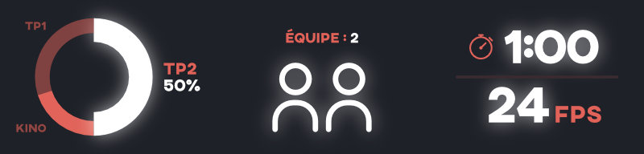
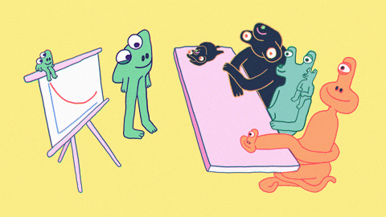

# TP2

*[TTS]: Text To Speech

Vous devez réaliser une vidéo explicative animée (_explainer video_).

Cette vidéo doit expliquer clairement un sujet, à l’aide de visuels animés, d’un design cohérent et d’une rythmique uniforme.

Le sujet peut être 🎓 **éducatif**, ✊ **engagé** ou 😂 **humoristique**.

!!! success "Portfolio"

    Ce TP est une excellente occasion de garnir votre portfolio 🎨

## Modalités

Ce travail doit être réalisé en équipe de 2 et compte pour 50 % de la note finale.

* Résolution : 1920 x 1080
* Durée : 60 secondes
* Exportation : Vimeo 1080p Full HD

Médias à utiliser :

* Narration obligatoire (francophone)
* Trames et effets sonores
* Visuels originaux ou téléchargés
* Police de caractères stylées

## Calendrier

* Cours 11 - 9 avril : Petit cours et début de la préproduction.
* Cours 12 - 16 avril : Petit cours et remise de la preuve de concept avec les médias.
* Cours 13 - 30 avril : Développement des animations.
* Cours 14 - 7 mai : Développement des animations.
* Cours 15 - 16 mai : Remise et présentation en classe.

> Vous avez plus d'un mois pour réaliser le TP2

## Étapes du TP

  

  **[Préproduction](./step1.md){.stretched-link .back}**
   <small>Remise le 15 avril à 23h59</small>

  

  **[Animation](./step2.md){.stretched-link .back}**
   <small>Remise le 8 mai à 23h59</small>

  

  **[Présentation en classe](./step3.md){.stretched-link .back}**
   <small>9 mai</small>

## Critères d’évaluation

### Production de l’animation (5 points)

- [ ] Paramètres techniques respectés (résolution, durée, format)
- [ ] Structure de projet bien organisée (Main + sous-compositions)
- [ ] Transitions fluides entre les scènes
- [ ] Scène de crédits
- [ ] Présentation originale des crédits

### Techniques obligatoires (10 points)

- [ ] Écrasement et étirement (squash & stretch)
- [ ] Anticipation
- [ ] Actions secondaires
- [ ] Lissage (Graph Editor)
- [ ] Animation sur une trajectoire
- [ ] Outil marionnette
- [ ] Typographie cinétique
- [ ] Expression `loopOut()`
- [ ] Utilisation d’au moins 4 effets différents
- [ ] Notion bonus

### Bande sonore (3 points)

- [ ] Trame sonore ajoutée
- [ ] Effets sonores judicieux
- [ ] Narration en français intégrée

### Général (5 points)

- [ ] Le sujet est bien expliqué via une structure narrative logique
- [ ] Le rythme de la production est bien exécuté (pas de temps morts par exemple, ou encore, une étape narrative beaucoup plus longue que les autres)
- [ ] L’esthétisme et la direction artistique sont cohérents tout au long de la vidéo (design, typographie, couleurs, lisibilité)
- [ ] Originalité / Créativité
- [ ] Respect des consignes

### Documentation (2 points)

- [ ] Structure narrative clairement expliquée
- [ ] Tableau des techniques + timecodes

### Présentation orale (5 points)

- [ ] Tous les membres prennent la parole
- [ ] Intention de départ bien expliquée
- [ ] Défis rencontrés et solutions trouvées
- [ ] Partage des apprentissages
- [ ] Autoévaluation pertinente (améliorations possibles)

[STOP]

!!! info "Valorisation de l'effort"

    Une vidéo trop courte ou ne démontrant pas un effort suffisant dans l’utilisation des techniques, de la narration ou de l’esthétisme, peut être considérée comme incomplète, même si les critères semblent “techniquement cochés”. L’évaluation tiendra compte du niveau d’engagement global dans le projet.

> Travaillons sérieusement sans se prendre trop au sérieux :wink:

tts
https://huggingface.co/spaces/innoai/Edge-TTS-Text-to-Speech
https://huggingface.co/spaces/VoiceCloning-be/text-to-speech
https://huggingface.co/spaces?q=text+to+speech

https://asana.com/fr/resources/brainstorming-techniques

1. Brainstorm et inspiration
1. Moodboard
1. Script
1. Storyboard
1. Design et recherche de médias
1. Animation avec After Effects
1. Présentation en classe

Préproduction

Cours 11 - 9 avril : Petit cours et Début de la planification
Cours 12 - 16 avril : Petit cours et Remise de la preuve de concept.

Production

Cours 13 - 30 avril : Remise de les médias. Développement des animations
Cours 14 - 7 mai : Développement des animations

Présentation

Cours 15 - 16 mai : Remise et présentation en classe