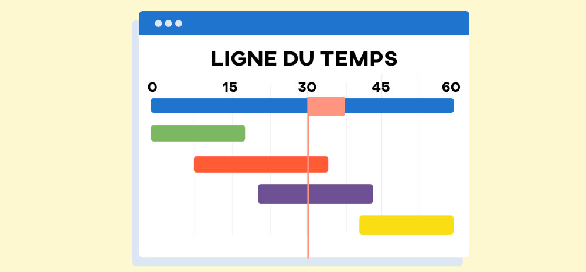

# TP2 - Préproduction

Assurément la partie la plus importante du projet, la préproduction vise à faire toute la planification nécessaire pour commencer l'animation du TP2.

!!! tip "Sauvegardes 💾"

    Pour la préproduction, il est important d'être bien organisé(e).

    Enregistrez quelque part tous les médias et URLs consultés, et ce, autant pour la portion brainstorming que pour la recherche et la création de médias.

## Brainstorm et inspiration

{.w-100}

Un brainstorming est une séance de génération d'idées sans jugement. L’objectif est d’explorer des pistes variées avant de faire un choix.

Il existe plein de [techniques de _brainstorming_](https://asana.com/fr/resources/brainstorming-techniques).

Pour orienter votre brainstorming, voici quelques sujets à considérer :

* Quel est le sujet à expliquer ?
* Quel est l'intention (humoristique, éducatif, engagé) ?
* Quel est le public cible ?
* Quel est le nom du projet ?

- [ ] Créer un docx avec les sujets de votre projet.

---

Voici une liste de vidéo explainer pour vous aider à faire vos choix :

* [Understanding Perception: How We Experience the Meaning We Create](https://motionographer.com/2015/09/18/understanding-perception-how-we-experience-the-meaning-we-create/)
* [Rutger Bregman on Taxes](https://vimeo.com/367769463)
* [Agora - Collage Explainer Video](https://vimeo.com/732074954)
* [Reddit's New Mobile App](https://www.youtube.com/watch?v=cCnTVd9nMoY)
* [What is Ahrefs?](https://www.youtube.com/watch?v=krzF3YhmSMw)
* [ow to become 37.78 times better at anything](https://www.youtube.com/watch?v=PZ7lDrwYdZc)
* [Why Your Brain Blinds You For 2 Hours Every Day](https://www.youtube.com/watch?v=wo_e0EvEZn8)
* [How Alcohol Changes Your Body](https://www.youtube.com/watch?v=KWQpV9_kUUM)
* [What would happen if you didn’t drink water?](https://www.youtube.com/watch?v=9iMGFqMmUFs)
* [The science of laughter](https://www.youtube.com/watch?v=Xu-QfE_1ksk)
* [Animation vs. Physics](https://www.youtube.com/watch?v=ErMSHiQRnc8)
* sinon : https://vimeo.com/search?q=explainer%20video

### Esthétisme

Dans la phase de brainstorming, vous devrez également penser à l'aspect graphique de votre animation.

Il existe de nombreux styles possible. Voici une liste suggérée :

* Animation 2D (style bande dessinée)
* Motion Graphics (vectoriel avec des formes simples, comme le kino)
* Kinetic text (animation de texte)
* Whiteboard animation (simulation d'un dessin synchro avec l'audio)
* Collage animation (à la south park)

- [ ] Choisir l'esthétisme recherché.

## Moodboard

{.w-100}

Un **moodboard** (ou planche d'inspiration) est un assemblage visuel qui évoque l'ambiance recherchée pour votre projet.

Il contient des images, couleurs et typographies qui traduisent l’esthétique souhaitée.

[Modèle Figma à télécharger :material-download:](./Mood_Board.jam){ .md-button .md-button--primary }

* [Exemple 1](https://www.figma.com/board/QCUCe07qWFr5S3OCBpxcgj/Mood-Board--Exemple2-?t=fZTJa3oEaMMKYAyr-6)
* [Exemple 2](https://www.figma.com/board/DboRKo6NLn4WRTPzqdMBWf/Mood-Board--Exemple1-?t=fZTJa3oEaMMKYAyr-6)

- [ ] Faire un moodboard à partir du modèle fourni.

## Recherche et création de médias

{.w-100}

- [ ] Trouver les trames et les effets sonores (libres de droits) nécessaires pour accompagner les animations :
  * [Pixabay](https://pixabay.com/)
  * [Mixkit](https://mixkit.co/)
  * [Falling Forever | Bandcamp](https://fallingforever.bandcamp.com/)

- [ ] Faire ou faire faire la narration de votre script. Pour la synthèse vocale :
  * [Edge TTS | Hugging Face](https://huggingface.co/spaces/innoai/Edge-TTS-Text-to-Speech). Essayez : fr-CA-ThierryNeural - fr-CA (Male), il est pas mal ;)
  * [elevenlabs (connexion requise)](https://elevenlabs.io/)

- [ ] Trouver des polices de caractères (libres de droits) :
  * [Fontesk](https://fontesk.com/license/free-for-commercial-use,free-for-personal-use/)
  * [Google Fonts](https://fonts.google.com/)
  * [Fontshare](https://www.fontshare.com/)
  * [Pousse ta fonte](https://www.poussetafonte.com/) (sélectionner le filtre "Free 🔥")
  * [Font Squirrel](https://www.fontsquirrel.com/)

- [ ] Créer ou télécharger des visuels (libres de droits) :
  * [Pixabay](https://pixabay.com/)
  * [Unsplash](https://unsplash.com/)
  * [Pexels](https://www.pexels.com/fr-fr/)

## Storyboard

{.w-100}

Un storyboard est un outil de planification visuelle utilisé pour représenter scène par scène une vidéo ou une animation.

Dans cette partie, vous devrez d'abord rédiger un scénario (appelé structure narrative) et ensuite dessiner un storyboard.

### Structure narrative

| Étape                         | Fonction narrative                           | Contenu typique                                             |
|-------------------------------|----------------------------------------------|-------------------------------------------------------------|
| **1. Accroche**               | Susciter l’émotion ou la curiosité           | Une question, une stat choc, une image frappante            |
| **2. Problème**               | Montrer l’enjeu ou le besoin                 | Exposer une situation problématique ou injuste              |
| **3. Causes**                 | Expliquer pourquoi le problème existe        | Contexte social, historique ou structurel                   |
| **4. Conséquences**           | Montrer ce qui se passe si rien ne change    | Impacts humains, environnementaux, économiques ou sociaux   |
| **5. Solution / Changement**  | Proposer une prise de conscience ou solution | Action individuelle ou collective possible                  |
| **6. Appel à l’action**       | Donner une direction claire au spectateur    | Ce que chacun peut faire maintenant                         |
| **7. Ouverture / Conclusion** | Imaginer un futur meilleur                   | Montrer une version positive du monde si on agit            |
| **8. Crédits**                | n/a                                          | n/a                                                         |

### Ligne du temps

{.w-100}

Sur une feuille de papier ou à l'ordinateur, commencez par faire une ligne du temps horizontale de 0 à 60 secondes.

Placez ensuite chacune des étapes dans votre ligne du temps.

Pour chaque étape, écrivez les grandes lignes de votre histoire. Les informations à raconter et comment les présenter.

!!! top "Petit truc"

    Une approche efficace pour gérer le temps consiste à rédiger d’abord le texte, générer l'audio puis déterminer ensuite comment il s’intégrera dans l’animation.

- [ ] Écrivez le **contenu narratif** et imaginez les **visuels** pour chacune des étapes. (Restez réaliste ;))
- [ ] En rédigeant votre **storyboard**, esquissez à quoi devra ressembler l'animation prévue. Vous pouvez également ajouter des liens ou images pour illustrer l'intention.

### Exemple de scénario

**Titre** : Une minute pour l’océan

Source : [canadiangeographic.ca](https://canadiangeographic.ca/articles/plastic-to-outweigh-all-of-the-fish-in-the-ocean-by-2050/)

**1. Accroche**

* **Narration** : Chaque minute, un camion entier de plastique est déversé dans l’océan — ce qui représente entre 8 et 10 millions de tonnes, annuellement ! (8 sec)
* **Visuel** : Un gros camion jaune. Les déchets tombent dans une mer calme qui devient trouble.
* :material-image-edit: Images ou URLs pour illustrer le visuel.

**2. Problème**

* **Narration** : Tortues, baleines, oiseaux marins. Des centaines d’espèces sont victimes de cette marée de plastique.
* **Visuel** : Tortue avec une paille dans le nez. Oiseau piégé dans un attache canettes. Fondu lent vers une mer polluée.
* :material-image-edit: Images ou URLs pour illustrer le visuel.

**3. Causes**

* **Narration** : Tout commence avec notre consommation. C'est l'emballages à usage unique, les objets jetables ou encore, le manques de tri qui explique sa présence en mer.
* **Visuel** : Sac en plastique d'épicerie avec des fruits qui s'y ajoutent. Pluie de produits de plastique avec des mains qui tentent d'attraper les items.
* :material-image-edit: Images ou URLs pour illustrer le visuel.

**4. Conséquences**

* **Narration** : Si rien ne change, en 2050, il y aura plus de plastique que de poissons dans les océans.
* **Visuel** : Animation de calendrier. Projection futuriste : bancs de bouteilles, océans envahis de déchets. Poissons à 3 yeux.
* :material-image-edit: Images ou URLs pour illustrer le visuel.

**5. Solution / Changement**

* **Narration** : Mais il est encore temps d’agir. Refuser, réduire, réutiliser… Chaque geste compte.
* **Visuel** : Gourde en métal, sac en tissu, marché sans emballages.
* :material-image-edit: Images ou URLs pour illustrer le visuel.

**6. Appel à l’action**

* **Narration** : À l’école, à la maison, dans ton quartier : tu peux faire la différence, dès aujourd’hui.
* **Visuel** : Plage nettoyée, jeunes qui sensibilisent leur entourage.
* :material-image-edit: Images ou URLs pour illustrer le visuel.

**7. Ouverture / Conclusion**

* **Narration** : Un océan sans plastique, c’est possible. Un monde plus propre commence par une seule action.
* **Visuel** : Mer limpide, faune marine en santé, texte à l’écran : « L’océan, c’est la vie. Protégeons-le. »
* :material-image-edit: Images ou URLs pour illustrer le visuel.

**8. Crédits**

* **Visuel** : « Nos noms »

## Remise

Cette remise est formative.

Dépot le 15 avril à 23h59.

Fichiers :

* Docx : Inspirations, scénario et storyboard
* Moodboard exporté en image

> Une rétroaction avec l'enseignant(e) sera faite en classe.