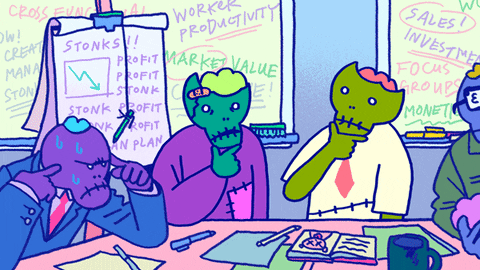
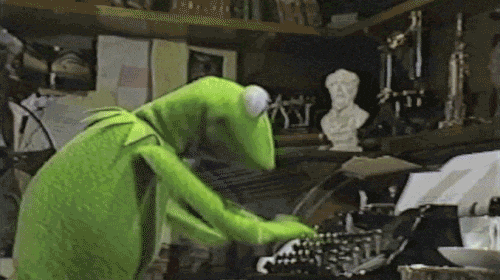

# TP2 - Préproduction

Assurément la partie la plus importante du projet, la préproduction vise à faire toute la planification nécessaire pour commencer l'animation du TP2.

Voici les étapes de la préproduction :

1. Brainstorm et inspiration
1. Moodboard
1. Script
1. Storyboard
1. Recherche et création de médias

!!! tip "Sauvegardes 💾"

    Pour la préproduction, il est important d'être bien organisé(e).

    Enregistrez quelque part tous les médias et URLs consultés, et ce, autant pour la portion brainstorming que pour la recherche et la création de médias.

## Brainstorm et inspiration

{.w-100}

Un brainstorming est une séance de génération d'idées sans jugement. L’objectif est d’explorer des pistes variées avant de faire un choix.

Il existe plein de [techniques de _brainstorming_](https://asana.com/fr/resources/brainstorming-techniques).

Pour orienter votre brainstorming, voici quelques sujets à considérer :

* Quel est le sujet à expliquer ?
* Ton et intention (humoristique, éducatif, engagé).
* Quel est le public cible.
* Quel est le nom du projet.

- [ ] Créer un documents avec les informations ci-dessus.

Voici une liste de vidéo explainer pour vous aider à faire vos choix :

* [Understanding Perception: How We Experience the Meaning We Create](https://motionographer.com/2015/09/18/understanding-perception-how-we-experience-the-meaning-we-create/)
* [Rutger Bregman on Taxes](https://vimeo.com/367769463)
* [Agora - Collage Explainer Video](https://vimeo.com/732074954)
* [Reddit's New Mobile App](https://www.youtube.com/watch?v=cCnTVd9nMoY)
* [What is Ahrefs?](https://www.youtube.com/watch?v=krzF3YhmSMw)
* [ow to become 37.78 times better at anything](https://www.youtube.com/watch?v=PZ7lDrwYdZc)
* [Why Your Brain Blinds You For 2 Hours Every Day](https://www.youtube.com/watch?v=wo_e0EvEZn8)
* [How Alcohol Changes Your Body](https://www.youtube.com/watch?v=KWQpV9_kUUM)
* [What would happen if you didn’t drink water?](https://www.youtube.com/watch?v=9iMGFqMmUFs)
* [The science of laughter](https://www.youtube.com/watch?v=Xu-QfE_1ksk)
* [Animation vs. Physics](https://www.youtube.com/watch?v=ErMSHiQRnc8)

## Moodboard

{.w-100}

Un **moodboard** (ou planche d'inspiration) est un assemblage visuel qui évoque l'ambiance recherchée pour votre projet.

Il contient des images, couleurs et typographies qui traduisent l’esthétique souhaitée.

[Modèle Figma à télécharger :material-download:](./Mood_Board.jam){ .md-button .md-button--primary }

* [Exemple 1](https://www.figma.com/board/QCUCe07qWFr5S3OCBpxcgj/Mood-Board--Exemple2-?t=fZTJa3oEaMMKYAyr-6)
* [Exemple 2](https://www.figma.com/board/DboRKo6NLn4WRTPzqdMBWf/Mood-Board--Exemple1-?t=fZTJa3oEaMMKYAyr-6)

- [ ] Faire un moodboard.

## Recherche et création de médias

{.w-100}

- [ ] Trouver les trames et les effets sonores (libres de droits) nécessaires pour accompagner les animations :
  * [Pixabay](https://pixabay.com/)
  * [Mixkit](https://mixkit.co/)
  * [Falling Forever | Bandcamp](https://fallingforever.bandcamp.com/)

- [ ] Faire ou faire faire la narration de votre script. Pour la synthèse vocale :
  * [Edge TTS | Hugging Face](https://huggingface.co/spaces/innoai/Edge-TTS-Text-to-Speech). Essayez : fr-CA-ThierryNeural - fr-CA (Male), il est pas mal ;)
  * [elevenlabs (connexion requise)](https://elevenlabs.io/)

- [ ] Trouver des polices de caractères (libres de droits) :
  * [Fontesk](https://fontesk.com/license/free-for-commercial-use,free-for-personal-use/)
  * [Google Fonts](https://fonts.google.com/)
  * [Fontshare](https://www.fontshare.com/)
  * [Pousse ta fonte](https://www.poussetafonte.com/) (sélectionner le filtre "Free 🔥")
  * [Font Squirrel](https://www.fontsquirrel.com/)

- [ ] Créer ou télécharger des visuels (libres de droits) :
  * [Pixabay](https://pixabay.com/)
  * [Unsplash](https://unsplash.com/)
  * [Pexels](https://www.pexels.com/fr-fr/)

## Script et storyboard

{.w-100}

Voici la structure narrative que vous devrez respecter :

| Étape                         | Fonction narrative                           | Contenu typique                                             |
|-------------------------------|----------------------------------------------|-------------------------------------------------------------|
| **1. Accroche**               | Susciter l’émotion ou la curiosité           | Une question, une stat choc, une image frappante            |
| **2. Problème**               | Montrer l’enjeu ou le besoin                 | Exposer une situation problématique ou injuste              |
| **3. Causes**                 | Expliquer pourquoi le problème existe        | Contexte social, historique ou structurel                   |
| **4. Conséquences**           | Montrer ce qui se passe si rien ne change    | Impacts humains, environnementaux, économiques ou sociaux   |
| **5. Solution / Changement**  | Proposer une prise de conscience ou solution | Action individuelle ou collective possible                  |
| **6. Appel à l’action**       | Donner une direction claire au spectateur    | Ce que chacun peut faire maintenant                         |
| **7. Ouverture / Conclusion** | Imaginer un futur meilleur                   | Montrer une version positive du monde si on agit            |
| **8. Crédits**                | n/a                                          | n/a                                                         |

Sur une feuille de papier ou à l'ordinateur, commencez par faire une ligne du temps horizontale de 0 à 60 secondes.

Placez ensuite chacune des étapes dans votre ligne du temps.

Pour chaque élément placé, écrivez les grandes lignes de votre histoire. Des informations à raconter.

Une bonne manière de timer son animation est de générer le texte avant de faire l'animation !

- [ ] Créez une **ligne du temps horizontale** (0 à 60 secondes)
- [ ] Placez chaque étape du scénario dans cette ligne
- [ ] Pour chaque étape, écrivez les **idées de narration** et **visuels**
- [ ] Rédigez votre **storyboard**

### Exemple de scénario

**Titre** : Une minute pour l’océan

Source : [canadiangeographic.ca](https://canadiangeographic.ca/articles/plastic-to-outweigh-all-of-the-fish-in-the-ocean-by-2050/)

**1. Accroche**

* Narration : Chaque minute, un camion entier de plastique est déversé dans l’océan — ce qui représente entre 8 et 10 millions de tonnes, annuellement ! (8 sec)
* Visuel : Un gros camion jaune. Les déchets tombent dans une mer calme qui devient trouble.

**2. Problème**

* Narration : Tortues, baleines, oiseaux marins. Des centaines d’espèces sont victimes de cette marée de plastique.
* Visuel : Tortue avec une paille dans le nez. Oiseau piégé dans un attache canettes. Fondu lent vers une mer polluée.

**3. Causes**

* Narration : Tout commence avec notre consommation. C'est l'emballages à usage unique, les objets jetables ou encore, le manques de tri qui explique sa présence en mer.
* Visuel : Sac en plastique d'épicerie avec des fruits qui s'y ajoutent. Pluie de produits de plastique avec des mains qui tentent d'attraper les items.

**4. Conséquences**

* Narration : Si rien ne change, en 2050, il y aura plus de plastique que de poissons dans les océans.
* Visuel : Projection futuriste : bancs de bouteilles, océans envahis de déchets.

**5. Solution / Changement**

* Narration : Mais il est encore temps d’agir. Refuser, réduire, réutiliser… Chaque geste compte.
* Visuel : Gourde en métal, sac en tissu, marché sans emballages.

**6. Appel à l’action**

* Narration : À l’école, à la maison, dans ton quartier : tu peux faire la différence, dès aujourd’hui.
* Visuel : Plage nettoyée, jeunes qui sensibilisent leur entourage.

**7. Ouverture / Conclusion**

* Voix off : Un océan sans plastique, c’est possible. Un monde plus propre commence par une seule action.
* Visuel : Mer limpide, faune marine en santé, texte à l’écran : « L’océan, c’est la vie. Protégeons-le. »

**8. Crédits**

* Visuel : Nos noms

## Remise

Cette remise est formative.

Dépot le 15 avril à 23h59.

Une rétroaction avec l'enseignant(e) sera faite en classe.
