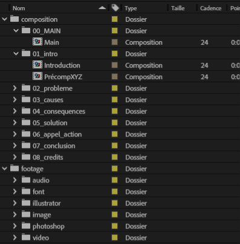

# TP2 - Animation

Maintenant que votre préproduction est complétée, vous pouvez passer à la **production** de votre animation dans After Effects.

## Paramètres techniques

* Création d'un **projet d'équipe** After Effects
* Résolution du produit final : 1920 x 1080 px (Full HD)
* Fréquence d’images : 24 fps
* Durée : 60 secondes
* Format d’exportation : H.264 - Vimeo 1080p Full HD

### Structure de projet

C'est dans la composition « Main » que vous ferez le montage de votre projet.

Vous y ajouterez les compositions correspondant à vos différentes scènes, accompagnées de la ou des pistes sonores. C’est aussi dans cette composition que vous appliquerez vos effets de transition pour assurer la fluidité de l’enchaînement.

## Techniques obligatoires à démontrer

Dans votre animation, vous devez inclure **toutes** les techniques suivantes :

* [ ] **Écrasement et étirement** (cours 2)
* [ ] **Anticipation** (cours 2)
* [ ] **Actions secondaires** (cours 2)
* [ ] **Lissage** : Utilisation du **Graph Editor** pour lisser certaines animations et améliorer leur fluidité (cours 2)
* [ ] **Animation sur une trajectoire** (cours 3)
* [ ] **Outil marionnette** (cours 3)
* [ ] **Typographie cinétique** (cours 6)
* [ ] Au moins **4 effets différents** (cours 7)
* [ ] Ajouter au moins une **expression** `loopOut()` (cours 9)

### Notion bonus

* [ ] Suivez un tutoriel YouTube de votre choix et intégrez une **technique qui n'a pas été vue en classe**.
* [ ] Indiquez l’**URL** dans votre documentation.

### Audio

L’ambiance sonore est essentielle pour renforcer la narration visuelle. Ajoutez :

* [ ] Au moins une trame sonore
* [ ] Une narration francophone
* [ ] Des effets sonores judicieux pour accompagner les animations. Par exemple, s'il y a une explosion, il faut l'entendre.

## Crédits

Votre vidéo doit se terminer par une scène de **crédits**, qui fera office de « page couverture » pour votre projet. Elle doit inclure :

- Titre du projet
- Noms complets des membres de l’équipe

- Titre du cours
- Nom de l’enseignant(e)
- Nom du programme
- Nom du Cégep
- Année
- [Logos du collège](./logo-cmontmorency.eps) et [logo du programme](./logo-tim.eps)

- [ ] Ajouter la scène « Crédits » à la fin de votre vidéo.
- [ ] **Originalité** : Des points seront attribués pour une présentation créative des crédits.

## Documentation à remettre

Un document Word (`.docx`) doit accompagner la vidéo. Il comprendra :

- Titre du projet
- Noms des membres de l’équipe
- Structure de vos étapes narratives. Ici on cherche à savoir si votre explication est bien structurée.
- Un tableau des « Techniques obligatoires à démontrer » avec une colonne « Timecode » pour indiquer à quel moment dans la video elles sont observées (Ex : 00:53).
  - Tutoriel externe : inclure l’URL complète

- [ ] Rédiger la documentation

## Remise

La nomenclature des documents à remettre sur Teams doit respecter cette structure : `[noms de famille en ordre alphabétique séparés par un tiret]_[nom_du_travail]_[#travail]_[#cours]`

Exemple :

* 📄 `boisvert-gilbert-hubert_TP_02_582-214MO.docx`
* 🎬 `boisvert-gilbert-hubert_TP_02_582-214MO.mp4`

Merci de **ne pas** compresser vos fichiers en `.zip`.

**Chaque membre** de l’équipe doit remettre les **mêmes fichiers** dans le devoir Teams.

Date limite : 15 mai à 23 h 59