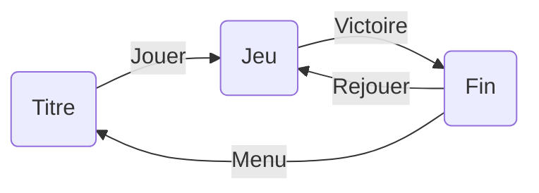

# Cours 9

## Caméra, HUD et rétroaction au joueur

Deux moitiés d'une même question : **comment le joueur perçoit ton jeu**. La caméra décide de ce qu'il voit - donc de ce qu'il sait, ressent et comprend. Le HUD et les rétroactions décident de ce que le jeu lui **dit** : ce qui a marché, ce qui a échoué, où il en est.

<!-- ## Déroulement de la séance

| Temps | Activité |
|---|---|
| 0h00 – 0h15 | Retour sur le Jalon 1 : constats de groupe |
| 0h15 – 0h55 | Théorie : la caméra comme choix de design |
| 0h55 – 1h30 | Théorie : interfaces, ancres, feedback à double canal |
| 1h30 – 1h45 | Pause |
| 1h45 – 2h30 | Pratique 1/2 : caméra et écrans Titre/Fin soignés |
| 2h30 – 3h20 | Pratique 2/2 : HUD et feedback de succès et d'échec |
| 3h20 – 3h35 | Rituel de commit + devoirs | -->

## Théorie - la caméra

### La caméra est un choix de design, pas un réglage

Change la caméra d'un jeu et tu changes le jeu. Le même labyrinthe vu du dessus est un puzzle (je vois le plan), vu à la première personne est un jeu d'horreur (je ne vois rien venir). Chaque genre a son alliance caméra-gameplay :

| Point de vue | Ce que le joueur sait | Genres types |
|---|---|---|
| **Vue de dessus** (top-down) | Le plan complet : stratégie | Zelda classique, jeux de gestion |
| **Vue de côté** (side-scroller) | La trajectoire : précision | Plateformers, *Hollow Knight* |
| **3ᵉ personne** | Son corps dans l'espace | Aventure, action |
| **1ʳᵉ personne** | Seulement ce qui est devant : immersion, tension | FPS, horreur |

{data-zoom-image}

[Hollow Knight (2017)](https://store.steampowered.com/app/367520/Hollow_Knight/) : caméra de côté, orthographique - parce que le jeu EST une affaire de trajectoires et de plateformes. La caméra sert la mécanique.

{data-zoom-image}

[God of War (2018)](https://store.steampowered.com/app/1593500/God_of_War/) : caméra 3ᵉ personne très rapprochée, à l'épaule - un choix radical pour un jeu d'action, fait pour l'intimité avec les personnages. La caméra sert l'émotion.

**Et ton jeu?** Ta caméra Starter Assets est en 3ᵉ personne par défaut - mais sa distance et sa hauteur changent tout : proche = tendu et intime, loin = vue d'ensemble et sécurité. C'est le réglage du jour.

### Orthographique vs perspective : les deux projections

| | **Perspective** | **Orthographique** |
|---|---|---|
| Profondeur | Loin = petit (comme l'œil) | Tout à la même échelle |
| Paramètre clé | **Field of View** (angle, en °) | **Size** (demi-hauteur du cadre) |
| Sensation | Espace, immersion | Lisibilité, précision, style graphique |
| Usages | La plupart des jeux 3D | 2D, pixel art, top-down, puzzle, stratégie |

Le devis du cours demande la configuration de la **caméra virtuelle 2D** - c'est la caméra orthographique. Dans Unity, c'est le même composant Camera : un menu **Projection** les sépare. Tu configureras les deux aujourd'hui, et tu garderas celle qui sert ton jeu.

!!! question "Discussion (3 min)"
    *Dixit* du cours 1, *Monument Valley*, *Age of Empires* : pourquoi tant de jeux de réflexion et de stratégie choisissent-ils l'orthographique? *(Indice : que perd-on avec la perspective quand on veut comparer des distances?)*

### Cinemachine : la caméra qui se règle au lieu de se programmer

Une bonne caméra de suivi est étonnamment difficile à programmer (lissage, obstacles, anticipation…). **Cinemachine** est la réponse de Unity : des « caméras virtuelles » qu'on **règle** dans l'Inspector.

Les trois concepts :

* **Virtual Camera (vcam)** : un point de vue configuré - la vraie caméra obéit à la vcam active
* **Follow / Look At** : la cible à suivre / à regarder (ton personnage)
* **Damping** : le lissage - 0 = caméra rigide collée au personnage; élevé = caméra « molle » qui traîne derrière. C'est LE paramètre de feel de caméra

## Théorie - l'interface

### Rappel : le flux de scènes

Tu l'as monté au cours 3, sur ton jeu express :

Rien de neuf techniquement - `SceneManager.LoadScene("NomDeLaScene")` et la **Build Profiles list** (seules les scènes inscrites peuvent être chargées; la position 0 démarre en premier). Ce qui change aujourd'hui, c'est l'**exigence** : ces écrans sont la première et la dernière impression de ton jeu. Titre, ambiance, promesse - le devis demande une interface virtuelle, et le jury la regarde avant même de jouer.

### Canvas, EventSystem, boutons

* **Canvas** : le panneau invisible où vivent TOUS les éléments d'interface. Réglage à faire systématiquement : **Canvas Scaler → Scale With Screen Size → 1920 × 1080** - sinon ton interface change de taille d'un écran à l'autre
* **EventSystem** : créé automatiquement avec le Canvas, c'est lui qui détecte les clics. **Ne le supprime jamais** - un menu qui ne répond pas, c'est presque toujours lui qui manque
* **Button** : un bouton a un événement **On Click ()** dans l'Inspector : on y branche une méthode `public` d'un script. Pas de code de détection de clic à écrire - on **branche**, littéralement
* **Événements sans code** : On Click () ne branche pas que des scripts! Glisse n'importe quel GameObject et choisis **GameObject → SetActive** : le bouton peut afficher/masquer un panneau **sans une ligne de code**. Beaucoup de comportements simples (panneau de crédits, aide, image qui apparaît) se font entièrement dans l'Inspector

### Les interfaces de jeu : un petit zoo

Toute information transmise au joueur passe par une interface - mais pas toujours celle qu'on croit :

| Type | C'est où? | Exemples |
|---|---|---|
| **HUD** (non-diégétique) | Par-dessus le jeu, hors du monde | Compteur de pièces, minicarte, barre de vie |
| **Diégétique** | DANS le monde du jeu | La jauge de vie sur le dos de l'armure (*Dead Space*), le compteur au tableau de bord d'un jeu de course |
| **Spatiale** | Dans l'espace, mais pas « du monde » | Le contour lumineux d'un objet interactif, une flèche au sol |

La tendance moderne : le moins de HUD possible, le plus de diégétique possible - le monde lui-même informe. Ton jeu fera les deux : un HUD minimal + de l'affordance dans le monde (ta clé qui flotte, cours 10).

!!! question "Discussion (3 min)"
    Pourquoi *Dead Space* a-t-il mis la barre de vie SUR le personnage plutôt qu'au coin de l'écran? Qu'est-ce que ça change pour l'immersion? Pour la lisibilité en plein combat?

### Les 3 règles du HUD

1. **Minimal** : n'affiche que ce dont le joueur a besoin *maintenant*. Chaque élément de plus dilue les autres. L'anti-modèle : l'écran de MMO tapissé de barres, cartes et boutons - illisible pour un nouveau venu
2. **Lisible en une seconde** : contraste fort, typo suffisante, positions conventionnelles (vie en haut à gauche, score en haut à droite - les conventions existent, profites-en)
3. **Cohérent** : mêmes couleurs, même typo, même langage que ton ambiance. Un HUD futuriste sur un jeu médiéval, ça grince

**Compteur, jauge ou icônes?** Un nombre précis qui monte → compteur (`Cles : 2/3`). Une ressource continue qui varie → jauge (vie, oxygène). Une petite quantité fixe → icônes (3 cœurs). Choisis selon ta donnée, pas selon l'esthétique.

### Les ancres : pour que ça tienne à tous les écrans

Chaque élément UI a une **ancre** (Anchor) : le point de l'écran auquel il est accroché. Un compteur ancré **en haut à gauche** reste en haut à gauche sur un 16:9, un ultrawide ou un projecteur. Sans ancre correcte, ton HUD centré sur TON écran déborde sur celui du jury.

Mode d'emploi : sélectionne l'élément → **Rect Transform** → clique le carré d'ancres → choisis le coin. Combiné au Canvas Scaler (1920 × 1080), ton interface devient indestructible.

### Le feedback : la moitié de l'agentivité

Souviens-toi du cours 7 : l'agentivité, c'est sentir que ses actions **comptent**. Le feedback en est le mécanisme concret - et il doit être **immédiat** (sous ~100 ms, sinon le cerveau ne relie plus l'action à la réponse).

La règle d'or du devis : le **double canal**, pour les réussites ET les échecs :

| Événement | Canal visuel | Canal sonore |
|---|---|---|
| ✅ Clé ramassée | La clé disparaît + le compteur s'incrémente | Son de collecte clair |
| ❌ Porte sans clé | Message « Il te faut une clé! » | Son sourd, négatif |

{data-zoom-image}

[Undertale (2015)](https://store.steampowered.com/app/391540/Undertale/) : interface minimale, mais chaque action reçoit une réponse nette - texte qui tremble, sons distinctifs, cœur qui clignote. Un budget minuscule, un feedback impeccable : c'est une question de design, pas de moyens.

**L'échec est le canal le plus oublié - et le plus important.** Quand une action ne marche pas, le joueur doit savoir : (1) que ça n'a PAS marché, (2) idéalement pourquoi, (3) implicitement quoi faire. « Il te faut une clé! » fait les trois en quatre mots. Le silence, lui, fait croire à un bug.

!!! example "Mini-activité (5 min)"
    Pense au dernier jeu où tu as été frustré. La frustration venait-elle de la difficulté… ou de ne pas **comprendre** pourquoi ça ne marchait pas? La distinction est exactement notre sujet : un bon jeu peut être dur, il ne doit jamais être muet.

## Pratique

Régler la caméra (et goûter à l'orthographique), soigner les écrans Titre et Fin, puis construire le HUD et le feedback de réussite et d'échec.

[Exercice - Caméra, HUD et feedback :material-arrow-right:](./exercices/cours09-camera-hud-et-feedback.md){ .md-button .md-button--primary }

## Devoir

* Habille tes écrans Titre et Fin selon ton moodboard (couleurs, typo, image de fond)
* Complète le HUD pour tout ce que ton jeu doit communiquer - et **rien de plus** (règle 1!)
* Passe chaque interaction de ton jeu au test du double canal : réussite = visuel + son? échec = visuel + son? Complète les trous

## Ressources

* [Game UI Database](https://www.gameuidatabase.com/) - des milliers de captures d'interfaces de jeux, classées. Mine d'or d'inspiration
* [Documentation Cinemachine](https://docs.unity3d.com/Packages/com.unity.cinemachine@3.1/manual/index.html)
* [Documentation Unity : Canvas Scaler](https://docs.unity3d.com/Packages/com.unity.ugui@2.0/manual/script-CanvasScaler.html)
* [Documentation Unity : TextMeshPro](https://docs.unity3d.com/Packages/com.unity.textmeshpro@4.0/manual/index.html)

## Savoirs essentiels touchés

Configuration de la caméra virtuelle 2D, fonctionnement d'une interface virtuelle (menu), transitions de scènes, intégration d'une interface graphique HUD, indication visuelle et sonore des réussites et échecs d'interaction.
