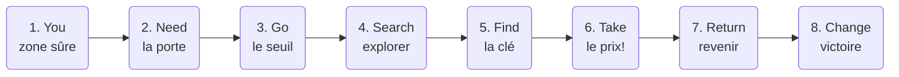

# Cours 12

## Production - capsule Level design

La production est lancée : l'essentiel de la séance se passe sur ton jeu, piloté par tes issues. La capsule du jour t'outille pour rendre ton **niveau** meilleur - elle n'est pas un prérequis pour livrer, mais c'est peut-être elle qui fera dire « oh, c'est bien fait » aux joueurs.

<!-- ## Déroulement de la séance

| Temps | Activité |
|---|---|
| 0h00 – 0h45 | Capsule : level design |
| 0h45 – 1h00 | Application express : diagnostic de ton niveau |
| 1h00 – 1h15 | Pause |
| 1h15 – 3h20 | Production (issues) |
| 3h20 – 3h35 | Rituel de commit | -->


## Capsule - Level design

### Le level design : l'espace qui raconte la boucle

Le level design est un métier à part entière : concevoir l'**espace** pour qu'il serve le gameplay. Un bon niveau n'est pas un beau décor - c'est un décor qui **enseigne, guide, dose et récompense** sans un mot de tutoriel. Ton niveau unique doit faire les quatre.

### Le rythme : tension et repos

Un bon niveau respire : moment d'action → respiration → action plus intense → grande respiration. Tout en tension épuise; tout en repos ennuie (le couloir du flow, cours 7 - appliqué à l'espace).

Trace la courbe de TON niveau : où sont les pics? S'il n'y a pas de vallées, ajoute un moment contemplatif (un point de vue, une salle sûre). S'il n'y a pas de pic final, ton arrivée à l'objectif est plate.

### Donner une forme au parcours : le cercle de Dan Harmon

!!! warning "C'est un outil de **niveau**, pas de scénario"
    Le cercle décrit le **parcours du joueur dans l'espace**. Ce n'est pas une histoire à écrire, pas des dialogues à ajouter, pas des cinématiques. Rappel du piège 4 (cours 5) : l'histoire habille la boucle, elle ne la remplace pas. Ici, chaque temps du cercle est un **endroit** et une **action**.

[Dan Harmon](https://en.wikipedia.org/wiki/Dan_Harmon) (*Community*, *Rick and Morty*) a simplifié le voyage du héros de Campbell en **huit temps**, pour écrire des épisodes de 22 minutes. La version courte tient en une ligne : *un personnage part chercher quelque chose, le paie cher, et revient changé.*

Ça se transpose presque mot pour mot sur ta boucle clé/porte :



| Temps | Dans ton niveau |
|---|---|
| 1. **You** | Le spawn. Zone calme, sûre : le joueur comprend où il est et comment il bouge |
| 2. **Need** | La **porte verrouillée**, visible tôt. C'est le désir qui met tout en marche |
| 3. **Go** | Franchir le seuil : quitter la zone sûre pour l'inconnu |
| 4. **Search** | L'exploration, les détours, les impasses, les premiers échecs |
| 5. **Find** | La **clé**. Le joueur obtient ce qu'il cherchait |
| 6. **Take** | **Le prix à payer.** Il n'y a pas de retour gratuit |
| 7. **Return** | Le chemin du retour vers la porte - le même espace, une autre tension |
| 8. **Change** | La porte s'ouvre. État final, victoire, et le joueur n'est plus le même |

#### Le temps qui manque toujours : *Take*

Presque tous les jeux de la classe font ceci : trouver la clé → ouvrir la porte → gagner. Trois temps sur huit, et **rien ne coûte rien**. C'est la raison n° 1 pour laquelle un niveau techniquement complet reste plat.

*Take*, c'est le moment où obtenir la clé **change le monde** :

* Ramasser la clé déclenche une **alarme** (son + lumière rouge : cours 8 et 12)
* La salle se **referme** derrière toi - le chemin du retour n'est plus celui de l'aller
* La clé est **lourde** : tu cours moins vite tant que tu la portes
* Un ennemi, un piège ou une poursuite **s'active** au ramassage
* Le décor bascule : la musique change, les lumières s'éteignent

Une phrase de conception, souvent moins d'une heure d'implémentation - et ton niveau a une forme au lieu d'une ligne droite.

#### Le bonus de production : *Return*

Le temps 7 te fait **réutiliser un espace que tu as déjà construit**, au lieu d'en fabriquer un neuf. Le joueur repasse par où il est venu, mais l'endroit a changé de sens : ce qui était un couloir tranquille à l'aller devient une course à l'arrivée.

Dans un cours où ton pire ennemi est le scope, c'est un argument de **production** autant que de design : plus de tension, zéro mètre carré de plus à modéliser.

### Les lumières : l'outil de guidage n° 1

Avant de guider par la lumière, il faut connaître ses sources. Unity (URP) en offre trois principales :

| Source | Métaphore | Usage type |
|---|---|---|
| **Directional Light** | Le soleil : partout, parallèle, une seule direction | L'éclairage global de ta scène (il y en a déjà une!) |
| **Point Light** | Une ampoule : rayonne dans toutes les directions | Lampadaire, torche, lueur d'un objet important |
| **Spot Light** | Un projecteur : un cône orienté | Mettre l'objectif « sous le projecteur », littéralement |

Les réglages qui comptent : **Color** (chaude = accueillant, froide = danger - raconte avec la température!), **Intensity**, **Range** (portée des Point/Spot) et **Shadow Type** (des ombres = du réalisme, mais un coût - *No Shadows* sur les petites lumières décoratives).

!!! tip "La lumière émissive"
    Un material avec **Emission** activée « brille » par lui-même (un cristal, un écran, des champignons luminescents). Combiné au bloom du cours 13, c'est l'effet le plus spectaculaire du cours pour 30 secondes de travail.

!!! tip "Baking"

### Guider sans flèches

Le joueur doit savoir **où aller** sans qu'on le lui dise. Les outils, par ordre de subtilité :

* **La lumière** : l'œil va vers la clarté. Éclaire ta destination, laisse les impasses dans la pénombre
* **La couleur** : une tache contrastée dans un décor uniforme est un aimant (la peinture jaune du cours 7!)
* **Les lignes** : chemins, clôtures, façades et rangées d'arbres pointent naturellement quelque part - fais-les pointer au bon endroit
* **Les landmarks** : un repère visible de partout (tour, arbre géant, statue). Le joueur ne se perd jamais s'il peut toujours se dire « la tour est par là »

Ce langage visuel repose sur deux concepts : l'**affordance** — la forme d'un objet suggère son usage (un baril rouge « demande » d'exploser, une corniche peinte « demande » d'être escaladée) — et le ***signposting*** — l'ensemble des indices (peinture, lumière, son) qui dirigent l'attention vers le chemin critique, sans texte ni flèche.

<div class="grid grid-1-2" markdown>
{data-zoom-image}

Dans [Elden Ring (2022)](https://store.steampowered.com/app/1245620/ELDEN_RING/), l'Erdtree - l'arbre doré - est visible depuis presque partout : landmark absolu. Sans aucune flèche, tu sais toujours grossièrement où est « l'objectif ». Les parcs Disney font pareil avec le château (les *weenies* de Walt).
</div>

### La lisibilité : si tout brille, rien ne brille

L'affordance appliquée à l'espace : ce qui est **interactif** doit se distinguer de ce qui est **décoratif**. Ta clé flotte et tourne (cours 10) - assure-toi que le décor autour reste calme. Le contrat implicite avec le joueur : « ce qui bouge/brille me concerne; le reste est du paysage ». Romps ce contrat et il touchera à tout (ou à rien).

### Placer l'objectif : visible tôt, atteignable tard

Le vieux truc des grands niveaux : montre la destination dès le début (la porte verrouillée bien en vue), fais-la mériter (la clé demande un détour). Le joueur comprend l'objectif en 5 secondes ET a une raison d'explorer - c'est ta boucle de jeu **racontée par l'espace**.

Corollaire : **récompense les détours**. Un recoin exploré doit contenir quelque chose (un son, un visuel sympa, un raccourci…). La curiosité punie (cul-de-sac vide) éteint l'envie d'explorer - pour tout le reste du jeu.

### La forme de ton niveau

Un niveau a une **topologie** : la façon dont ses espaces se connectent. Trois formes couvrent presque tout ce qui se fait[^ashwell] - et tu es probablement en train d'en construire une sans le savoir.

[^ashwell]: Adapté des *Standard Patterns in Choice-Based Games* de Sam Kabo Ashwell (2015), recensés par David E. Millard dans *Strange Patterns* (2022). Ces patrons décrivent à l'origine des structures de **choix narratifs**; on les emprunte ici comme formes d'**espace**.

=== "Le couloir"

    ```mermaid
    graph LR
        A(Départ) --> B(Salle) --> C(Salle) --> D(Objectif)
        B --> B2(Impasse)
        C --> C2(Impasse)
    ```

    Un chemin principal, quelques impasses courtes. **C'est ce que 80 % des niveaux deviennent par défaut**, parce que c'est ce qui sort naturellement d'un greybox.

    Ça marche, mais le joueur ne fait jamais de choix : il avance ou il recule.

=== "La place centrale ⭐️"

    ```mermaid
    graph LR
        B(Aile ouest) <--> A(Place centrale)
        C(Aile nord<br>la clé!) <--> A
        D(Aile est) <--> A
        A --> E(Objectif)
    ```

    Une place au milieu, des branches qu'on explore et d'où on **revient**. La porte est visible depuis le centre; la clé est au bout d'une seule branche.

    **Le meilleur choix pour un niveau unique** : le joueur choisit son ordre, ne se perd jamais (il rentre toujours au centre), et l'espace paraît trois fois plus grand qu'un couloir de même superficie.

=== "La boucle"

    ```mermaid
    graph LR
        A(Départ) --> B(Zone) --> C(Zone) --> D(Zone) --> A
    ```

    Le même parcours, refait plusieurs fois - et chaque passage révèle ou débloque quelque chose de neuf (un raccourci qui s'ouvre, une porte qu'on comprend enfin).

    De la rejouabilité pour zéro mètre carré supplémentaire. C'est la structure d'*Outer Wilds* et de *Hades*. Ambitieux, mais redoutable.

!!! tip "Le passage du couloir à la place centrale"
    C'est la modification la plus rentable de la séance. Prends ton couloir, choisis la salle du milieu, élargis-la, rends la porte visible depuis là, et rebranche tes impasses dessus comme des branches. Une après-midi de greybox - et ton niveau change de catégorie.

## Production

Application express : diagnostiquer le guidage et la forme de ton niveau, puis production sur tes issues.

[Exercice - Diagnostic de level design et production :material-arrow-right:](./exercices/cours12-level-design.md){ .md-button .md-button--primary }

## Devoir

* Poursuivre ses issues (Must d'abord, toujours)

## Ressources

* [Modèles narratifs](./extra/narration.md) - Harmon, Kishōtenketsu, et comment raconter sans texte
* [The Level Design Book (référence libre, en anglais)](https://book.leveldesignbook.com/)
* [GMTK - la chaîne de référence sur le design de jeu](https://www.youtube.com/@GMTK)
