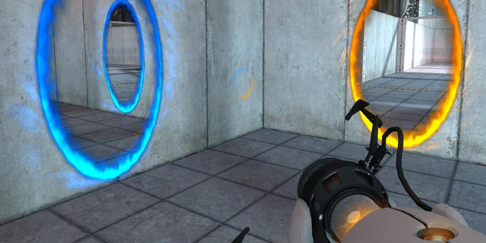
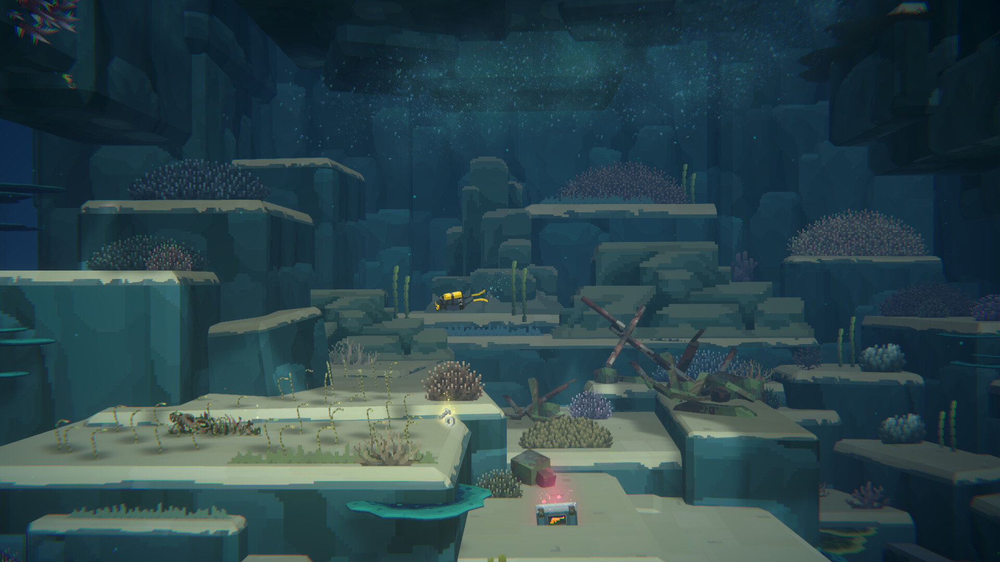

---
tags:
  - Cours 1
  - Mardi 27 août
---

# Bienvenue

## Plan de cours

[Plan de cours :material-download:](./assets/documents/582301MO-InteractiviteLudique-A2024.pdf){ .md-button .md-button--primary }

## Le ludisme

### Définition

> **Ludisme** n.m.[^ludisme] 
> Comportement caractérisé par la recherche systématique du jeu sous toutes ses formes. 
> latin *ludus*, jeu, [*ludologie*](https://vitrinelinguistique.oqlf.gouv.qc.ca/fiche-gdt/fiche/26502181/ludologie)

[^ludisme]: [Définition du mot ludisme selon Larousse](https://www.larousse.fr/dictionnaires/francais/ludisme/48009)

Le ludisme se caractérise par l’**engagement** et l'ensemble des **comportements** d'une personne vis-à-vis un **jeu**. La notion d’**amusement** et d'**expérimentation** est essentielle au développement de l’aspect ludique de l'expérience.

Ci-bas, quelques aspects permettant de construire une expérience ludique.

### :speaking_head: Narration

La façon dont l’histoire est racontée et mise en œuvre. Cela inclut les dialogues, le script des événements, les décisions des joueurs, etc.
La narration peut être linéaire ou interactive de sorte que le joueur puisse influencer l’histoire par ses choix.

{data-zoom-image}

Dans le jeu [Call of Juarez (2007)](https://store.steampowered.com/app/3020/Call_of_Juarez/), la narration sonore est continuellement guidée par les actions des joueurs.

### :fontawesome-solid-gears: **Mécanique**

Règle ou un système qui détermine comment les joueurs interagissent avec le jeu.

{data-zoom-image}

Dans le jeu [Portal (2007)](https://store.steampowered.com/app/400/Portal/), les joueurs doivent résoudre des énigmes en manipulant des trous de ver.

### :paintbrush: **Design graphique**

Éléments visuels du jeu, comme les environnements, les personnages, les interfaces et les effets visuels.
C'est ce qui détermine l’identité visuelle et l’ambiance du jeu.

{data-zoom-image}

Dans le jeu [Thank Goodness You’re Here! (2024)](https://store.steampowered.com/app/2366980/Thank_Goodness_Youre_Here/), les dessins, à eux seuls, transportent les utilisateurs dans un univers grotesque.

### :musical_note: **Design sonore**

Effets sonores et musique.
L'audio va aussi déterminer l’identité du jeu, supporter l’immersion, orienter le joueur et lorsque c'est bien fait, communiquer ou provoquer des émotions!

{data-zoom-image}

Dans le jeu [A Blind Legend (2016)](https://store.steampowered.com/app/437530/A_Blind_Legend/), les joueurs doivent se fier exclusivement au son pour naviguer et interagir avec le monde.

### :octicons-search-16: **Exploration**

Le résultat de la curiosité.
La découverte d'environnements, d'objets ou d'informations doit idéalement être récompensée.

{data-zoom-image}

Dans le jeu [Dave the diver (2023)](https://store.steampowered.com/app/1868140/DAVE_THE_DIVER/), l'exploration est récompensée par la découverte de nouvelles espèces de poissons, de trésors cachés et de ressources rares.

### :trophy: **Accomplissements**

Récompenses générales (achievements) ou liées à une mécanique du jeu (upgrades, items).
Ça récompense certaines actions des joueurs et ça ajoute une notion de défi à l'expérience.

{data-zoom-image}

Dans le jeu [(the) Gnorp Apologue (2023)](https://store.steampowered.com/app/1473350/the_Gnorp_Apologue/), les accomplissements sont récompensés par des compétences permanentes, ce qui engage la rejouabilité.

### :material-arrow-decision: **Agentivité**

Capacité du joueur à influencer le jeu et son déroulement.
Offre aux joueurs une impression de liberté et de contrôle.

{data-zoom-image}

Dans le jeu [Baldurs gate 3 (2023)](https://store.steampowered.com/app/1086940/Baldurs_Gate_3/), les joueurs font des choix qui influencent l'histoire, les relations entre les personnages, ainsi que l'issue des quêtes et des combats.

### :people_wrestling: **Compétition** / :handshake: **Coopération**

À la recherche d'avantage créant des dynamiques sociales et stratégiques.

{data-zoom-image}

Dans le jeu [Keep Talking and Nobody Explodes (2015)](https://store.steampowered.com/app/341800/Keep_Talking_and_Nobody_Explodes/), un des joueurs doit désamorcer une bombe en suivant les instructions des autres joueurs qui ne voient pas ladite bombe.

## Jeu vidéo

### Quelques ressources

#### Distributeurs

* [Steam](https://steampowered.com/)
* [Itch.io](https://itch.io/)
* [Epic Games](https://www.epicgames.com/)
* [GOG](https://www.gog.com/)

#### Statistiques

* [SteamDB](https://steamdb.info/)
* [Games Stats](https://games-stats.com/)
* [HowLongToBeat](https://howlongtobeat.com/)
* [IsThereAnyDeal](https://isthereanydeal.com/)

#### Assets

Ressources utilisées pour créer le contenu visuel et sonore d'un jeu.

Voici une petite liste de sources offrant des assets 2D gratuits.

* [Itch.io](https://itch.io/game-assets/free/tag-2d)
* [Craftpix](https://craftpix.net/freebies/)
* [Unity - assetstore](https://assetstore.unity.com/?category=2d&free=true)
* [Opengameart](https://opengameart.org/)
* [Kenney](https://kenney.nl/assets/category:2D)
* [Gamedevmarket](https://www.gamedevmarket.net/)
* [Gameart2d](https://www.gameart2d.com/freebies.html)
* [Reddit](https://www.reddit.com/r/gameassets/)

#### Inspirations

* [Reddit: r/gamedevscreens](https://www.reddit.com/r/gamedevscreens/)
* [Reddit : r/destroymygame](https://www.reddit.com/r/DestroyMyGame/)
* [Reddit : r/indiedev](https://www.reddit.com/r/IndieDev/)
* [Reddit : r/gamedesign](https://www.reddit.com/r/gamedesign/)
* [Itch.io : 2d](https://itch.io/games/tag-2d)

### Vocabulaire

> :material-comment-quote:  
> Le boss du dlc est juste op. J'ai lu sur le devlog qu'ils vont nerfer son dps dans la prochaine patch.

Il est très utile de comprendre le [lexique](https://gamingcampus.fr/boite-a-outils/lexique-du-jeu-video-100-mots-du-jeu-video.html#:~:text=HUD%20%3A,traduit%20par%20Affichage%20T%C3%AAte%20Haute.) qui entoure le monde des jeux vidéo.

En prendre connaissance facilite non seulement la compréhension de la culture, mais aide aussi à articuler clairement les concepts envisagés[^jeuxvideolexique] dans la création et le développement de votre jeu vidéo.

[^jeuxvideolexique]: [Lexique des jeux vidéo](https://en.wikipedia.org/wiki/List_of_video_game_genres)

### Types de jeu

Voici une liste non exhaustive des différents types de jeux vidéo[^videogamestypes].

[^videogamestypes]: [Types de jeux vidéo](https://en.wikipedia.org/wiki/List_of_video_game_genres) (en anglais)

#### Action

* Plateforme (Super Mario World)
* FPS (Counter Strike)
* TPS (Resident Evil)
* Combat (Street Fighter)
* Beat'em Up (Castle Crashers)
* Infiltration (Thief)
* Survie (The Forest)
* Rythme (Beat Saber)
* Battle Royale (Fortnite)
* Metroidvania (Blasphemous)

*[FPS]: Jeu de tir à la première personne (First-person shooter)
*[TPS]: Jeu de tir à la troisième personne (Third-person shooter)

#### Aventure

* Monde ouvert (Grand Theft Auto V)
* Nouvelles graphiques (Aviary Attorney)
* Point & Click (Monkey Island)
* Films interactifs (Life Is Strange)

#### Casse-tête

* Physique (Kerbal Space Program)
* Programmation (Shenzhen I/O)
* Exploration (The Witness)
* Objets cachés (Hidden Folks)
* Évasion (Escape Simulator)
* Traditionnel (Tetris)

#### Jeu de rôle (RPG)

* Action (Diablo 4)
* CRPG (Baldur’s Gate 3)
* Roguelike (Hades)
* Tactique (Wartales 🔥)

*[RPG]: Jeu de rôle (Role-Playing Game)
*[CRPG]: Jeu de rôle sur ordinateur (Computer Role-Playing Game)

#### Simulation

* Vie (The Sims)
* Gestion et construction (Stardew Valley)
* Conduite (American Truck Simulator)
* Carré de sable (Minecraft)

#### Stratégie

* 4X (Civilization VI)
* Auto battler (Totally Accurate Battle Simulator)
* MOBA (League of Legends)
* RTS (StarCraft)
* RTT (Total War)
* Tower defense (Plants vs. Zombies)
* TBS (XCOM)
* Grand strategy wargames (Stellaris)

*[4X]: Exploration, expansion, exploitation et extermination (eXplore, eXpand, eXploit, eXterminate)
*[MOBA]: Arène de bataille en ligne multijoueur (multiplayer online battle arena)
*[RTS]: Jeu de stratégie en temps réel (Real-time strategy)
*[RTT]: Jeu de tactique en temps réel (Real-time tactics)
*[TBS]: Jeu de stratégie au tour par tour (Turn-based strategy)

#### Sports

* Course (Mario Kart)
* Équipe (FIFA)
* Combat (UFC)
* Sport individuel (Tony Hawk's Pro Skater)

#### Autres genres

* Jeu de société (Jackbox Party Pack)
* Jeu de cartes (Baltro)
* Incrémentiel ((the) Gnorp Apologue)
* Dactylographie (Epistory)

### Plateformes

#### Console

* PlayStation
* Xbox
* Nintendo

#### PC

* Windows
* Mac
* Linux
* Steam Deck

#### Mobile

* iOS (Apple)
* Android (Google)

#### Réalité virtuelle (VR)

* Meta Quest
* PlayStation VR
* HTC Vive
* Valve Index

#### Réalité augmentée (AR)

* Microsoft HoloLens
* Apple Vision Pro

#### Jeux infonuagiques

* Xbox Cloud Gaming
* NVIDIA GeForce Now
* Amazon Luna
* ~~Stadia~~ :fontawesome-solid-skull-crossbones:

#### Navigateur Web :fontawesome-regular-hand-point-left:{ .horizontal-anim .valign-bottom }

* HTML5
* WebGL / WebAssembly

### Contrôles de jeux vidéo

* Manette de jeu
* Écran tactile
* Joystick
* Clavier et souris :fontawesome-regular-hand-point-left:{ .horizontal-anim .valign-bottom }

[Aperçu non exhaustif des contrôles en jeux vidéo](https://en.wikipedia.org/wiki/List_of_game_controllers)

<!-- 0.85 -->

## Prérequis

Ce sont les critères que les joueurs doivent satisfaire avant d'accéder à certains contenus, d'effectuer une action spécifique, ou simplement de progresser dans le jeu.

### Types de prérequis

1. **Niveau du personnage requis** : Le joueur doit atteindre le niveau 10 avant de pouvoir accéder à un donjon.
1. **Possession d'un objet spécifique** : Une clé est nécessaire pour ouvrir une porte.
1. **Compétence ou capacité acquise** : Le joueur doit apprendre la compétence "Nage" pour traverser une rivière.
1. **Quête ou mission complétée** : Terminer une mission spécifique permet d'intégrer une guilde.
1. **Quantité de ressources accumulées** : Le joueur doit accumuler 1000 pièces d'or pour acheter une épée.
1. **Temps de jeu ou événement temporel atteint** : Après 10 heures de jeu, un nouveau personnage rejoint votre équipe.
1. **Niveau de compétence du joueur** : Réussir le tutoriel avancé débloque un nouveau combo.
1. **Alignement ou réputation** : Atteindre le statut "Allié" avec une faction permet d'accéder à leurs quêtes.
1. **Choix narratifs précédents** : Choisir de sauver un personnage plus tôt dans l'histoire ouvre une nouvelle branche narrative.
1. **Équipement spécifique** : Porter l'armure complète de chevalier permet d'entrer dans le château.
1. **Conditions environnementales** : Le joueur doit attendre la nuit pour que certains monstres apparaissent.
1. **Accomplissements ou trophées** : Débloquer 50% des trophées permet d'accéder au mode «difficile».

### À quoi ça sert ?

* Structure la progression du joueur
* Crée une courbe d'apprentissage
* Récompense l'exploration et la curiosité
* Ajoute de la profondeur à l'expérience
* Encourage la rejouabilité

### Quel prérequis s'applique à l'exemple ci-dessous ?

<iframe class="aspect-4-1" height="300" style="width: 100%;" scrolling="no" title="Prérequis" src="https://codepen.io/tim-momo/embed/xxoXazb?default-tab=result&editable=true&theme-id=50173" frameborder="no" loading="lazy" allowtransparency="true" allowfullscreen="true">
  See the Pen <a href="https://codepen.io/tim-momo/pen/xxoXazb">
  Prérequis</a> by TIM Montmorency (<a href="https://codepen.io/tim-momo">@tim-momo</a>)
  on <a href="https://codepen.io">CodePen</a>.
</iframe>

## Cadriciels (Framework)

Un cadriciel est une bibliothèque d'outils et de fonctionnalités fdestinés à aider les développeurs.

Au lieu de tout construire à partir de zéro, les cadriciels offrent une structure déjà prête, ce qui permet de gagner du temps et de rester organisé.

Par exemple, un cadriciel de jeux vidéo évite de devoir programmer un système de physique, de gestionnaire audio ou d'animation.

| Cadriciel | 2D | 3D | Langages de programmation | Produits |
|-----------|----|----|---------------------------|----------|
| Unreal Engine[^unreal_showcase] | :material-check-circle:{ .text-success } | :material-check-circle:{ .text-success } | C++ | Fortnite, Borderlands 3 |
| Unity[^unity_showcase] | :material-check-circle:{ .text-success } | :material-check-circle:{ .text-success } | C# | Among Us, RimWorld, Hollow Knight |
| Godot[^godot_showcase] | :material-check-circle:{ .text-success } | :material-check-circle:{ .text-success } | GDScript, C#, C++ | Dome Keeper, The Case of the Golden Idol |
| Phaser[^phaser_showcase] :fontawesome-regular-hand-point-left:{ .horizontal-anim .valign-bottom } | :material-check-circle:{ .text-success } | | JavaScript | Slay the Spire, Vampire Survivors[^vampire_survivor_x] |
| GameMaker Studio[^gms_showcase] | :material-check-circle:{ .text-success } | | GML (GameMaker Language) | Hyper Light Drifter, Undertale, Forager |

[^unreal_showcase]: [Liste de jeux réalisés avec Unreal Engine selon SteamDB](https://steamdb.info/instantsearch/?refinementList%5Btechnologies%5D%5B0%5D=Engine.Unreal) (en anglais)
[^unity_showcase]: [Liste de jeux réalisés avec Unity](https://unity.com/fr/made-with-unity) | [SteamDB](https://steamdb.info/instantsearch/?refinementList%5Btechnologies%5D%5B0%5D=Engine.Unity) (en anglais)
[^godot_showcase]: [Liste de jeux réalisés avec Godot](https://godotengine.org/showcase/) | [SteamDB](https://steamdb.info/instantsearch/?refinementList%5Btechnologies%5D%5B0%5D=Engine.Godot) (en anglais)
[^phaser_showcase]: [Liste de jeux réalisés avec Phaser](https://phaser.io/news/category/game) | [SteamDB](https://steamdb.info/instantsearch/?refinementList%5Btechnologies%5D%5B0%5D=Engine.Phaser) (en anglais)
[^gms_showcase]: [Liste de jeux réalisés avec GameMaker Studio](https://gamemaker.io/fr/showcase) | [SteamDB](https://steamdb.info/instantsearch/?refinementList%5Btechnologies%5D%5B0%5D=Engine.GameMaker) (en anglais)

[^vampire_survivor_x]: [Gazouillis sur Vampire Survivors](https://x.com/phaser_/status/1488191403125522436?lang=fr)

## Document de conception de jeu (GDD)

*[GDD]: Document de conception de jeu (Game Design Document)

Document qui décrit tous les aspects fondamentaux d’un jeu vidéo.

Il fait partie de la phase de conceptualisation et sera utile tout au long du développement.

On y décrit entre autres le **concept du jeu**, les **mécaniques**, l’**histoire**, les **personnages**, le **design graphique**, le **design sonore**, les **niveaux**, l’**interface utilisateur** et la **technologie utilisée**.

Voici un [exemple complet](./assets/documents/gdd-perihelie.pdf) d'un document de conception.

!!! question "Est-ce un document définitif ?"

    Probablement pas :person_shrugging: Pendant le processus de création, certains concepts sont parfois mis de côté, d'autres s'ajoutent et c'est tout à fait normal. Toutefois, ça reste un document de référence. Il ne devrait pas changer continuellement.

## Devoir

  

  <small>Devoir - Document de conception</small> 
  **[Création d'un document de conception de jeu vidéo](devoirs/gdd.md){.stretched-link}**

---

Si on a l'temps :octicons-arrow-right-16: [Introduction Phaser](./phaser/phaser-intro.md)
