# Cours 1

[STOP]

*[LTS] : Long-Term Support

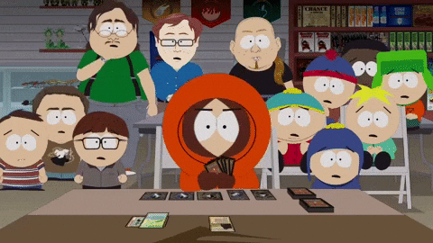{.w-100}

## Le ludisme

> **Ludisme** n.m.[^ludisme] 
> Comportement caractérisé par la recherche systématique du jeu sous toutes ses formes. 
> latin *ludus*, jeu, [*ludologie*](https://vitrinelinguistique.oqlf.gouv.qc.ca/fiche-gdt/fiche/26502181/ludologie)

[^ludisme]: [Définition du mot ludisme selon Larousse](https://www.larousse.fr/dictionnaires/francais/ludisme/48009)

Le ludisme se caractérise par l’**engagement** et l'ensemble des **comportements** d'une personne envers un **jeu**. 

La notion d’**amusement** et d'**expérimentation** est essentielle au développement de l’aspect ludique de l'expérience.

### :speaking_head: Narration

La façon dont l’histoire est racontée, mise en oeuvre ou vécue. Cela inclut les **dialogues**, l'**ambiance**, les **décisions** des joueurs et le **scénario**, qu'il soit linéaire ou interactif.

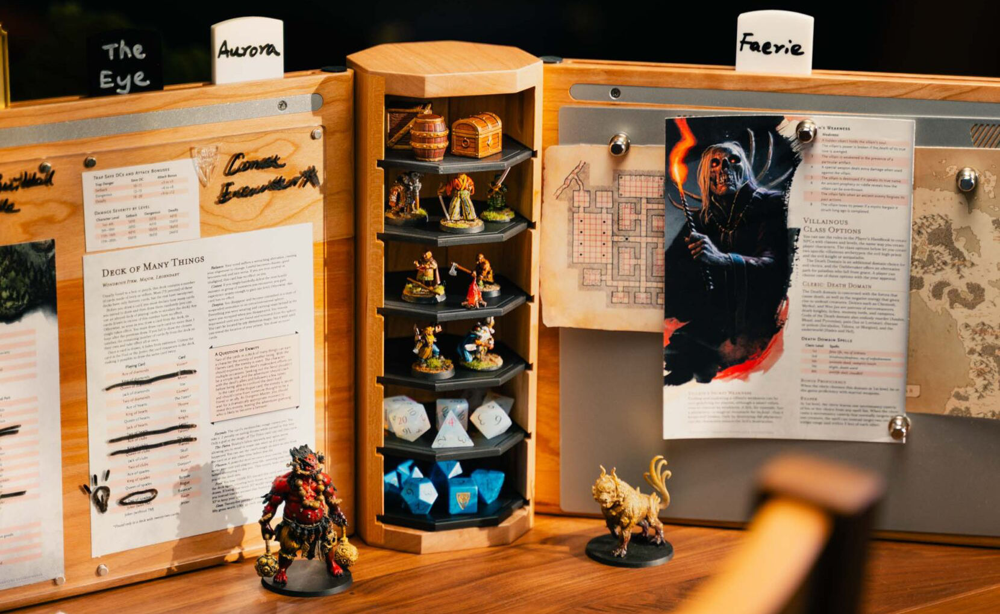{data-zoom-image}

Dans le jeu de rôle sur table [Donjons & Dragons](https://fr.wikipedia.org/wiki/Donjons_et_Dragons), la narration est entièrement interactive et partagée.

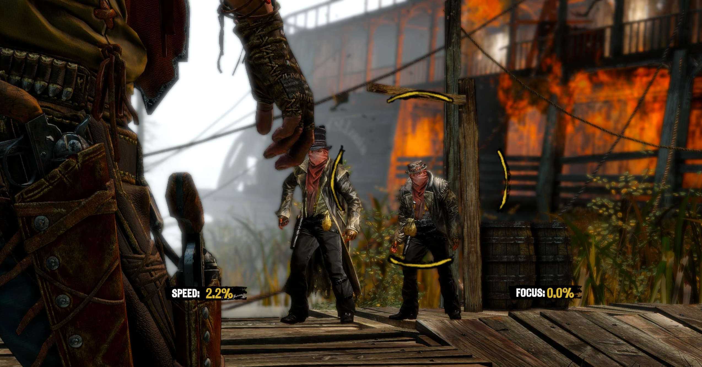{data-zoom-image}

Dans le jeu [Call of Juarez (2007)](https://store.steampowered.com/app/3020/Call_of_Juarez/), la narration sonore est continuellement guidée par les actions des joueurs.

### :fontawesome-solid-gears: **Mécanique**

Une règle ou un système qui détermine comment les joueurs interagissent avec le jeu.

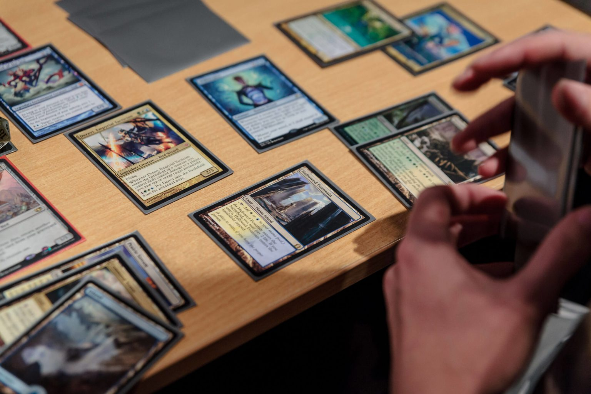{data-zoom-image}

Dans [Magic: The Gathering](https://magic.wizards.com/), la mécanique du *"Tap"* (pivoter une carte à 90°) force le joueur à faire des choix stratégiques en indiquant visuellement qu'une ressource ou une créature a été utilisée pour le tour.

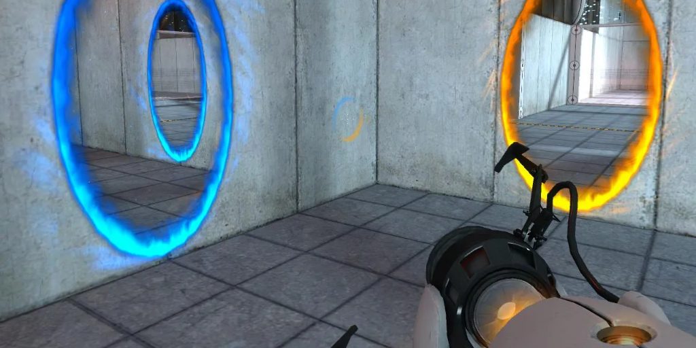{data-zoom-image}

Dans le jeu [Portal (2007)](https://store.steampowered.com/app/400/Portal/), les joueurs doivent résoudre des énigmes en manipulant des trous de ver.

### :paintbrush: **Visuel**

Éléments visuels, comme l'environnement, le matériel, les interfaces, les illustrations et les effets. C'est ce qui détermine l’identité visuelle et l’ambiance.

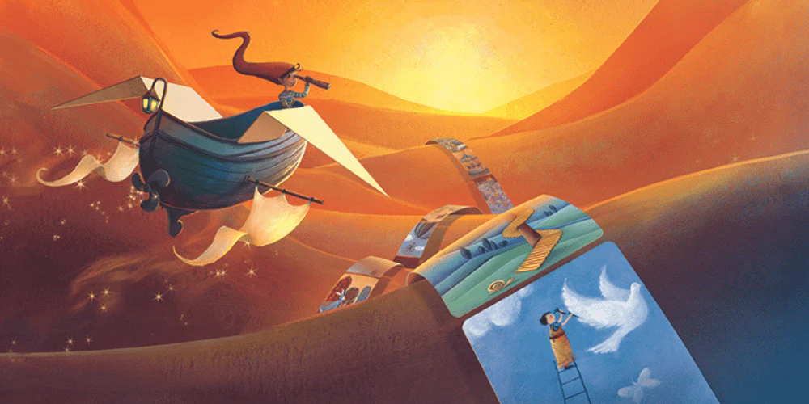{data-zoom-image}

Dans le jeu de société [Dixit](https://boardgamegeek.com/boardgame/39856/dixit), le graphisme surréalistes des cartes forcent les joueurs à imaginer des associations d'idées poétiques ou abstraites.

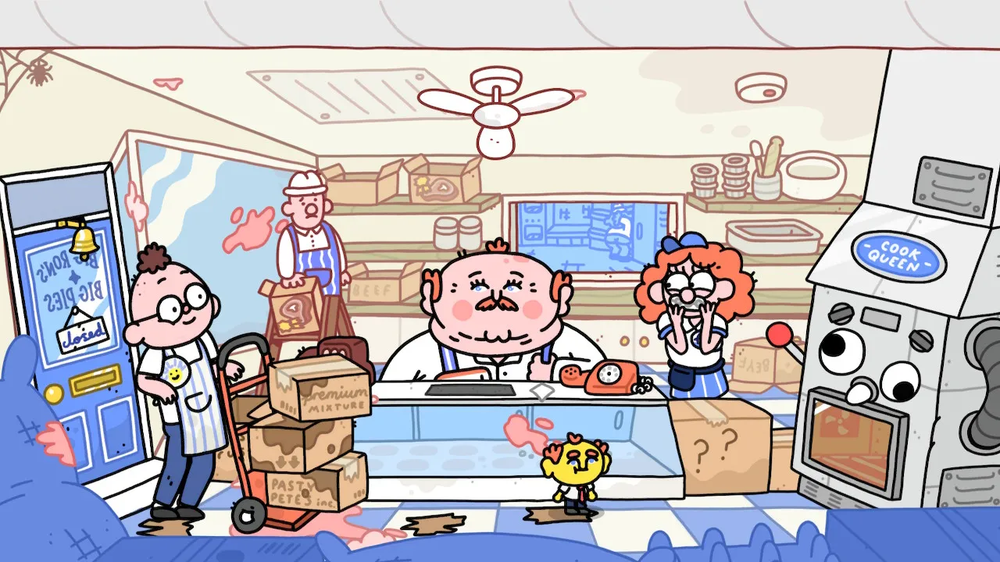{data-zoom-image}

Dans le jeu [Thank Goodness You’re Here! (2024)](https://store.steampowered.com/app/2366980/Thank_Goodness_Youre_Here/), les dessins, à eux seuls, transportent les utilisateurs dans un univers grotesque.

### :musical_note: **Son**

L'audio détermine souvent l’identité du jeu, supporte son immersion, orienter le joueur et lorsque c'est vraiment bien fait, communique des émotions !

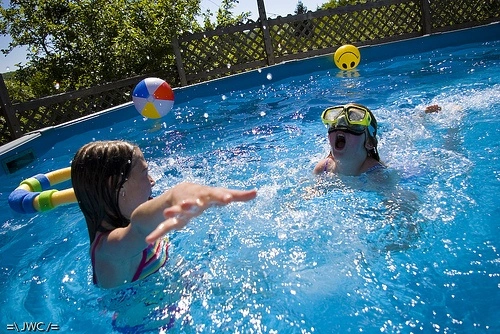{data-zoom-image}

Dans le jeu [Marco Polo](https://fr.wikipedia.org/wiki/Marco_Polo_(jeu)), le son est utilisé comme radar afin de retrouver son adversaire.

{data-zoom-image}

Dans le jeu [A Blind Legend (2016)](https://store.steampowered.com/app/437530/A_Blind_Legend/), les joueurs doivent se fier exclusivement au son pour naviguer et interagir avec le monde.

### :octicons-search-16: **Exploration**

Le résultat de la curiosité. La découverte d'espaces, de secrets ou d'informations qui doit idéalement être récompensée. Cela englobe aussi le plaisir de l'expérimentation libre.

<!-- 

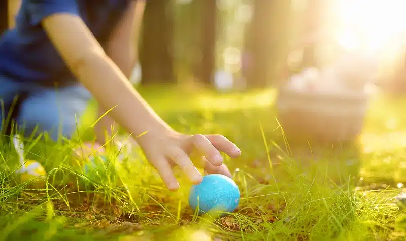{data-zoom-image}

Dans une [chasse aux trésors](https://fr.wikipedia.org/wiki/Chasse_au_tr%C3%A9sor), l'objectif est assez intéressant pour se donner tout le mal pour le trouver. Ça ne doit être ni trop difficile, ni trop facile.

 -->

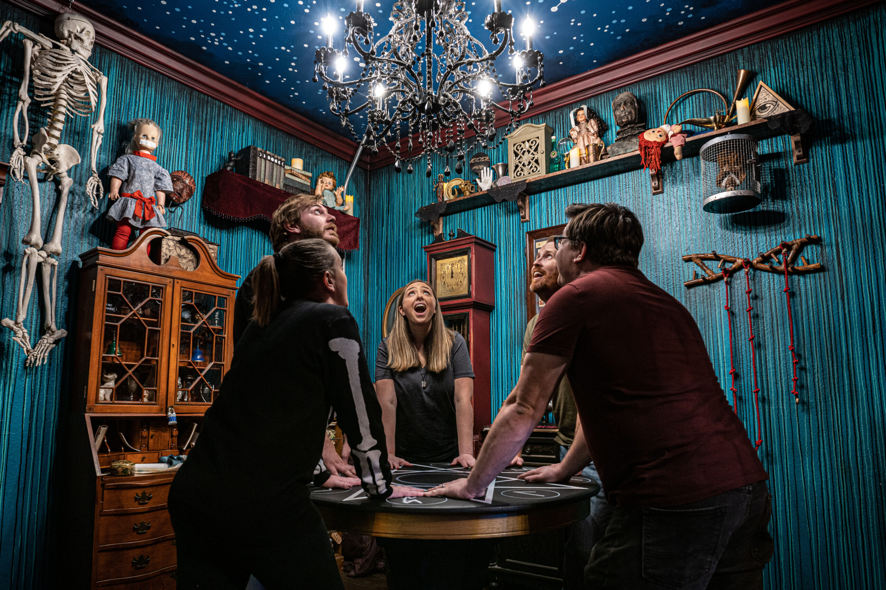{data-zoom-image}

Dans un [jeu d'évasion](https://en.wikipedia.org/wiki/Escape_room), fouiller le pièces et manipuler les objets permet de trouver les indices nécessaires pour avancer dans le jeu.

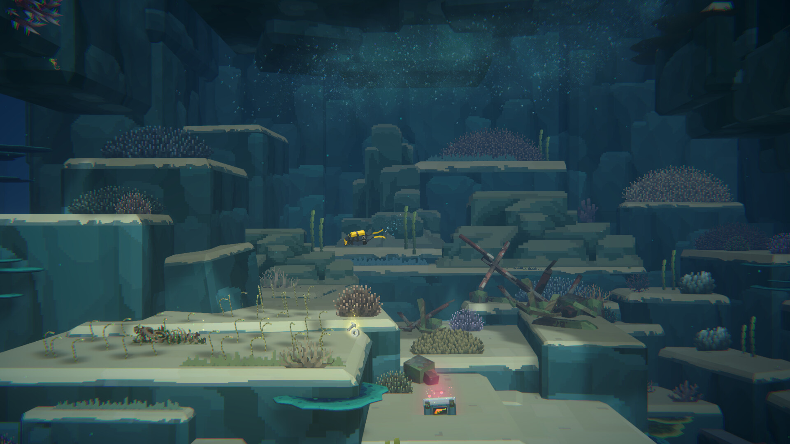{data-zoom-image}

Dans le jeu [Dave the diver (2023)](https://store.steampowered.com/app/1868140/DAVE_THE_DIVER/), l'exploration est récompensée par la découverte de nouvelles espèces de poissons, de trésors cachés et de ressources rares.

### :crossed_swords: **Défi et Rétroaction**

L'équilibre entre la difficulté des obstacles et les compétences du joueur. Le jeu doit renvoyer un retour d'information immédiat (visuel, sonore ou textuel) pour que le joueur comprenne l'impact de ses actions, qu'il réussisse ou qu'il échoue.

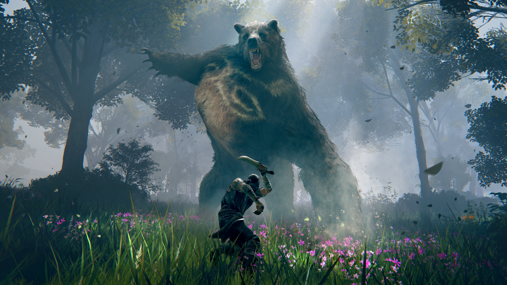{data-zoom-image}

Dans les jeux comme [Elden Ring (2022)](https://store.steampowered.com/app/1245620/ELDEN_RING/), le défi est brutal mais la courbe d'apprentissage et la satisfaction de surmonter un obstacle sont au cœur de l'expérience de jeu.

### :trophy: **Accomplissements**

Récompenses générales (*achievements*) ou liées à une mécanique du jeu (*upgrades*, items).
Ça récompense certaines actions des joueurs, valide leur progression et ajoute une notion de défi à l'expérience.

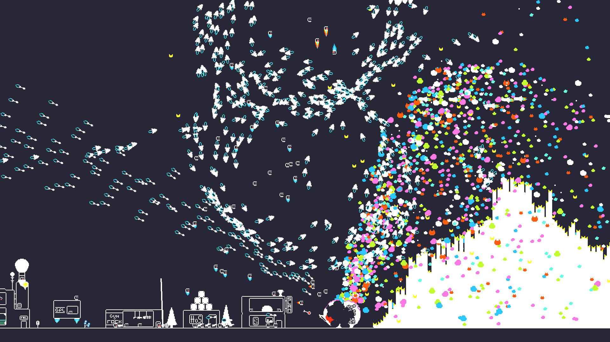{data-zoom-image}

Dans le jeu [(the) Gnorp Apologue (2023)](https://store.steampowered.com/app/1473350/the_Gnorp_Apologue/), les accomplissements sont récompensés par des compétences permanentes, ce qui engage la rejouabilité.

### :material-arrow-decision: **Agentivité**

Capacité du joueur à influencer le jeu et son déroulement.
Offre aux joueurs une impression de liberté, de responsabilité et de contrôle sur leur aventure.

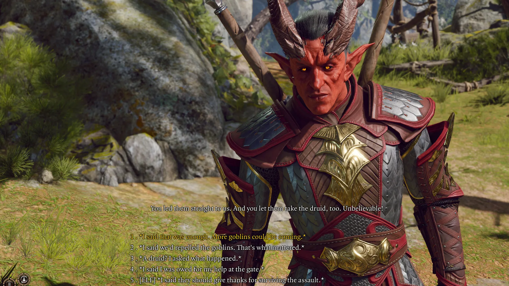{data-zoom-image}

Dans le jeu [Baldurs gate 3 (2023)](https://store.steampowered.com/app/1086940/Baldurs_Gate_3/), les joueurs font des choix qui influencent l'histoire, les relations entre les personnages, ainsi que l'issue des quêtes et des combats.

### :people_wrestling: **Compétition** / :handshake: **Coopération**

À la recherche d'avantages ou d'entraide, créant des dynamiques sociales et stratégiques uniques entre les humains ou contre le système.

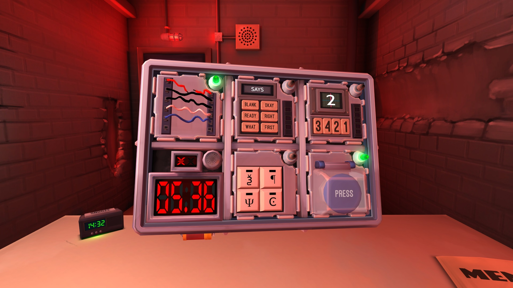{data-zoom-image}

Dans le jeu [Keep Talking and Nobody Explodes (2015)](https://store.steampowered.com/app/341800/Keep_Talking_and_Nobody_Explodes/), un des joueurs doit désamorcer une bombe en suivant les instructions des autres joueurs qui ne voient pas ladite bombe.

## Jeu vidéo

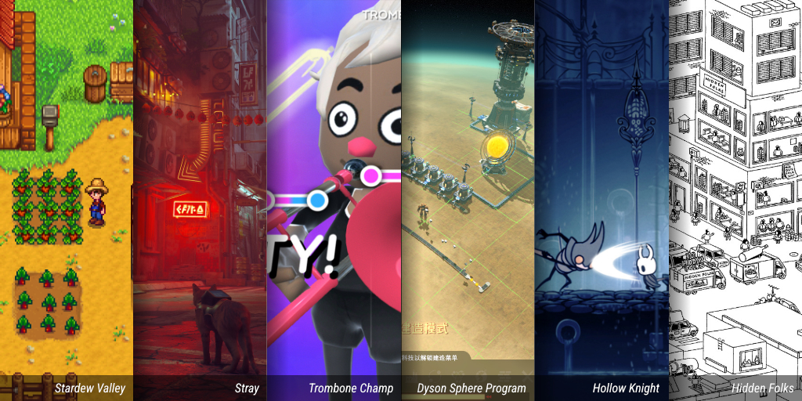

### Quelques ressources

#### Distributeurs

[Steam](https://steampowered.com/) | [Itch.io](https://itch.io/) | [Epic Games](https://www.epicgames.com/) | [GOG](https://www.gog.com/)

#### Statistiques et Données

* [SteamDB](https://steamdb.info/) (Données Steam)
* [Games Stats](https://games-stats.com/) (Statistiques de ventes)
* [HowLongToBeat](https://howlongtobeat.com/) (Durée des jeux)
* [IsThereAnyDeal](https://isthereanydeal.com/) (Historique des prix)

#### Assets

* [Itch.io](https://itch.io/game-assets/free/tag-2d)
* [Craftpix](https://craftpix.net/freebies/)
* [Unity Asset Store](https://assetstore.unity.com/?category=2d&free=true)
* [Opengameart](https://opengameart.org/)
* [Kenney.nl](https://kenney.nl/assets/category:2D) 
* [Gameart2d](https://www.gameart2d.com/freebies.html)
* [Gamedevmarket](https://www.gamedevmarket.net/)

#### Inspirations & Communautés

* [Reddit : r/gamedevscreens](https://www.reddit.com/r/gamedevscreens/)
* [Reddit : r/destroymygame](https://www.reddit.com/r/DestroyMyGame/)
* [Reddit : r/indiedev](https://www.reddit.com/r/IndieDev/)
* [Reddit : r/gamedesign](https://www.reddit.com/r/gamedesign/)

### Genres de jeux principaux

Plutôt que de lister les centaines de sous-genres existants, voici les grandes catégories fondamentales et les styles les plus populaires que vous risquez de côtoyer[^videogamestypes].

* **Action / Réflexes :** Axé sur l'habileté manuelle et le tempo.
    * *Exemples :* Plateforme (*Super Mario*), Tir (*Counter-Strike*, *Resident Evil*), Combat (*Street Fighter*), Rythme (*Beat Saber*), Roguelike (*Hades*).
* **Aventure / Narration :** Met l'accent sur l'histoire, l'exploration et les choix.
    * *Exemples :* Monde ouvert (*GTA V*), Point & Click (*Monkey Island*), Film interactif (*Life Is Strange*).
* **Réflexion / Casse-tête :** Fait appel aux méninges, à la logique ou à la physique.
    * *Exemples :* Logique (*Tetris*, *The Witness*), Évasion (*Escape Simulator*), Physique (*Kerbal Space Program*).
* **Jeu de rôle (RPG) :** Axé sur l'évolution des statistiques d'un personnage et les choix narratifs.
    * *Exemples :* Action-RPG (*Diablo 4*), RPG Tactique (*Baldur’s Gate 3*).
* **Stratégie & Gestion :** Demande de la planification, de la gestion de ressources ou de la tactique militaire.
    * *Exemples :* Gestion (*Cities: Skylines*, *Stardew Valley*), Stratégie (*Civilization VI*, *League of Legends*).
* **Simulations & Bac à sable :** Recréation d'activités réelles ou liberté totale de création.
    * *Exemples :* Conduite (*Euro Truck*), Simulation de vie (*The Sims*), Sandbox (*Minecraft*).
* **Hybrides & OVNI :** Jeux inclassables ou conceptuels.
    * *Exemples :* Cartes (*Balatro*), Incrémentiel (*(the) Gnorp Apologue*).

[^videogamestypes]: [Liste complète des genres de jeux vidéo (Wikipédia)](https://fr.wikipedia.org/wiki/Genre_de_jeu_vid%C3%A9o)

### Écosystème : Plateformes & Contrôles

Pour concevoir un jeu, il faut savoir **où** on y joue et **avec quoi** on le contrôle. Cela influence directement l'interface (UI) et le gameplay.

| Support | Plateformes populaires | Contrôles typiques |
| :--- | :--- | :--- |
| **PC & Consoles** | Windows, Mac, PlayStation, Xbox, Switch, Steam Deck | Clavier/Souris, Manette, Joystick |
| **Mobile** | iOS, Android | Écran tactile, Gyroscopes |
| **Réalités (VR/AR)** | Meta Quest, PlayStation VR, Apple Vision Pro | Manettes à détection de mouvement, Suivi des mains/yeux |
| **Infonuagique (Cloud)** | Xbox Cloud Gaming, NVIDIA GeForce Now, ~~Stadia~~ :fontawesome-solid-skull-crossbones: | Multiplateforme (dépend du flux) |
| **Navigateur Web** | Portails HTML5 / WebGL / WebAssembly | Clavier/Souris, Tactique |

## Prérequis

Ce sont les critères que les joueurs doivent satisfaire avant d'accéder à un contenu, d'effectuer une action, ou simplement de progresser dans le jeu. Ils permettent de structurer la courbe de progression et de récompenser l'effort.

### Exemples fréquents en Game Design

* **Progression :** Niveau de personnage requis (ex: *Être niveau 10 pour le donjon*).
* **Économie :** Quantité de ressources accumulées (ex: *Avoir 1000 pièces d'or*).
* **Inventaire :** Possession d'un objet spécifique (ex: *Trouver la clé bleue*).
* **Scénario :** Quête ou choix narratif précédent complété.
* **Compétence :** Capacité technique apprise (ex: *Débloquer le double-saut pour traverser*).
* **Environnement :** Conditions contextuelles (ex: *Attendre qu'il fasse nuit dans le jeu*).

### Quel prérequis s'applique à l'exemple ci-dessous ?

<iframe class="aspect-4-1" height="300" style="width: 100%;" scrolling="no" title="Prérequis" src="https://codepen.io/tim-momo/embed/xxoXazb?default-tab=result&editable=true&theme-id=50173" frameborder="no" loading="lazy" allowtransparency="true" allowfullscreen="true">
  See the Pen <a href="https://codepen.io/tim-momo/pen/xxoXazb">
  Prérequis</a> by TIM Montmorency (<a href="https://codepen.io/tim-momo">@tim-momo</a>)
  on <a href="https://codepen.io">CodePen</a>.
</iframe>

## Cadriciels (Frameworks & Moteurs)

Un cadriciel/moteur est une bibliothèque d'outils et de fonctionnalités destinés à aider les développeurs. Au lieu de tout reprogrammer à partir de zéro (moteur physique, gestion audio, rendu des images), on utilise une structure existante pour gagner du temps.

| Cadriciel / Moteur | 2D | 3D | Langages | Exemples de succès |
| :--- | :---: | :---: | :--- | :--- |
| **Unreal Engine**[^unreal_showcase] | :material-check-circle:{ .text-success } | :material-check-circle:{ .text-success } | C++ / Blueprints | *Fortnite*, *Borderlands 3* |
| **Unity**[^unity_showcase] | :material-check-circle:{ .text-success } | :material-check-circle:{ .text-success } | C# | *Among Us*, *Hollow Knight* |
| **Godot**[^godot_showcase] | :material-check-circle:{ .text-success } | :material-check-circle:{ .text-success } | GDScript, C#, C++ | *Dome Keeper*, *Brotato* |
| **GameMaker**[^gms_showcase] | :material-check-circle:{ .text-success } | | GML | *Undertale*, *Hotline Miami* |

## Document de conception de jeu (GDD)

Le **Game Design Document** (GDD) décrit tous les aspects fondamentaux d’un jeu vidéo. Rédigé durant la phase de conceptualisation, il sert de boussole à l'équipe tout au long du développement.

On y détaille le **concept**, les **mécaniques**, l'**histoire**, la **direction artistique**, le **design sonore**, le **level design** et les **technologies retenues**.

👉 Voici un [exemple complet de GDD](./assets/documents/gdd-perihelie.pdf) pour vous inspirer.

!!! question "Est-ce un document définitif ?"
    Absolument pas. En cours de route, des idées tombent à l'eau, d'autres s'ajoutent suite aux phases de test. C'est un document vivant (*live document*), même s'il doit garder une base stable pour éviter que le projet ne parte dans tous les sens (*scope creep*).

## Unity

### Création de compte

### Configuration système requise

https://docs.unity3d.com/Manual/system-requirements.html

### Plan

En tant qu'étudiant-e, vous avez accès au [compte éducationnel](https://unity.com/products/unity-student) qui donne accès à l'éditeur Pro de Unity. Il donne également accès à un paquet d'assets premium gratuitement.

https://unity.com/products/unity-student

## Unity Hub

### Installation

1. Rendez-vous sur la page de [téléchargement de Unity](https://unity.com/download).
2. Sélectionnez l’une des options correspondant à votre système d’exploitation. Un fichier nommé UnityHubSetup sera téléchargé. Le nom du fichier peut varier selon la version du Hub et votre système d’exploitation.
3. Repérez le fichier UnityHubSetup que vous venez de télécharger et lancez-le.
4. Suivez les instructions propres à votre plateforme afin d’installer Unity Hub.
    * Si vous n’avez pas encore créé de compte Unity, vous serez invité à le faire durant cette étape.
    * Une fois connecté à Unity Hub, celui-ci vous guidera pour installer la plus récente version LTS de l’éditeur Unity. Les versions LTS sont les versions les plus récentes ayant fait l’objet de tests complets et offrant une stabilité accrue.
5. Sélectionnez Installer l’éditeur Unity (Install Unity Editor) afin de télécharger et d’installer la dernière version LTS de l’éditeur Unity.

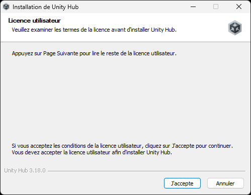{data-zoom-image}

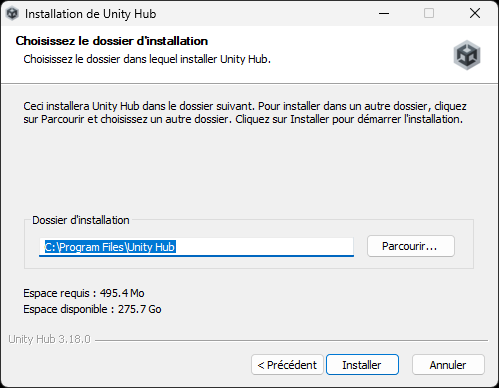{data-zoom-image}

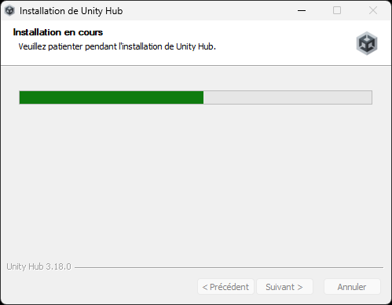{data-zoom-image}

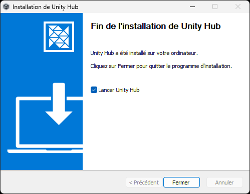{data-zoom-image}

{data-zoom-image}

### Installer Unity 6

Si vous avez déjà Unity Hub, mais qu’une version plus ancienne de Unity est installée sur votre ordinateur, suivez ces étapes pour installer Unity 6

1. Dans Unity Hub, ouvrez l’onglet Installs (Installations).
2. Cliquez sur le bouton Install Editor (Installer l’éditeur) afin d’installer une nouvelle version de Unity.
3. Dans la section Unity 6 Releases, cliquez sur Install pour la version correspondant à votre plateforme.
    > Remarque : Sur macOS, vous devrez choisir entre un processeur Apple Silicon ou Intel. Si vous ne savez pas quel type de processeur équipe votre Mac, consultez l’article d’assistance d’Apple à ce sujet.
4. À l’étape Add Modules (Ajouter des modules), sélectionnez l’option disponible sous DEV TOOLS afin d’installer un environnement de développement compatible.
    * Windows : sélectionnez Visual Studio.
    * macOS : sélectionnez Visual Studio Code.
    L’installation de l’un de ces outils vous permettra d’écrire, d’exécuter et de déboguer votre code plus efficacement dans vos projets Unity.
5. Cliquez sur Continue (Continuer) pour lancer l’installation.
    > Remarque : L’éditeur Unity est une application puissante et de grande taille. Le téléchargement et l’installation peuvent prendre plusieurs minutes.

Une fois l’installation terminée, cette version de l’éditeur Unity apparaîtra dans l’onglet Installs de Unity Hub.

## Structure de fichier

Lorsque vous créez un nouveau projet, je vous conseille de tout de suite créer les dossiers suivants dans votre fenêtre Project. Ainsi, vous pourrez classer vos ressources dès que vous les importez:

Animation
Art
Audio
Font
Materials (en 3D seulement)
Prefabs
Rendering (Si nécessaire)
Scenes
Scripts

## Exercices

