# Cours 1

*[LTS] : Long-Term Support
*[UX] : User Experience
*[FPS] : First Person Shooters

[^ludisme]: [Définition du mot ludisme selon Larousse](https://www.larousse.fr/dictionnaires/francais/ludisme/48009)
[^mda]: [Hunicke, LeBlanc & Zubek, 2004](https://users.cs.northwestern.edu/~hunicke/MDA.pdf)
[^gap]: [*User Experience Design for Inexperienced Gamers: GAP – Game Approachability Principles*](https://doi.org/10.1007/978-1-84882-963-3_8)
[^flow]: [Sweetser, 2020, OzCHI/ACM](https://dl.acm.org/doi/10.1145/3441000.3441048)
[^fail]: [*The Art of Failure*, MIT Press, 2013](https://mitpress.mit.edu/9780262529952/the-art-of-failure/)

## Le ludisme

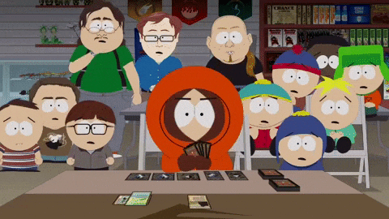{.w-100}

> **Ludisme** n.m.[^ludisme] 
> Comportement caractérisé par la recherche systématique du jeu sous toutes ses formes. 
> latin *ludus*, jeu, [*ludologie*](https://vitrinelinguistique.oqlf.gouv.qc.ca/fiche-gdt/fiche/26502181/ludologie)

Le ludisme, c'est l'**engagement** et les **comportements** d'une personne envers un **jeu**. 

L'**amusement** et l'**expérimentation** sont essentiels au développement de l'aspect ludique de l'expérience.

!!! example "Comment créer une expérience ludique ?"

    > On travaille l'expérience utilisateur (_UX_) dans le but de provoquer une émotion.

    Le concepteur développe des **mécaniques** (ex. : saut, points de vie) ce qui produit des **Dynamiques** en jeu (ex. : camper, faire une *speedrun*) pour déclencher du plaisir (ex. : défi, découverte, camaraderie)[^mda]:. 

    Le joueur vit le chemin **inverse**. Il ressent d'abord puis comprends les règles ensuite.

## Expérience ludique

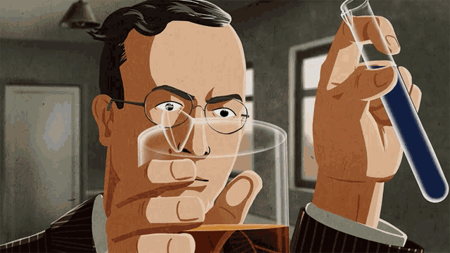{.w-100}

Ce qui suit sont des stratégies pour concevoir une expérience ludique. 

Tout ne doit pas **obligatoirement** se trouver dans un même jeu, mais ça aide ;)

### :speaking_head: Narration

Raconter une histoire donne un **sens** aux actions du joueur 

> On ne pousse pas un bouton, on sauve quelqu'un !

Par les **dialogues**, l'**ambiance**, les **décisions** et le **scénario**, la narration crée un investissement émotionnel et l'envie de connaître la suite.

{data-zoom-image}

Dans [Donjons & Dragons](https://fr.wikipedia.org/wiki/Donjons_et_Dragons), la narration est entièrement interactive et partagée.

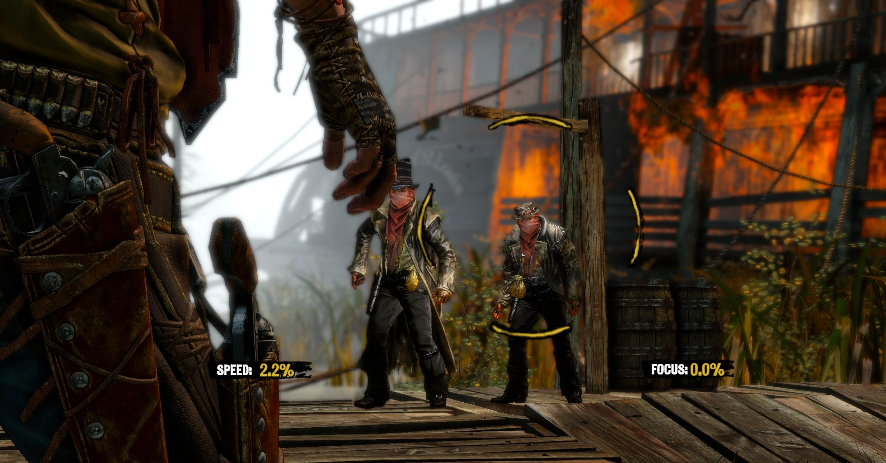{data-zoom-image} 

Dans [Call of Juarez (2013)](https://fr.wikipedia.org/wiki/Call_of_Juarez:_Gunslinger), la narration sonore est continuellement guidée par les actions des joueurs.

!!! question "Comment raconter une histoire ?"

    On verra plus tard comment fabriquer une histoire à partir de [techniques de création narratives](./extra/narration.md){.back}.

### :fontawesome-solid-gears: **Mécanique**

Les règles et systèmes qui déterminent **comment on interagit avec le jeu**. 

> Sauter, crocheter, courrir... 
> Règle des pions aux échecs

Une bonne mécanique génère des **choix intéressants** et un plaisir de **maîtrise** (comprendre, expérimenter, s'améliorer).

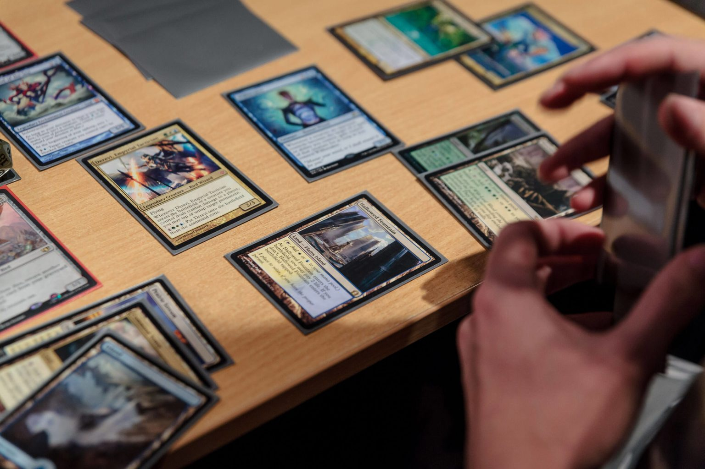{data-zoom-image}

Dans [Magic: The Gathering](https://magic.wizards.com/), la mécanique du « *Tap* » active une ressource ou une créature.

{data-zoom-image}

Dans [Portal (2011)](https://fr.wikipedia.org/wiki/Portal_2), les joueurs doivent résoudre des énigmes en manipulant des trous de ver.

### :material-school: Prise en main

<!-- Une mécanique géniale ne vaut rien si le joueur **abandonne avant de la comprendre**. -->

Les premières minutes doivent enseigner : 

* En jouant plutôt qu'en expliquant
* Une notion à la fois et accompagné de rétroaction (renforcement positif)
* S'il y a beaucoup de mécaniques, n'enseignez pas tout en même temps

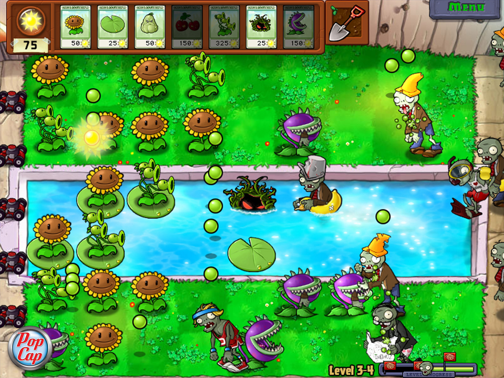{data-zoom-image}

Dans [Plants vs. Zombies (2009)](https://store.steampowered.com/app/3590/Plants_vs_Zombies_GOTY_Edition/), chaque niveau n'introduit **qu'une seule nouvelle plante**.

!!! tip "Les 10 principes GAP (*Game Approachability Principles*)"

    Desurvire & Wiberg[^gap] proposent une grille pour concevoir de meilleurs tutoriels et premiers niveaux, particulièrement pour les joueurs occasionnels :

    1. **Pratique** : offrir assez d'occasions de pratiquer chaque nouvelle habileté
    2. **Démonstration** : montrer le jeu de plus d'une façon
    3. **Renforcement** : donner une rétroaction aux actions du joueur
    4. **Sentiment de compétence** : le joueur se sent habile après l'entraînement initial
    5. **Échafaudage** : aide générale, puis plus précise **au besoin**
    6. **Contrôle** : le joueur s'identifie à son personnage et voit qu'il affecte le monde
    7. **Bonnes pratiques** : ne pas punir deux fois le même échec, varier les activités, doser le rythme
    8. **Objectifs clairs** : le joueur sait ce qu'il doit faire et y arrive
    9. **Information au bon moment** : juste ce qu'il faut, quand il le faut
    10. **Maîtrise** : à la fin, le joueur a réellement appris de nouvelles habiletés

!!! success "Le tutoriel invisible"

    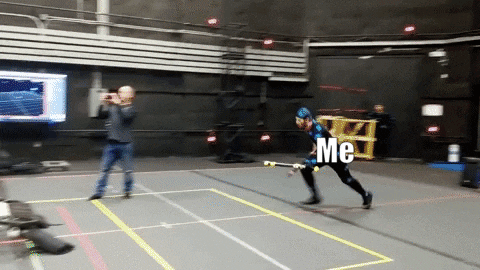{.w-33}

    Le meilleur tutoriel est celui qu'on ne remarque pas.

    Si on concoit les premières scènes de façon à ce qu'il n'existe **qu'une seule action possible**. Le joueur croit résoudre l'énigme par lui même, mais en réalité, on lui enseigne les règles une à une.

### :paintbrush: **Visuel**

L'environnement, les interfaces, les illustrations et les effets donnent au jeu son **identité** et son **ambiance**. 

Le visuel invite le joueur à entrer dans l'univers et à y rester. Il rend aussi le jeu **lisible**. C'est-à-dire qu'on comprend d'un coup d'oeil où aller et quoi faire.

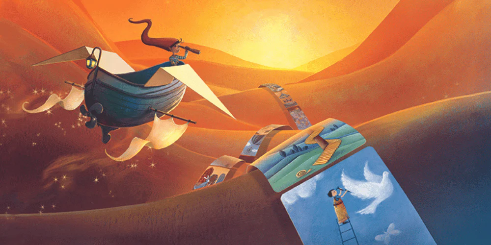{data-zoom-image}

Dans [Dixit](https://boardgamegeek.com/boardgame/39856/dixit), le graphisme surréalistes des cartes forcent les joueurs à imaginer des associations d'idées abstraites.

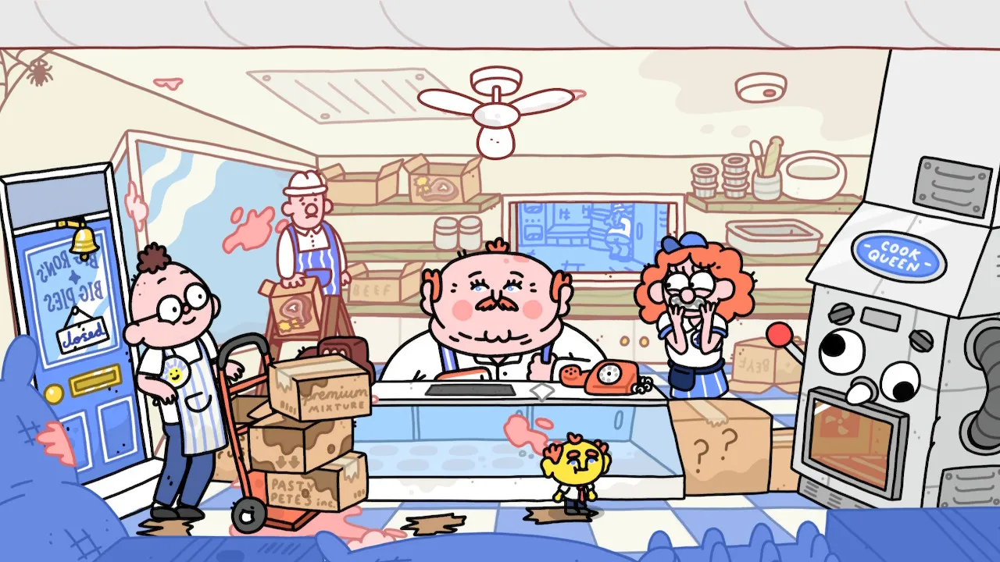{data-zoom-image}

Dans [Thank Goodness You're Here! (2024)](https://store.steampowered.com/app/2366980/Thank_Goodness_Youre_Here/), les dessins affirment un univers jovial, drôle et grotesque.

### :musical_note: **Son**

L'image montre et le son **immerge**. 

Le son installe une **émotion**, **oriente** le joueur (ex. : un danger à venir) et **récompense** les actions.

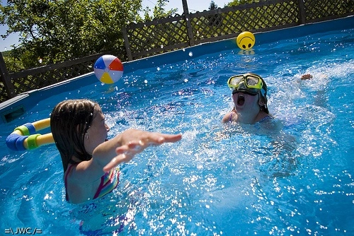{data-zoom-image}

Dans le jeu [Marco Polo](https://fr.wikipedia.org/wiki/Marco_Polo_(jeu)), le son est utilisé comme radar afin de retrouver son adversaire.

{data-zoom-image}

Dans [A Blind Legend (2016)](https://store.steampowered.com/app/437530/A_Blind_Legend/), les joueurs doivent se fier exclusivement au son pour naviguer et interagir avec le monde. Aucune image dans ce jeu vidéo !

!!! example "L'impopularité du traitement sonore"

    Le son est souvent mis de côté. Peut-être parce que c'est moins tangible qu'une image 🤷 ?

    Pourtant, il est **aussi important que l'image**. 
    
    Le son c'est l'équivalent du glaçage sur un gâteau d'aniversaire. C'est pas obligatoire.. mais un peu quand même 😅

    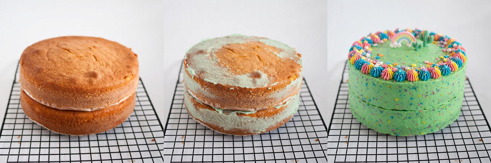{data-zoom-image .w-50}

### :octicons-search-16: **Exploration**

Éveiller la **curiosité**, puis (surtout) la **récompenser**.

Ça peut être en découvrant une nouvelle salle, une section secrète ou une information.

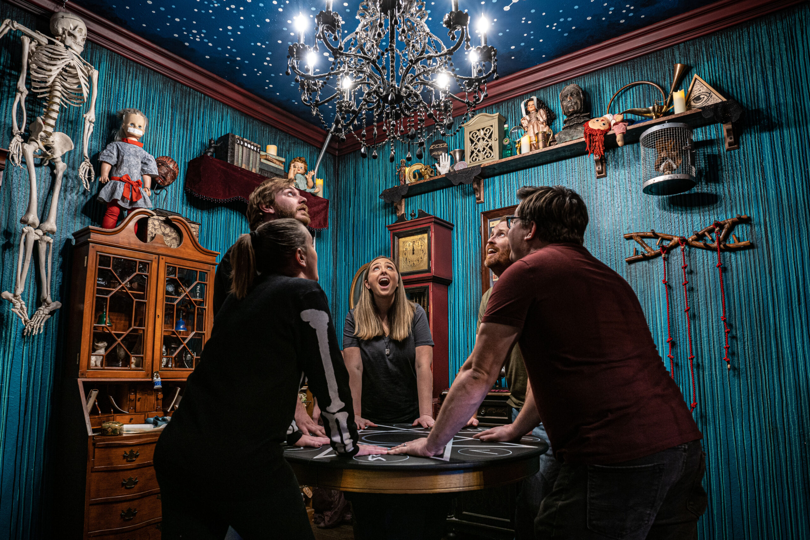{data-zoom-image}

Dans un [jeu d'évasion](https://en.wikipedia.org/wiki/Escape_room), fouiller le pièces et manipuler les objets permet d'avancer dans le jeu.

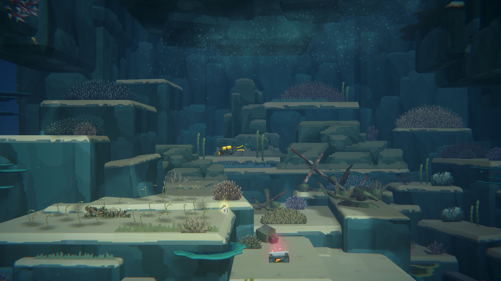{data-zoom-image}

Dans [Dave the diver (2023)](https://store.steampowered.com/app/1868140/DAVE_THE_DIVER/), l'exploration fait avancer le niveau de difficulté et la narration du jeu.

### :crossed_swords: **Défi**

Un jeu trop facile peut provoquer l'ennui. Un jeu trop difficile provoque la frustration et le découragement.

Un obstacle à la hauteur des compétences/attentes du joueur crée un état d'engagement, mais ce qui le fait continuer est la récompense.

{data-zoom-image}

Dans [Elden Ring (2022)](https://store.steampowered.com/app/1245620/ELDEN_RING/), l'échec est la mécanique principale du jeu.

!!! tip "L'art de l'échec 😮"

    Cet équilibre ennui / frustration se nomme ***flow***[^flow]. Même que parfois, on recherche l'échec pour rendre la réussite signifiante[^fail].

### :trophy: **Accomplissements**

Les récompenses (*achievements*, mais aussi items et *upgrades*,) **valident la progression** du joueur et fixent des objectifs à poursuivre.

{data-zoom-image}

Dans [(the) Gnorp Apologue (2023)](https://store.steampowered.com/app/1473350/the_Gnorp_Apologue/), on ne progresse que par la bonne gestion des _upgrades_.

### :material-arrow-decision: **Agentivité**

Donner au joueur le pouvoir d'**influencer** le jeu et son déroulement crée une impression de **liberté** et de **contrôle**. 

{data-zoom-image}

Dans [Baldurs gate 3 (2023)](https://store.steampowered.com/app/1086940/Baldurs_Gate_3/), les joueurs font des choix qui influencent l'histoire, les relations entre les personnages, ainsi que l'issue des quêtes.

### :people_wrestling: **Compétition** / :handshake: **Coopération**

**Rivalité**, **entraide**, **négociation** et **trahison** sont des dynamiques extrêmement intéressantes pour l'engagement des joueurs. 

Néanmoins, pour être efficace et convainquantes, ces dynamiques doivent être performées par des humains.

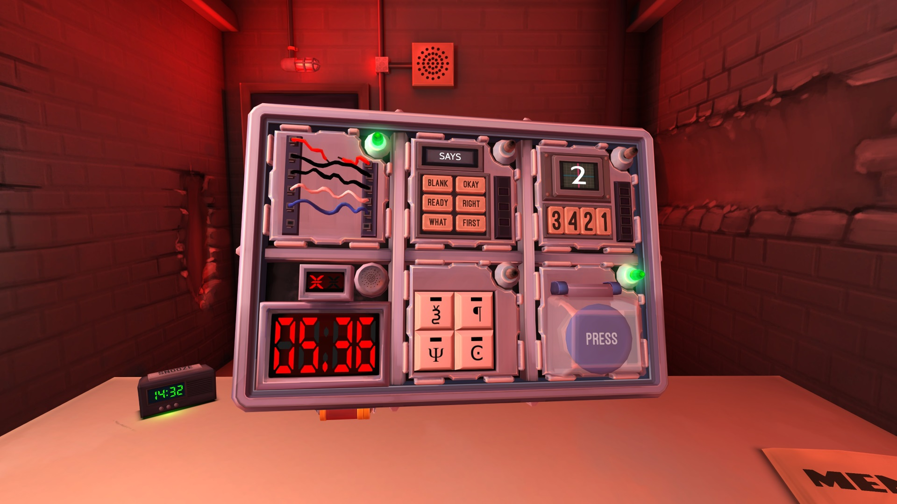{data-zoom-image}

Dans [Keep Talking and Nobody Explodes (2015)](https://store.steampowered.com/app/341800/Keep_Talking_and_Nobody_Explodes/), un des joueurs doit désamorcer une bombe en suivant les instructions d'autres joueurs qui ne la voient pas.

## Jeu vidéo

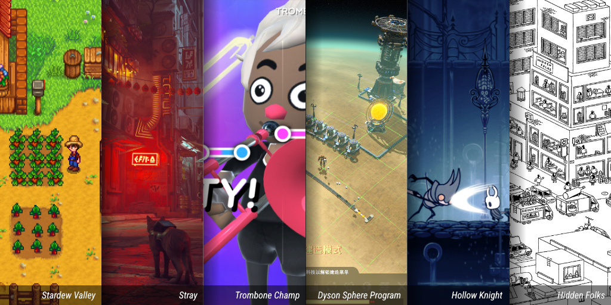

Les jeux vidéos sont une façon très efficace d'aborder l'expérience ludique. Si efficace, qu'annuellement, cette industrie génère mondialement plus de [200 milliards USD](https://afjv.com/news/12036_l-industrie-des-jeux-video-a-franchi-la-barre-des-200-mds-en-2025.htm).

### Distributeurs

* **PC** : :simple-steam: [Steam](https://steampowered.com/), :simple-epicgames: [Epic Games Store](https://store.epicgames.com/), :simple-battledotnet:[Battle.net](https://us.shop.battle.net/) et [_bien d'autres_](https://www.pcgamer.com/pc-gamings-many-launchers-reviewed-for-2024-steam-still-puts-the-rest-to-shame/)
* **Consoles** : :simple-playstation: [PlayStation Store](https://store.playstation.com/), :material-nintendo-switch: [Nintendo eShop](https://www.nintendo.com/us/store/), :fontawesome-brands-xbox: [Xbox Store](https://www.xbox.com/microsoft-store)
* **Mobile** : :simple-appstore: [App Store](https://www.apple.com/app-store/), :simple-googleplay: [Google Play](https://play.google.com/)
* **Web** : :fontawesome-brands-itch-io: [Itch.io](https://itch.io/), [Game Jolt](https://gamejolt.com/), [Newgrounds](https://www.newgrounds.com/), [Poki](https://poki.com/), [CrazyGames](https://www.crazygames.com/)

### Statistiques et Données

* [SteamDB](https://steamdb.info/) (Données Steam)
* [Games Stats](https://games-stats.com/) (Statistiques de ventes)
* [IsThereAnyDeal](https://isthereanydeal.com/) (Historique des prix. Équivalent Steam de <https://keepa.com/>.)
* [HowLongToBeat](https://howlongtobeat.com/) (Durée des jeux)

## Genres de jeux

{.w-100}

Il existe des centaines de [genres de jeux vidéos](https://steamdb.info/tags/) et les étiqueter n'aide pas beaucoup à en concevoir un. Ce qui aide, c'est de nommer **ce que le jeu exploite chez le joueur**. Voici trois grandes catégories de jeux :

* :material-lightning-bolt: **Action/Arcade** : exploite l'**exécution en temps réel**
  > Réflexes, timing, précision. Le joueur sait souvent ce qui s'en vient : le défi est de l'exécuter au bon moment.
  >
  > *[Mortal Kombat](https://fr.wikipedia.org/wiki/Mortal_Kombat)*, *[Counter-Strike](https://www.counter-strike.net/cs2)*, *[Beat Saber](https://beatsaber.com/)*
* :material-magnify: **Aventure** : exploite le **dévoilement d'information**
  > Le joueur ne devient pas meilleur : c'est le **monde** qui se révèle. Une carte, une intrigue, une règle cachée, un mensonge.
  >
  > *[Monkey Island](https://returntomonkeyisland.com/)*, *[Outer Wilds](https://www.mobiusdigitalgames.com/outer-wilds.html)*, *[Firewatch](https://en.wikipedia.org/wiki/Firewatch)*
* :material-chess-rook: **Stratégie** : exploite la **gestion de ressources**
  > De l'or, des unités, du temps, de l'espace, de l'attention. Le défi est de choisir où dépenser ce qu'on n'a pas en quantité suffisante.
  >
  > *[Civilization](https://civilization.2k.com/)*, *[Stardew Valley](https://www.stardewvalley.net/)*, *[Balatro](https://www.playbalatro.com/)*

<!-- !!! note "Petite note"

    Énormément de jeux sont des combinaisons de ces trois catégories. -->

## Théorie du jeu vidéo

### Prérequis

{.w-100}

> J'ai besoin de A pour faire B. 

Les prérequis sont des critères que le joueur doit satisfaire pour faire autre chose. En design de jeu, ce concept porte le nom de ***gating***.

Ça sert à contrôler le **rythme**, **enseigner les mécaniques**, maintenir le **défi**, créer un sentiment de **maîtrise** et alimenter la logique de **récompense**.

Sa forme la plus classique est le mécanisme **serrure / clé** : 

  See the Pen <a href="https://codepen.io/tim-momo/pen/xxoXazb">
  Phaser - Prérequis</a> by TIM Montmorency (<a href="https://codepen.io/tim-momo">@tim-momo</a>)
  on <a href="https://codepen.io">CodePen</a>.

<!-- 
!!! quote "Sources"
    * Adams, E. & Dormans, J. (2012). [*Game Mechanics: Advanced Game Design*](https://www.peachpit.com/store/game-mechanics-advanced-game-design-9780132946704), chap. 11 « Progression Mechanisms » — les mécanismes *lock-and-key* comme fondement de la progression.
    * Juul, J. (2002). [*The Open and the Closed: Games of Emergence and Games of Progression*](https://jesperjuul.net/text/openandtheclosed.html), CGDC, Tampere — la distinction académique entre jeux d'émergence et jeux de progression.
    * Ashmore, C. & Nitsche, M. (2007). [*The Quest in a Generated World*](https://dl.digra.org/index.php/dl/article/view/312), DiGRA — la structure clé/serrure comme unité de base des quêtes.

    **Vulgarisation** (pour aller plus loin, format accessible) :

    * Brown, M. [*Boss Keys*](https://www.youtube.com/playlist?list=PLc38fcMFcV_ul4D6OChdWhsNsYY3NA5B2) (Game Maker's Toolkit) — analyse vidéo du *gating* dans les donjons de *Zelda* et les *metroidvania*.
    * [*The Level Design Book*, chap. « Gates »](https://book.leveldesignbook.com/process/layout/typology/gates) — typologie des *gates* (hard/soft, direction, lock and key) et bonnes pratiques. -->

#### Types de _gating_

1. **Progression** : Niveau de personnage requis
  > Avoir le niveau 10 pour entrer dans le donjon
1. **Économie** : Quantité de ressources accumulées 
  > Avoir 1000 pièces d'or pour acheter une maison
1. **Inventaire** : Possession d'un objet spécifique 
  > Trouver une carte bleue pour ouvrir les portes bleus 
1. **Scénario** : Choix narratif active ou désactive un élément du jeu 
  > Un garde bloque la porte du village tant qu'on n'a pas parlé au vieux Kamajī
1. **Compétence du personnage** : Capacité apprise 
  > Débloquer le double-saut pour traverser le ravin
1. **Environnement** : Conditions contextuelles
  > Attendre qu'il fasse nuit pour cueillir une fleur spéciale
1. **Habileté du joueur** : C'est le *joueur* qui doit s'améliorer, pas son personnage 
  > Un boss infranchissable tant qu'on n'a pas maîtrisé ses séquences d'attaque
1. **Connaissance** : Informations à découvrir par l'expérimentation pour progresser 
  > Manger une pomme en sautant fait lever le soleil

<!-- | Type de *gate* | Ce qui déverrouille | Expérience produite |
| -------------- | ------------------- | ------------------- |
| Progression | Niveau / statistiques | Croissance, investissement |
| Économie | Monnaie / matériaux | Gestion, accumulation |
| Inventaire | Objet spécifique | Fouille, découverte |
| Scénario | Déclencheur narratif / choix | Rythme, cohérence du récit |
| Compétence du personnage | Nouvelle action (verbe) | Retour sur ses pas, carte qui s'ouvre |
| Environnement | État du monde / moment | Routine, observation |
| Habileté du joueur | Maîtrise, réflexes | Triomphe sur la difficulté |
| Connaissance | Information comprise | Eurêka! | -->

### Boucles de jeu

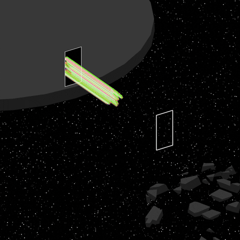{.aspect-4-3}

Une **boucle de jeu** ([_game loop_](https://gamedesignskills.com/game-design/core-loops-in-gameplay/)) est une séquence d'actions que le joueur répète tout au long de la partie.

Ça sert à bien comprendre les mécaniques et leur fréquences. On dit qu'avant de développer un jeu, il est essentiel de connaitre ses boucles. Comme ça, ça donne une bonne idée de l'envergure du projet.

Voici un exemple pour un FPS.

<figure markdown>
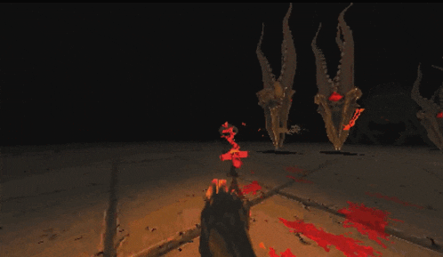{.w-50}
</figure>

<!-- 
| À chaque instant | Aux 10 minutes | Aux heures | Aux journées |
| --- | --- | --- | --- | 
| Viser un ennemi, le tirer, avancer | Entrer dans une salle, fouiller partout, trouver des armes/items (_loot_) | Ajuster l'équipement (_loadout_), finir une mission, recevoir des upgrades | Débloquer des personnages, accomplir des _achievements_, acheter des _skins_ |  -->

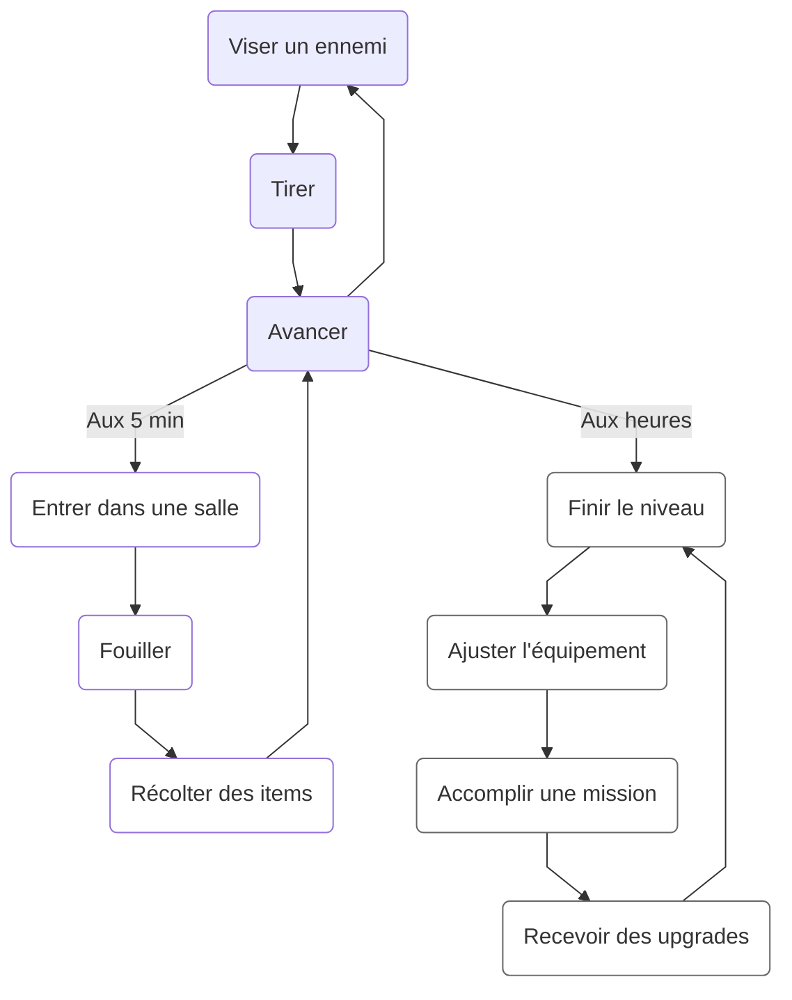
```mermaid
%%{init: {"flowchart": {"curve": "linear"}}}%%
graph TD
    
    direction TD
      
      A1(Viser un ennemi) --> A2
      A2(Tirer) --> A3
      A3(Avancer) --> A1

      A3 -->|Aux 5 min| B1
      B1(Entrer dans une salle):::min --> B2
      B2(Fouiller):::min --> B3
      B3(Récolter des items):::min --> A3
        
      A3 -->|Aux heures| C1
      C1(Finir le niveau):::hour --> C2
      C2(Ajuster l'équipement):::hour --> C3
      C3(Accomplir une mission):::hour --> C4
      C4(Recevoir des upgrades):::hour --> C1

  classDef min fill:transparent;
  classDef hour stroke:#666666,fill:transparent;
```

Pour voir d'autres exemples, consultez la page [_Designing The Core Gameplay Loop: A Beginner’s Guide_](https://gamedesignskills.com/game-design/core-loops-in-gameplay/).

## Moteurs de jeu vidéo

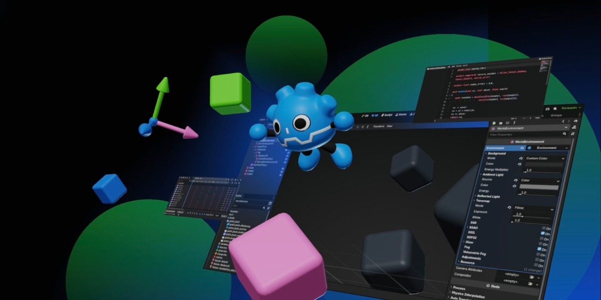{data-zoom-image .aspect-1-1}

### [Godot](https://godotengine.org/fr/)

Un moteur 100 % gratuit, open-source et très léger. 

<!-- > *Exemples :* [Brotato, Dome Keeper, ...](https://godotengine.org/showcase/). -->

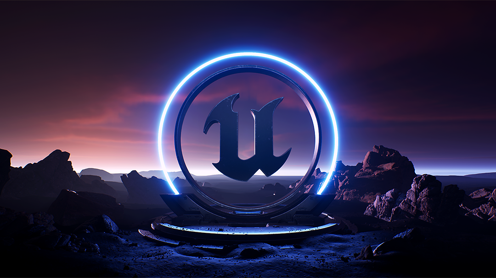{data-zoom-image .aspect-1-1}

### [Unreal Engine](https://www.unrealengine.com/)

Le moteur de choix pour les superproductions (jeux AAA) et le photoréalisme.

<!-- > *Exemples :* [Fortnite, Borderlands 4, Claire Obscure, Black Myth: Wykong, ...](https://www.unrealengine.com/en-US/games). -->

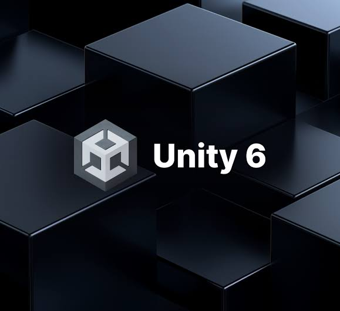{data-zoom-image .aspect-1-1}

### [Unity](https://unity.com/) (⭐️ Choix du cours)

Le moteur le plus polyvalent et le plus utilisé dans l'industrie.

<!-- > *Exemples :* [Rust, Hollow Knight, Outer Wilds, Pokémon GO, Among Us, ...](https://unity.com/madewith). -->

<!-- !!! question "Pourquoi choisir Unity ?"

    - Export WebGL pour jouer directement dans le navigateur
    - Communauté très large et beaucoup de documentation
    - Compte éducationnel gratuit
    - Sera très probablement utilisé en Réalité mixte ;) -->

### Les outils spécialisés

* [Phaser](https://phaser.io/) : cadriciel **JavaScript** pour jeux 2D sur le web.
* [Twine](https://twinery.org/) : récits interactifs à embranchements, sans code !
* [Bitsy](https://bitsy.org/) : minuscules jeux en *pixel art*, dans le navigateur.
* [GameMaker](https://gamemaker.io/) : moteur dédié à la **2D**, langage GML (*Undertale*, *Hotline Miami*).
* [RPG Maker](https://www.rpgmakerweb.com/) : RPG 2D à la *Zelda/Final Fantasy* sans code (*To the Moon*, *Omori*).

## Unity

{.h-auto}

Unity fonctionne sur la majorité des ordinateurs. À moins que votre machine soit particulièrement ancienne, elle devrait satisfaire la [configuration système requise](https://docs.unity3d.com/Manual/system-requirements.html).

Unity fonctionne sur une base de licence. L'une est gratuite et les autres sont [payantes](https://unity.com/fr/products) en fonction des revenus au cours des 12 derniers mois.

| Version | Coût par utilisateur |
| --- | --- |
| **Unity Personal** | **Gratuit** ♥️, si revenus inférieurs à 200 000 $ USD |
| **Unity Pro** | 210 $ USD / mois, si revenus entre 200 001 $ et 24,9 millions $ USD |
| **Unity Enterprise** | _Sur devis_, si revenus supérieurs à 25 millions $ USD |
| **Unity Industry** | _Sur devis_, si obligatoire dès 1 000 000 $ USD pour un usage industriel (hors jeux/divertissement) |

TLDR; c'est gratuit :wink:

### Installation

Unity a besoin du logiciel Unity Hub pour être installé. 

Unity Hub sert, entre autres, à gérer les versions de Unity et créer des projets.

  

  **[Compte Unity et installation](./extra/installation-unity-hub.md){.stretched-link .back}** 

## Présentation de Unity Hub et Unity

<figure markdown>
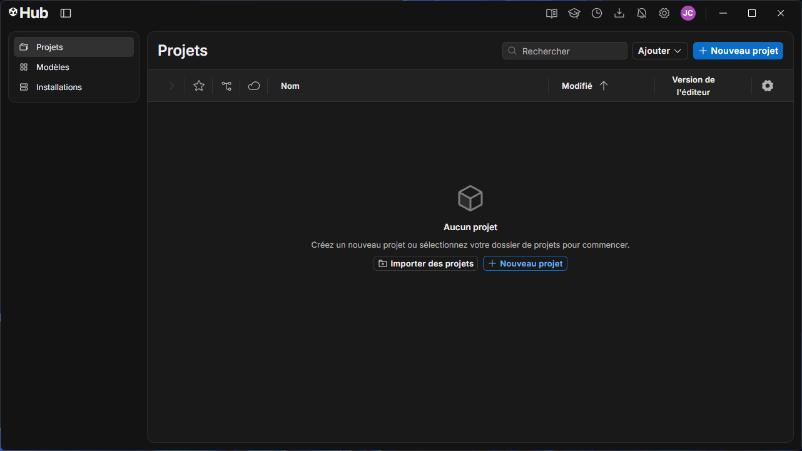{data-zoom-image}
<figcaption markdown>Unity Hub</figcaption>
</figure>

<figure markdown>
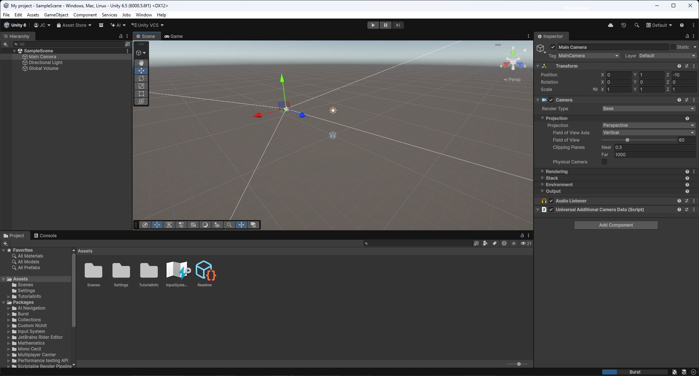{data-zoom-image}
<figcaption markdown>Unity</figcaption>
</figure>

### Panneaux

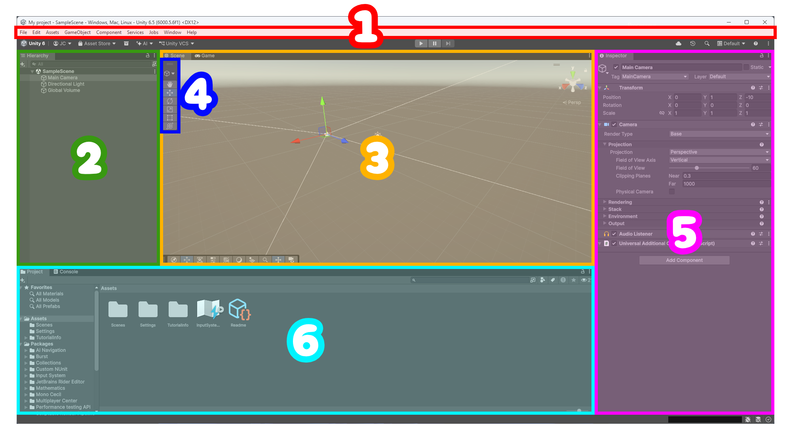{data-zoom-image}

1. **Barre de menu** : Regroupe les options globales du logiciel (sauvegarde, paramètres généraux et ouverture de nouvelles fenêtres).
2. **Panneau _Hierarchy_** : Liste tous les objets (GameObjects) de la scène active et permet d'organiser leurs relations de parenté (parent/enfant).
3. **Panneau _Scene_** : L'espace de travail visuel (2D/3D) pour construire votre niveau en y plaçant vos objets. (Le test du jeu se fait dans l'onglet Game).
4. **Barre d'outils** : Fournit les outils de manipulation spatiale pour sélectionner, déplacer, pivoter et redimensionner les objets de la scène.
5. **Panneau _Inspector_** : Affiche et permet de modifier les propriétés et composants (Components) de l'élément sélectionné (objet ou ressource).
6. **Panneau _Project_** : L'explorateur de fichiers. Il rassemble toutes vos ressources (Assets), importées (modèles, sons) ou créées dans Unity (scripts, matériaux).

### Assets store

[Asset Store](https://assetstore.unity.com/) est le magazin de Unity pour ajouter des objets 2D, 3D, des scripts et des matériaux aux projets. Voici comment l'utiliser : 

1. Dans la barre de menu de Unity, cliquez sur `Window` > `Package Management` > `Asset Store`. Une page Web s'ouvrira.
1. Cliquer sur une des ressources.
1. Appuyez suz « _Add to my assets_ », acceptez les conditions et revenez dans Unity.
1. Cliquez sur `Window` > `Package Management` > `Package Manager`. Une petit fenêtre s'ouvrira.
1. Pour ajouter la ressource du Assets Store à votre projet, cliquez dessus, puis sur « Download »
1. Une fois téléchargé. Cliquez sur « Import ... to project » (puis sur « Install / Upgrade » si demandé).
1. Une autre fenêtre s'ouvrira, cliquez sur « Import ».

Avec le compte éducationnel, vous avez accès gratuitement aux assets de « POLYGON - Sampler Pack - Art by Synty » d'une valeur de 80 $ USD.

## Devoirs

  {.aspect-4-3}

  <small>Devoir - Unity</small> 
  **[Tutoriel pour commencer avec Unity](./devoirs/get-started-with-unity/index.md){.stretched-link .back}**

  {.aspect-4-3}

  <small>Devoir - Unity</small> 
  **[Faire la demande de compte éducationnel](./extra/installation-unity-hub.md){.stretched-link .back}**

  {.aspect-4-3}

  <small>Devoir - Unity</small> 
  **[Ajouter le Sampler Pack à votre compte éducationnel](https://tim-montmorency.com/compendium/582-401-realite-mixte/cours01.html#ajouter-le-sampler-pack-de-synty-studios-a-vos-assets:~:text=POLYGON%20%2D%20Sampler%20Pack){.stretched-link .back}**

<!-- Savoirs essentiels touchés : Logiciels d'intégration d'expériences ludiques, choix du logiciel, installation et configuration des ressources. -->

<!-- Notes de préparation (archivées) :

Commencer le cours avec le gdd. Comme ça ensuite on enchaine avec les sujets du gdd.

https://learn.unity.com/tutorial/fill-out-a-game-design-document
https://www.codecks.io/blog/2023/how-to-design-your-steam-store-page/
https://www.codecks.io/blog/2020/curious-expedition-financial-history/
https://www.graybeardgames.com/download/diablo_pitch.pdf
https://www.reddit.com/r/gamedesign/comments/7ze7xq/finished_game_design_document_examples/
https://www.codecks.io/blog/writing-modern-game-design-documents/
https://www.productionalchemist.com/p/why-game-design-docs-still-matter

Gdd : https://www.youtube.com/watch?v=lxFbog6jpVU
Management d'un projet : https://www.youtube.com/watch?v=kJP45RqyXN8
Dev + design process : https://www.youtube.com/watch?v=YdKPCFlFbOA
https://www.youtube.com/watch?v=aBZZXoV9MUk

https://craftpix.net/freebies/filter/2d-game-kits/
https://www.gameart2d.com/#gsc.tab=0
https://www.mixamo.com/#/
https://itch.io/game-assets/free
-->
