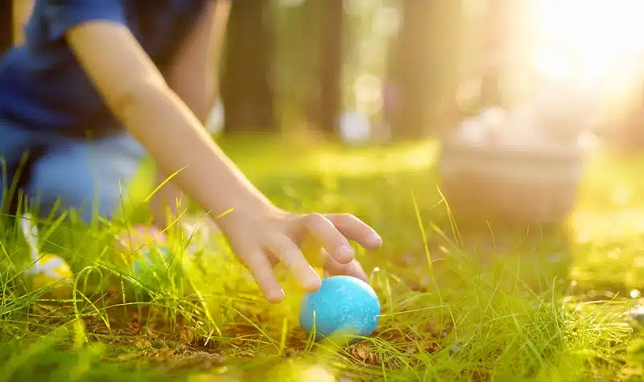
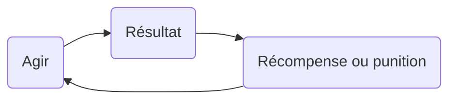

# Cours 1

<style>.md-sidebar--secondary .md-nav .md-nav { display: none; }</style>

*[LTS] : Long-Term Support
*[UX] : User Experience

## Le ludisme

{.w-100}

> **Ludisme** n.m.[^ludisme]<br>
> Comportement caractérisé par la recherche systématique du jeu sous toutes ses formes.<br>
> latin *ludus*, jeu, [*ludologie*](https://vitrinelinguistique.oqlf.gouv.qc.ca/fiche-gdt/fiche/26502181/ludologie)

[^ludisme]: [Définition du mot ludisme selon Larousse](https://www.larousse.fr/dictionnaires/francais/ludisme/48009)

Le ludisme, c'est l'**engagement** et les **comportements** d'une personne envers un **jeu**. 

L'**amusement** et l'**expérimentation** sont essentiels au développement de l'aspect ludique de l'expérience.

Comment fait-on pour créer une expérience ludique ? On travaille l'expérience utilisateur (_UX_) avec une **palette d'ingrédients** — pas une liste de cases à cocher : aucun jeu ne les utilise tous (*Tetris* n'a pas de narration, *Dear Esther* n'a pas de défi). Chaque jeu compose sa propre recette.

!!! abstract "Le cadre MDA : des règles à l'émotion"
    Un modèle célèbre ([Hunicke, LeBlanc & Zubek, 2004](https://users.cs.northwestern.edu/~hunicke/MDA.pdf)) explique comment ces ingrédients s'assemblent : le designer code des **Mécaniques** (règles : hauteur de saut, points de vie) → qui produisent des **Dynamiques** en jeu (comportements émergents : camper, faire du *speedrun*) → qui déclenchent des **Esthétiques** (émotions : défi, découverte, camaraderie). Le joueur vit le chemin **inverse** : il ressent d'abord, comprend les règles ensuite. Concevoir un jeu, c'est régler des mécaniques pour viser une émotion.

### :speaking_head: Narration

Raconter une histoire donne un **sens** aux actions du joueur (ex. : on ne pousse pas un bouton, on sauve quelqu'un!). 

Par les **dialogues**, l'**ambiance**, les **décisions** et le **scénario**, la narration crée un investissement émotionnel et l'envie de connaître la suite.

<div class="grid grid-1-2" markdown>
{data-zoom-image}

Dans [Donjons & Dragons](https://fr.wikipedia.org/wiki/Donjons_et_Dragons), la narration est entièrement interactive et partagée.
</div>

<div class="grid grid-1-2" markdown>
{data-zoom-image}

Dans [Call of Juarez (2013)](https://fr.wikipedia.org/wiki/Call_of_Juarez:_Gunslinger), la narration sonore est continuellement guidée par les actions des joueurs.
</div>

### :fontawesome-solid-gears: **Mécanique**

Les règles et systèmes qui déterminent **comment on interagit avec le jeu**. 

Une bonne mécanique génère des **choix intéressants** et un plaisir de **maîtrise** (comprendre, expérimenter, s'améliorer).

<div class="grid grid-1-2" markdown>
{data-zoom-image}

Dans [Magic: The Gathering](https://magic.wizards.com/), la mécanique du « *Tap* » force le joueur à faire des stratégies en indiquant visuellement qu'une ressource ou une créature a été utilisée pour le tour.
</div>

<div class="grid grid-1-2" markdown>
{data-zoom-image}

Dans [Portal (2011)](https://fr.wikipedia.org/wiki/Portal_2), les joueurs doivent résoudre des énigmes en manipulant des trous de ver.
</div>

!!! example "Le gameplay émergent"
    Quand les règles sont conçues comme des **systèmes qui interagissent** (le feu brûle le bois, l'électricité traverse l'eau, le vent propage le feu), les joueurs inventent des solutions que personne n'a scriptées. C'est tout le plaisir de *Tears of the Kingdom* ou des *immersive sims* comme *Deus Ex* : le jeu surprend même ses créateurs.

### :paintbrush: **Visuel**

L'environnement, les interfaces, les illustrations et les effets donnent au jeu son **identité** et son **ambiance**. 

Le visuel invite le joueur à entrer dans l'univers et à y rester. Il rend aussi le jeu **lisible**. C'est-à-dire qu'on comprend d'un coup d'oeil où aller et quoi faire.

<div class="grid grid-1-2" markdown>
{data-zoom-image}

Dans [Dixit](https://boardgamegeek.com/boardgame/39856/dixit), le graphisme surréalistes des cartes forcent les joueurs à imaginer des associations d'idées abstraites.
</div>

<div class="grid grid-1-2" markdown>
{data-zoom-image}

Dans [Thank Goodness You're Here! (2024)](https://store.steampowered.com/app/2366980/Thank_Goodness_Youre_Here/), les dessins affirment un univers jovial, drôle et grotesque.
</div>

### :musical_note: **Son**

Le son **immerge** là où l'image ne fait que montrer. 

Le son installe une **émotion**, **oriente** le joueur (ex. : un danger à venir) et **récompense** les actions.

<div class="grid grid-1-2" markdown>
{data-zoom-image}

Dans le jeu [Marco Polo](https://fr.wikipedia.org/wiki/Marco_Polo_(jeu)), le son est utilisé comme radar afin de retrouver son adversaire.
</div>

<div class="grid grid-1-2" markdown>
{data-zoom-image}

Dans [A Blind Legend (2016)](https://store.steampowered.com/app/437530/A_Blind_Legend/), les joueurs doivent se fier exclusivement au son pour naviguer et interagir avec le monde. Aucune image dans ce jeu vidéo !
</div>

!!! example "L'impopularité du traitement sonore"

    Le son est souvent mis de côté. Peut-être parce que c'est moins tangible qu'une image 🤷 ?

    Pourtant, il joue un rôle tout aussi important que l'image. 
    
    Le son c'est l'équivalent du glaçage sur un gâteau d'aniversaire. C'est pas obligatoire.. mais un peu quand même 😅

    {data-zoom-image .w-50}

### :octicons-search-16: **Exploration**

Éveiller la **curiosité**, puis (surtout) la **récompenser**.

Ça peut être en découvrant une nouvelle salle, une section secrète ou une information.

<!-- <div class="grid grid-1-2" markdown>
{data-zoom-image}

Dans une [chasse aux trésors](https://fr.wikipedia.org/wiki/Chasse_au_tr%C3%A9sor), l'objectif est assez intéressant pour se donner tout le mal pour le trouver. Ça ne doit être ni trop difficile, ni trop facile.
</div> -->

<div class="grid grid-1-2" markdown>
{data-zoom-image}

Dans un [jeu d'évasion](https://en.wikipedia.org/wiki/Escape_room), fouiller le pièces et manipuler les objets permet d'avancer dans le jeu.
</div>

<div class="grid grid-1-2" markdown>
{data-zoom-image}

Dans [Dave the diver (2023)](https://store.steampowered.com/app/1868140/DAVE_THE_DIVER/), l'exploration fait avancer le niveau de difficulté et la narration du jeu.
</div>

### :crossed_swords: **Défi**

Un jeu trop facile peut provoquer l'ennui, trop difficile, la frustration/découragement.

Un obstacle à la hauteur des compétences du joueur crée un état d'engagement, mais ce qui le fait continuer est la récompense.

<!-- Cet équilibre ennui/frustration se nomme ***flow*** ([Sweetser, 2020, OzCHI/ACM](https://dl.acm.org/doi/10.1145/3441000.3441048)). Jesper Juul ([*The Art of Failure*, MIT Press, 2013](https://mitpress.mit.edu/9780262529952/the-art-of-failure/)) montre même qu'on recherche l'échec pour rendre la réussite signifiante. Mais le défi n'est pas obligatoire — dans le [cadre MDA](https://users.cs.northwestern.edu/~hunicke/MDA.pdf), le *challenge* n'est qu'une des **huit esthétiques** du plaisir de jeu; les jeux *cozy* et les *walking simulators* misent plutôt sur la découverte et la sensation. Certains jeux maintiennent même le *flow* en trichant : l'**ajustement dynamique de la difficulté** (*DDA*) module en douce le nombre d'ennemis ou les objets échappés selon ta performance — comme le « AI Director » de *Left 4 Dead*. -->

<div class="grid grid-1-2" markdown>
{data-zoom-image}

Dans [Elden Ring (2022)](https://store.steampowered.com/app/1245620/ELDEN_RING/), l'échec est utilisé comme un outil pour emplifier la gratification de réussite.
</div>

### :trophy: **Accomplissements**

Les récompenses (*achievements*, mais aussi items et *upgrades*,) **valident la progression** du joueur et fixent des objectifs à poursuivre.

<div class="grid grid-1-2" markdown>
{data-zoom-image}

Dans [(the) Gnorp Apologue (2023)](https://store.steampowered.com/app/1473350/the_Gnorp_Apologue/), on ne progresse que par la bonne gestion des _upgrades_.
</div>

### :material-arrow-decision: **Agentivité**

Donner au joueur le pouvoir d'**influencer** le jeu et son déroulement crée une impression de **liberté** et de **contrôle**. 

<div class="grid grid-1-2" markdown>
{data-zoom-image}

Dans [Baldurs gate 3 (2023)](https://store.steampowered.com/app/1086940/Baldurs_Gate_3/), les joueurs font des choix qui influencent l'histoire, les relations entre les personnages, ainsi que l'issue des quêtes.
</div>

### :people_wrestling: **Compétition** / :handshake: **Coopération**

**Rivalité**, **entraide**, **négociation** et **trahison** sont des dynamiques extrêmement intéressantes pour l'engagement des joueurs. 

Néanmoins, pour être efficace et convainquantes, ces dynamiques doivent être performées par des humains.

<div class="grid grid-1-2" markdown>
{data-zoom-image}

Dans [Keep Talking and Nobody Explodes (2015)](https://store.steampowered.com/app/341800/Keep_Talking_and_Nobody_Explodes/), un des joueurs doit désamorcer une bombe en suivant les instructions des autres joueurs qui ne voient pas ladite bombe.
</div>

<!-- 
!!! quote "Références"
    Cette palette d'ingrédients est une synthèse pédagogique ancrée dans la recherche récente :

    * Rigby, S. & Ryan, R. M. (2011). *Glued to Games: How Video Games Draw Us In and Hold Us Spellbound*. Praeger — les trois besoins psychologiques que les jeux satisfont : **compétence** (défi), **autonomie** (agentivité), **relation** (coopération/compétition).
    * Juul, J. (2013). [*The Art of Failure: An Essay on the Pain of Playing Video Games*](https://mitpress.mit.edu/9780262529952/the-art-of-failure/). MIT Press — pourquoi on recherche des jeux qui nous font échouer.
    * Isbister, K. (2016). [*How Games Move Us: Emotion by Design*](https://mitpress.mit.edu/9780262534451/how-games-move-us/). MIT Press — comment mécaniques, narration et jeu social produisent l'émotion.
    * Fullerton, T. (2018). *Game Design Workshop: A Playcentric Approach to Creating Innovative Games* (4ᵉ éd.). CRC Press — le manuel de conception centrée sur l'expérience du joueur.
    * Schell, J. (2019). *The Art of Game Design: A Book of Lenses* (3ᵉ éd.). CRC Press — manuel de référence sur les « lentilles » d'analyse de l'expérience de jeu.
    * Sweetser, P. (2020). [*GameFlow 2020: 15 Years of a Model of Player Enjoyment*](https://dl.acm.org/doi/10.1145/3441000.3441048). OzCHI '20, ACM — bilan de 200+ applications du modèle **GameFlow** : concentration, défi, habiletés, contrôle, buts clairs, rétroaction, immersion, interaction sociale.
    * Tyack, A. & Mekler, E. D. (2020). [*Self-Determination Theory in HCI Games Research: Current Uses and Open Questions*](https://doi.org/10.1145/3313831.3376723). CHI '20, ACM — revue de 110 études sur la motivation des joueurs.

    **Classiques fondateurs** (toujours cités par la recherche ci-dessus) : Huizinga, *Homo Ludens* (1938); Caillois, *Les jeux et les hommes* (1958); Csikszentmihalyi, *Flow* (1990); Hunicke, LeBlanc & Zubek, [cadre MDA et ses 8 esthétiques](https://users.cs.northwestern.edu/~hunicke/MDA.pdf) (2004). -->

## Jeu vidéo


### Distributeurs

Les canaux par lesquels un jeu se rend aux joueurs — chaque écosystème a les siens :

* **PC** : [Steam](https://steampowered.com/), [Epic Games Store](https://store.epicgames.com/), [GOG](https://www.gog.com/), [Itch.io](https://itch.io/), [Game Jolt](https://gamejolt.com/)
* **Consoles** : [PlayStation Store](https://store.playstation.com/), [Nintendo eShop](https://www.nintendo.com/us/store/), [Xbox Store](https://www.xbox.com/microsoft-store)
* **Mobile** : [App Store](https://www.apple.com/app-store/), [Google Play](https://play.google.com/)
* **Web** : [Itch.io](https://itch.io/games/platform-web), [Newgrounds](https://www.newgrounds.com/), [Poki](https://poki.com/), [CrazyGames](https://www.crazygames.com/)

!!! note ""
    C'est sur **Itch.io** que nous publierons nos jeux (build WebGL) — gratuit, sans processus d'approbation, et jouable directement dans le navigateur.

#### Statistiques et Données

* [SteamDB](https://steamdb.info/) (Données Steam)
* [Games Stats](https://games-stats.com/) (Statistiques de ventes)
* [HowLongToBeat](https://howlongtobeat.com/) (Durée des jeux)
* [IsThereAnyDeal](https://isthereanydeal.com/) (Historique des prix)

### Plateformes & Contrôles

Le mot « plateforme » désigne pêle-mêle des machines (*Switch*), des systèmes (*Windows, iOS*), des technologies (*WebGL*) et des services (*GeForce Now*). Pour concevoir un jeu, la question utile est plus simple : **sur quel appareil joue-t-on, avec quels contrôles, et dans quel contexte ?** Chaque réponse impose des choix de design.

| Support (appareil) | Exemples | Contrôles typiques | Conséquences pour le design |
| :--- | :--- | :--- | :--- |
| **PC** | Windows, Mac, Linux, Steam Deck | Clavier / Souris, Manette | Précision de la souris, raccourcis, options graphiques |
| **Consoles** | PlayStation, Xbox, Switch | Manette | UI lisible de loin (télé), navigation aux boutons |
| **Mobile** | iOS, Android | Écran tactile, Gyroscope | Sessions courtes, gros boutons, doigts qui masquent l'écran |
| **Réalités (VR/AR)** | Meta Quest, PS VR2, Apple Vision Pro | Manettes de mouvement, mains/yeux | Confort (cinétose), interactions physiques |
| **Navigateur Web** | HTML5 / WebGL / WebAssembly | Clavier / Souris | Chargement léger, jouable sans installation — **notre cible avec Itch.io** |

!!! note "Et le *cloud gaming* ?"
    Xbox Cloud Gaming ou GeForce Now ne sont pas des appareils : ce sont des **services de diffusion** qui font tourner le jeu ailleurs et streament l'image vers n'importe lequel des supports ci-dessus. Pour le designer, une contrainte s'ajoute : la latence.

### Genres de jeux

Plutôt que de lister les centaines de [sous-genres existants](https://steamdb.info/tags/), voici des grandes lignes de catégories de jeu :

* **Action, réflexes**
  > *Exemples :* Plateforme (*[Super Mario](https://supermario-game.com/fr)*, Hollow Knight, Rayman Legends), Tir (*[Counter-Strike](https://www.counter-strike.net/cs2)*, *[Resident Evil](https://www.residentevil.com/)*, Fortnite, Valorant), Combat (*[Street Fighter](https://www.streetfighter.com/)*, Super Smash Bros, Mortal Kombat), Rythme (*[Beat Saber](https://beatsaber.com/)*, Geometry Dash, Just Dance), Roguelike (*[Hades](https://www.supergiantgames.com/games/hades-ii/)*, The Binding of Isaac, Dead Cells).
* **Aventure, narration**
  > *Exemples :* Monde ouvert (*[GTA V](https://www.rockstargames.com/gta-v)*, Red Dead Redemption 2, The Legend of Zelda, Ghost of Tsushima), Point & Click (*[Monkey Island](https://returntomonkeyisland.com/)*, Fran bow, The Case of the Golden Idol, Disco Elysium), Film interactif (*[Life Is Strange](https://lifeisstrange.square-enix-games.com/en-us)*, Until Dawn, Detroit: Become Human).
* **Réflexion, casse-tête**
  > *Exemples :* Logique (*[Tetris](https://play.tetris.com/)*, *[The Witness](https://www.playstation.com/en-ca/games/the-witness/)*, Portal 2), Évasion (*[Escape Simulator](https://pinestudio.com/games/escape-simulator/)*, Outer Wilds, The Room), Physique (*[Kerbal Space Program](https://www.kerbalspaceprogram.com/)*, Poly Bridge, Teardown).
* **Jeu de rôle (RPG)**
  > *Exemples :* Action-RPG (*[Diablo 4](https://diablo4.blizzard.com/fr-fr/)*, Elden Ring, Cyberpunk 2077), RPG Tactique (*[Baldur's Gate 3](https://baldursgate3.game/)*, XCOM 2).
* **Stratégie, gestion**
  > *Exemples :* Gestion (*[Cities: Skylines](https://www.paradoxinteractive.com/games/cities-skylines/about)*, *[Stardew Valley](https://www.stardewvalley.net/)*, RimWorld), Stratégie (*[Civilization](https://civilization.2k.com/)*, *[League of Legends](https://www.leagueoflegends.com/en-us/)*).
* **Simulations, bac à sable**
  > *Exemples :* Simulation de vie (*[Paralives](https://www.paralives.com/)*, Les Sims), Sandbox (*[Minecraft](https://www.minecraft.net/fr-fr)*, Terraria), Simulateurs (*[Euro Truck](https://eurotrucksimulator2.com/)*, Flight Simulator).
* **Divers**
  > *Exemples :* Cartes (*[Balatro](https://www.playbalatro.com/)*, Hearthstone, Slay the Spire), Incrémentiel/Clicker (*[(the) Gnorp Apologue](https://gnorp.dev/)*), Party (Mario Party, Among Us, Jeux sur Netflix).

## Prérequis

> J'ai besoin de A pour faire B. 

Les prérequis sont des critères que le joueur doit satisfaire pour faire autre chose. En design de jeu, ce concept porte le nom de _gating_.

Ça sert à contrôler le **rythme**, **enseigner les mécaniques**, maintenir le **défi**, créer un sentiment de **maîtrise** et alimenter la logique de **récompense**.

Sa forme la plus classique est le mécanisme **serrure / clé** : 

<p class="codepen aspect-4-1" data-theme-id="50173" data-height="300" data-pen-title="Phaser - Prérequis" data-default-tab="result" data-slug-hash="xxoXazb" data-user="tim-momo" style="height: 300px; box-sizing: border-box; display: flex; align-items: center; justify-content: center; border: 2px solid; margin: 1em 0; padding: 1em;">
  <span>See the Pen <a href="https://codepen.io/tim-momo/pen/xxoXazb">
  Phaser - Prérequis</a> by TIM Montmorency (<a href="https://codepen.io/tim-momo">@tim-momo</a>)
  on <a href="https://codepen.io">CodePen</a>.</span>
</p>
<script async src="https://public.codepenassets.com/embed/index.js"></script>

<!-- 
!!! quote "Sources"
    * Adams, E. & Dormans, J. (2012). [*Game Mechanics: Advanced Game Design*](https://www.peachpit.com/store/game-mechanics-advanced-game-design-9780132946704), chap. 11 « Progression Mechanisms » — les mécanismes *lock-and-key* comme fondement de la progression.
    * Juul, J. (2002). [*The Open and the Closed: Games of Emergence and Games of Progression*](https://jesperjuul.net/text/openandtheclosed.html), CGDC, Tampere — la distinction académique entre jeux d'émergence et jeux de progression.
    * Ashmore, C. & Nitsche, M. (2007). [*The Quest in a Generated World*](https://dl.digra.org/index.php/dl/article/view/312), DiGRA — la structure clé/serrure comme unité de base des quêtes.

    **Vulgarisation** (pour aller plus loin, format accessible) :

    * Brown, M. [*Boss Keys*](https://www.youtube.com/playlist?list=PLc38fcMFcV_ul4D6OChdWhsNsYY3NA5B2) (Game Maker's Toolkit) — analyse vidéo du *gating* dans les donjons de *Zelda* et les *metroidvania*.
    * [*The Level Design Book*, chap. « Gates »](https://book.leveldesignbook.com/process/layout/typology/gates) — typologie des *gates* (hard/soft, direction, lock and key) et bonnes pratiques. -->

### Types de prérequis (_gating_)

En design, on classe les *gates* selon **ce que le joueur doit acquérir ou démontrer** pour franchir la barrière :

1. **Progression** : Niveau de personnage requis
  - Avoir le niveau 10 pour entrer dans le donjon
  - Crochetage niveau 75 pour déverouiller certains cadnas
1. **Économie** : Quantité de ressources accumulées 
  - Avoir 1000 pièces d'or pour acheter une maison
  - Collecter assez d'étoiles pour ouvrir certaines portes
1. **Inventaire** : Possession d'un objet spécifique 
  - Trouver une carte bleue pour ouvrir les portes bleus 
1. **Scénario** : Choix narratif active ou désactive un élément du jeu 
  - Un garde bloque la porte du village tant qu'on n'a pas parlé au vieux Kamajī
1. **Compétence du personnage** : Capacité apprise 
  - Débloquer le double-saut pour traverser le ravin
1. **Environnement** : Conditions contextuelles
  - Attendre qu'il fasse nuit pour cueillir une fleur spéciale
1. **Habileté du joueur** : C'est le *joueur* qui doit s'améliorer, pas son personnage 
  - Un boss infranchissable tant qu'on n'a pas maîtrisé ses séquences d'attaque
1. **Connaissance** : Informations à découvrir par l'expérimentation pour progresser 
  - Manger une pomme en sautant fait lever le soleil


| Type de *gate* | Ce qui déverrouille | Expérience produite |
| -------------- | ------------------- | ------------------- |
| Progression | Niveau / statistiques | Croissance, investissement |
| Économie | Monnaie / matériaux | Gestion, accumulation |
| Inventaire | Objet spécifique | Fouille, découverte |
| Scénario | Déclencheur narratif / choix | Rythme, cohérence du récit |
| Compétence du personnage | Nouvelle action (verbe) | Retour sur ses pas, carte qui s'ouvre |
| Environnement | État du monde / moment | Routine, observation |
| Habileté du joueur | Maîtrise, réflexes | Triomphe sur la difficulté |
| Connaissance | Information comprise | Eurêka! |

## Boucles de jeu

{.aspect-4-3}

Une **boucle de jeu** est une séquence d'actions que le joueur répète tout au long de la partie.

Une boucle bien conçue est **simple à comprendre**, mais assez **riche** pour rester intéressante.

### Boucle principale *(core loop)*

La boucle principale est la séquence d'actions fondamentale - ce que le joueur répète en quelques secondes ou minutes.


```mermaid
graph LR
    A(Agir) --> B(Résultat)
    B --> C(Récompense ou punition)
    C --> A
```

<div class="grid grid-1-2" markdown>
{data-zoom-image}

Dans [Elden Ring (2022)](https://store.steampowered.com/app/1245620/ELDEN_RING/), la boucle principale est : *explorer une zone → affronter un ennemi → mourir ou vaincre → récupérer des runes → s'améliorer → explorer plus loin*.
</div>

!!! tip "Exprimer une boucle en verbes d'action"
    Pour décrire une boucle principale, on utilise des **verbes d'action concrets**.

    > ❌ *"Le joueur ressent la tension de l'exploration"*  
    > ✅ *"Le joueur explore, attaque, meurt, réapparaît et recommence"*

    Ces **verbes** (*sauter, tirer, se cacher, parler, construire*) sont le vocabulaire que tu donnes au joueur. Règle d'or : chaque verbe doit servir à quelque chose de **distinct** — pas deux outils dont l'un est juste une version plus puissante de l'autre (c'est l'*orthogonalité*).

<!-- ### Boucle méta *(meta loop)*

La boucle méta est la boucle de **long terme** - ce qui motive le joueur à relancer le jeu d'une session à l'autre. Elle s'appuie souvent sur la progression, les déblocages ou l'amélioration permanente.

Dans [(the) Gnorp Apologue (2023)](https://store.steampowered.com/app/1473350/the_Gnorp_Apologue/), la boucle méta est : *accumuler des éclats → acheter des améliorations → accumuler encore plus vite → débloquer de nouvelles mécaniques*. On répète la même boucle principale, mais on est toujours plus puissant. -->

### Boucles optionnelles

Les boucles optionnelles enrichissent l'expérience sans être au cœur du jeu : quêtes annexes, collections, personnalisation, mini-jeux, etc.

<div class="grid grid-1-2" markdown>
{data-zoom-image}

Dans [Dave the Diver (2023)](https://store.steampowered.com/app/1868140/DAVE_THE_DIVER/), la boucle principale est *plonger → chasser du poisson → remonter*. La boucle optionnelle - gérer le restaurant le soir - n'est pas obligatoire, mais elle donne une raison supplémentaire de rejouer.
</div>

<!-- ### Boucles de rétroaction

À ne pas confondre avec les boucles d'actions ci-dessus : la **boucle de rétroaction** décrit comment le système réagit au succès ou à l'échec du joueur.

* **Positive** (*snowballing*) : le succès nourrit le succès. Dans *Civilization*, chaque ville capturée fournit les ressources pour capturer la suivante. Risque : une partie « décidée » dès le début, sans espoir pour le perdant.
* **Négative** (*rubber-banding*) : le système freine le meneur ou aide le retardataire. Dans *Mario Kart*, le dernier reçoit la carapace bleue, le premier des bananes. Utilité : des parties serrées jusqu'à la fin. -->

!!! abstract "À retenir"
    Un jeu solide a une **boucle principale claire** et quelques **boucles optionnelles** pour la variété.  
    Quand la boucle principale est mal conçue, le jeu paraît creux ou répétitif.

## Moteurs de jeu vidéo

<div class="grid grid-1-2" markdown>
{data-zoom-image .aspect-1-1}

<div markdown>
### Godot

Un moteur 100 % gratuit et open-source, léger et en pleine ascension. Il se distingue par son architecture innovante basée sur des _nodes_ et des scènes. (Langage : GDScript)

> *Exemples :* [Brotato, Dome Keeper, ...](https://godotengine.org/showcase/).
</div>
</div>

<div class="grid grid-1-2" markdown>
{data-zoom-image .aspect-1-1}

<div markdown>
### Unreal Engine

Le moteur de choix pour les superproductions (jeux AAA) et le photoréalisme. (Langage : C++/Verse, Blueprints)

> *Exemples :* [Fortnite, Borderlands 4, Claire Obscure, Black Myth: Wykong, ...](https://www.unrealengine.com/en-US/games).
</div>
</div>

<div class="grid grid-1-2" markdown>
{data-zoom-image .aspect-1-1}

<div markdown>
### Unity (⭐️ Choix du cours)

Le moteur le plus polyvalent et le plus utilisé dans l'industrie. (Langage : C#)

> *Exemples :* [Rust, Hollow Knight, Outer Wilds, Pokémon GO, Among Us, ...](https://unity.com/madewith).
</div>
</div>

!!! question "Pourquoi choisir Unity ?"

    - Export WebGL pour jouer directement dans le navigateur
    - Communauté très large et beaucoup de documentation
    - Compte éducationnel gratuit
    - Sera probablement utilisé en Réalité mixte ;)

### Les outils spécialisés

Tous les jeux n'ont pas besoin d'un moteur hyper polyvalent.

* [Phaser](https://phaser.io/) : cadriciel **JavaScript** pour jeux 2D sur le web.
* [Twine](https://twinery.org/) : récits interactifs à embranchements, sans code !
* [Ren'Py](https://www.renpy.org/) : *visual novels* (roman + dialogues + choix).
* [Bitsy](https://bitsy.org/) : minuscules jeux en *pixel art*, dans le navigateur.
* [GameMaker](https://gamemaker.io/) : moteur dédié à la **2D**, langage GML (*Undertale*, *Hotline Miami*).
* [RPG Maker](https://www.rpgmakerweb.com/) : RPG 2D à la *Zelda/Final Fantasy* sans programmation (*To the Moon*, *Omori*).

## Document de conception de jeu (GDD)


Le **Game Design Document** (GDD) décrit tous les aspects fondamentaux d'un jeu vidéo. Rédigé durant la phase de conceptualisation, il sert de fondation au développement.

[Modèle de GDD](https://www.figma.com/fr-fr/communaute/file/1657116644655532636/document-de-conception-gdd){ .md-button .md-button--primary }

!!! question "Est-ce un document définitif ?"

    Absolument pas. En cours de route, des idées tombent à l'eau, d'autres s'ajoutent suite aux phases de test. C'est un document vivant (*live document*), même s'il doit garder une base stable pour éviter que le projet ne parte dans tous les sens (*scope creep*).

## Unity


### Création de compte

### Configuration système requise

https://docs.unity3d.com/Manual/system-requirements.html

### Plan

En tant qu'étudiant-e, vous avez accès au [compte éducationnel](https://unity.com/products/unity-student) qui donne accès à l'éditeur Pro de Unity. Il donne également accès à un paquet d'assets premium gratuitement.

https://unity.com/products/unity-student


## Unity Hub

Pour installer Unity, il faut d'abord se créer un compte.

[Installation unity hub](./extra/installation-unity-hub.md)

### Installer Unity 6

Si vous avez déjà Unity Hub, mais qu'une version plus ancienne de Unity est installée sur votre ordinateur, suivez ces étapes pour installer Unity 6

1. Dans Unity Hub, ouvrez l'onglet Installs (Installations).
2. Cliquez sur le bouton Install Editor (Installer l'éditeur) afin d'installer une nouvelle version de Unity.
3. Dans la section Unity 6 Releases, cliquez sur Install pour la version correspondant à votre plateforme.
    > Remarque : Sur macOS, vous devrez choisir entre un processeur Apple Silicon ou Intel. Si vous ne savez pas quel type de processeur équipe votre Mac, consultez l'article d'assistance d'Apple à ce sujet.
4. À l'étape Add Modules (Ajouter des modules), sélectionnez l'option disponible sous DEV TOOLS afin d'installer un environnement de développement compatible.
    * Windows : sélectionnez Visual Studio.
    * macOS : sélectionnez Visual Studio Code.
    L'installation de l'un de ces outils vous permettra d'écrire, d'exécuter et de déboguer votre code plus efficacement dans vos projets Unity.
5. Cliquez sur Continue (Continuer) pour lancer l'installation.
    > Remarque : L'éditeur Unity est une application puissante et de grande taille. Le téléchargement et l'installation peuvent prendre plusieurs minutes.

Une fois l'installation terminée, cette version de l'éditeur Unity apparaîtra dans l'onglet Installs de Unity Hub.

## Structure de fichier

Lorsque vous créez un nouveau projet, je vous conseille de tout de suite créer les dossiers suivants dans votre fenêtre Project. Ainsi, vous pourrez classer vos ressources dès que vous les importez:

```txt
Assets/
  ├── 📁 Plugins (Pour les assets téléchargés sur l'Asset Store)
  └── 📂 _Project
        ├── 📁 Animations
        ├── 📂 Art
        │    ├── 📁 Materials
        │    ├── 📁 Models
        │    └── 📁 Textures
        ├── 📁 Audio
        ├── 📁 Fonts
        ├── 📁 Prefabs
        ├── 📁 Rendering
        ├── 📁 Scenes
        └── 📁 Scripts
```

## Pratique - Unity Essentials Pathway, partie 1

!!! abstract "Objectif de la pratique"
    Apprivoiser l'éditeur Unity **à ton rythme** avec le parcours officiel [Unity Essentials](https://learn.unity.com/pathway/unity-essentials). Ce que tu ne termines pas en classe se finit en devoir. Au prochain cours, on s'en sert pour faire un **jeu complet en une séance**.

### Mise en route

- [ ] Crée ton compte Unity (ou connecte-toi) - le même servira pour Unity Hub, l'Asset Store et Unity Learn
- [ ] Vérifie que **Unity Hub et Unity 6** sont installés ([guide d'installation](./extra/installation-unity-hub.md))
- [ ] Va sur [learn.unity.com](https://learn.unity.com) et ouvre le parcours **Unity Essentials**

### À compléter (en classe, puis en devoir)

- [ ] Module de prise en main de l'éditeur : interface, fenêtres, layout
- [ ] Navigation dans la Scene view (voler, zoomer, cadrer)
- [ ] Création et manipulation de GameObjects (déplacer ++w++ · pivoter ++e++ · redimensionner ++r++ · dupliquer ++ctrl+d++ · cadrer ++f++)
- [ ] Premiers pas avec le Play mode

!!! tip "Le contenu est en anglais"
    Active les sous-titres au besoin, et note tes questions : on y répond en début de cours 2. L'anglais technique fait partie du métier - autant s'y mettre tout de suite.

!!! warning "Play mode = bac à sable"
    Tout ce que tu modifies **pendant** le Play mode est perdu quand tu l'arrêtes. Vérifie toujours que tu n'es pas en Play avant d'éditer ta scène. C'est le piège numéro 1 des débutants - le Pathway te le montrera.

## Devoirs

<div class="grid grid-1-2" markdown>
  

  <small>Devoir - Unity</small><br>
  **[Essential Pathway #1](./devoirs/pathway-essentials-1.md){.stretched-link .back}**
</div>

<div class="grid grid-1-2" markdown>
  

  <small>Devoir - Conception</small><br>
  **[Analyse d'un jeu existant](./devoirs/gdd.md){.stretched-link .back}**
</div>

<div class="grid grid-1-2" markdown>
  

  <small>Travail 1 - Conception (10 %)</small><br>
  **[GDD de ton jeu de session](./devoirs/gdd-jeu.md){.stretched-link .back}**
</div>

## Savoirs essentiels touchés

Logiciels d'intégration d'expériences ludiques, choix du logiciel, installation et configuration des ressources, classement des fichiers et des médias.

<!-- Notes de préparation (archivées) :

Commencer le cours avec le gdd. Comme ça ensuite on enchaine avec les sujets du gdd.

https://learn.unity.com/tutorial/fill-out-a-game-design-document
https://www.codecks.io/blog/2023/how-to-design-your-steam-store-page/
https://www.codecks.io/blog/2020/curious-expedition-financial-history/
https://www.graybeardgames.com/download/diablo_pitch.pdf
https://www.reddit.com/r/gamedesign/comments/7ze7xq/finished_game_design_document_examples/
https://www.codecks.io/blog/writing-modern-game-design-documents/
https://www.productionalchemist.com/p/why-game-design-docs-still-matter

Gdd : https://www.youtube.com/watch?v=lxFbog6jpVU
Management d'un projet : https://www.youtube.com/watch?v=kJP45RqyXN8
Dev + design process : https://www.youtube.com/watch?v=YdKPCFlFbOA
https://www.youtube.com/watch?v=aBZZXoV9MUk

https://craftpix.net/freebies/filter/2d-game-kits/
https://www.gameart2d.com/#gsc.tab=0
https://www.mixamo.com/#/
https://itch.io/game-assets/free
-->
