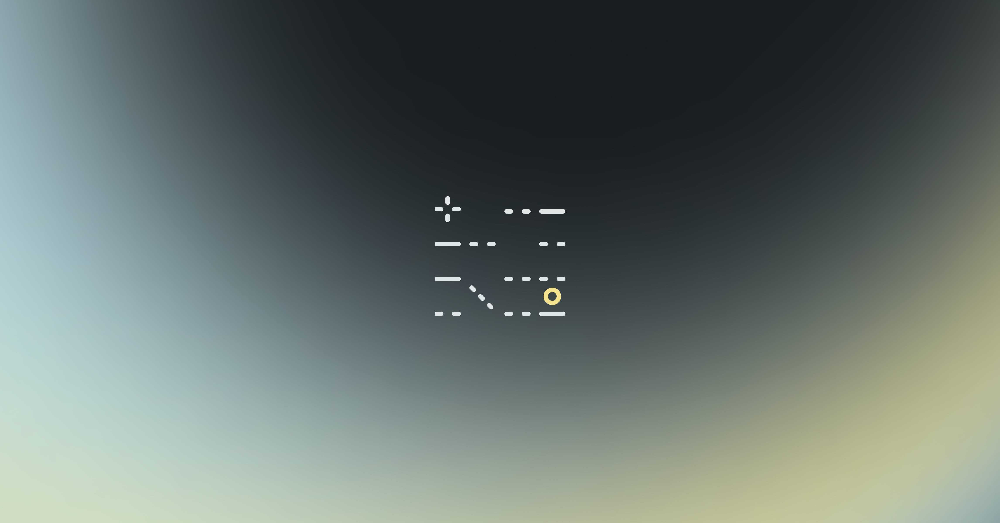

# Cours 2

## I don't know what I'm doing, but I made a game

Aujourd'hui, tu fais **un jeu complet** : un monde, un personnage, un objectif, une victoire, un vrai build. En une séance. C'est possible parce que le tutoriel Get Started With Unity t'a déjà appris l'éditeur - et parce qu'on n'écrit presque pas de code : le personnage vient d'un prefab officiel, et le seul script de la journée est **fourni et expliqué ligne par ligne**.

Tu ne comprendras pas tout. **C'est prévu.** Chaque notion effleurée aujourd'hui sera reprise en profondeur dans les prochaines semaines (voir la carte des notions en bas de page).

<!-- ## Déroulement de la séance

| Temps | Activité |
|---|---|
| 0h00 – 0h15 | Retour sur le tutoriel Get Started With Unity : questions, dépannage |
| 0h15 – 0h50 | Théorie : colliders et triggers, scènes, compilation, mise en ligne |
| 0h50 – 2h00 | Pratique guidée 1/2 : le monde et le personnage |
| 2h00 – 2h15 | Pause |
| 2h15 – 3h20 | Pratique guidée 2/2 : la victoire, le build, la mise en ligne |
| 3h20 – 3h35 | Jalon 0 : on essaie les jeux des voisins | -->

 
## Théorie

### Collisions : détecter que quelque chose se passe

Un objet peut détecter qu'un autre le touche grâce à un **Collider** - une forme invisible (boîte, sphère, capsule) attachée au GameObject.

| | Collider « solide » | Collider **Trigger** |
|---|---|---|
| Effet physique | Bloque (mur, sol) | Laisse passer (fantôme) |
| Utilité | Empêcher de traverser | **Détecter un passage** |
| Événement C# | `OnCollisionEnter` | `OnTriggerEnter` |
| Exemples | Murs, plancher, caisses | Zone d'arrivée, pièce à ramasser, piège |

!!! tip "L'intuition"
    Un trigger, c'est un **rayon laser de magasin** : il ne bloque personne, mais il *sait* que tu es passé - et il peut déclencher quelque chose (un son, une porte, une victoire…).

### Les scènes : les « écrans » du jeu

Une **scène** est un contenant : ton niveau en est une, ton écran de victoire en sera une autre. Le `SceneManager` permet de passer de l'une à l'autre par code. Un jeu complet, c'est presque toujours plusieurs scènes reliées : titre → jeu → fin.

### La structure de fichier

Unity n'impose aucun rangement : c'est à toi de le faire, **dès la création du projet**. Un `Assets/` en vrac devient ingérable en trois semaines.

La convention : tout ce qui vient de l'Asset Store dans `Plugins`, tout ce que tu produis dans `_Project` (le `_` le garde en haut de la liste).

```txt
Assets/
  ├── 📁 Plugins (Pour les assets téléchargés sur l'Asset Store)
  └── 📂 _Project
        ├── 📁 Animations
        ├── 📂 Art
        │    ├── 📁 Materials
        │    ├── 📁 Models
        │    └── 📁 Textures
        ├── 📁 Audio
        ├── 📁 Fonts
        ├── 📁 Prefabs
        ├── 📁 Rendering
        ├── 📁 Scenes
        └── 📁 Scripts
```

### La compilation (build)

Jusqu'ici, ton jeu n'existe que dans l'éditeur. **Compiler**, c'est produire une application autonome (`.exe` / `.app`) que n'importe qui peut lancer sans Unity. C'est l'étape qui transforme « mon projet » en « mon jeu ».

### La mise en ligne : itch.io

[itch.io](https://itch.io) est LA plateforme des jeux indépendants et des game jams : n'importe qui peut y publier un jeu gratuitement, avec sa page, sa description et ses visuels. C'est là que ton jeu de session sera publié à la fin du cours - alors autant y mettre ton tout premier jeu dès aujourd'hui.


## Pratique

Un monde, un personnage, un objectif, une victoire, un build et une page itch.io - en une séance.

[Exercice - Un jeu complet en une séance :material-arrow-right:](./exercices/cours02-premier-jeu-complet.md){ .md-button .md-button--primary }

## La carte des notions : « je n'ai pas tout compris »

Parfait - c'est prévu. Tout ce qu'on vient d'effleurer sera repris en profondeur, morceau par morceau, appliqué à **ton** jeu :

| Tu viens d'effleurer… | On le maîtrisera au… |
|---|---|
| Le script C# copié-collé | **Cours 4** (programmation) |
| Les triggers et `CompareTag` | **Cours 5** (interactions) |
| Le changement de scène, les menus | **Cours 6** (caméra, scènes, menu) |
| Le build | **Cours 7** (jalon 1), puis **cours 13** (publication web) |
| La page itch.io | **Cours 13** (publication WebGL, crédits) |

## Et maintenant, TON jeu : le document de conception (GDD)



Tu viens de fabriquer un jeu sans l'avoir conçu - c'était l'exercice. À partir du prochain cours, c'est l'inverse : une seule cible, **ton** jeu, pendant 12 séances. Et ça commence sur papier.

Le **Game Design Document** (GDD) décrit tous les aspects fondamentaux d'un jeu vidéo. Rédigé durant la phase de conceptualisation, il sert de fondation au développement : c'est lui qui t'évite de partir dans tous les sens (*scope creep*) et qui rend ton jeu **réalisable** en une session.

[Modèle de GDD](https://www.figma.com/fr-fr/communaute/file/1657116644655532636/document-de-conception-gdd){ .md-button .md-button--primary }

!!! question "Est-ce un document définitif ?"

    Non. En cours de route, des idées tombent à l'eau, d'autres s'ajoutent après les phases de test. C'est un document **vivant** - mais il doit garder une base stable, sinon le projet dérive. C'est pourquoi ton GDD sera validé puis **verrouillé** au cours 3.

!!! tip "Six questions à te poser avant de remettre ton GDD"

    Les [heuristiques d'évaluation d'un jeu](./extra/heuristiques.md) sont une grille de diagnostic qu'on utilisera aux jalons, sur des jeux jouables. Mais [six d'entre elles](./extra/heuristiques.md#les-6-questions-du-gdd) se répondent dès maintenant, sur papier - et ce sont exactement celles qui font échouer un GDD.

## Devoirs

<div class="grid grid-1-2" markdown>
  {.aspect-4-3}

  <small>Devoir - Conception</small><br>
  **[Analyse d'un jeu existant](./devoirs/gdd.md){.stretched-link .back}**
</div>

<div class="grid grid-1-2" markdown>
  {.aspect-4-3}

  <small>Travail 1 - Conception (10 %)</small><br>
  **[GDD de ton jeu de session](./devoirs/gdd-jeu.md){.stretched-link .back}**
</div>

* Fais l'**analyse d'un jeu existant** avant de rédiger ton GDD : c'est l'échauffement, et ça prend 30 minutes
* Remets ton [GDD](./devoirs/gdd-jeu.md) - 11 éléments, dont le moodboard et les médias cités - **au début du cours 3**
* Terminer le [tutoriel Get Started With Unity](./devoirs/get-started-with-unity/index.md) si ce n'est pas fait
* Fais essayer ton build à quelqu'un (ami, parent, coloc) et note ses 3 premières réactions

## Savoirs essentiels touchés

Installation et configuration des ressources, classement des fichiers, création d'un environnement virtuel navigable, intégration d'images, détection de collisions pour le déclenchement d'événements, transitions de scènes, compilation de l'application.
