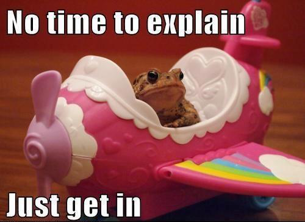
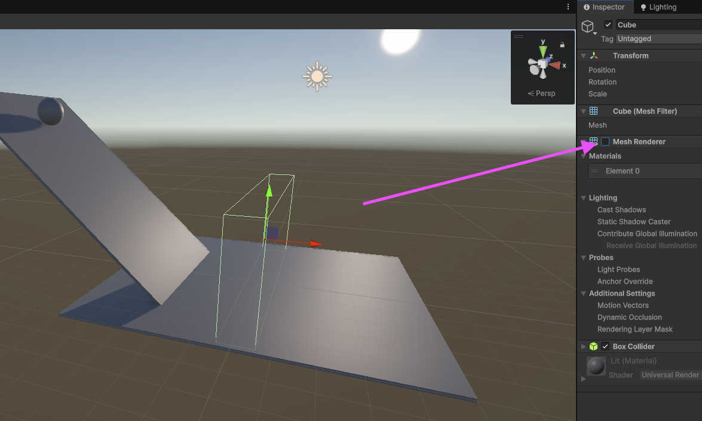
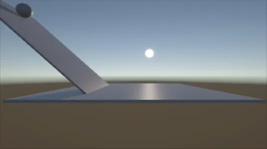
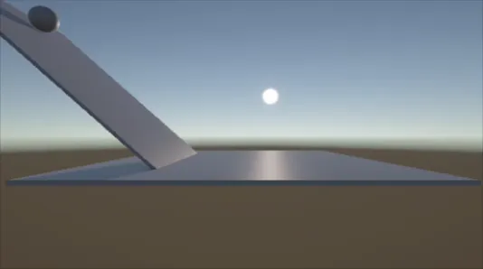
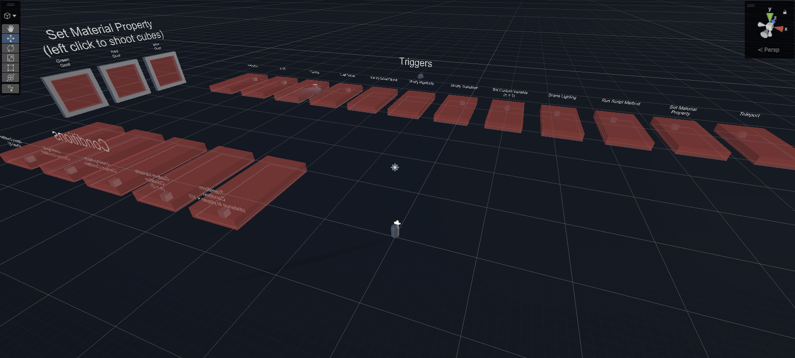

# Cours 2

<!-- {.w-100} -->

*[URP] : Universal Render Pipeline

## Commencer un nouveau jeu

{.w-100}

1. Déterminer ce qu'on veut faire avec un document de conception (On y reviendra)
1. Dans Unity Hub, créer un projet ***Universal 3D***
1. Ajuster la structure du dossier « 📁 Assets »

### Structure de dossiers

À chaque nouveau projet, il sera important de bien classer ses fichiers. 

Voici une structure suggérée.

```txt 
📁 Assets
 ├── 📁 _MOMO
 │    ├── 📁 Animations
 │    ├── 📁 Audio
 │    ├── 📁 Fonts
 │    ├── 📁 Materials
 │    ├── 📁 Prefabs ⭐️ Utile aujourd'hui
 │    ├── 📁 Scenes 💅 Déplacé ici
 │    └── 📁 Scripts
 └── ...
```

<div class="grid align-items-top" markdown>
<figure markdown>
  {data-zoom-image}
  <figcaption markdown>Par défaut</figcaption>
</figure>

<figure markdown>
  {data-zoom-image}
  <figcaption markdown>Structure ajustée</figcaption>
</figure>
</div>


!!! note "Dossier Scenes à déplacer"

    Dans un nouveau projet, le dossier « 📁 Scenes » existe déjà à la racine du dossier « 📁 Assets ». Vous pouvez simplement le déplacer dans votre structure de dossier.

!!! note "Asset store"

    Tout ce qui sera importé d'ailleur se positionnera normalement à la racine du dossier « 📁 Assets ». Il sera important de les laisser à cet endroit pour éviter des problèmes plus tard.

!!! note "Pourquoi _MOMO ?"

    On vut juste séparer vos documents custom du reste.

    Le «_» dans le nom du dossier sert juste à ce qu'il soit toujours affiché en premier sous « 📁 Assets ».

    Finalement, «MOMO» est juste une suggestion. Le dossier pourrait très bien s'appeler « _Project », « _Perso » ou siplement « _ »

!!! note "Nomenclature"

    Pour les dossiers et fichiers, évitez les espaces dans leur nom.

    Utilisez la convention _Pascal Case_ (ex. : MonBeauDossier) ou _Pascal Snake Case_ (ex. : Mon_Beau_Dossier).

## Demo

{.w-100}

### Mise en place

- Modifier la structure de fichiers

- Ajoutez un cube et renommer le « Plancher »
- Repositionnez le cube au centre de la scène (x=0, y=0, x=0)
- L'aplatissez le pour faire une plateforme (x=10, y=0.1, x=10)

- Ajouter un autre cube et renommer le « Pente »
- Changer sa dimension/position/échelle pour créer une pente qui donne vers le plancher <br>{data-zoom-image .w-10} 

!!! info "Gizmo"

    Pour voir la caméra et autres éléments importants, activez les options : , puis affichez les _Gizmos_ 

    Notez qu'on voit maintenant la caméra et la lumière directionnelle (soleil)

### Physique

{.w-50}

- Noter la notion de collider sur le « Plancher »
- Ajouter une sphère en haut de la pente

!!! info "Petit truc"
 
    ++ctrl+shift++ + `drag` le carré central pour positionner l'élément sur la surface d'un autre gameobject"

!!! info "Donner le shortcut ++f++ pour zoomer sur un objet"

- Play 🤨
- Stop
- Ajouter un RigidBody à la sphere via « Add Component »

!!! info "Rigidbody"

    Rigidbody, ça ajoute une masse à un objet et par défaut, ça utilise la gravité. Autrement dit, on active la physique pour cet objet.

- Play 👌<br>{data-zoom-image .w-10} 
- Stop

- Désactiver ***Sphere Collider*** de la sphère
- Ajouter un ***Box Collider*** via « Add Component »

- Play 🤗<br>{data-zoom-image .w-10} 
- Stop

- Remet le ***Sphere Collider*** pour la suite

!!! info "Murs invisibles"

    Les murs invisibles servent à confiner le joueur dans une zone définie sans bloquer la vue. Idéalement, leur placement doit paraître naturel pour ne pas frustrer le joueur ou ressembler à un bogue.

    Pour en créer un, ajoutez simplement un cube et décochez son **Mesh Renderer**.<br>{data-zoom-image .w-10} 
    
    L'objet gardera ses propriétés de collision tout en devenant invisible.

### Action / réaction

#### Faire disparaitre un GameObject

{.w-50}

Le but ici est d'entrer dans une zone et activer/désactiver quelque chose d'autre. Pour nous faciliter la vie, ajoutons d'abord [Enhanced Trigger Box](./extra/assets/index.md){.back} à nos assets. 

- `Project` > `Enhanced Trigger Box` > `Prefabs` > `ETB`. Glisse une instance sur la scène.<br>{data-zoom-image .w-10} 
- Assigne le tag « Player » à la Sphere.
- Dans `Inspector` > `Enhanced Trigger Box (Script)` > `On Trigger`, clic sur le + et ajoute ***Modify Gameobject***.
- Dans le champ `Obj` : Glissez-y le GameObject « Pente »

- Play<br>{data-zoom-image .w-10} 

#### Téléporter un GameObject

{.w-50}

- Créer un GameObject vide et renommer le « Portal »
- Positionnez le en haut de la Pente

- Dans `Inspector` > `Enhanced Trigger Box (Script)` > `On Trigger`, supprimer ***Modify Gameobject***.
- Ajouter `Teleport`
- Glisser la Sphere dans le champ `Target Object`
- Ajouter « Portal » dans le champ `Destination`
- Finalement, dans `After Trigger`, choisir `Do Noting`
- Play<br>{data-zoom-image .w-10} 

### Exemples ETB

***Enhanced Trigger Box*** vient avec une scène d'exemple pour montrer toutes les fonctionnalités possibles. 

- `Project` > `Enhanced Trigger Box` > `Examples`, cliquez sur la scène Examples.

{data-zoom-image .w-50}

---


### Scene

{.h-auto}

Les scènes en Unity sont différents lieux ou interfaces qui sont traditionnellement séparés par un écran de chargement.

Pour créer une nouvelle scène, dans le dossier scène, clic-droit > `Create` > `Scene` > `Scene`.

!!! info "Skybox manquant ?"

    {data-zoom-image .w-25}

    `Window` > `Rendering` > `Lighting` > onglet `Environment` → `Skybox Material` : assigne `Default-Skybox`

#### Changer de scène

Pour changer de scène, il faut d'abord configurer les scènes du build. On doit mentionner manuellement à Unity les scènes qui font officiellement parti de notre jeu.

- `File` > `Build Profiles`
- Dans la colonne de gauche, clic sur `Scene List`
- Il faut glisser manuellement les scènes de notre jeu dans cette case !<br>{data-zoom-image} 

Un fois les scènes ajoutées dans la liste, on peut utiliser un ETB (_Enhanced Trigger Box_) pour déclencher un changement de scène.

- Dans la liste des réponses, choisir `Load Scene`
- Dans `Load Level Name`, inscrire le nom **EXACTE** de la scène vers où il faut se diriger
- Play<br>{data-zoom-image .w-10}

## SyntyStudio


L'avantage du _pack_ est qu'il contient des centaines de modèles 3D **cohérents entre eux**. Visuellement, c'est plus sérieux que d'avoir plusieurs assets qui ne partagent pas le même esthétique.

[Installation via Asset Store](./extra/assets/index.md)

### Conversion nécessaire

{data-zoom-image .w-50}

Bon, là, si vous ajoutez tout de suite des assets de « SyntyStudio » vous devriez faire face à un problème de _Shaders_ incompatibles. Quand ça arrive, Unity affiche les assets en magenta.

Pas de panique, ça veut juste dire que l'asset utilise un shader qui n'est pas reconnu par la technologie URP (ce sur quoi notre projet est basé). Il faut donc convertir le _pack_ avant de pouvoir l'utiliser :

1. Clic sur `Window` > `Rendering` > `Render Pipeline Converter`.
1. Dans la fenêtre qui s'ouvre, coche « ***Material Reference Converter*** » et « ***Material Shader Converter*** ».
1. Clic sur le bouton `Scan`.
1. Quand c'est terminé, clic sur `Convert Assets`.

Là, ça fonctionne !

{data-zoom-image .w-50}

### Ajouter des assets sur la scène

1. Dans le panneau ***Project***, ouvre le dossier `SyntyStudios` > `PolygonAdventure` > `Prefabs` > `Environments`
1. Glissez par exemple, `SM_Env_Road_Straight_01` sur le panneau ***Scene***.
1. Repositionnez le prefab au centre de l'environnement (`x=0`, `y=0` et `z=0`).

!!! info "Pour éviter des problèmes, ne modifiez pas le scale des prefabs"

### Mesh Collider vs Box Collider

Certains modèles 3D incluent par défaut un **Mesh Collider**. Si son utilisation est pertinente pour des surfaces complexes (comme un terrain), elle est souvent superflue pour des objets plus simples. 

*Mesh Collider* est très gourmand en ressources, car le processeur doit calculer les collisions pour chaque polygone. Il faut donc se demander si une telle précision de collision est vraiment nécessaire.

Si ce n'est pas le cas, privilégiez toujours un collider de forme primitive (Box, Capsule ou Sphere) afin d'optimiser les performances de votre jeu.

<div class="grid" markdown>
{data-zoom-image}

{data-zoom-image}
</div>

## Un environnement qui se tient


Quand on fabrique un **environnement**, il faut qu'on puisse s'y promener sans tomber dans le vide. Au besoin, ajoutez des murs invisibles pour empecher que cela se produise.

### L'environnement au service de l'objectif

{.w-50 data-zoom-image}

Un monde où on se promène, ce n'est pas encore un jeu. Il manque un **but** et une **raison de ne pas l'atteindre tout de suite**.

Voici deux exemples : 

- **Inventaire** : un ETB sur une clé enregistre une variable à `true`. Un autre ETB sur une porte vérifie si la variable est `true`, si oui, elle disparait
- **Habileté du joueur** : un parcours demande de la précision sinon on tombe dans un ETB et il nous téléporte vers le début du parcours

Une fois le *gate* choisi, l'environnement se construit en conséquence.

## Exercices

<div class="grid grid-1-2" markdown>
  {.aspect-4-3}

  <small>Exercice - Unity</small><br>
  **[Boucle là !](./exercices/boucle-la/index.md){.stretched-link .back}**<br>
</div>


<!-- Note à moi meme : Ajouter un autre exercice sur un usage un peu plus avancé de ETB (avec des conditions cette fois-ci) -->

## Devoirs

* **Termine ton mini-monde** : un départ, un chemin, une arrivée évidente - sol continu, colliders en place, aucun endroit où on reste coincé ou on tombe dans le vide
* Ce monde est la base de ton [jeu express](./devoirs/jeu-express.md) (**Évaluation 1 - 10 %**) : lis la grille dès maintenant
* Apporte des idées : au [cours 3](./cours03.md), ton monde devient **jouable** (personnage, matériaux, son, victoire) - et on commence à parler de **ton** jeu de session

<!-- ## Savoirs essentiels touchés
Logiciels d'intégration d'expériences ludiques, installation et configuration des ressources, classement des fichiers et des médias, création d'un environnement virtuel navigable, intégration d'images dans l'environnement virtuel, déplacement dans l'environnement virtuel. -->
