# Cours 2

*[URP]: Universal Render Pipeline
*[CES]: Collider Event System

## Commencer un jeu

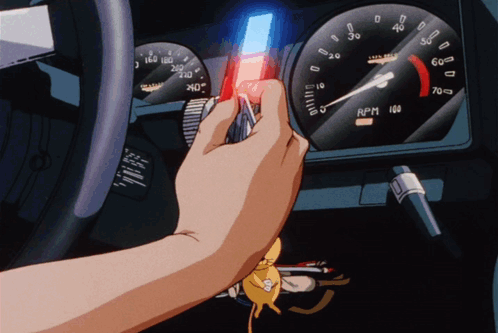{.w-100}

D'abord, on doit déterminer ce qu'on veut faire avec une **planification structurée** (on y reviendra un peu plus tard dans la session).

Ensuite, on embarque dans Unity pour faire un **mini-prototype**. Le but ici est de tester notre **boucle de jeu** (game loop).

Aujourd'hui, on va passer directement au prototypage. Cela permettra deux choses. D'abord, ça nous familiarisera avec le moteur Unity et de nous donner une certaine confiance pour la suite. Ensuite, ça devrait justifier l'importance de l'étape que nous venons d'omettre 😈

## GitHub


Les projets Unity peuvent s'enregistrer sur GitHub. C'est même recommandé de le faire ! Comme ça, pas besoin de trainer de disque dur.

Première chose à faire, **se connecter à GitHub** !

### Ajouter un nouveau projet Unity

Dans Unity Hub,

1. Dans _Projects_, cliquez sur « ***+ New Project*** »
1. Sélectionnez la version 6 de Unity
1. Cliquer sur « Universal 3D » (URP)
1. Choisir un nouveau nom (_Project name_). Exemple : `Protolude`
1. Choisir l'emplacement (_Location_) 
  - Au collège, dans le dossier `Documents/Code_Unity` idéalement

Là, il y a deux méthodes pour connecter Unity à Github.

#### Méthode 1 : _Source control provider_

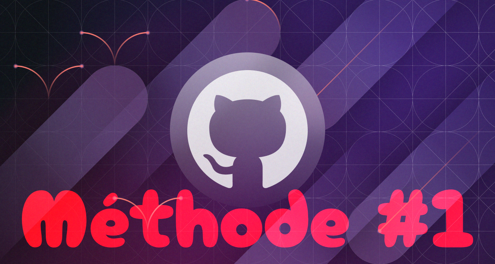

Avant de créer le projet, on créer une passerelle avec GitHub

1. Choisir GitHub <br><figure markdown>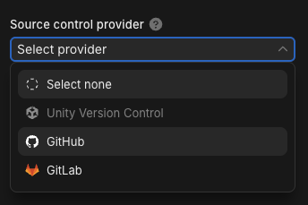{data-zoom-image .w-50}</figure>
1. Cliquer sur « ***Get a token*** »<br><figure markdown>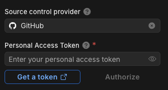{data-zoom-image .w-50}</figure>
1. Confirmer l'accès<br><figure markdown>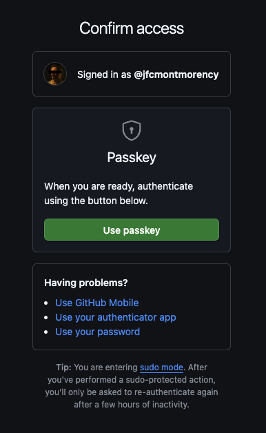{data-zoom-image .w-50}</figure>
1. Cliquer sur Generate token<br><figure markdown>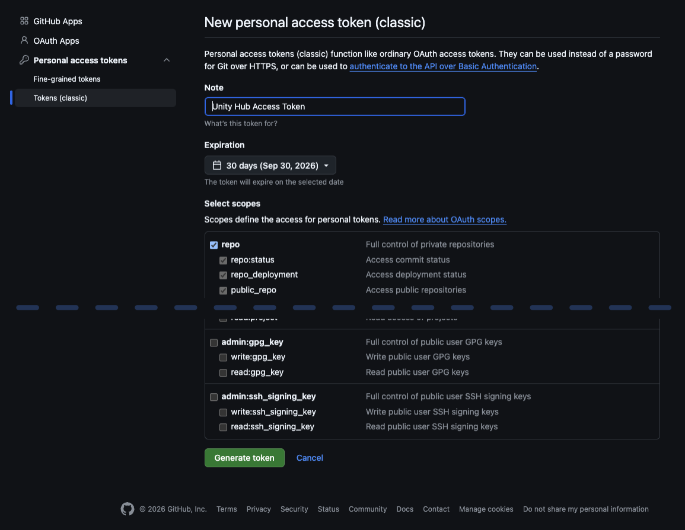{data-zoom-image .w-50}</figure>
1. Copier le token d'accès dans votre presse papier<br><figure markdown>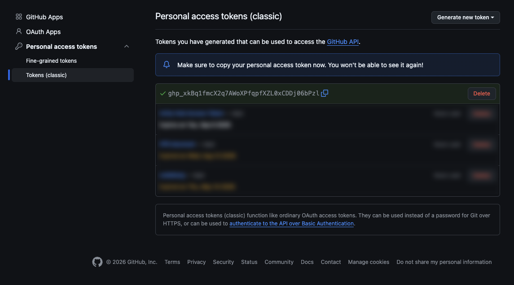{data-zoom-image .w-50}</figure>
1. Retourner sur Unity Hub
1. Entrer le token d'acccès et cliquer sur Authorize<br><figure markdown>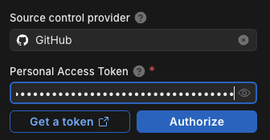{data-zoom-image .w-50}</figure>
1. Enfin, cliquer sur « ***+ Create project*** »
1. Ouvrir l'application :simple-github: **GitHub Desktop**
1. Cliquer sur `File > Add local repository`
1. Choisir le chemin vers le projet créé et cliquer sur « Add repository »
1. La fenêtre "Initialize Git LFS" devrait apparaitre. Cliquer sur Initialize Git LFS <br><figure markdown>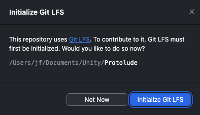{data-zoom-image .w-50}</figure>
1. Cliquer sur « _Publish branch_ » <br><figure markdown>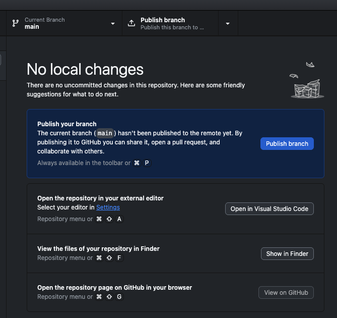{data-zoom-image .w-50}</figure>

#### Méthode 2 : À l'ancienne 👵

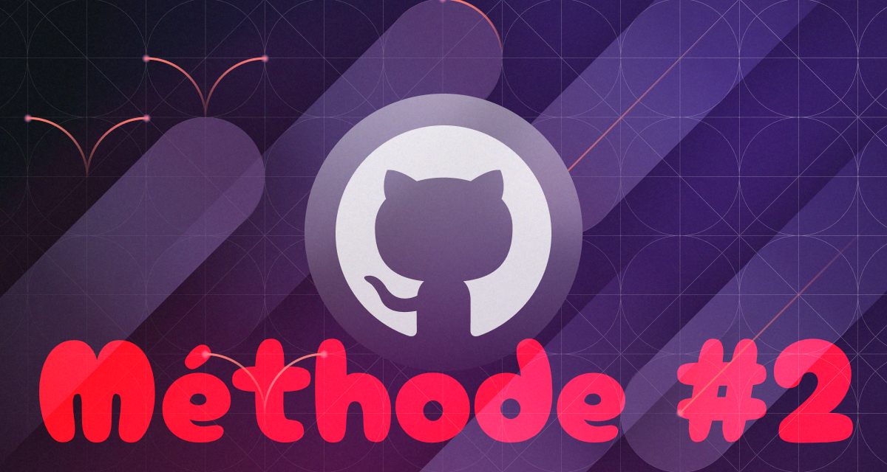

1. Cliquer sur « ***+ Create project*** » (sans choisir de _source control provider_)
1. Télécharger le gitignore Unity et le placer à la racine du projet : <https://raw.githubusercontent.com/github/gitignore/main/Unity.gitignore>
1. Changer son nom de `Unity.gitignore` à `.gitignore`
  ```txt title="Résultat attendu"
  📁 ton-projet-unity
  ├── 📁 Assets
  ├── 📁 Library
  ├── 📁 Logs
  ├── 📁 Packages
  ├── ...
  └── .gitignore 👈
  ```
1. Ouvrir l'application :simple-github: **GitHub Desktop**
1. Cliquer sur `File > Add local repository`
1. Choisir le chemin vers le projet créé et cliquer sur « Add repository »
1. Une erreur devrait apparaitre. Cliquer sur le lien « _create a repository_ »<br><figure markdown>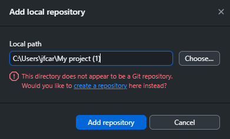{data-zoom-image .w-50}</figure>
1. La fenêtre « Create a new repository » apparait :
  - Vérifier que le nom est correct
  - Ajouter une courte description
  - Cocher "Initialize this repository with a README"
  - Sélectionner Unity dans la liste de "Git ignore"
  - Vous pouvez mettre MIT License pour la "License"<br><figure markdown>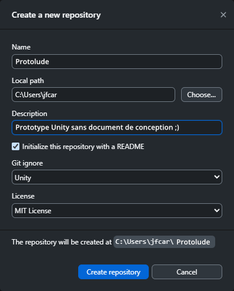{data-zoom-image .w-50}</figure>
  - Cliquer sur « Create repository »
1. La fenêtre « Publish repository » apparait. 
  - Décocher « Keep this code private »
  - Cliquer sur « Publish repository »<br><figure markdown>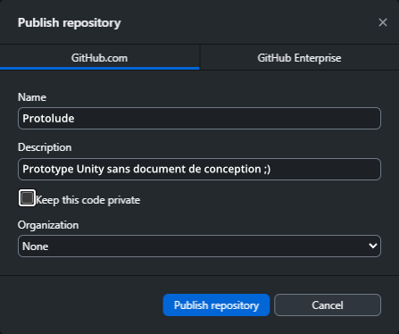{data-zoom-image .w-50}</figure>

!!! note "À faire juste une fois par projet"

### Travailler avec GitHub

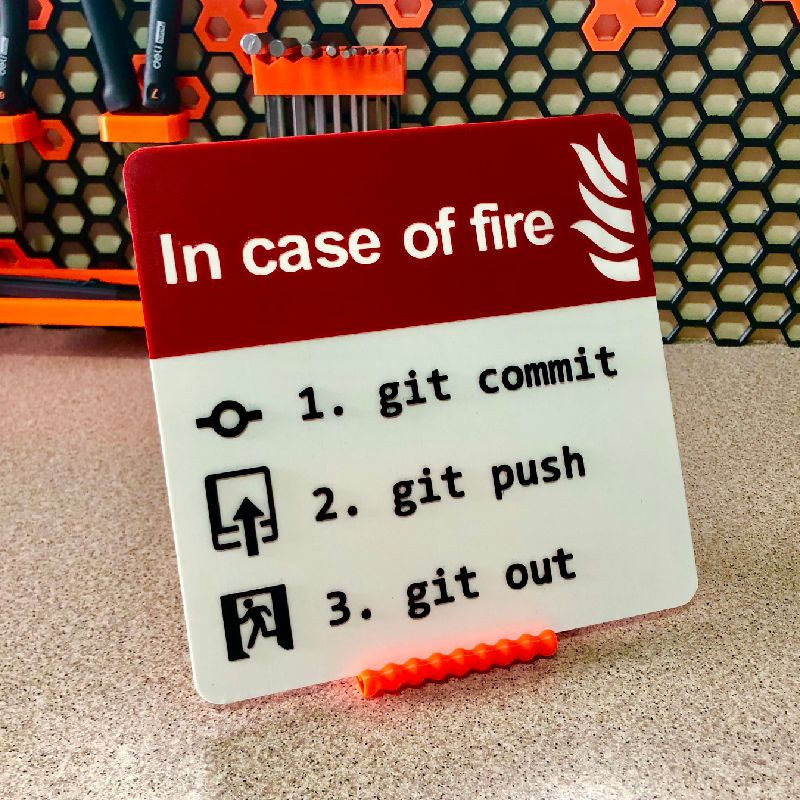{.w-50}

La version officielle de votre projet est maintenant celle qui se trouve sur GitHub !

++ctrl+s++ n'est plus suffisant. À partir de maintenant, pour sauvegarder un projet, il sera **essentiel** d'effectuer un `commit` + `push`. Sinon ça revient à ne pas le sauvegarder du tout.

Si vous voulez travailler sur un autre ordinateur, il faut juste cloner le projet avant de l'ouvrir avec Unity.

Si vous voulez travailler sur un ordinateur qui a deja un clone, mais que la version sur github est plus récente, n'oubliez pas de faire un `pull` !

Voilà !

## Structure de dossiers

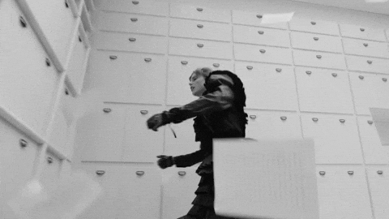{.w-100}

À chaque nouveau projet, il sera important de bien classer ses fichiers. Voici la structure recommandée pour le cours :

```txt 
📁 Assets
 ├── 📁 _
 │    ├── 📁 Animations
 │    ├── 📁 Audio
 │    ├── 📁 Fonts
 │    ├── 📁 Materials
 │    ├── 📁 Prefabs ⭐️ Utile aujourd'hui même
 │    ├── 📁 Scenes 💅 Déplacé ici !
 │    └── 📁 Scripts
 └── ...
```

<div class="grid align-items-top" markdown>
<figure markdown>
  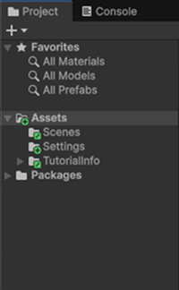{data-zoom-image}
  <figcaption markdown>Par défaut</figcaption>
</figure>

<figure markdown>
  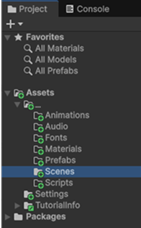{data-zoom-image}
  <figcaption markdown>Structure ajustée</figcaption>
</figure>
</div>


!!! note "Dossier Scenes à déplacer"

    Dans un nouveau projet, le dossier « 📁 Scenes » existe déjà à la racine du dossier « 📁 Assets ». Vous pouvez simplement le déplacer dans votre structure de dossier.

!!! note "Asset store"

    Tout ce qui sera importé d'ailleur se positionnera normalement à la racine du dossier « 📁 Assets ». Il sera important de les laisser à cet endroit pour éviter des problèmes plus tard.

!!! note "Pourquoi _ ?"

    Séparer les éléments personnalisés du reste.

    Le «_» affichera le dossier en premier sous « 📁 Assets ».

!!! note "GitHub"

    Notez que les dossiers vides ne sont pas enregistrés dans git.

## Démo

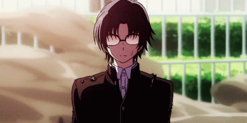{.w-100}

### Mise en place

1. Modifier la structure de fichiers

1. Ajoutez un cube et renommer le « Plancher »
1. Repositionnez le cube au centre de la scène (x=0, y=0, x=0)f
1. L'aplatissez le pour faire une plateforme (x=10, y=0.1, x=10)

1. Ajouter un autre cube et renommer le « Pente »
1. Changer sa dimension/position/échelle pour créer une pente qui donne vers le plancher <br>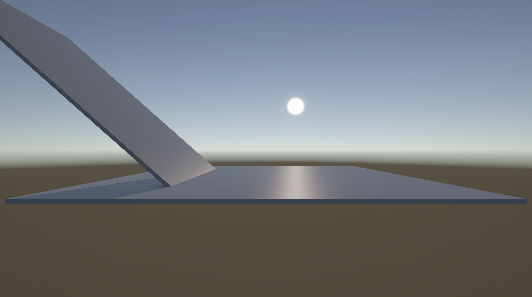{data-zoom-image .w-10} 

!!! info "Gizmo"

    Pour voir la caméra et autres éléments importants, activez les options : , puis affichez les _Gizmos_ 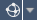

    Notez qu'on voit maintenant la caméra et la lumière directionnelle (soleil)

!!! info "Raccourci : ++f++ (zoom sur un objet)"

<!-- !!! info "Positionner un élément sur une surface"

    Quand on glisse un élément du panneau Project sur la scène, vous verrez que celui-ci se positionne SUR les surfaces.

    Ensuite, le repositionnement ne suit plus cette logique. Sauf si on utilise le raccourci : ++ctrl+shift++ + `drag`. -->

### Physique

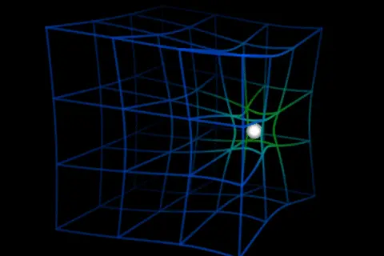{.w-50}

- Noter la notion de _collider_ sur le « Plancher »

  > :material-arrow-collapse-horizontal: Un collider est une carapace invisible qui permet au moteur physique de Unity de détecter les collisions et d'empêcher les objets de se traverser.

- Ajouter une sphère en haut de la pente
- Play<br>{.w-20}
- Stop

  !!! tip "Attention au mode Play"

      Lorsque vous effectuez des modifications en mode ***Play***, sachez qu'elles sont temporaire et qu'elles disparaîtront après le ***Stop***.

#### RigidBody

- Ajouter un ***RigidBody*** à la sphere via `Add Component` dans le panneau _Inspector_

    > :material-food-apple: Rigidbody, ça ajoute une masse à un objet et par défaut, ça applique la gravité.

- Play<br>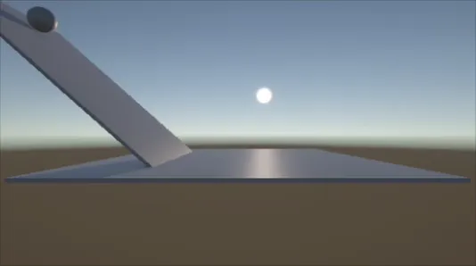{data-zoom-image .w-10} 
- Stop

#### Collider

C'est cool les _Colliders_, mais c'est avec des Rigidbody qu'on en voit l'utilité.

Selon la forme des objets, les colliders changent. Par défaut, une sphère a un collider sphérique. 

Pour le fun : 

- Désactiver ***Sphere Collider*** de la sphère
- Ajouter un ***Box Collider*** via `Add Component`
- Play<br>{data-zoom-image .w-10} 
- Stop
- Remet le ***Sphere Collider*** pour la suite

### Mesh Renderer

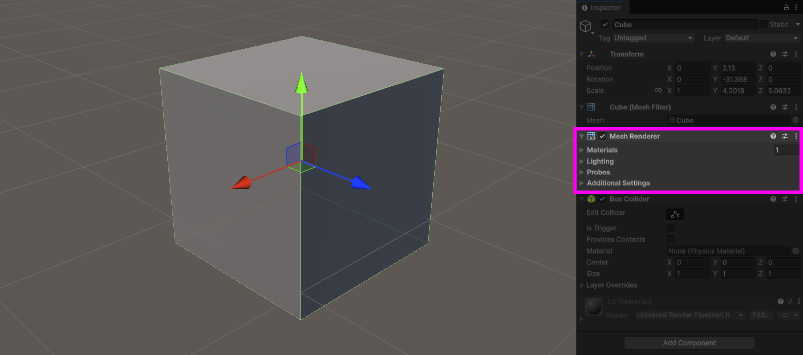{.w-50 data-zoom-image}

Le _Mesh Renderer_ c'est l'enveloppe, le manteau de la forme. C'est ce qu'on voit au final. Ça utilise ce qu'on appelle un _shader_ pour afficher une surface, mais bon, on y reviendra une fois.

!!! question "Pourquoi on désactiverait ça ?"

    Super utile !<br>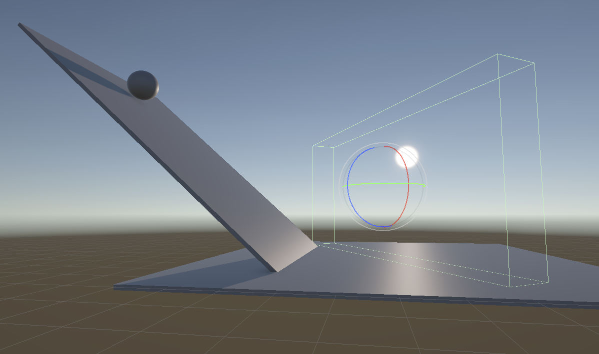{data-zoom-image .w-10} 
    
    On veut parfois limiter le déplacement d'un personnage sans l'afficher explicitement.
    
    Par exemple, une fin de map, ou encore, un pont quand on ne veut pas que le personnage tombe sur les côtés, ce genre de chose.

    <div class="grid" markdown>
    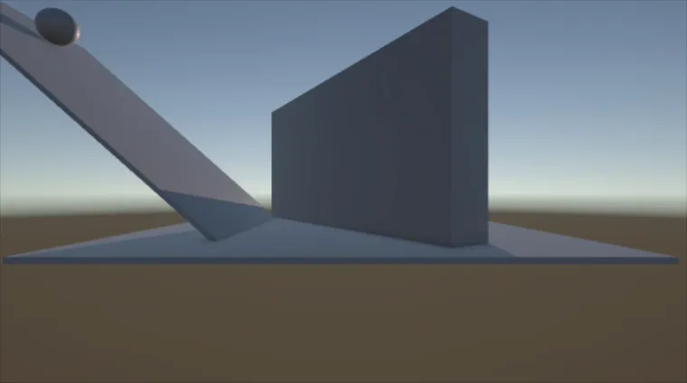{data-zoom-image}

    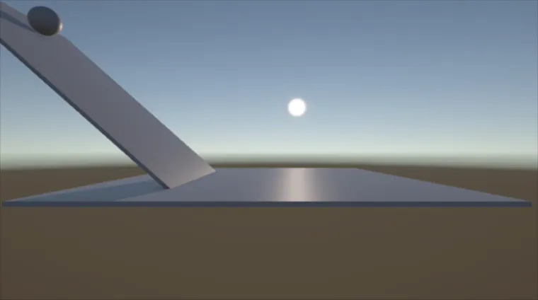{data-zoom-image}
    </div>

    > Ôte-toi de mon soleil !<br>
    > - Diogène

### Mesh Filter

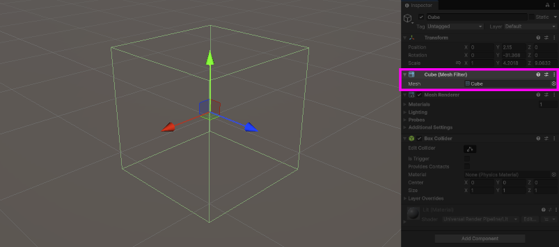{.w-50 data-zoom-image}

Finalement, le _Mesh Filter_ c'est le squelette géométrique (juste des points et des polygones). C'est un peu l'équivalent des vecteurs d'une image vectorielle.

---

<div class="grid grid-1-2" markdown>
  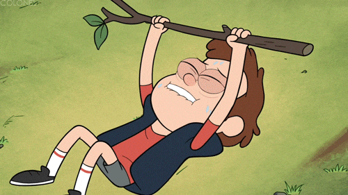{.aspect-4-3}

  <small>Exercice - Unity</small><br>
  **[Isaac Newton](./exercices/gravite/index.md){.stretched-link .back}**<br>
</div>

## Action / réaction

{.aspect-16-9}

La base d'une jeu vidéo c'est d'effectuer une action et que cette action a une répercussion. En Web, le classique c'est le lien ou le bouton. On click et il se passe quelque chose.

En jeu vidéo, il y a ça et plus encore. Quand on contrôle un personnage, celui ci interagit avec son environnement. Que ce soit lorsqu'il tire un ennemi ou lorsqu'il tombe dans un trou, une réaction se produit.

En Unity, on parle surtout de **collision**. Quand le projectif entre en collision avec l'ennemie ou quand le personne tombe dans le trou, il entre en collision avec le trou, il se passe telle ou telle chose.

## Collider Event System (CES)

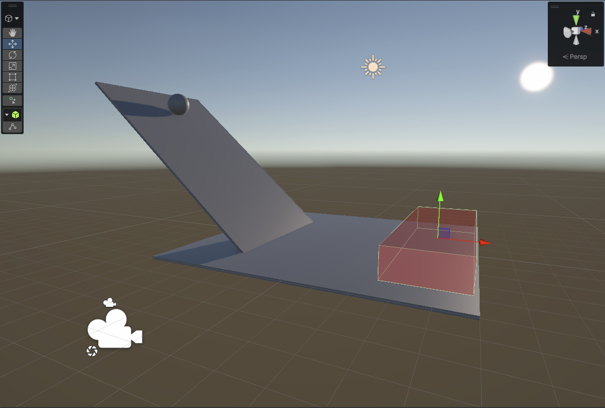{.w-50 data-zoom-image}

Pour faciliter la gestion des événements liés à des collisions, installons le package [Collider Event System](./extra/assets/index.md#collider-event-system).

Dans le panneau _Project_, glissez un prefab du package sur la scène. 

Ex : `Packages` > `Collider Event System` > `Prefabs` > `Trigger Cube`

1. Positionnez le à l'endroit où vous voulez effectuer une détection de collision.
1. Dans le panneau _Inspector_, sous _Collider Event_, on peut ajouter un comportement lorsqu'une collision est détectée dans la section ***Actions*** :

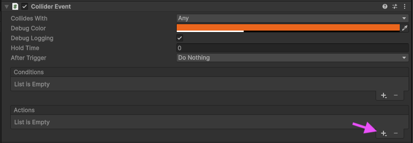{data-zoom-image}

Les actions possibles sont les suivantes : 

| Action | Effet |
| :--- | :--- |
| **Animation** | Déclenche une animation |
| **Audio** | Lecture d'une piste audio |
| **GameObject** | Affiche, cache ou détruit un objet. |
| **Instantiate Prefab** | Fait apparaitre un prefab |
| **Invoke Events** | Permet de déclencher un script custom |
| **Material** | Change l'apparence d'un objet |
| **Rigidbody** | Retire ou applique la physique sur un objet |
| **Scene** | Change de scène |
| **Transform** | Modifie la position, rotation ou l'échelle d'un objet |
| **Variable** | Assigne une valeur à une variable |

[Démo | :simple-youtube: Youtube](https://youtu.be/jXNzGtv4pdM){ .md-button .md-button--primary }

### Changer l'affichage d'un objet avec CES

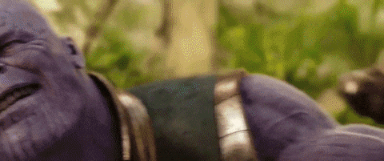{.w-50}

Pour activer ou désactiver manuellement un objet dans Unity, on doit simplement cocher ou décocher la case à cocher dans le panneau _Inspector_.

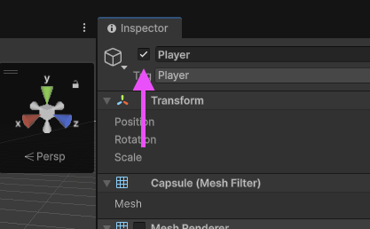{data-zoom-image .w-25}

Toutefois, il est également possible de le faire dynamiquement en programmation, ou avec « Collider Event System ». Voici la marche à suivre pour cette dernière :

1. Ajouter un prefab du « Collider Event System » sur la scène, de sorte à ce qu'il puisse entrer en collision avec une sphère qui roule.
1. Dans le panneau _Inspector_, sous _Collider Event_, sous _Actions_, ajouter « Game Object »
1. _Target mode_ : _Specific object_
1. _Target_ : Glisser depuis le panneau _Hierarchy_ un des _GameObjects_ (ex: le plancher)
1. _Operation_ : laisser à Disable

<div class="grid" markdown>
<figure markdown>
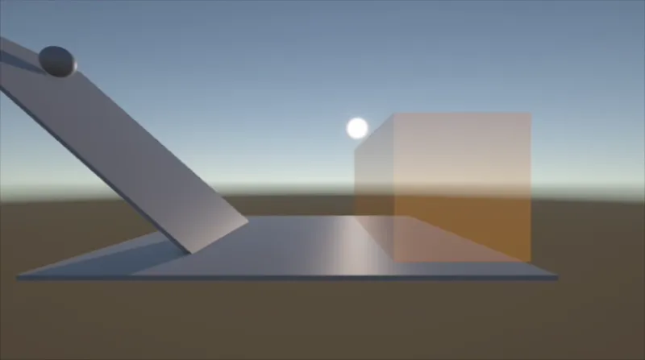{data-zoom-image}
<figcaption>Désactiver un GameObject actif</figcaption>
</figure>

<figure markdown>
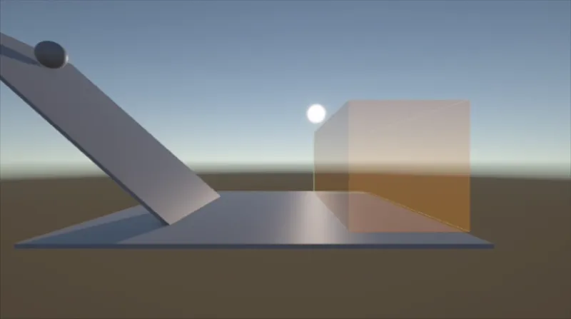{data-zoom-image}
<figcaption>Activer un GameObject inactif</figcaption>
</figure>
</div>

### Téléporter un objet avec CES

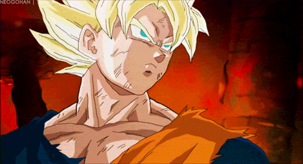{.w-50}

1. Ajouter un prefab du « Collider Event System » sur la scène, de sorte à ce qu'il puisse entrer en collision avec une sphère qui roule.
1. Dans le panneau _Inspector_, sous _Collider Event_, sous _Actions_, ajouter « Transform »
1. _Target mode_ : _Entering Objects_ (les éléments qui entrent en collision avec le CES)
1. _Value Source_ : _Fixed Value_
1. Cocher _Position_ et spécifier des valeurs

{.h-auto .w-50}

### Changer la rotation d'un objet avec CES

1. Ajouter un prefab du « Collider Event System » sur la scène, de sorte à ce qu'il puisse entrer en collision avec une sphère qui roule.
1. Dans le panneau _Inspector_, sous _Collider Event_, sous _Actions_, ajouter « Transform »
1. _Target mode_ : _Specific object_
1. _Target_ : Glisser depuis le panneau _Hierarchy_ un des _GameObjects_ (ex: _Pente_)
1. _Value Source_ : _Fixed Value_
1. Cocher _Rotation_ et spécifier des valeurs
1. Cocher _Animate_
1. _Duration_ (en secondes) : 3

{.h-auto .w-50}

---

<div class="grid grid-1-2" markdown>
  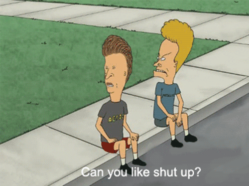{.aspect-4-3}

  <small>Exercice - Unity</small><br>
  **[Boucle là !](./exercices/boucle-la/index.md){.stretched-link .back}**<br>
</div>

## Prefab

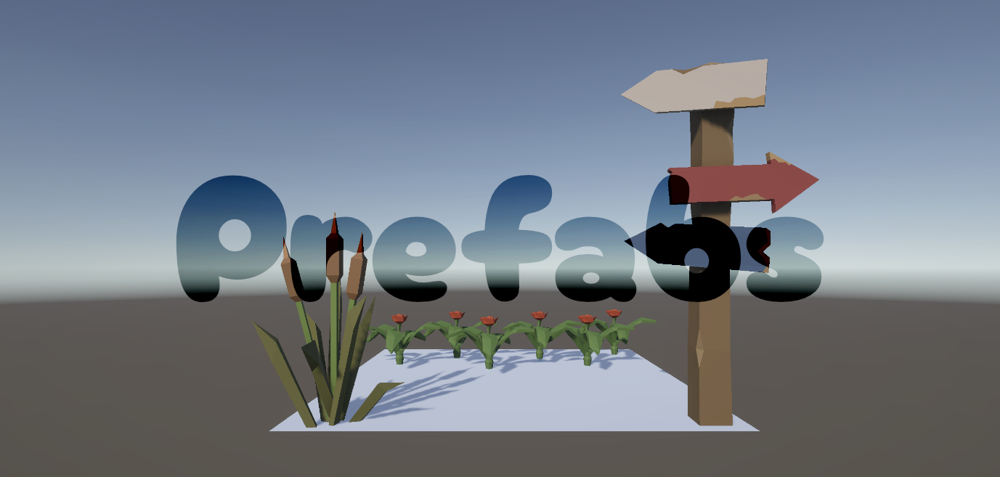{.w-100}

Un prefab c'est un objet ou un groupe d'objets qu'on enregistre pour le réutiliser. C'est un modèle sur lequel toutes les copies vont garder une référence.

### Le bonhomme de neige

1 bonhomme de neige c'est facile à faire. 3 sphères et hop, c'est fait.

Admettons que je veuille ajouter 10 bonhommes de neige dans mon jeu. Je pourrais le dupliquer 10 fois, mais pas l'idéal. Si ensuite je veux ajouter une carotte pour le nez, je dois le faire pour les 10 ! Il faudrait avoir à le faire une seule fois pour tous les bonhommes. Ça, ça s'appelle faire un prefab.

- Crééer un gameobject vide, nomme le « bonhomme de neige » et y mettre les 3 sphères.<br>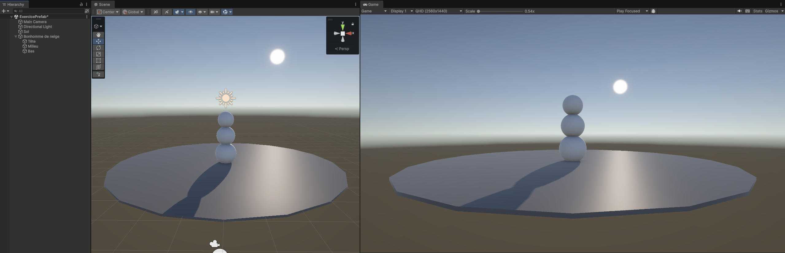{data-zoom-image .w-10}
- Glisser « bonhomme de neige » dans le panneau _Project_ dans le dossier prefab que vous devirez déjà avoir si vous avez bien fait votre structure de dossiers ;)
- Supprimer « bonhomme de neige » du panneau _Hierarchy_
- Glisser le prefab « bonhomme de neige » sur la scène (on reconnait le prefab par un cube turquoise)<br>{data-zoom-image .w-10}
- Dubliquer le prefab et repositionnez le, 10 fois<br>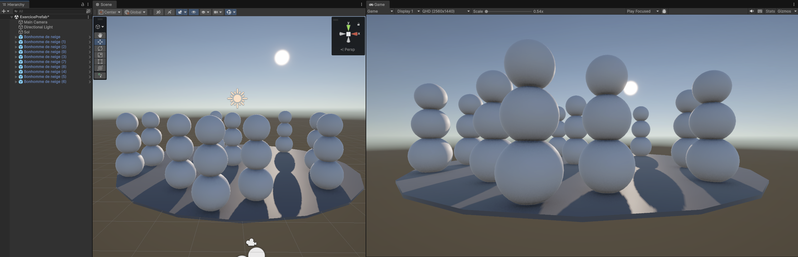{data-zoom-image .w-10}

Testons l'avantage d'utiliser des prefabs. Ajoutons une carotte pour le nez.

- Dans le panneau _Project_, double-clic sur le prefab « bonhomme de neige »<br>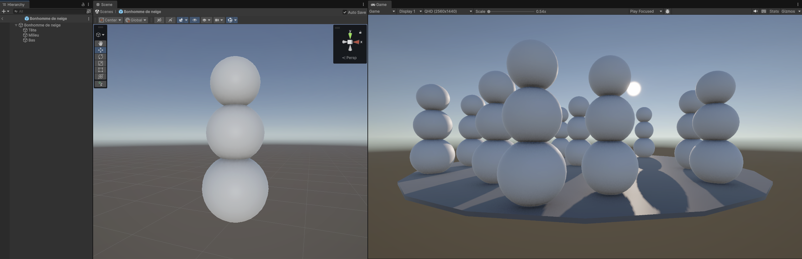{data-zoom-image .w-10}
- Ajouter une carotte pour le nez<br>{data-zoom-image .w-10}
- Sauvegarder et revenir de l'édition en cliquant sur la petite flèche dans le panneau hierarchy<br>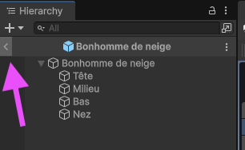{data-zoom-image .w-10}

### Détacher un prefab

Pour détacher un prefab, clic-droit sur l'objet dans le panneau `Hierarchy`, puis `Prefab` > `Unpack Completely`.

Il n'y aura plus de référence au prefab, donc si on change le prefab, ca ne changera plus cet élément.

## SyntyStudio

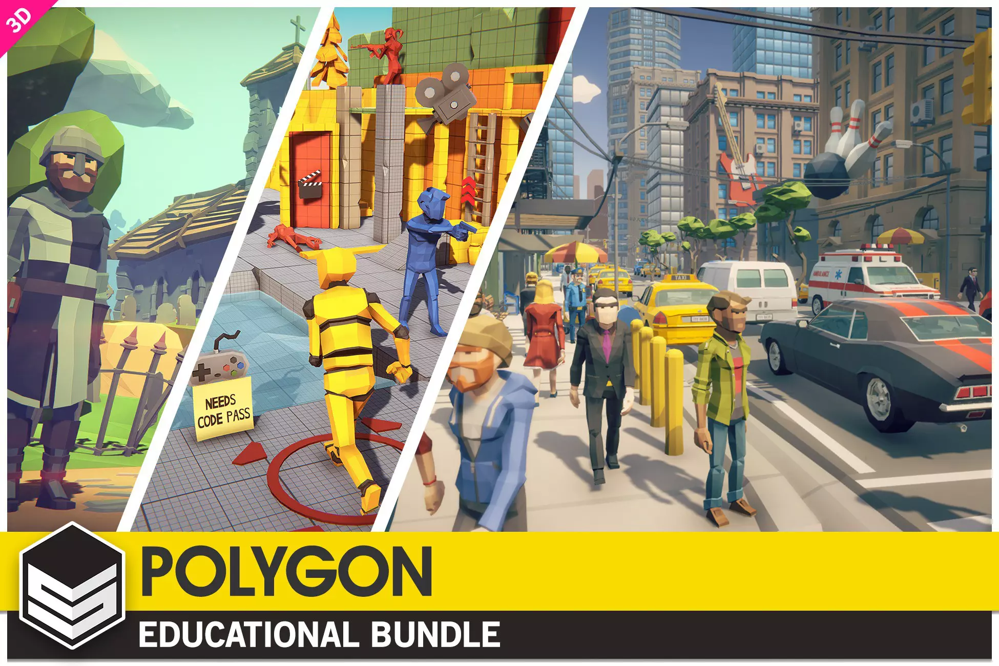

L'avantage du _pack_ est qu'il contient des centaines de modèles 3D **cohérents entre eux**. Visuellement, c'est plus sérieux que d'avoir plusieurs assets qui ne partagent pas le même esthétique.

[Installation via Asset Store](./extra/assets/index.md#polygon-sampler-pack-synty-studiostm)

!!! quote "J'ai pas encore mon compte éducationnel"
    
    Si vous ne l'avez pas encore 🤨 vous pouvez le télécharger [ici](https://cmontmorency365-my.sharepoint.com/:u:/g/personal/jfcartier_cmontmorency_qc_ca/IQD9pUXpPylCRL1Y3sSWsg17AfVhPb8LMoRxMa5SfhzYkcU?e=KEK0eD), mais cette solution doit être temporaire.

### Conversion nécessaire

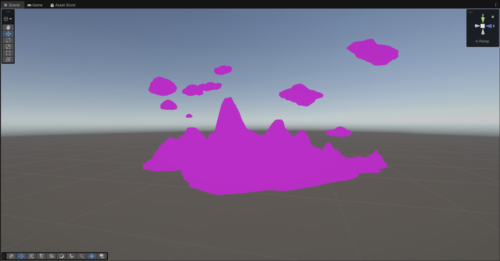{data-zoom-image .w-50}

Bon, là, si vous ajoutez tout de suite des assets de « SyntyStudio » vous devriez faire face à un problème de _Shaders_ incompatibles. Quand ça arrive, Unity affiche les assets en magenta.

Pas de panique, ça veut juste dire que l'asset utilise un shader qui n'est pas reconnu par la technologie URP (ce sur quoi notre projet est basé). Il faut donc convertir le _pack_ avant de pouvoir l'utiliser :

1. Clic sur `Window` > `Rendering` > `Render Pipeline Converter`.
1. Dans la fenêtre qui s'ouvre, coche « ***Material Reference Converter*** » et « ***Material Shader Converter*** ».
1. Clic sur le bouton `Scan`.
1. Quand c'est terminé, clic sur `Convert Assets`.

Là, ça fonctionne !

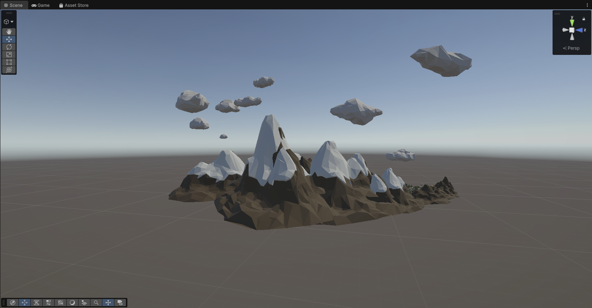{data-zoom-image .w-50}

### Ajouter des assets sur la scène

1. Dans le panneau ***Project***, ouvre le dossier `SyntyStudios` > `PolygonAdventure` > `Prefabs` > `Environments`
1. Glissez par exemple, `SM_Env_Road_Straight_01` sur le panneau ***Scene***.
1. Repositionnez le prefab au centre de l'environnement (`x=0`, `y=0` et `z=0`).

### Mesh Collider vs Box Collider

<div class="grid" markdown>
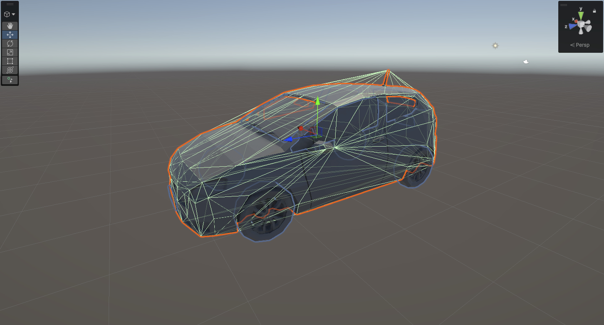{data-zoom-image}

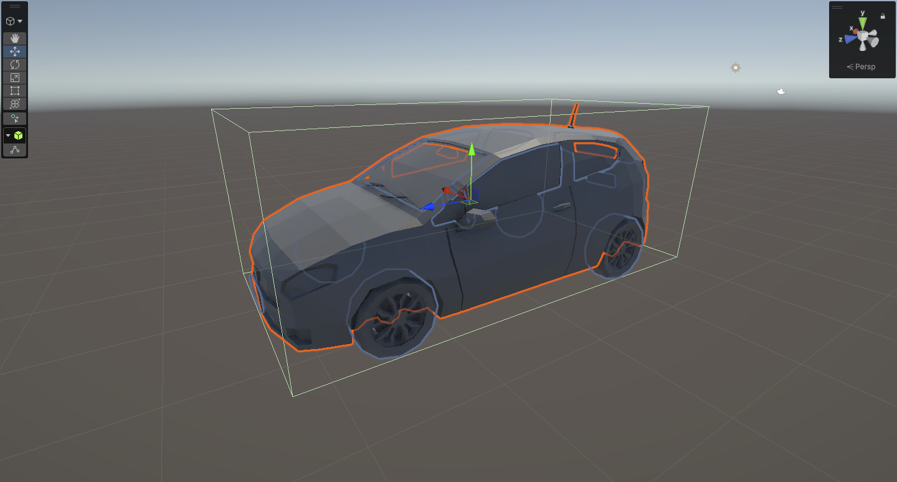{data-zoom-image}
</div>

> Moins le collider est complexe, plus le jeu est performant

Certains modèles 3D incluent par défaut un **Mesh Collider**. Si son utilisation est pertinente pour des surfaces complexes (comme un terrain) on garde, mais souvent ce n'est pas pertinent. 

*Mesh Collider* est très gourmand en ressources, car le processeur doit calculer les collisions pour chaque polygone.
<!-- 
## Un environnement qui se tient

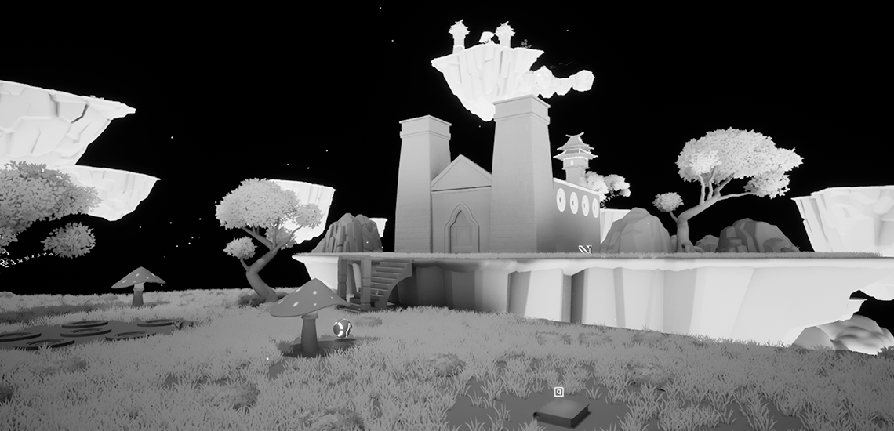

Quand on fabrique un **environnement**, il faut qu'on puisse s'y promener sans tomber dans le vide. Au besoin, ajoutez des murs invisibles pour empecher que cela se produise.

### L'environnement au service de l'objectif

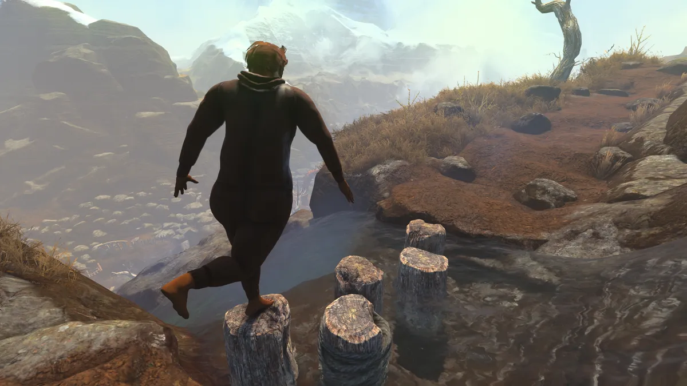{.w-50 data-zoom-image}

Un monde où on se promène, ce n'est pas encore un jeu. Il manque un **but** et une **raison de ne pas l'atteindre tout de suite**.

Voici deux exemples : 

- **Inventaire** : un CES sur une clé enregistre une variable à `true`. Un autre CES sur une porte vérifie si la variable est `true`, si oui, elle disparait
- **Habileté du joueur** : un parcours demande de la précision sinon on tombe dans un CES et il nous téléporte vers le début du parcours

Une fois le *gate* choisi, l'environnement se construit en conséquence. -->

## Devoirs

!!! abstract ":material-check-decagram: Vérification du devoir 01 (2 %)"


<div class="grid grid-1-2" markdown>
  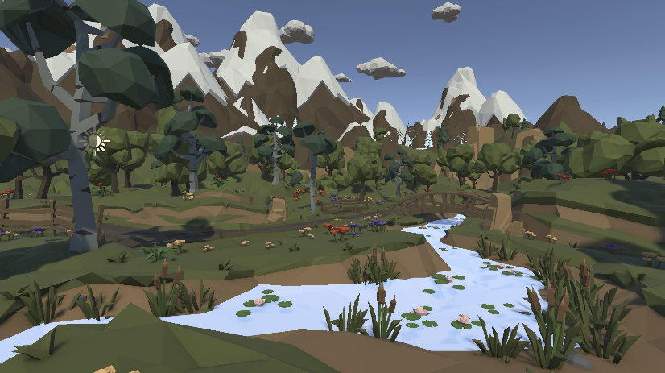{.aspect-4-3}

  <small>Devoir - Unity</small><br>
  **[Protolude : Partie 1](./devoirs/protolude/index.md){.stretched-link .back}**<br>
</div>
<!-- 
* **Termine ton mini-monde** : un départ, un chemin, une arrivée évidente - sol continu, colliders en place, aucun endroit où on reste coincé ou on tombe dans le vide
* Ce monde est la base de ton [jeu express](./devoirs/protolude/index.md) (**Évaluation 1 - 13 %**) : lis la grille dès maintenant
* Apporte des idées : au [cours 3](./cours03.md), ton monde devient **jouable** (personnage, matériaux, son, victoire) - et on commence à parler de **ton** jeu de session -->

<!-- ## Savoirs essentiels touchés
Logiciels d'intégration d'expériences ludiques, installation et configuration des ressources, classement des fichiers et des médias, création d'un environnement virtuel navigable, intégration d'images dans l'environnement virtuel, déplacement dans l'environnement virtuel. -->
