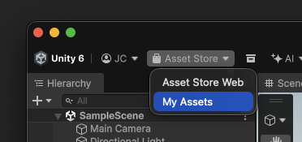
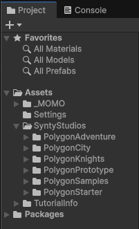

# Cours 2

<!-- {.w-100} -->

*[URP] : Universal Render Pipeline

## Commencer un nouveau jeu

{.w-100}

Étape 1 : Déterminer ce qu'on veut faire avec un document de conception (On y reviendra)

Étape 2 : Créer un projet ***Universal 3D***

Étape 3 : Ajuster la structure du dossier « 📁 Assets »

### Structure de dossiers

À chaque nouveau projet, il sera important de bien classer ses fichiers. 

Voici une structure suggérée.

```txt 
📁 Assets
 ├── 📁 _MOMO
 │    ├── 📁 Animations
 │    ├── 📁 Audio
 │    ├── 📁 Fonts
 │    ├── 📁 Materials
 │    ├── 📁 Prefabs ⭐️ Utile aujourd'hui
 │    ├── 📁 Scenes 💅 Déplacé ici
 │    └── 📁 Scripts
 └── ...
```

<div class="grid align-items-top" markdown>
<figure markdown>
  {data-zoom-image}
  <figcaption markdown>Par défaut</figcaption>
</figure>

<figure markdown>
  {data-zoom-image}
  <figcaption markdown>Structure ajustée</figcaption>
</figure>
</div>


!!! note "Dossier Scenes à déplacer"

    Dans un nouveau projet, le dossier « 📁 Scenes » existe déjà à la racine du dossier « 📁 Assets ». Vous pouvez simplement le déplacer dans votre structure de dossier.

!!! note "Asset store"

    Tout ce qui sera importé d'ailleur se positionnera normalement à la racine du dossier « 📁 Assets ». Il sera important de les laisser à cet endroit pour éviter des problèmes plus tard.

!!! note "Pourquoi _MOMO ?"

    On vut juste séparer vos documents custom du reste.

    Le «_» dans le nom du dossier sert juste à ce qu'il soit toujours affiché en premier sous « 📁 Assets ».

    Finalement, «MOMO» est juste une suggestion. Le dossier pourrait très bien s'appeler « _Project », « _Perso » ou siplement « _ »

!!! note "Nomenclature"

    Pour les dossiers et fichiers, évitez les espaces dans leur nom.

    Utilisez la convention _Pascal Case_ (ex. : MonBeauDossier) ou _Pascal Snake Case_ (ex. : Mon_Beau_Dossier).

## Demo

{.w-100}

### Mise en place

- Modifier la structure de fichiers

- Ajoutez un cube et renommer le « Plancher »
- Repositionnez le cube au centre de la scène (x=0, y=0, x=0)
- L'aplatissez le pour faire une plateforme (x=10, y=0.1, x=10)

- Ajouter un autre cube et renommer le « Pente »
- Changer sa dimension/position/échelle pour créer une pente qui donne vers le plancher <br>{data-zoom-image .w-10} 

!!! info "Gizmo"

    Pour voir la caméra et autres éléments importants, activez les options : , puis affichez les _Gizmos_ 

    Notez qu'on voit maintenant la caméra et la lumière directionnelle (soleil)

### Physique

{.w-50}

- Noter la notion de collider sur le « Plancher »
- Ajouter une sphère en haut de la pente

!!! info "Petit truc"
 
    ++ctrl+shift++ + `drag` le carré central pour positionner l'élément sur la surface d'un autre gameobject"

!!! info "Donner le shortcut ++f++ pour zoomer sur un objet"

- Play 🤨
- Stop
- Ajouter un RigidBody à la sphere via « Add Component »

!!! info "Rigidbody"

    Rigidbody, ça ajoute une masse à un objet et par défaut, ça utilise la gravité. Autrement dit, on active la physique pour cet objet.

- Play 👌<br>{data-zoom-image .w-10} 
- Stop

- Désactiver ***Sphere Collider*** de la sphère
- Ajouter un ***Box Collider*** via « Add Component »

- Play 🤗<br>{data-zoom-image .w-10} 
- Stop

- Remet le ***Sphere Collider*** pour la suite

### Action / réaction

{.w-50}

Le but ici est d'entrer dans une zone et activer/désactiver quelque chose d'autre. Pour nous faciliter la vie, ajoutons [Enhanced Trigger Box](https://assetstore.unity.com/packages/tools/game-toolkits/enhanced-trigger-box-72826) à nos assets.

- `Project` > `Enhanced Trigger Box` > `Prefabs` > `ETB`. Glisse une instance sur la scène.<br>{data-zoom-image .w-10} 
- Dans `Inspector` > `Enhanced Trigger Box (Script)` > `Modify Gameobject Response`, clic sur ***Select A Response*** puis ***Modify Gameobject Response***.
- GameObject : Glissez-y le GameObject « Pente »
- Assigne le tag « Player » à la Sphere.
- Play<br>{data-zoom-image .w-10} 

!!! info "Explication"

    Quand le GameObject avec le ***Trigger Tag*** « Player » entre dans la boite rouge, ça déclenche la réponse configurée.

    Pour que ça fonctionne, le GameObject qui a le Tag doit avoir un collider.

- Créer un `Gameobject empty` et renommer le « Spawn »

Retourner sur le ETB :

- Supprimer `Modify Gameobject Response`
- Positionnez le en haut de la Pente
- Ajouter `Teleport Response` 
- Ajouter la Sphere dans `Target Gameobject`
- Ajouter « Spawn » dans `Destination`
- Finalement, dans `After Trigger`, choisir `Do Noting`
- Play<br>{data-zoom-image .w-10} 

<div class="grid grid-1-2" markdown>
  {.aspect-4-3}

  <small>Exercice - Unity</small><br>
  **[Boucle là !](./exercices/boucle-la/index.md){.stretched-link .back}**<br>
</div>

## Scene

{.h-auto}

Les scènes en Unity sont différents lieux ou interfaces qui sont traditionnellement séparés par un écran de chargement.

Pour créer une nouvelle scène, dans le dossier scène, clic-droit > `Create` > `Scene` > `Scene`.

!!! info "Skybox manquant"

    {data-zoom-image .w-33}

    `Window` > `Rendering` > `Lighting` > onglet `Environment` → `Skybox Material` : assigne `Default-Skybox`

<!-- !!! info "Global Volume manquant"

    Pour l'ajouter, dans le panneau _Hierarchy_, clic-droit > `Volume` > `Global Volume`.

    Sélectionne le, puis dans le panneau _Inspector_, trouve le composant _Volume_.

	  À côté du champ _Profile_, clique sur le bouton _New_ pour créer un nouveau profil vierge, ou clique sur le petit point de sélection pour assigner le profil par défaut qui était utilisé dans la SampleScene. -->

### Changer de scène

Pour changer de scène, il faut d'abord configurer les scènes du build.

Il faut mentionner manuellement les scènes qui font officiellement parti de notre jeu.

- `File` > `Build Profiles`
- Dans la colonne de gauche, clic sur `Scene List`
- Il faut glisser manuellement les scènes de notre jeu dans cette case !<br>{data-zoom-image} 

Un fois les scènes ajoutées dans la liste, on peut utiliser un UTB (_Enhanced Trigger Box_) pour déclencher un changement de scène.

- Dans la liste des réponses, choisir `Load Level Response`
- Dans `Scene Name`, inscrire le nom de la scène vers où il faut se diriger (⚠️ il faut que ce soit le nom exacte)
- Play<br>{data-zoom-image .w-10}

## Ajouter SyntyStudio à un projet


L'avantage du _pack_ est qu'il contient des centaines de modèles 3D **cohérents entre eux**. Visuellement, c'est plus sérieux que d'avoir plusieurs assets qui ne partagent pas le même esthétique.

Pour l'ajouter rapidement : 

1. Cliquez sur « _Asset Store_ » puis sur `My Assets`.<br>{data-zoom-image .w-25}
1. Ça va ouvrir le `Package Manager`. Cliquez sur `POLYGON - Sampler Pack - Art by Synty` puis sur ***Download***. 
1. Lorsque c'est fait, cliquez sur ***Import***. Vous devriez voir «SyntyStudios» dans le panneau ***Project*** : <br>{data-zoom-image .w-25}

### Conversion nécessaire

{data-zoom-image}

Bon, là, si vous ajoutez tout de suite des assets de « SyntyStudio » vous devriez faire face à un problème de _Shaders_ incompatibles. Quand ça arrive, Unity affiche les assets en magenta.

Pas de panique, ça veut juste dire que l'asset utilise un shader qui n'est pas reconnu par la technologie URP (ce sur quoi notre projet est basé). Il faut donc convertir le _pack_ avant de pouvoir l'utiliser :

1. Clic sur `Window` > `Rendering` > `Render Pipeline Converter`.
1. Dans la fenêtre qui s'ouvre, coche "Material Reference Converter" et "Material Shader Converter".
1. Clic sur le bouton `Scan`.
1. Quand c'est terminé, clic sur `Convert Assets`.

Là, ça fonctionne !

{data-zoom-image .w-50}

### Ajouter des assets à la scène

1. Dans le panneau ***Project***, ouvre le dossier `SyntyStudios` > `PolygonAdventure` > `Prefabs` > `Environments`
1. Glisse `SM_Env_Road_Straight_01` sur le panneau ***Scene***.
1. Repositionnez le prefab au centre de l'environnement (`x=0`, `y=0` et `z=0`).

!!! info "Pour éviter des problèmes, ne modifiez pas le scale des prefabs"

1. Dans le panneau ***Project***, ouvre le dossier `SyntyStudios` > `PolygonAdventure` > `Prefabs` > `Characters`
1. Glisse un personnage sur le panneau ***Scene***.

[Exercice - Le monde et le personnage :material-arrow-right:](./exercices/cours02-monde-et-personnage.md){ .md-button .md-button--primary }


* [Starter Assets: Character Controllers | URP](https://assetstore.unity.com/packages/essentials/starter-assets-character-controllers-urp-267961)


## Devoirs

<!-- * **Termine ton mini-monde** : il doit se parcourir du départ à l'arrivée sans rester coincé -->
<!-- * Terminer le [tutoriel Get Started With Unity](./devoirs/get-started-with-unity/index.md) si ce n'est pas fait -->
<!-- * Apporte des idées : au [cours 3](./cours03.md), ton jeu express devient jouable et publiable - et on commence à parler de **ton** jeu de session -->

<!-- ## Savoirs essentiels touchés

Logiciels d'intégration d'expériences ludiques, installation et configuration des ressources, classement des fichiers et des médias, création d'un environnement virtuel navigable, intégration d'images dans l'environnement virtuel, déplacement dans l'environnement virtuel. -->
