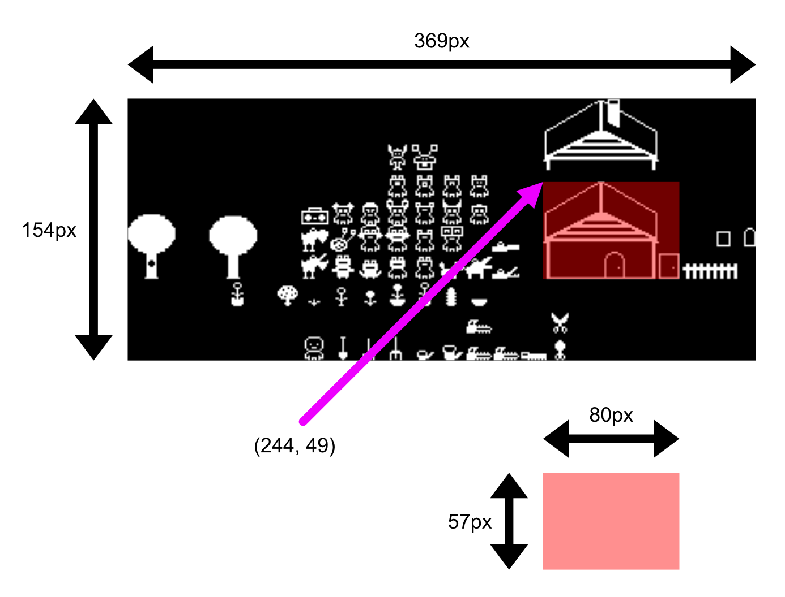
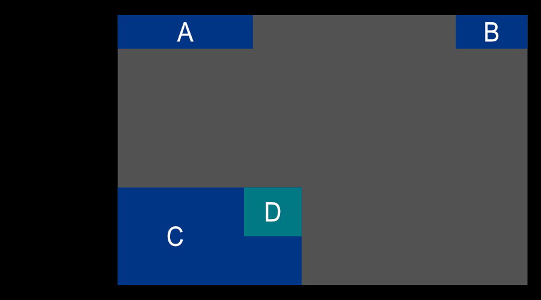
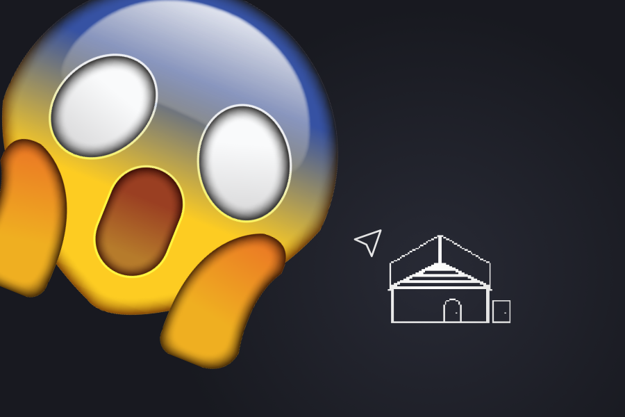
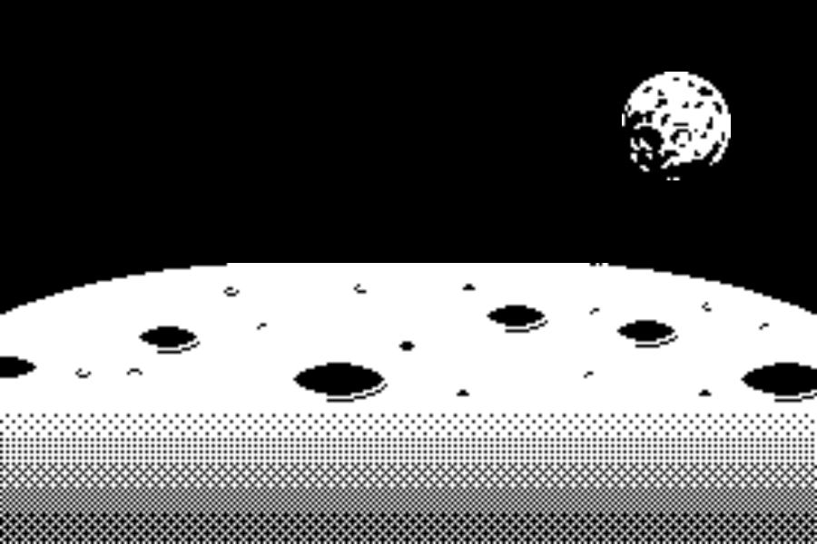
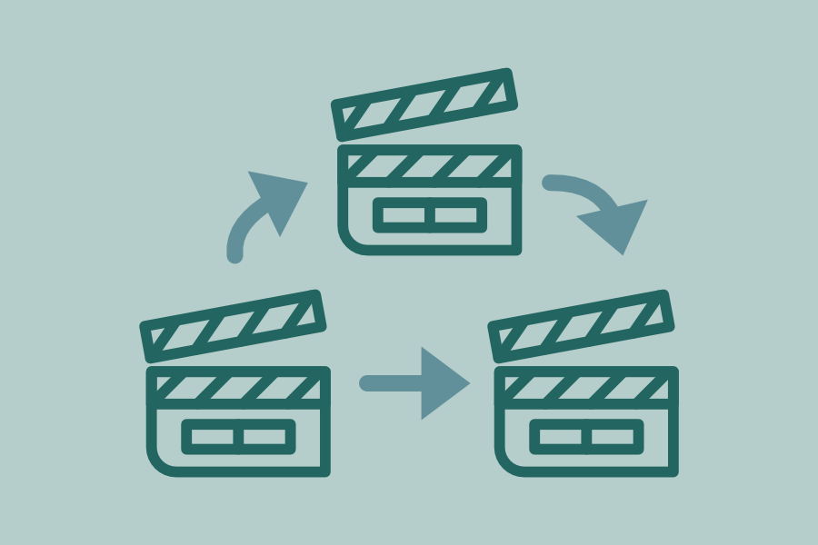

# Cours 03

[STOP]

## Exercices du cours 2

Retour sur les exercices du cours 2

* Orange mécanique
* Damier
* Monstre

!!! tip "Pour éviter le positionnement à l'aveugle"

    Ajoutez ce petit bout de code afin de connaître la position `X` et `Y` de votre curseur dans le canvas de votre jeu.

    ```js
    create(){
      this.input.on("pointermove", (pointer) => {
        console.log(parseInt(pointer.x) + ", " + parseInt(pointer.y));
      });

      // ou

      this.input.on("pointermove", function (pointer) {
        console.log(parseInt(pointer.x) + ", " + parseInt(pointer.y));
      }.bind(this));
    }
    ```

## Nouvelle version de Phaser

> 🥳 Phaser v3.85.0 "Itsuki" was released on 5th September 2024.

Pour installer la nouvelle version de Phaser, vous devez exécuter cette ligne de commande à la racine de votre dossier

```bash
npm update --save
```

## Tilemap


La demo sur la création d'une Tilemap ira malheureusement à la semaine prochaine.

Il y a présentement un souci avec l'exportation de Sprite Fusion 🫠.

Une discussion est en cours avec les développeurs de l'application 💪, il se peut que j'aille à développer un plugin.

## Crop

Si on veut afficher juste une partie d'une image, on peut y arriver avec la fonction setCrop.

Les paramètres de la fonction sont (x, y, largeur, hauteur).

### Exemple setCrop

Image source (blanc sur transparent)

{data-zoom-image}

Explication

{data-zoom-image}

En programmation

```js
preload(){
  this.load.image("img", "https://assets.codepen.io/9367036/frogtileset.png");
}

create(){
  this.img = this.add.image(0, 0, "img").setOrigin(0, 0);

  //@param x — The x coordinate to start the crop from. Cannot be negative or exceed the Frame width. Or a Phaser.Geom.Rectangle object, in which case the rest of the arguments are ignored.
  //@param y — The y coordinate to start the crop from. Cannot be negative or exceed the Frame height.
  //@param width — The width of the crop rectangle in pixels. Cannot exceed the Frame width.
  //@param height — The height of the crop rectangle in pixels. Cannot exceed the Frame height.
  this.img.setCrop(244, 49, 80, 57);
}
```

En pratique

<iframe class="aspect-2-1" height="300" style="width: 100%;" scrolling="no" title="Phaser - HUD Exercice SOLUTION" src="https://codepen.io/tim-momo/embed/xxoMmNM/23942833e4df4486e6c9bce083dad5b6?default-tab=&editable=true&theme-id=50210" frameborder="no" loading="lazy" allowtransparency="true" allowfullscreen="true">
  See the Pen <a href="https://codepen.io/tim-momo/pen/xxoMmNM/23942833e4df4486e6c9bce083dad5b6">
  Phaser - HUD Exercice SOLUTION</a> by TIM Montmorency (<a href="https://codepen.io/tim-momo">@tim-momo</a>)
  on <a href="https://codepen.io">CodePen</a>.
</iframe>

## Contrôles

### Souris

```js title="Souris"
create() {
  this.input.on('pointerdown', (pointer) => {
    if (pointer.leftButtonDown()) {
      console.log('Clic gauche');
    }
    if (pointer.rightButtonDown()) {
      console.log('Clic droit');
    }
  });

  this.input.on('pointermove', (pointer) => {
    console.log(`Souris déplacée à X: ${pointer.x}, Y: ${pointer.y}`);
  });
}
```

```js title="Souris - Clic une image"
create() {
  this.image = this.add.image(400, 300, 'img');

  // Rendre l'image interactive pour qu'elle puisse détecter les clics
  this.image.setInteractive();

  this.image.on('pointerdown', (pointer) => {
    console.log('Image cliquée');
  });

}
```

#### Les événements souris

* pointerdown : Le bouton de la souris est enfoncé
* pointerup : Le bouton de la souris est relâché
* pointermove : La souris se déplace
* pointerover : La souris passe sur un objet interactif
* pointerout : La souris quitte un objet interactif
* pointerenter : Le pointeur entre dans l’objet interactif (comme pointerover)
* pointerleave : Le pointeur quitte l’objet interactif (comme pointerout)
* pointerwheel : La molette de la souris est utilisée

### Clavier

```js title="Flèches"
create(){
  this.cursors = this.input.keyboard.createCursorKeys();
}

update(){
  if (this.cursors.left.isDown) {
    console.log('Flèche gauche');
  }
  if (this.cursors.right.isDown) {
    console.log('Flèche droite');
  }
  if (this.cursors.up.isDown) {
    console.log('Flèche haut');
  }
  if (this.cursors.down.isDown) {
    console.log('Flèche bas');
  }
}
```

```js title="WASD"
create() {
  this.keyW = this.input.keyboard.addKey(Phaser.Input.Keyboard.KeyCodes.W);
  this.keyA = this.input.keyboard.addKey(Phaser.Input.Keyboard.KeyCodes.A);
  this.keyS = this.input.keyboard.addKey(Phaser.Input.Keyboard.KeyCodes.S);
  this.keyD = this.input.keyboard.addKey(Phaser.Input.Keyboard.KeyCodes.D);
}

update(){
  if (this.keyW.isDown) {
    console.log('W');
  }
  if (this.keyA.isDown) {
    console.log('A');
  }
  if (this.keyS.isDown) {
    console.log('S');
  }
  if (this.keyD.isDown) {
    console.log('D');
  }
}
```

#### Les événements clavier

* keydown : Une touche est enfoncée.
* keyup : Une touche est relâchée.
* keydown-[KEY] : Une touche spécifique est enfoncée.
* keyup-[KEY] : Une touche spécifique est relâchée.

#### Référence des touches

Lettres

* A : Phaser.Input.Keyboard.KeyCodes.A
* B : Phaser.Input.Keyboard.KeyCodes.B
* C : Phaser.Input.Keyboard.KeyCodes.C
* etc.

Chiffres

* 0 : Phaser.Input.Keyboard.KeyCodes.ZERO
* 1 : Phaser.Input.Keyboard.KeyCodes.ONE
* 2 : Phaser.Input.Keyboard.KeyCodes.TWO
* etc.

Touches spéciales

* Espace : Phaser.Input.Keyboard.KeyCodes.SPACE
* Enter : Phaser.Input.Keyboard.KeyCodes.ENTER
* Échap : Phaser.Input.Keyboard.KeyCodes.ESC
* Shift : Phaser.Input.Keyboard.KeyCodes.SHIFT
* Ctrl : Phaser.Input.Keyboard.KeyCodes.CTRL
* Tab : Phaser.Input.Keyboard.KeyCodes.TAB
* Alt : Phaser.Input.Keyboard.KeyCodes.ALT

Flèches directionnelles

* Flèche gauche : Phaser.Input.Keyboard.KeyCodes.LEFT
* Flèche droite : Phaser.Input.Keyboard.KeyCodes.RIGHT
* Flèche haut : Phaser.Input.Keyboard.KeyCodes.UP
* Flèche bas : Phaser.Input.Keyboard.KeyCodes.DOWN

Touches de fonction (F1, F2, etc.)

* F1 : Phaser.Input.Keyboard.KeyCodes.F1
* F2 : Phaser.Input.Keyboard.KeyCodes.F2
* F3 : Phaser.Input.Keyboard.KeyCodes.F3
* etc.

## Gestion des scènes

Jusqu'à maintenant, nous avons travaillé avec une seule scène à la fois, mais un jeu vidéo comprend habituellement plusieurs scènes. Par exemple, une scène pour l'accueil, quelques-unes pour les interfaces du jeu, une pour la page des crédits, etc.

Voici un exemple qui contient deux scènes.

<iframe class="aspect-16-9" height="300" style="width: 100%;" scrolling="no" title="Phaser - Scene Switch" src="https://codepen.io/tim-momo/embed/GRbzdjV/c4058b765ff82517a969d316a4cc4040?default-tab=&editable=true&theme-id=50173" frameborder="no" loading="lazy" allowtransparency="true" allowfullscreen="true">
  See the Pen <a href="https://codepen.io/tim-momo/pen/GRbzdjV/c4058b765ff82517a969d316a4cc4040">
  Phaser - Scene Switch</a> by TIM Montmorency (<a href="https://codepen.io/tim-momo">@tim-momo</a>)
  on <a href="https://codepen.io">CodePen</a>.
</iframe>

### Comment ça marche

Le changement de scène se produit après un **événement**. Il se peut que cet événement soit une **action** du joueur ou simplement, une **condition** dans le jeu!

Par exemple, si le temps de la partie est écoulé, le jeu s'arrête automatiquement et le joueur est dirigé vers la scène "Fin de partie".

Voici comment faire tout ça en programmation.

```js title="Attribution d’une clé"
class Niveau1 extends Phaser.Scene {
  constructor() {
    super({ key: "lvl1" }); // Assignez une clé unique à votre scène
  }
}
```

```js title="Pour changer la scène"
this.scene.start("lvl1"); // Goto la scène mentionnée
```

### Exemple complet

```js title="./src/js/scenes/Niveau1.js"
class Niveau1 extends Phaser.Scene {
  constructor() {
    super({ key: "lvl1" });
  }
  preload() {
    this.load.image("btn", "./assets/images/btn.png");
  }
  create() {
    const button = this.add.image(config.width - 10, 10, "btn");
    button.setInteractive();
    button.on("pointerdown", () => {
      this.scene.start("gameover");
    });
  }
  update() {}
}
```

```js title="./src/js/scenes/GameOver.js"
class GameOver extends Phaser.Scene {
  constructor() {
    super({ key: "gameover" });
  }
  preload() {}
  create() {
    this.add.text(100, 10, "Partie terminée");
  }
  update() {}
}
```

Important! Il ne faut pas oublier d'ajouter nos nouvelles scènes dans le fichier `index.html` ainsi que dans `init.js`.

```js title="./index.html"
<script src="./src/js/scenes/GameOver.js"></script>
<script src="./src/js/scenes/Niveau1.js"></script>
```

```js title="./src/js/init.js"
const config = {
    type: Phaser.AUTO,
    parent: "canvas-wrapper",
    transparent: true,
    width: 800,
    height: 400,
    scene: [Niveau1, GameOver]
};
const game = new Phaser.Game(config);
```

## HUD

*[HUD]: Affichage tête haute (Heads-Up Display)

### Conteneur

Afin de regrouper tous les éléments du HUD, on peut créer un conteneur (container).

Lorsqu'on utilise cette technique, tous les éléments sont relatifs au conteneur.

{data-zoom-image}

* **Noir** : Le canvas du jeu vidéo
* **Gris** : Le conteneur positionné à la coordonnée `(100, 20)` avec une origine de `(0,0)`
* **A** : L'élément est positionné à la coordonnée `(0, 0)` avec une origine de `(0,0)`
* **B** : L'élément est positionné à la coordonnée `(config.width, 0)` avec une origine de `(1,0)`
* **C** : Conteneur positionné à la coordonnée `(0, config.height)` avec une origine de `(0,1)`
* **D** : L'élément est positionné à la coordonnée `(C.width, 0)` avec une origine de `(1,0)`

Exemple

<iframe class="aspect-1-1" height="300" style="width: 100%;" scrolling="no" title="Phaser - Container" src="https://codepen.io/tim-momo/embed/mdZvLLd/2b5960cd4adf6cc0ccc82b44558c414e?default-tab=&editable=true&theme-id=50173" frameborder="no" loading="lazy" allowtransparency="true" allowfullscreen="true">
  See the Pen <a href="https://codepen.io/tim-momo/pen/mdZvLLd/2b5960cd4adf6cc0ccc82b44558c414e">
  Phaser - Container</a> by TIM Montmorency (<a href="https://codepen.io/tim-momo">@tim-momo</a>)
  on <a href="https://codepen.io">CodePen</a>.
</iframe>

### Composantes dynamiques

<iframe class="aspect-1-1" height="300" style="width: 100%;" scrolling="no" title="Phaser - Container" src="https://codepen.io/tim-momo/embed/WNqPYae/55e7951ef696552e65ebd0b8f8c27d3e?default-tab=&editable=true&theme-id=50173" frameborder="no" loading="lazy" allowtransparency="true" allowfullscreen="true">
  See the Pen <a href="https://codepen.io/tim-momo/pen/WNqPYae/55e7951ef696552e65ebd0b8f8c27d3e">
  Phaser - Container</a> by TIM Montmorency (<a href="https://codepen.io/tim-momo">@tim-momo</a>)
  on <a href="https://codepen.io">CodePen</a>.
</iframe>

## Exercices

<div class="grid grid-1-2" markdown>
  

  <small>Exercice - Phaser</small><br>
  **[Evil dead](./exercices/crop.md){.stretched-link}**
</div>

<div class="grid grid-1-2" markdown>
  

  <small>Exercice - Phaser</small><br>
  **[Combat lunaire](./exercices/combat-lunaire.md){.stretched-link}**
</div>

<!-- <https://antoniohtc.itch.io/several-1bit-health-bars> -->

## Devoir

<div class="grid grid-1-2" markdown>
  

  <small>Devoir - Phaser</small><br>
  **[PS - Scènes](./devoirs/scenes.md){.stretched-link}**
</div>
