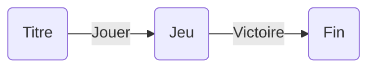

# Cours 3

### Ajouter un personnage jouable

Il y a 3 façon de positionner une caméra. Soit elle est fixe, soit elle suite le personnage joué (à la 3eme personne), soit caméra est en avant du personnage joué (à la première personne).

#### Première personne

- Désactiver « Main Camera »
- Activer « Starter Assets: Character Controllers | URP » dans ***Package Manager***
- Dans `Starter Assets` > `Runtime` > `FirstPersonController` > `Prefabs`, glissez ***NestedParent_Unpack*** sur la scène.

## Prefab

- Ajouter un empty GameObject
- Dedans, ajouter 3 sphères pour faire un bonome de neige.
- Faire un prefab
- Supprimer et ajouter des prefabs
- Modifier le prefab en ajoutant des couleurs de surface

## I don't know what I'm doing, but I made a game (2/2)

Ton monde se parcourt. Aujourd'hui il devient un **jeu** : un objectif, une victoire, un écran titre, un écran de fin, un build autonome et une page sur itch.io. À la fin de la séance, tu auras publié un jeu vidéo.

Ce jeu express est aussi ta **première évaluation** : il se remet au [cours 4](./cours04.md) et vaut 10 % - il mesure exactement ce que tu viens d'apprendre à faire dans Unity.

<!-- ## Déroulement de la séance

| Temps | Activité |
|---|---|
| 0h00 – 0h15 | Retour : état des mini-mondes, dépannage |
| 0h15 – 1h00 | Théorie : colliders et triggers, scènes, compilation, mise en ligne |
| 1h00 – 1h30 | Pratique 1/3 : la zone de victoire et le script fourni |
| 1h30 – 1h45 | Pause |
| 1h45 – 2h30 | Pratique 2/3 : les scènes Titre et Fin, le flux complet |
| 2h30 – 3h05 | Pratique 3/3 : build et mise en ligne sur itch.io |
| 3h05 – 3h25 | Jalon 0 : on essaie les jeux des voisins |
| 3h25 – 3h35 | Le document de conception (GDD) et les devoirs | -->

## Théorie

### Collisions : détecter que quelque chose se passe

Un objet peut détecter qu'un autre le touche grâce à un **Collider** - une forme invisible (boîte, sphère, capsule) attachée au GameObject.

| | Collider « solide » | Collider **Trigger** |
|---|---|---|
| Effet physique | Bloque (mur, sol) | Laisse passer (fantôme) |
| Utilité | Empêcher de traverser | **Détecter un passage** |
| Événement C# | `OnCollisionEnter` | `OnTriggerEnter` |
| Exemples | Murs, plancher, caisses | Zone d'arrivée, pièce à ramasser, piège |

!!! tip "L'intuition"
    Un trigger, c'est un **rayon laser de magasin** : il ne bloque personne, mais il *sait* que tu es passé - et il peut déclencher quelque chose (un son, une porte, une victoire…).

### Les scènes : les « écrans » du jeu

Une **scène** est un contenant : ton niveau en est une, ton écran titre et ton écran de victoire en sont d'autres. Le `SceneManager` permet de passer de l'une à l'autre par code. Un jeu complet, c'est presque toujours plusieurs scènes reliées :

```mermaid
graph LR
    A(Titre) -->|Jouer| B(Jeu)
    B -->|Victoire| C(Fin)
```

Pourquoi un écran titre, même pour un jeu de cinq minutes? (1) Le joueur choisit quand commencer - pas de jeu qui démarre pendant qu'on regarde ailleurs; (2) c'est la **première impression**; (3) le devis du cours exige une interface virtuelle (menu). On le fera vite aujourd'hui, on le soignera au cours 9.

### La compilation (build)

Jusqu'ici, ton jeu n'existe que dans l'éditeur. **Compiler**, c'est produire une application autonome (`.exe` / `.app`) que n'importe qui peut lancer sans Unity. C'est l'étape qui transforme « mon projet » en « mon jeu ».

### La mise en ligne : itch.io

[itch.io](https://itch.io) est LA plateforme des jeux indépendants et des game jams : n'importe qui peut y publier un jeu gratuitement, avec sa page, sa description et ses visuels. C'est là que ton jeu de session sera publié à la fin du cours - alors autant y mettre ton tout premier jeu dès aujourd'hui.

## Pratique

La zone de victoire, le script fourni, les scènes Titre et Fin, le build et la page itch.io.

[Exercice - La victoire, le build et la mise en ligne :material-arrow-right:](./exercices/cours03-victoire-et-mise-en-ligne.md){ .md-button .md-button--primary }

## La carte des notions : « je n'ai pas tout compris »

Parfait - c'est prévu. Tout ce qu'on vient d'effleurer sera repris en profondeur, morceau par morceau, appliqué à **ton** jeu :

| Tu viens d'effleurer… | On le maîtrisera au… |
|---|---|
| Le rangement et le greybox d'un niveau | **Cours 5** (démarrage du jeu de session) |
| Le script C# copié-collé | **Cours 6** (programmation) |
| Les triggers et `CompareTag` | **Cours 7** (interactions) |
| La caméra, les menus, le flux de scènes | **Cours 9** (caméra, HUD, rétroaction) |
| Le build | **Cours 8** (jalon 1), puis **cours 13** (publication web) |
| La page itch.io | **Cours 13** (publication WebGL, crédits) |

## Et maintenant, TON jeu : le document de conception (GDD)

Tu viens de fabriquer un jeu sans l'avoir conçu - c'était l'exercice. À partir du cours 5, c'est l'inverse : une seule cible, **ton** jeu, jusqu'à la fin de la session. Et ça commence sur papier.

Le **Game Design Document** (GDD) décrit tous les aspects fondamentaux d'un jeu vidéo. Rédigé durant la phase de conceptualisation, il sert de fondation au développement : c'est lui qui t'évite de partir dans tous les sens (*scope creep*) et qui rend ton jeu **réalisable** en une session.

[Modèle de GDD](https://www.figma.com/fr-fr/communaute/file/1657116644655532636/document-de-conception-gdd){ .md-button .md-button--primary }

!!! question "Est-ce un document définitif ?"

    Non. En cours de route, des idées tombent à l'eau, d'autres s'ajoutent après les phases de test. C'est un document **vivant** - mais il doit garder une base stable, sinon le projet dérive. C'est pourquoi ton GDD sera validé puis **verrouillé** au cours 5.

!!! tip "Pourquoi maintenant, et pas au cours 1?"
    Parce qu'un GDD écrit avant d'avoir touché à Unity est une liste de souhaits. Tu viens de passer deux séances à fabriquer un jeu : tu sais maintenant ce que coûte une porte, un décor, un build. C'est **exactement** ce qu'il faut pour concevoir quelque chose de réalisable.

## Devoirs

  {.aspect-4-3}

  <small>Évaluation 1 - Acquis Unity (10 %)</small> 
  **[Le jeu express](./devoirs/jeu-express.md){.stretched-link .back}**

  {.aspect-4-3}

  <small>Devoir formatif - Conception</small> 
  **[Analyse d'un jeu existant](./devoirs/gdd.md){.stretched-link .back}**

* **Finalise et remets ton [jeu express](./devoirs/jeu-express.md)** - build et page itch.io - **au début du cours 4**
* Fais l'**[analyse d'un jeu existant](./devoirs/gdd.md)** (formatif, ~30 min) : c'est l'échauffement avant de concevoir le tien, et on s'en sert en classe au cours 4
* Fais essayer ton build à quelqu'un (ami, parent, coloc) et note ses 3 premières réactions

## Savoirs essentiels touchés

Détection de collisions pour le déclenchement d'événements, transitions de scènes, fonctionnement d'une interface virtuelle (menu), compilation de l'application.
