# Cours 3

*[ETB]: Enhanced Trigger Box
*[URP]: Universal Render Pipeline
*[FBX]: Filmbox — format d'échange de modèles 3D
*[GDD]: Game Design Document

https://github.com/jfcmontmorency/collider-event-system.git#v0.1.7

## Ajouter un personnage jouable

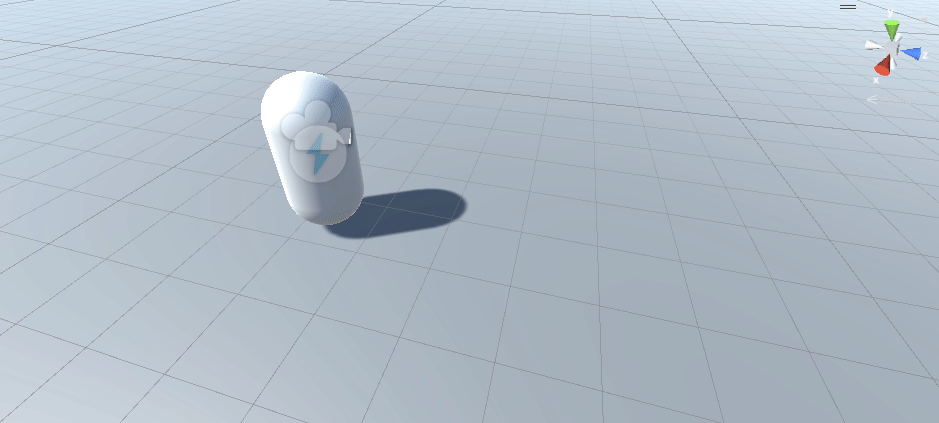{.w-100}

Dans les jeux en 3D, la gestion de la caméra se divise généralement en trois grandes catégories :

* **Caméra fixe** : le joueur observe le personnage qu'il déplace depuis un point de vue prédéfini 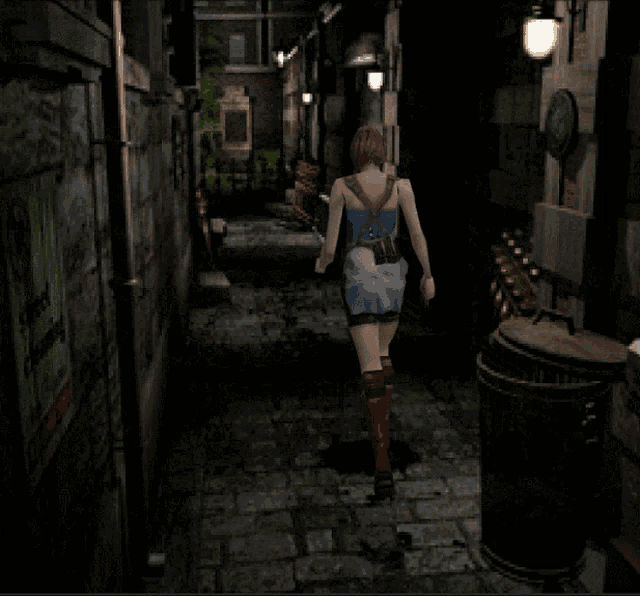{data-zoom-image .w-33}
* Vue à la **3e personne** : la caméra est placée derrière le personnage et suit l'ensemble de ses mouvements {data-zoom-image .w-33}
* Vue à la **1re personne** : la caméra incarne les yeux du personnage, et les mouvements du joueur y sont directement appliqués 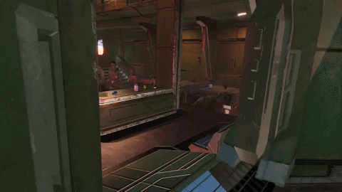{data-zoom-image .w-33}

Pour contrôler un personnage, il faut quand même programmer un peu. 

Pour l'instant, on va essayer de limiter la programmation et utiliser un controlleur de personnage déjà fait : [Starter Assets: Character Controllers | URP](https://assetstore.unity.com/packages/essentials/starter-assets-character-controllers-urp-267961).

### Première personne

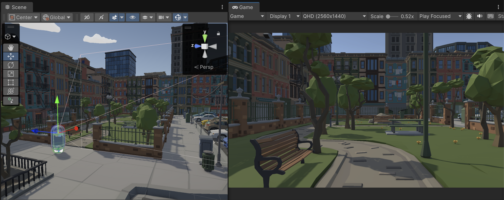{data-zoom-image}

- Ajoute "Starter Assets: Character Controllers" à ton projet
- Désactive la « Main Camera » par défaut
- Dans `Starter Assets` > `Runtime` > `FirstPersonController` > `Prefabs`, glisse ***NestedParent_Unpack*** sur la scène
- Clic-droit sur l'objet dans le panneau `Hierarchy`, puis `Prefab` > `Unpack Completely`
- Positionne le joueur **au-dessus** du sol, à ton point de départ
- Play (++w+a+s+d++ pour bouger, ++space++ pour sauter, la souris pour regarder)

### Troisième personne

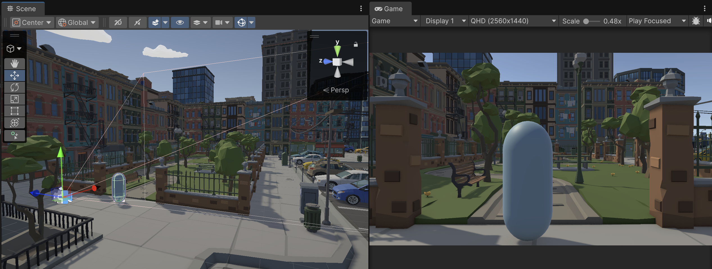{data-zoom-image}

- Ajoute "Starter Assets: Character Controllers" à ton projet
- Désactive la « Main Camera » par défaut
- Dans `Starter Assets` > `Runtime` > `ThirdPersonController` > `Prefabs`, glisse ***NestedParentCapsule_Unpack*** sur la scène
- Clic-droit sur l'objet dans le panneau `Hierarchy`, puis `Prefab` > `Unpack Completely`
<!-- - Sélectionne ***PlayerFollowCamera*** > dans l'Inspector, champ `Follow` : glisse-y ***PlayerCameraRoot*** (il est **à l'intérieur** de PlayerArmature) -->
- Play (++w+a+s+d++ pour bouger, ++space++ pour sauter, la souris pour regarder)

### ETB

Maintenant, on veut que notre personnage interagisse avec Enhanced Trigger Box. Souvenez-vous pour ce faire, il faut 2 choses  :

* l'élément qui interagisse avec le ETB ait le `Tag` **Player**
* ce même élément doit posseder un ***Collider***

Sélectionne ton personnage, trouver la capsule (qui a un _Capsule Collider_) et dans le panneau _Inspector_, assigne le `Tag` **Player**.

<figure markdown>
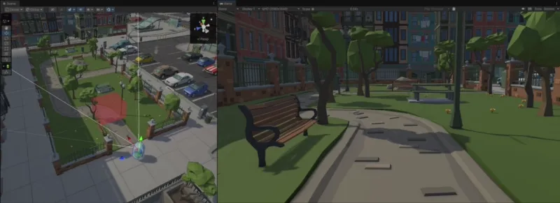{data-zoom-image}
<figcaption>1ère personne</figcaption>
</figure>

<figure markdown>
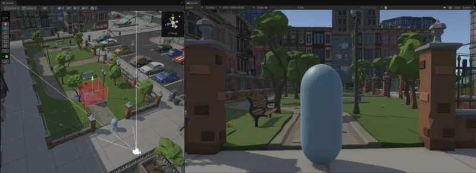{data-zoom-image}
<figcaption>3e personne</figcaption>
</figure>

<!-- On peut afficher le ETB visuellement en lui ajoutant un Mesh Filter (Cube) et un Mesh Renderer (avec un Material). -->

## La progression

{.w-100}

Les prérequis (_gates_) qu'un joueur doit satisfaire pour avancer sert à contrôler le **rythme** du jeu, à **enseigner** les mécaniques, à maintenir le **défi** et à alimenter la **récompense**.

| Type de *gate* | Exemple | Montage ETB |
|---|---|---|
| **Inventaire** | Trouver la carte bleue | `Player Pref Response` sur la clé → `Player Pref Condition` sur la porte |
| **Économie** | Amasser 3 gemmes | `Player Pref Response` avec la valeur `++` → `Player Pref Condition` *greater than or equal to* `3` |
| **Progression** | Atteindre le niveau 10 | Même chose, avec un pref numérique qui monte |
| **Scénario** | Parler au vieux Kamajī | Un ETB devant le PNJ pose le pref `aParle = 1` |
| **Environnement** | Attendre que le pont bascule | `Transform Condition` sur la rotation du pont |
| **Connaissance** | Comprendre qu'il faut regarder la statue | `Camera Condition` (*Looking At*) sur la statue |
| **Habileté du joueur** | Rester dans la zone 5 secondes | `Condition Time` dans les options de base |
| **Compétence** | Le double saut débloqué | `Modify GameObject` > *Enable Component* sur le script de saut |

@todo : 

Exercice

- Ajouter une joueur
- Ajouter un gameobject

### Les trois événements d'un trigger

| Événement | Se déclenche… | Analogie |
|---|---|---|
| **Entrée** | à l'instant où un objet **entre** | la sonnette |
| **Présence** | à **chaque image** tant qu'il est dedans | le détecteur de présence |
| **Sortie** | à l'instant où il **sort** | le « au revoir » du commerce |

Dans l'ETB, la sortie s'active en mettant `After Trigger` à ***Execute Exit Responses*** : une deuxième liste de réponses apparaît. C'est comme ça qu'on fait « la lumière s'éteint quand je quitte la pièce ».

### Les conditions techniques

Rien ne marche si l'une de ces quatre choses manque :

1. Les deux objets ont un **Collider**
2. Celui qui détecte a **Is Trigger** coché (l'ETB l'a déjà)
3. Au moins un des deux **bouge physiquement** : un `Rigidbody` ou un `CharacterController`. Ton personnage Starter Assets en a un — c'est pour ça que ça fonctionne
4. Le champ **Trigger Tags** de l'ETB contient `Player` — sinon n'importe quel caillou qui roule déclenche ta porte

!!! tip "Debug Trigger Box"

    Coche ***Debug Trigger Box*** dans les options de base : l'ETB écrit dans la Console à chaque fois qu'il est déclenché. Quand rien ne fonctionne, c'est la première case à cocher — elle te dit si le problème est **avant** (rien n'entre) ou **après** (ça entre mais la condition bloque).

### Tags et layers

Deux systèmes d'étiquetage qu'on confond toujours :

| | **Tag** | **Layer** |
|---|---|---|
| Répond à | « Qui es-tu? » | « Avec qui interagis-tu? » |
| Par objet | Un seul | Un seul |
| Sert à | **Identifier** (le champ `Trigger Tags` de l'ETB) | Filtrer la **physique** et ce que la **caméra** voit |
| Exemples | `Player`, `Collectable` | `Ground`, `IgnoreRaycast` |

Créer un tag : Inspector → menu `Tag` → `Add Tag…` → `+` → nomme-le → **reviens sur l'objet et assigne-le**.

!!! danger "Créer ne suffit pas"

    Créer un tag ne l'assigne pas. C'est l'erreur la plus fréquente : le tag existe dans la liste, mais l'objet porte encore `Untagged`.

Les layers, tu les utilises déjà sans le savoir : le champ ***Ground Layers*** de ton personnage Starter Assets dit au détecteur de sol « seul ce qui est sur ce layer compte comme un sol ». Si ton personnage flotte ou refuse de sauter, c'est souvent là.

---

## Le patron clé/porte

{.w-50}

Derrière presque tout système de progression de presque tous les jeux se cache la même logique :

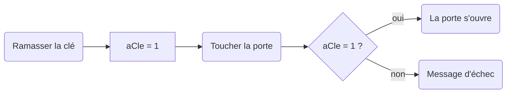
```mermaid
graph LR
    A(Ramasser la clé) --> B["aCle = 1"]
    B --> C(Toucher la porte)
    C --> D{"aCle = 1 ?"}
    D -- oui --> E(La porte s'ouvre)
    D -- non --> F(Message d'échec)
```

La ligne `aCle = 1`, c'est **l'état du jeu** (*game state*) : une valeur qui **se souvient** de ce que le joueur a accompli. Toute progression, du plus petit au plus grand jeu, est une collection de valeurs comme celle-là.

« Clé » et « porte » sont des métaphores. Regarde n'importe quel jeu avec cette lunette :

| « Clé » | « Porte » | Jeu type |
|---|---|---|
| La clé du donjon | La porte du boss | *Zelda* — le patron à l'état pur |
| Le double saut débloqué | La corniche trop haute | Metroidvania — la capacité **est** une clé |
| 3 emblèmes ramassés | La statue qui pivote | *Resident Evil* |
| Le boss vaincu | Le pont qui apparaît | à peu près tout |
| L'indice trouvé | Le cadenas à code | *Escape room* |

{data-zoom-image}

Dans [Hollow Knight (2017)](https://store.steampowered.com/app/367520/Hollow_Knight/), la carte entière est un réseau de portes — corniches, murs, abîmes — dont les clés sont des **capacités**. Quand tu obtiens le *dash*, des dizaines de portes s'ouvrent d'un coup, partout. Même patron, échelle géniale.

📺 La série [Boss Keys (Game Maker's Toolkit)](https://www.youtube.com/playlist?list=PLc38fcMFcV_ul4D6OChdWhsNsYY3NA5B2) décortique les donjons de *Zelda* uniquement sous l'angle clés/portes.

### Le montage, sans code

Deux ETB et une variable. C'est tout.

**① La clé** — un ETB autour de l'objet à ramasser

| Champ | Valeur |
|---|---|
| `Trigger Tags` | `Player` |
| Réponse ***Player Pref Response*** | `Player Pref Key` : `aCle` · `Type` : int · `Value` : `1` |
| Réponse ***Modify GameObject*** | `GameObject` : l'objet clé · `Modify Type` : **Disable** |
| Réponse ***Audio Response*** | `Response Type` : SoundEffect · ton clip de ramassage |
| `After Trigger` | **Destroy Trigger Box** |

**② La porte** — un ETB devant la porte, un peu plus grand qu'elle

| Champ | Valeur |
|---|---|
| `Trigger Tags` | `Player` |
| Condition ***Player Pref Condition*** | `Condition Type` : **equal to** · `Key` : `aCle` · `Type` : int · `Value` : `1` · ✅ **Refresh Every Frame** |
| Réponse ***Modify GameObject*** | `GameObject` : le battant · `Modify Type` : **Disable** |
| Réponse ***Set Material Property*** | le cadre passe au vert (`_BaseColor`, type Colour, `Change Duration` : 1) |

!!! danger "Coche Refresh Every Frame"

    Sans cette case, l'ETB lit la valeur **une seule fois au démarrage du jeu** et la garde en mémoire. Ta clé aura beau être ramassée, la porte lira encore l'ancienne valeur. C'est le bogue le plus vicieux de la séance parce que tout **a l'air** correct.

!!! danger "Les Player Prefs survivent à la fermeture du jeu"

    Un *player pref* est écrit sur le disque de la machine. Relance ton jeu demain : `aCle` vaut encore `1` et ta porte est déjà ouverte. Trois solutions :

    1. **Un ETB de remise à zéro** au démarrage : un ETB avec ***Disable Entry Check*** coché (il se déclenche immédiatement, sans attendre personne) et une `Player Pref Response` qui remet `aCle` à `0`
    2. Le faire depuis la scène de menu, au [cours 5](./cours05.md)
    3. `Edit` > `Clear All PlayerPrefs` pendant tes tests

    C'est aussi ta première rencontre avec la **sauvegarde** — on y revient au [cours 11](./cours11.md).

### Variantes, même patron

| Variante | Ce qui change |
|---|---|
| Levier → pont qui apparaît | `Modify Type` devient **Enable** sur le pont |
| Bouton → lumière qui révèle un passage | La réponse devient ***Lighting Response*** |
| Offrande déposée → portail actif | Identique, seul l'habillage change |
| **3 gemmes → sortie déverrouillée** | Sur chaque gemme : `Player Pref Value` = `++` · sur la sortie : condition ***greater than or equal to*** `3` |

!!! tip "Le `++` de l'ETB"

    Dans une `Player Pref Response`, écrire `++` dans le champ valeur **incrémente** le pref au lieu de l'écraser. Un seul prefab de gemme, dupliqué dix fois, et ton compteur fonctionne. C'est ta première variable qui compte.

!!! question "À toi, deux minutes"

    Dans **ton** jeu : quelle est ta clé? Quelle est ta porte? Si tu ne peux pas répondre en une phrase chacune, on le règle ensemble pendant la pratique.

!!! note "Et appeler du vrai code?"

    La réponse ***Send Message Response*** appelle une **méthode d'un script** que tu aurais écrit, avec un paramètre. C'est la passerelle entre l'ETB et le C# — celle qu'on empruntera au [cours 5](./cours05.md), quand écrire une méthode aura un sens.

---

## Habiller le personnage

{.w-50}

Le personnage des Starter Assets est un mannequin gris. Tes assets Synty contiennent des dizaines de personnages — mais ce sont des **modèles figés en T-pose**, sans squelette. Il faut les *rigger*.

### Ce qu'on va faire

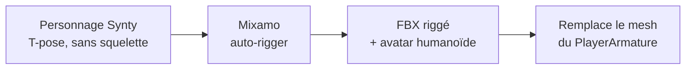
```mermaid
graph LR
    A[Personnage Synty<br/>T-pose, sans squelette] --> B[Mixamo<br/>auto-rigger]
    B --> C[FBX riggé<br/>+ avatar humanoïde]
    C --> D[Remplace le mesh<br/>du PlayerArmature]
```

### 1. Le rigging avec Mixamo

[Mixamo](https://www.mixamo.com) est gratuit avec un compte Adobe.

- Repère le FBX de ton personnage dans le dossier Synty (`Models` ou `Characters`)
- Sur Mixamo : `Upload Character`, dépose le FBX
- L'auto-rigger te demande de placer des marqueurs : menton, poignets, coudes, genoux, aine. Prends ton temps — **c'est la seule étape qui demande de la précision**
- `Skeleton LOD` : **Standard (65)**
- Attends l'aperçu animé, puis `Download`
  - `Format` : **FBX for Unity (.fbx)**
  - `Pose` : **T-pose**

!!! warning "Plan B — Mixamo est un outil non maintenu"

    Adobe garde Mixamo gratuit, mais ne le met plus à jour et le service a connu des pannes de plusieurs jours. **Ne construis pas ta séance de travail dessus sans filet.**

    Si le site est en panne : des personnages Synty **déjà riggés** sont déposés sur le lecteur de classe. Tu les importes et tu sautes directement à l'étape 3.

### 2. L'avatar humanoïde dans Unity

- Glisse le FBX téléchargé dans `📁 _MOMO/Models`
- Sélectionne-le > onglet ***Rig*** dans l'Inspector
  - `Animation Type` : **Humanoid**
  - `Avatar Definition` : **Create From This Model**
  - `Apply`
- Clic sur ***Configure…*** : Unity montre le squelette qu'il a compris. Les cercles doivent être **verts**. Un os en rouge = un marqueur mal placé sur Mixamo

!!! info "Pourquoi Humanoid?"

    Le type ***Humanoid*** dit à Unity : « ce squelette a deux bras, deux jambes et une tête ». Unity peut alors faire du **retargeting** — appliquer n'importe quelle animation humanoïde à n'importe quel personnage humanoïde. C'est ce qui te permet de garder les animations des Starter Assets avec ton personnage Synty.

    La [documentation Unity sur la configuration de l'avatar](https://docs.unity3d.com/Manual/ConfiguringtheAvatar.html) détaille chaque os si un cercle refuse de passer au vert.

### 3. Remplacer le mesh

- Déplie ***PlayerArmature*** dans la Hierarchy : tu y trouves un enfant qui porte le mesh (le mannequin) et un ***PlayerCameraRoot***
- Glisse ton personnage riggé **comme enfant de PlayerArmature**, position `0, 0, 0`
- Désactive (ou supprime) l'ancien mesh
- Sélectionne ***PlayerArmature*** > composant ***Animator*** > champ `Avatar` : glisse le **nouvel** avatar
- Laisse le `Controller` tel quel — c'est lui qui contient les animations
- Play ▶️

!!! warning "Les trois pièges du remplacement"

    1. **Les materials sont perdus.** Mixamo renvoie le FBX sans les materials Synty. Réassigne le material du pack (une seule texture *atlas* pour tout le personnage)
    2. **L'échelle.** Si ton personnage fait trois mètres ou dix centimètres, ajuste `Scale Factor` dans l'onglet `Model` du FBX
    3. **La capsule.** Le `CharacterController` de PlayerArmature a une hauteur et un rayon fixes. Ajuste-les à ton nouveau personnage, sinon il traverse les murs ou flotte

---

## Compiler ton jeu

{.w-50}

Jusqu'ici, ton jeu n'existe que dans l'éditeur. **Compiler** (*build*), c'est produire une application autonome que n'importe qui peut lancer **sans Unity**.

- `File` > `Build Profiles` > vérifie ta ***Scene List*** — une scène absente ne peut pas être chargée
- Clic sur `Build`
- Choisis un dossier `Builds` **à l'extérieur** du dossier `Assets`
- Attends (c'est long la première fois), puis **lance ton jeu** comme une vraie application 🎉

!!! success "Trois semaines, et tu as un jeu"

    Un monde, un personnage, une progression, une fin — et ça se lance tout seul. Échange ton build avec un voisin et essayez le jeu de l'autre.

!!! note "Et la mise en ligne?"

    Publier sur [itch.io](https://itch.io) avec un build **WebGL** qui se joue dans le navigateur viendra au [cours 11](./cours11.md). C'est **ton jeu de session** qui sera publié, pas celui-ci.

---

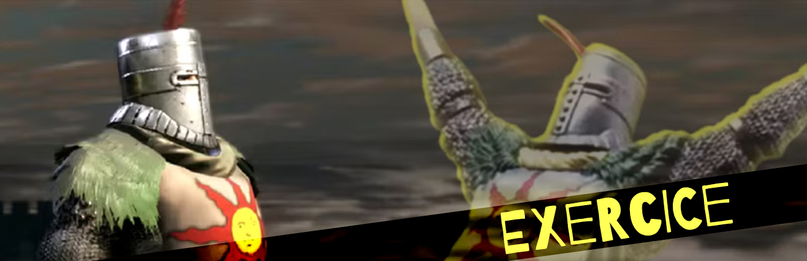

## Troisième personne rigged

!

## Pratique

[Exercice — Le personnage et la progression :material-arrow-right:](./exercices/cours03-personnage-et-progression.md){ .md-button .md-button--primary }

## Devoirs

  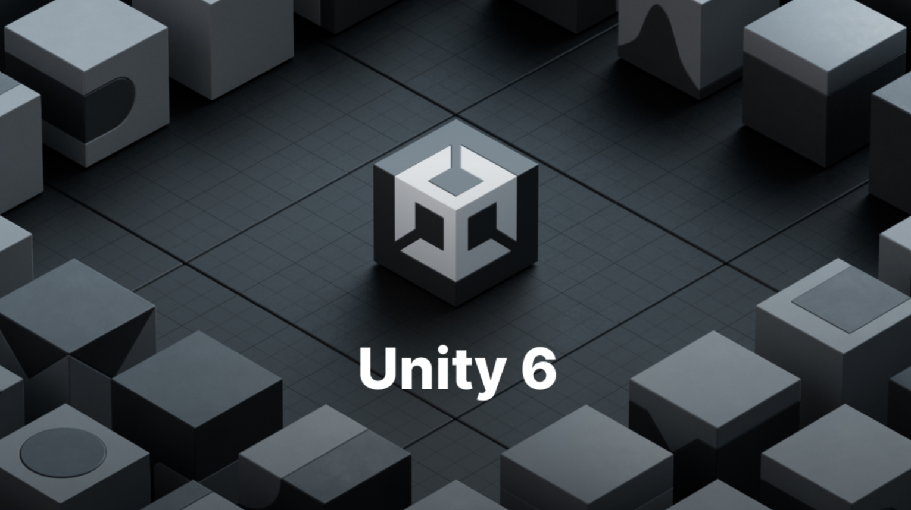{.aspect-4-3}

  <small>Évaluation 1 — Acquis Unity (15 %)</small> 
  **[Le jeu express](./devoirs/jeu-express.md){.stretched-link .back}**

* **Termine et dépose ton [jeu express](./devoirs/jeu-express.md)** : personnage jouable, au moins **une** progression clé/porte, une fin, un build. **À déposer la veille du [cours 4](./cours04.md)** — on l'utilise en classe pour le retour collectif
* Fais un **build** et fais-le essayer à quelqu'un (ami, parent, coloc). Note ses **3 premières réactions** sans l'aider — c'est ton premier playtest, et on en reparle au [cours 12](./cours12.md)

<!--
Savoirs essentiels touchés (note pour l'enseignant) :
Déplacement d'un personnage dans l'environnement virtuel, détection de
collisions pour le déclenchement d'événements, interactions virtuelles,
programmation d'un système de clé et de porte, progression en fonction de
la réussite d'une action, intégration d'images dans l'environnement
virtuel, compilation de l'application.
-->
