# Cours 3

*[CES]: Collider Event System
*[URP]: Universal Render Pipeline
*[FBX]: Filmbox — format d'échange de modèles 3D
*[GDD]: Game Design Document

## Raccourcis

* ++q++ :  View
* ++w++ :  Move
* ++e++ :  Rotate
* ++r++ :  Scale
* ++t++ :  Rect
* ++y++ :  Transform

## Scene

{.h-auto}

Les scènes en Unity sont différents lieux ou interfaces qui sont traditionnellement séparés par un écran de chargement.

### Créer une nouvelle 

Dans le panneau Project : 

- 📁 Assets > 📁 _ > 📁 Scenes
- Clic-droit > `Create` > `Scene` > `Scene`

### Changement de scène avec CES

Collider Event > Actions > Scene

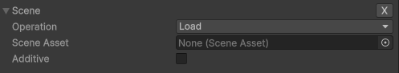{data-zoom-image}

Pour changer de scène à la collision, il ne suffit que de glisser la scene dans le champ Scene Asset.

Pour les autres options, voici l'explication :

|          | Load                             | Load Async                             |
| -------- | -------------------------------- | -------------------------------------- |
| :material-checkbox-blank-outline: Additive  | Petite scène, transition simple (peut saccader)  | Grosse scène, pour éviter le _freeze_ (Permet un écran de chargement) |
| :material-checkbox-marked-outline: Additive | Petit overlay (UI, menu)         | Streaming de contenu en cours de jeu            |

## Skybox

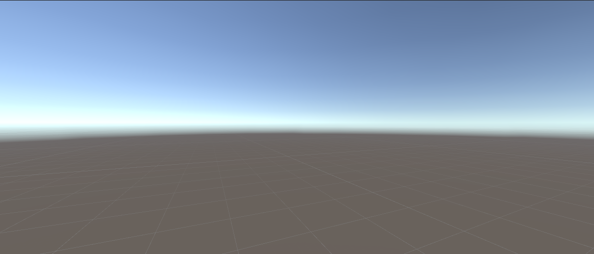{.w-100}

La configuration du skybox se trouve :

`Window` > `Rendering` > `Lighting` > onglet `Environment` > `Skybox Material`

Le Material par défaut est `Default-Skybox`.

Pour en ajouter d'autres, il faut créer d'autres Material, mais nous n'en sommes pas encore à cet étape.

Avec l'aide de l'asset gratuit « [Skybox Series Free](./unity-assets/index.html#skybox-series-free) », vous aurez d'autres options pour configurer `Skybox Material`.

## Text (version express)

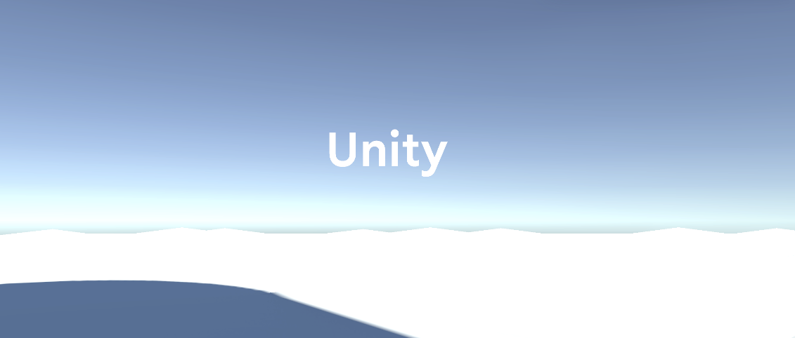

Pour ajouter du texte à une scène 3D, la façon rapide est d'ajouter : 

- `Hierarchy` > clic-droit > `3D Object` > `Legacy` > `TextMesh`
- Changer le contenu du champ `Text`
- Modifier `Font Size` à `500`
- Changer `Character Size` à `0.01`

### Changer la fonte 

Télécharger une fonte sur Google Fonts. Exemple : 

- <https://fonts.google.com/specimen/Google+Sans>
- Cliquer sur « Get Font »
- Cliquer sur « Download all » et chosir le chemin de sauvegarde
- Dézipper le fichier téléchargé

Dans unity : 

- Dans 📁 Assets > 📁 _ : créer un nouveau dossier 📁 Fonts
- Glisser un fichier `.ttf` téléchargé dans le dossier 📁 Fonts
- Sélectionner le TextMesh dans le panneau Hierarchy
- Dans `Inspector` > `TextMesh` > `Font`, glisser la fonte du dossier 📁 Fonts

## Son

Avant l'ajout d'audio dans un projet, on doit avoir un "Audio Listener". 

Il y en a déjè un par défaut d'assigné sur la caméra principale, mais c'est bon de le savoir quand même.

### Trouver des sons

- Télécharger une piste sonore : <https://pixabay.com/> ou <https://tommusic.itch.io/free-fantasy-200-sfx-pack>

Dans unity : 

- Dans 📁 Assets > 📁 _ : créer un nouveau dossier 📁 Audio
- Glisser le fichier `.mp3` téléchargé dans le dossier 📁 Audio

### Ajouter une source audio

- `Hierarchy` > clic-droit > `Audio` > `Audio Source`
- Dans `Inspector` > `Audio Generator`, glisser le fichier audio du panneau _Project_

!!! examples "Options"

    L'option `Play On Awake` coché, déclenche l'audio au chargement de la scène.

    L'option `Loop` la fait boucler.

## Personnage jouable

{.w-100}

Dans les jeux en 3D, la gestion de la caméra se divise généralement en trois grandes catégories :

* Vue à la **1re personne** : la caméra incarne les yeux du personnage, et les mouvements du joueur y sont directement appliqués {data-zoom-image .w-33}
* **Caméra fixe** : le joueur observe le personnage qu'il déplace depuis un point de vue prédéfini {data-zoom-image .w-33}
* Vue à la **3e personne** : la caméra est placée derrière le personnage et suit l'ensemble de ses mouvements {data-zoom-image .w-33}

Le contrôle d'un personnage nécéssite normalement un peu de code. Heureusement, Unity distribut gratuitement un asset de [Character Controllers](./unity-assets/index.md#character-controllers) qui nous épargne la programmation.

### Première personne

{data-zoom-image}

- Désactive ou supprime la « Main Camera »
- Ajoute le [Character Controllers](./unity-assets/index.md#character-controllers) via le Asset Store
- Dans le panneau _Project_, `Assets` > `Starter Assets` > `Runtime` > `FirstPersonController` > `Prefabs`, glisse ***NestedParent_Unpack*** sur la scène
- Positionne le prefab **au-dessus** du sol
- Clic-droit sur l'objet dans le panneau `Hierarchy`, puis `Prefab` > `Unpack Completely`
- Dans ***NestedParent_Unpack***, clic sur PlayerFollowCamera
- Pour que la caméra suive le personnage, du panneau _Hierarchy_, glisse `PlayerCapsule` vers le champ `Inspector` > `Cinemachine Camera` > `Tracking Target` 
- Play

!!! examples "Contrôles"

    * ++w+a+s+d++ pour bouger
    * ++space++ pour sauter
    * Souris pour regarder

### Troisième personne

{data-zoom-image}

- Désactive ou supprime la « Main Camera »
- Ajoute le [Character Controllers](./unity-assets/index.md#character-controllers) via le Asset Store
- Dans le panneau _Project_, `Assets` > `Starter Assets` > `Runtime` > `ThirdPersonController` > `Prefabs`, glisse ***NestedParentCapsule_Unpack*** sur la scène
- Positionne le prefab **au-dessus** du sol
- Clic-droit sur l'objet dans le panneau `Hierarchy`, puis `Prefab` > `Unpack Completely`
- Dans ***NestedParentCapsule_Unpack***, clic sur PlayerFollowCamera
- Pour que la caméra suive le personnage, du panneau _Hierarchy_, glisse `PlayerCapsule` > `PlayerCameraRoot` vers le champ `Inspector` > `Cinemachine Camera` > `Tracking Target` 
- Play

!!! examples "Contrôles"

    * ++w+a+s+d++ pour bouger
    * ++space++ pour sauter
    * Souris pour regarder

### Troisième personne avec armature

- Suivre la même procédure que pour l'ajout d'un "ThirdPersonController", mais au lieu de "NestedParentCapsule_Unpack", choisir "NestedParentArmature_Unpack".

<figure markdown>
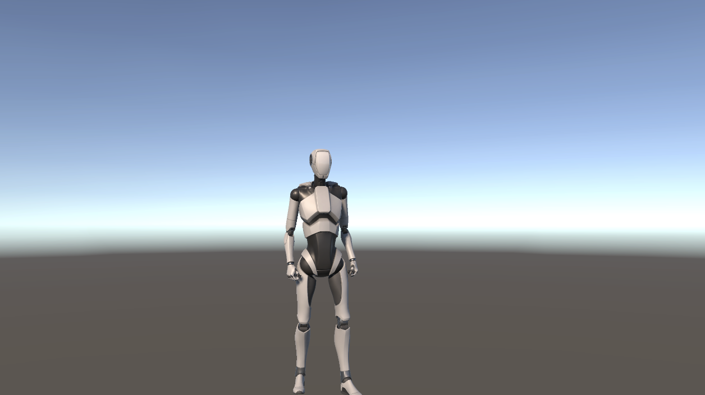{data-zoom-image}
<figcaption>Avec armature</figcaption>
</figure>
<figure markdown>
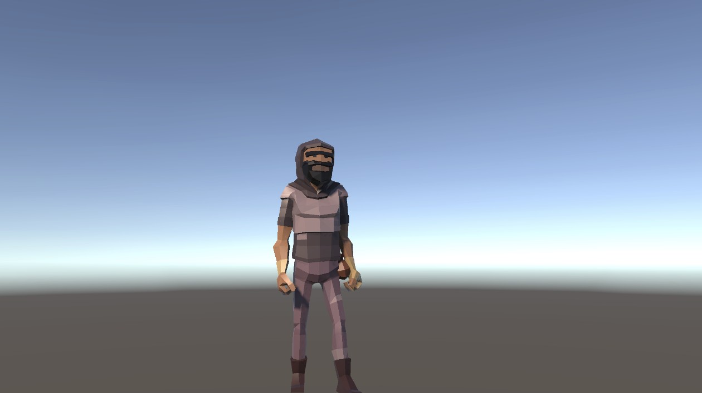{data-zoom-image}
<figcaption>Avec armature + SyntyStudio</figcaption>
</figure>

Le pack SyntyStudio contient plein de personnages en TPose : 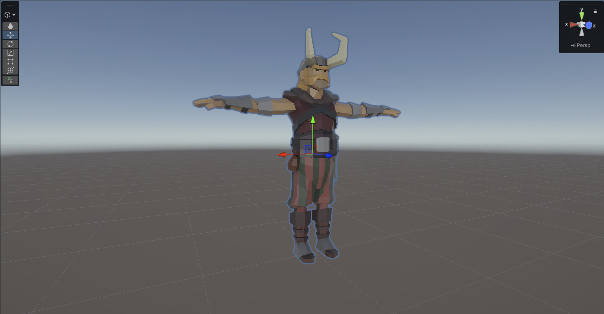{.w-10 data-zoom-image}. Par exemple, dans le dossier `SyntyStudios` > `PolygonAdventure` > `Prefabs` > `Characters`.

Parce que les personnages Synty sont humanoïdes, on peut s'en servir pour remplacer le manequin humanoïde par défaut.

- Dans `NestedParentArmature_Unpack` > `PlayerArmature` > `Geometry`, désactive ou supprime `Armature_Mesh`.
- Glisse un prefab Character de Synty sous le dossier `Geometry`
- Clic sur Player Armature
- Trouve un `CharactersAvatar`. Exemple : `SyntyStudios` > `PolygonAdventure` > `Models` > `Characters`. Déplier `Characters` et on devrait y voir `CharactersAvatar`.
- Glisse `CharactersAvatar` vers le champ `Animator` > `Avatar`

## Collider Event System, la suite

Maintenant, on veut que notre personnage interagisse avec CES.

<figure markdown>
{data-zoom-image}
<figcaption>1ère personne</figcaption>
</figure>

<figure markdown>
{data-zoom-image}
<figcaption>3e personne</figcaption>
</figure>

!!! tip "Préciser la collision"

    Pour cibler uniquement la collision avec le personnage, on peut configurer le Collider Event 

    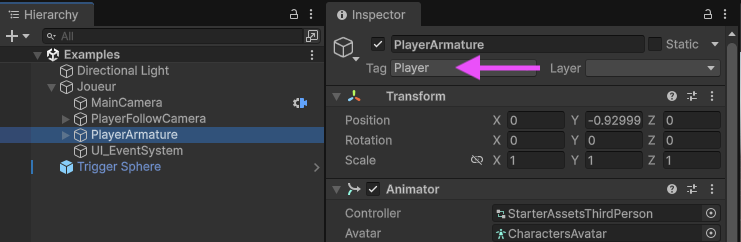{data-zoom-image .w-33}
    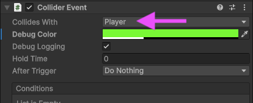{data-zoom-image .w-25}

### Conditions

{.w-100 .aspect-2-1}

Au cours 01, nous avons vu la notion de prérequis (inventaire, économie, progression, etc.). Elle nécessitent l'usage de conditions et nous verrons comment les configurer dans CES.

### Exemple de la clé et la porte

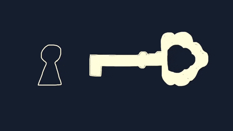{.w-50}

**Situation** : Il faut la clé pour ouvrir la porte. Sans la clé, la porte reste fermée.

**Étapes de réalisation** : 

1. Créer une variable booléenne `hasKey` 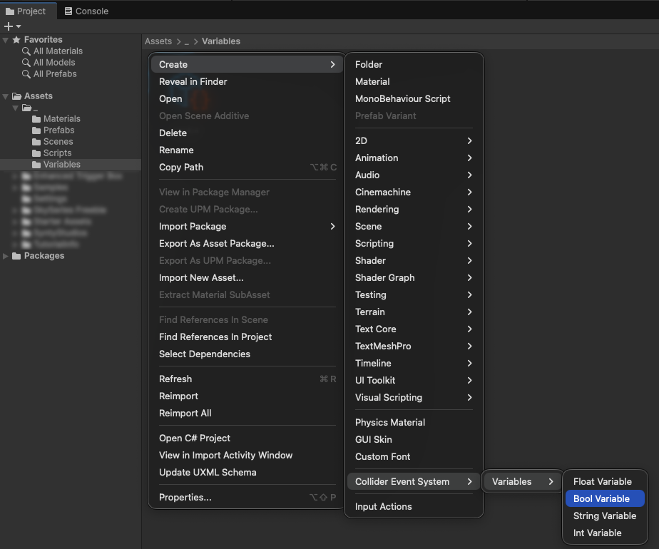{data-zoom-image .w-10}
1. Ajouter un CES qui permet de changer la variable à TRUE 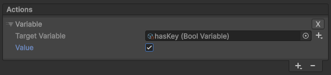{data-zoom-image .w-10}
    - Dans la liste des actions, on a un changement de variable, mais on pourrait aussi ajouter le délenchement d'un son.
    - Si un objet se trouve dans la zone (ex. : une clé en 3d), on pourrait aussi la faire disparaitre en même temps.
1. Ajouter un autre CES et lui appliquer une condition qui détectera si la variable est à TRUE 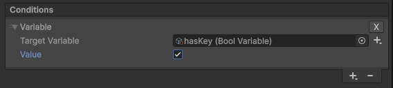{data-zoom-image .w-10}
1. Déterminer une action pertinente

### Types de déclenchement d'actions

- **Entrée** (par défaut) : Se déclenche à l'instant où un objet **entre** dans la zone.  Ex. : prendre un objet
- **Présence** : Se déclenche **X secondes** suite à une collision soutenue.  Ex. : Trop longtemps dans une zone de feu charge la scène _Game Over_ 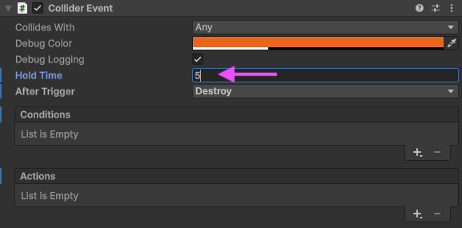{data-zoom-image .w-10}
- **Sortie** : Se déclenche quand l'objet **sort** de la zone.  Ex. : Sortir d'une pièce ferme sa lumière 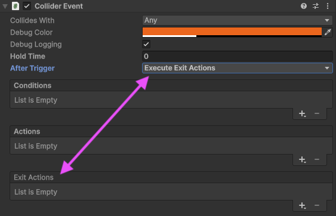{data-zoom-image .w-10}

## Compiler

{.w-100}

Jusqu'ici, le jeu n'existe que dans l'éditeur. 

**Compiler** (faire un *build*), c'est produire une application autonome pour un usage spécifique. Par exemple, faire un build Web pour publier sur [itch.io](https://itch.io/), `.exe` pour Windows, `.apk` pour Android, etc.

- `File` > `Build Profiles` > vérifie la ***Scene List*** (toutes vos scènes doivent y être glissé)
- Dans la colonne de gauche, choisir un build profile (ex: Windows). S'il n'y en a pas, cliquer sur « Add Build Profile »  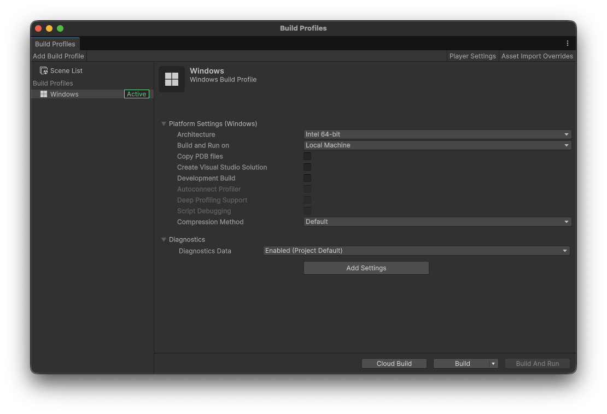{data-zoom-image .w-10} 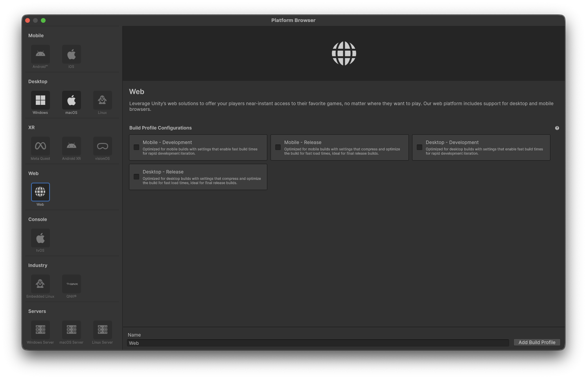{data-zoom-image .w-10}
- Clic sur `Build`
- Enregistrer dans un dossier `Build` à la racine du projet (au même niveau que `.gitignore`)
- Attends (c'est long la première fois), puis **lance ton jeu** comme une vraie application 🎉

!!! note "Github + Build"

    Il n'est pas une bonne pratique de sauvegarder un build sur GitHub. C'est trop lourd. 
    
    Normalement, avec le fichier `.gitignore` pour Unity, les builds dans le dossier `Build` à la racine du projet seront ignoré par Git et c'est ce qu'on veut.

!!! warning "Au CÉGEP, on ne peut malheureusement pas installer de nouveaux Build Profile"

## Devoirs

  {.aspect-4-3}

  <small>Devoir - Unity</small> 
  **[Protolude : Partie 2](./devoirs/protolude/index.md){.stretched-link .back}** 

<!--
Savoirs essentiels touchés (note pour l'enseignant) :
Déplacement d'un personnage dans l'environnement virtuel, détection de
collisions pour le déclenchement d'événements, interactions virtuelles,
programmation d'un système de clé et de porte, progression en fonction de
la réussite d'une action, intégration d'images dans l'environnement
virtuel, compilation de l'application.
-->
