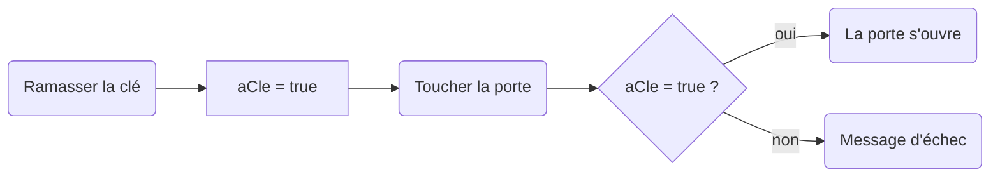
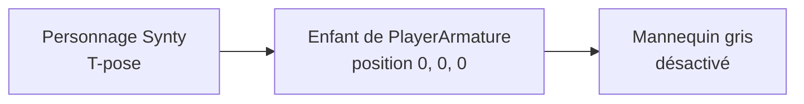

# Cours 3

[STOP]

*[CES]: Collider Event System
*[URP]: Universal Render Pipeline
*[FBX]: Filmbox — format d'échange de modèles 3D
*[GDD]: Game Design Document

https://github.com/jfcmontmorency/collider-event-system.git

À faire rapidement : 

- Changement de scène
- Texte à l'écran (legacy)
- Ajout d'un son

## Ajouter un personnage jouable

{.w-100}

Dans les jeux en 3D, la gestion de la caméra se divise généralement en trois grandes catégories :

* **Caméra fixe** : le joueur observe le personnage qu'il déplace depuis un point de vue prédéfini {data-zoom-image .w-33}
* Vue à la **3e personne** : la caméra est placée derrière le personnage et suit l'ensemble de ses mouvements {data-zoom-image .w-33}
* Vue à la **1re personne** : la caméra incarne les yeux du personnage, et les mouvements du joueur y sont directement appliqués {data-zoom-image .w-33}

Pour contrôler un personnage, il faut quand même programmer un peu. 

Pour l'instant, on va essayer de limiter la programmation et utiliser un controlleur de personnage déjà fait : [Starter Assets: Character Controllers | URP](https://assetstore.unity.com/packages/essentials/starter-assets-character-controllers-urp-267961).

### Première personne

{data-zoom-image}

- Ajoute "Starter Assets: Character Controllers" à ton projet
- Désactive la « Main Camera » par défaut
- Dans `Starter Assets` > `Runtime` > `FirstPersonController` > `Prefabs`, glisse ***NestedParent_Unpack*** sur la scène
- Clic-droit sur l'objet dans le panneau `Hierarchy`, puis `Prefab` > `Unpack Completely`
- Positionne le joueur **au-dessus** du sol, à ton point de départ
- Play (++w+a+s+d++ pour bouger, ++space++ pour sauter, la souris pour regarder)

### Troisième personne

{data-zoom-image}

- Ajoute "Starter Assets: Character Controllers" à ton projet
- Désactive la « Main Camera » par défaut
- Dans `Starter Assets` > `Runtime` > `ThirdPersonController` > `Prefabs`, glisse ***NestedParentCapsule_Unpack*** sur la scène
- Clic-droit sur l'objet dans le panneau `Hierarchy`, puis `Prefab` > `Unpack Completely`
<!-- - Sélectionne ***PlayerFollowCamera*** > dans l'Inspector, champ `Follow` : glisse-y ***PlayerCameraRoot*** (il est **à l'intérieur** de PlayerArmature) -->
- Play (++w+a+s+d++ pour bouger, ++space++ pour sauter, la souris pour regarder)

### Collider Event System

Maintenant, on veut que notre personnage interagisse avec le **Collider Event System**. Souvenez-vous, pour ce faire, il faut 2 choses :

* l'élément qui interagit avec le CES a le `Tag` **Player**
* ce même élément doit posséder un ***Collider***

Sélectionne ton personnage, trouver la capsule (qui a un _Capsule Collider_) et dans le panneau _Inspector_, assigne le `Tag` **Player**.

<figure markdown>
{data-zoom-image}
<figcaption>1ère personne</figcaption>
</figure>

<figure markdown>
{data-zoom-image}
<figcaption>3e personne</figcaption>
</figure>

!!! tip "Les prefabs tout faits"

    Plutôt que d'ajouter un Collider et un composant **Collider Event** à la main, glisse un prefab prêt à l'emploi depuis `Packages` > `Collider Event System` > `Prefabs` : ***Trigger Cube***, ***Trigger Sphere*** ou ***Trigger Capsule***. Le collider est déjà en `Is Trigger` et le composant est déjà attaché — il ne reste qu'à ajouter tes conditions et tes actions.

## La progression

{.w-100}

Les prérequis (_gates_) qu'un joueur doit satisfaire pour avancer sert à contrôler le **rythme** du jeu, à **enseigner** les mécaniques, à maintenir le **défi** et à alimenter la **récompense**.

| Type de *gate* | Exemple | Montage CES |
|---|---|---|
| **Inventaire** | Trouver la carte bleue | Action ***Variable*** sur la clé → Condition ***Variable*** sur la porte |
| **Économie** | Amasser 3 gemmes | Action ***Variable*** en `Value Mode` : **Additive** → Condition ***Variable*** *Greater Than Or Equal* `3` |
| **Progression** | Atteindre le niveau 10 | Même chose, avec une `Int Variable` qui monte |
| **Scénario** | Parler au vieux Kamajī | Un CES devant le PNJ met la variable `aParle` à `true` |
| **Environnement** | Attendre que le pont bascule | Condition ***Rotation*** sur le pont |
| **Connaissance** | Comprendre qu'il faut regarder la statue | Condition ***Looking At*** sur la statue |
| **Habileté du joueur** | Rester dans la zone 5 secondes | `Hold Time` : `5` dans les options de base |
| **Compétence** | Le double saut débloqué | Action ***Game Object*** > `Operation` : **Enable** sur l'objet du saut |

@todo : 

Exercice

- Ajouter une joueur
- Ajouter un gameobject

### Les trois événements d'un trigger

| Événement | Se déclenche… | Analogie |
|---|---|---|
| **Entrée** | à l'instant où un objet **entre** | la sonnette |
| **Présence** | à **chaque image** tant qu'il est dedans | le détecteur de présence |
| **Sortie** | à l'instant où il **sort** | le « au revoir » du commerce |

Dans le CES, la sortie s'active en mettant `After Trigger` à ***Execute Exit Actions*** : une deuxième liste d'actions apparaît. C'est comme ça qu'on fait « la lumière s'éteint quand je quitte la pièce ».

### Les conditions techniques

Rien ne marche si l'une de ces quatre choses manque :

1. Les deux objets ont un **Collider**
2. Celui qui détecte a **Is Trigger** coché (les prefabs `Trigger Cube`, `Sphere` et `Capsule` l'ont déjà)
3. Au moins un des deux **bouge physiquement** : un `Rigidbody` ou un `CharacterController`. Ton personnage Starter Assets en a un — c'est pour ça que ça fonctionne
4. Le champ **Required Tags** du CES contient `Player` — laisse-le vide et n'importe quel caillou qui roule déclenche ta porte

!!! tip "Debug Logging"

    ***Debug Logging*** est coché **par défaut** dans les options de base : le CES écrit dans la Console chaque fois qu'il se déclenche et chaque fois qu'il sort. Quand rien ne fonctionne, c'est la première chose à lire — elle te dit si le problème est **avant** (rien n'entre) ou **après** (ça entre, mais une condition bloque).

### Tags et layers

Deux systèmes d'étiquetage qu'on confond toujours :

| | **Tag** | **Layer** |
|---|---|---|
| Répond à | « Qui es-tu? » | « Avec qui interagis-tu? » |
| Par objet | Un seul | Un seul |
| Sert à | **Identifier** (le champ `Required Tags` du CES) | Filtrer la **physique** et ce que la **caméra** voit |
| Exemples | `Player`, `Collectable` | `Ground`, `IgnoreRaycast` |

Créer un tag : Inspector → menu `Tag` → `Add Tag…` → `+` → nomme-le → **reviens sur l'objet et assigne-le**.

!!! danger "Créer ne suffit pas"

    Créer un tag ne l'assigne pas. C'est l'erreur la plus fréquente : le tag existe dans la liste, mais l'objet porte encore `Untagged`.

Les layers, tu les utilises déjà sans le savoir : le champ ***Ground Layers*** de ton personnage Starter Assets dit au détecteur de sol « seul ce qui est sur ce layer compte comme un sol ». Si ton personnage flotte ou refuse de sauter, c'est souvent là.

---

## Le patron clé/porte

{.w-50}

Derrière presque tout système de progression de presque tous les jeux se cache la même logique :

```mermaid
graph LR
    A(Ramasser la clé) --> B["aCle = true"]
    B --> C(Toucher la porte)
    C --> D{"aCle = true ?"}
    D -- oui --> E(La porte s'ouvre)
    D -- non --> F(Message d'échec)
```

La ligne `aCle = true`, c'est **l'état du jeu** (*game state*) : une valeur qui **se souvient** de ce que le joueur a accompli. Toute progression, du plus petit au plus grand jeu, est une collection de valeurs comme celle-là.

« Clé » et « porte » sont des métaphores. Regarde n'importe quel jeu avec cette lunette :

| « Clé » | « Porte » | Jeu type |
|---|---|---|
| La clé du donjon | La porte du boss | *Zelda* — le patron à l'état pur |
| Le double saut débloqué | La corniche trop haute | Metroidvania — la capacité **est** une clé |
| 3 emblèmes ramassés | La statue qui pivote | *Resident Evil* |
| Le boss vaincu | Le pont qui apparaît | à peu près tout |
| L'indice trouvé | Le cadenas à code | *Escape room* |

{data-zoom-image}

Dans [Hollow Knight (2017)](https://store.steampowered.com/app/367520/Hollow_Knight/), la carte entière est un réseau de portes — corniches, murs, abîmes — dont les clés sont des **capacités**. Quand tu obtiens le *dash*, des dizaines de portes s'ouvrent d'un coup, partout. Même patron, échelle géniale.

📺 La série [Boss Keys (Game Maker's Toolkit)](https://www.youtube.com/playlist?list=PLc38fcMFcV_ul4D6OChdWhsNsYY3NA5B2) décortique les donjons de *Zelda* uniquement sous l'angle clés/portes.

### Le montage, sans code

Deux zones CES et une Variable. C'est tout.

**⓪ La Variable** — l'état du jeu, créé une seule fois

`Assets` > `Create` > `Collider Event System` > `Variables` > ***Bool Variable***, nomme-la `aCle`, et range-la dans `📁 _/Variables`.

Tu peux aussi la créer à la volée : le bouton **+** à côté du champ `Target Variable`, dans une condition ou une action, la crée sur-le-champ.

**① La clé** — un `Trigger Cube` autour de l'objet à ramasser

| Champ | Valeur |
|---|---|
| `Required Tags` | `Player` |
| Action ***Variable*** | `Target Variable` : `aCle` · `Value` : ✅ (true) |
| Action ***Game Object*** | `Target Mode` : **Specific Object** · `Target` : l'objet clé · `Operation` : **Disable** |
| Action ***Audio*** | ton clip de ramassage |
| `After Trigger` | **Destroy** |

**② La porte** — un `Trigger Cube` devant la porte, un peu plus grand qu'elle

| Champ | Valeur |
|---|---|
| `Required Tags` | `Player` |
| Condition ***Variable*** | `Target Variable` : `aCle` · valeur attendue : ✅ (true) |
| Action ***Game Object*** | `Target` : le battant · `Operation` : **Disable** |
| Action ***Material*** | le cadre passe au vert |

!!! danger "Une Variable est partagée"

    Une Variable est un **asset**, pas un composant : tous les objets qui pointent vers `aCle` lisent et écrivent la **même** valeur. C'est exactement ce qu'on veut pour une clé de progression.

    Mais si tu veux donner des points de vie à chacun de tes cinq ennemis, une seule Variable ne suffit pas — il en faudrait cinq, ou un script. Retiens la règle : **une Variable = un état du jeu**, pas un état d'objet.

!!! danger "Persistent : à ne cocher qu'en connaissance de cause"

    Une Variable a une case **Persistent**. Cochée, sa valeur est écrite sur le disque et rechargée au lancement suivant : relance ton jeu demain, `aCle` vaut encore `true` et ta porte est **déjà ouverte**. Décochée — c'est le défaut — tout repart à la valeur d'origine à chaque partie.

    Pour un système clé/porte : **laisse-la décochée**. Persistent sert à ce qui doit survivre entre deux parties : le meilleur score, le volume, le dernier niveau atteint. C'est ta première rencontre avec la **sauvegarde** — on y revient au [cours 11](./cours11.md).

!!! tip "Déclencher sans zone de collision"

    Certaines conditions n'ont rien à voir avec un endroit : « quand le joueur a 3 clés », « quand le pont a fini de pivoter ». Pour celles-là, utilise le composant **Condition Watcher** au lieu de **Collider Event** : pas de collider, pas de zone — il évalue ses conditions en continu depuis le début de la scène.

### Variantes, même patron

| Variante | Ce qui change |
|---|---|
| Levier → pont qui apparaît | `Operation` devient **Enable** sur le pont |
| Bouton → lumière qui révèle un passage | Action ***Game Object*** > **Enable** sur la lumière |
| Offrande déposée → portail actif | Identique, seul l'habillage change |
| **3 gemmes → sortie déverrouillée** | Sur chaque gemme : Action ***Variable*** en `Value Mode` **Additive**, `+1` sur une `Int Variable` · sur la sortie : Condition ***Variable*** *Greater Than Or Equal* `3` |

!!! tip "Le mode Additive"

    Dans une Action ***Variable***, `Value Mode` : **Additive** **ajoute** à la valeur courante au lieu de l'écraser (Int et Float seulement). Un seul prefab de gemme, dupliqué dix fois, et ton compteur fonctionne. C'est ta première variable qui compte.

!!! tip "Hint Material — montrer que l'interaction existe"

    Dans les options de base, coche ***Show Hint Material*** : un matériau est appliqué à un objet **tant que les conditions ne sont pas toutes remplies**, et l'original revient dès qu'elles le sont. La porte reste surlignée tant que tu n'as pas la clé, l'objet à ramasser brille tant que tu n'as pas appuyé sur ++e++.

    C'est la façon la plus rapide de rendre une **affordance** lisible — et c'est directement l'exigence **B5** de ton [projet de session](./devoirs/projet-final.md) : *on comprend sur quoi agir sans qu'on te le dise*.

!!! question "À toi, deux minutes"

    Dans **ton** jeu : quelle est ta clé? Quelle est ta porte? Si tu ne peux pas répondre en une phrase chacune, on le règle ensemble pendant la pratique.

!!! note "Et appeler du vrai code?"

    L'action ***Invoke Events*** expose un `UnityEvent` : tu y glisses un objet de la scène et tu choisis une **méthode** d'un de ses scripts. C'est la passerelle entre le CES et le C# — celle qu'on empruntera au [cours 5](./cours05.md), quand écrire une méthode aura un sens.

---

## L'échec

{.w-100}

Un jeu où on ne peut pas perdre n'est pas un jeu, c'est une visite guidée. Le devis du cours ne parle pas de « victoire », il parle de **mesure et communication de la réussite — succès _ou_ échec**. La progression a donc une deuxième moitié, et on la monte exactement comme la première : **un CES de plus**.

### Trois montages, un seul principe

| Montage | Le principe | Le CES |
|---|---|---|
| **La zone piège** | Lave, ravin, laser, eau profonde : on y entre, c'est fini | `Trigger Cube` sur la zone → Action ***Scene*** |
| **La zone qu'on doit fuir** | On peut y entrer, mais pas y rester | Le même, avec `Hold Time` : `3` |
| **Le danger mobile** | Un rocher qui roule, une sphère qui tombe | L'objet a un `Rigidbody` — il te **pousse** dans une zone piège |

### Recommencer : l'Action Scene pointée sur elle-même

Ta victoire charge une **autre** scène. Ton échec charge **la même** — et c'est tout ce que ça prend pour recommencer.

| Champ | Valeur |
|---|---|
| `Required Tags` | `Player` |
| Action ***Scene*** | `Operation` : **Load** · `Scene Asset` : **ta scène courante** |
| Action ***Audio*** | le son qui fait mal |
| `Hold Time` | `0` pour une mort instantanée, `3` pour laisser une chance de sortir |

!!! tip "Hold Time, le compte à rebours du pauvre"

    `Hold Time` compte les secondes **tant que le joueur est dans la zone**. S'il en sort avant la fin, le compteur retombe à zéro et rien ne se passe. Une seule valeur transforme donc un piège mortel en zone à traverser vite : la lave qu'on peut franchir en courant, le laser qu'on peut esquiver, le sable mouvant dont on peut se sortir.

!!! danger "Recharger la scène ne remet **pas** le jeu à zéro"

    Souviens-toi : une Variable est un **asset**, pas un objet de la scène. Elle survit donc au rechargement. Tu meurs après avoir ramassé la clé, tu repars au début du niveau — mais `aCle` vaut encore ✅ et ta porte s'ouvre au premier contact.

    Deux réponses, aucune n'est mauvaise — c'est une décision de **design** :

    * **Tu gardes tes acquis.** C'est le comportement d'un *checkpoint* : on refait le parcours, pas les énigmes. Tu n'as rien à faire.
    * **Tu repars vraiment à zéro.** Ajoute sur la zone de danger une Action ***Variable*** qui remet `aCle` à ❌ (false), **placée avant** l'action ***Scene***.

    Le monde se recharge, la mémoire du jeu non. C'est la même distinction qu'au [cours 11](./cours11.md), quand on parlera de sauvegarde.

!!! warning "La scène doit être dans les Build Settings"

    Une scène absente de `File` > `Build Profiles` > ***Scene List*** se charge dans l'éditeur et **plante dans le build**. Le CES t'affiche l'avertissement directement dans l'Inspector — lis-le.

!!! tip "Le danger mobile et son collider"

    Un objet qui roule a besoin d'un collider **solide** (`Is Trigger` décoché), sinon il traverse le sol. Un CES, lui, a besoin d'un collider **trigger**. Les deux ne sont pas le même collider.

    Le montage le plus simple évite complètement le problème : **le rocher ne tue pas, il pousse**. C'est le ravin en dessous qui contient le CES — et ton rocher coche du même coup l'exigence « un objet qui utilise la physique ».

    Si tu tiens à ce que le contact lui-même soit mortel : garde le collider solide et ajoute sur le **même objet** un second collider, un peu plus grand, avec `Is Trigger` coché. C'est lui que le composant *Collider Event* écoutera.

### Alternative : la téléportation

Recharger la scène est brutal. Une Action ***Transform*** en `Target Mode` : ***Entering Objects*** qui renvoie le joueur à sa position de départ produit un échec plus doux, sans écran de chargement — c'est le montage vu au [cours 2](./cours02.md#teleporter-un-objet-avec-ces), recyclé tel quel.

!!! question "Doser, deux minutes"

    Un danger qu'on ne voit **pas** venir n'est pas difficile, il est injuste : le joueur n'apprend rien de sa mort, il la subit. Un danger visible qu'on rate quand même, lui, se transforme en « encore une fois ».

    Dans ton jeu : est-ce qu'on **voit** le danger avant de le toucher? Est-ce qu'on comprend, en mourant, **ce qu'on aurait dû faire**?

---

## Habiller le personnage

{.w-50}

Le personnage des Starter Assets est un mannequin gris. Ton pack Synty contient des dizaines de personnages : aujourd'hui, on fait le geste le plus simple qui soit — **on échange le mannequin contre l'un d'eux**.

### Ce qu'on va faire

```mermaid
graph LR
    A[Personnage Synty<br/>T-pose] --> B[Enfant de PlayerArmature<br/>position 0, 0, 0]
    B --> C[Mannequin gris<br/>désactivé]
```

### La substitution, en quatre gestes

- Repère un personnage en **T-pose** dans ton pack Synty (`Prefabs` > `Characters`, ou le FBX dans `Models`)
- Déplie ***PlayerArmature*** dans la Hierarchy : tu y trouves l'enfant qui porte le mesh (le mannequin) et un ***PlayerCameraRoot***
- Glisse ton personnage Synty **comme enfant de PlayerArmature**, position `0, 0, 0`
- Désactive l'ancien mesh gris — ne le supprime pas, c'est ton point de comparaison
- Play ▶️

!!! warning "Il glisse les bras en croix, et c'est normal"

    Un modèle Synty en T-pose n'a **pas de squelette** : Unity ne peut donc pas lui appliquer les animations des Starter Assets. Ton personnage se déplace, mais sans bouger.

    C'est assumé pour aujourd'hui. L'objectif de la séance est que ton jeu **ait un visage** et qu'il **compile**. On le fera bouger au [cours 6](./cours06.md), quand on ouvrira l'Animator : c'est là que le *rigging* prend son sens, pour ton personnage comme pour les PNJ du [cours 10](./cours10.md).

!!! tip "Ton personnage Synty a déjà un squelette?"

    Certains packs livrent des personnages déjà riggés. Vérifie en trente secondes : sélectionne le FBX > onglet ***Rig*** > `Animation Type` : **Humanoid** > `Avatar Definition` : **Create From This Model** > `Apply`. Si ***Configure…*** montre des os **verts**, glisse ce nouvel avatar dans le champ `Avatar` de l'***Animator*** de PlayerArmature : les animations fonctionnent immédiatement.

!!! warning "Les deux réglages à surveiller"

    1. **L'échelle.** Si ton personnage fait trois mètres ou dix centimètres, ajuste `Scale Factor` dans l'onglet `Model` du FBX
    2. **La capsule.** Le `CharacterController` de PlayerArmature a une hauteur et un rayon fixes. Ajuste-les à ton nouveau personnage, sinon il traverse les murs ou il flotte

---

## Compiler ton jeu

{.w-50}

Jusqu'ici, ton jeu n'existe que dans l'éditeur. **Compiler** (*build*), c'est produire une application autonome que n'importe qui peut lancer **sans Unity**.

- `File` > `Build Profiles` > vérifie ta ***Scene List*** — une scène absente ne peut pas être chargée
- Clic sur `Build`
- Choisis un dossier `Builds` **à l'extérieur** du dossier `Assets`
- Attends (c'est long la première fois), puis **lance ton jeu** comme une vraie application 🎉

!!! success "Trois semaines, et tu as un jeu"

    Un monde, un personnage, une progression, une fin — et ça se lance tout seul. Échange ton build avec un voisin et essayez le jeu de l'autre.

!!! note "Et la mise en ligne?"

    Publier sur [itch.io](https://itch.io) avec un build **WebGL** qui se joue dans le navigateur viendra au [cours 11](./cours11.md). C'est **ton jeu de session** qui sera publié, pas celui-ci.

---

## Pratique

[Exercice — Le personnage et la progression :material-arrow-right:](./exercices/cours03-personnage-et-progression.md){ .md-button .md-button--primary }

## Devoirs

  {.aspect-4-3}

  <small>Évaluation 1 — Acquis Unity (13 %)</small> 
  **[Le jeu express](./devoirs/protolude/index.md){.stretched-link .back}**

* **Termine et dépose ton [jeu express](./devoirs/protolude/index.md)** : personnage jouable, au moins **une** progression clé/porte, **un danger qui peut te faire échouer**, une fin. `commit` + `push`, puis dépose **l'URL de ton répertoire public** dans le devoir Teams — **la veille du [cours 4](./cours04.md)**, on l'utilise en classe pour le retour collectif
* Fais un **build** et fais-le essayer à quelqu'un (ami, parent, coloc). Il n'est pas remis — c'est simplement la seule façon de savoir que ton jeu tient debout hors de l'éditeur. Note ses **3 premières réactions** sans l'aider : c'est ton premier playtest, et on en reparle au [cours 12](./cours12.md)

<!--
Savoirs essentiels touchés (note pour l'enseignant) :
Déplacement d'un personnage dans l'environnement virtuel, détection de
collisions pour le déclenchement d'événements, interactions virtuelles,
programmation d'un système de clé et de porte, progression en fonction de
la réussite d'une action, intégration d'images dans l'environnement
virtuel, compilation de l'application.
-->
