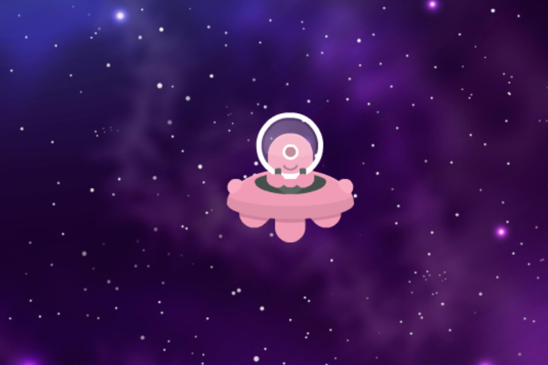
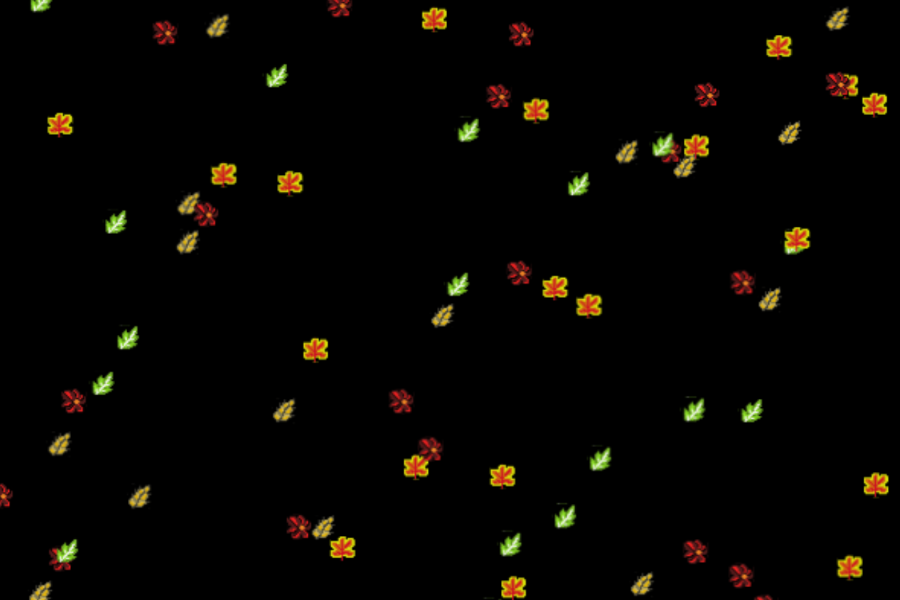

---
tags:
  - Cours 4
  - Mardi 17 septembre
---

# Déplacements 1/2

## Déplacement par pixels

### Déplacement X et Y

<iframe class="aspect-2-1" height="300" style="width: 100%;" scrolling="no" title="Phaser - Déplacement A1" src="https://codepen.io/tim-momo/embed/dyBadmX/5358afca716a8e890844c4847e359f25?default-tab=&theme-id=50173&editable=true" frameborder="no" loading="lazy" allowtransparency="true" allowfullscreen="true">
  See the Pen <a href="https://codepen.io/tim-momo/pen/dyBadmX/5358afca716a8e890844c4847e359f25">
  Phaser - Déplacement A1</a> by TIM Montmorency (<a href="https://codepen.io/tim-momo">@tim-momo</a>)
  on <a href="https://codepen.io">CodePen</a>.
</iframe>

```js linenums="1" hl_lines="4 5 10 13-27"
class Game extends Phaser.Scene {

  create() {
    this.speed = 4;
    this.cursors = this.input.keyboard.createCursorKeys();
    this.player = this.add.circle(400, 200, 10, 0xFFFF00);
  }

  update() {
    this.move();
  }

  move() {
    // Mouvement horizontal
    if (this.cursors.left.isDown) {
      this.player.x -= this.speed;
    } else if (this.cursors.right.isDown) {
      this.player.x += this.speed;
    }

    // Mouvement vertical
    if (this.cursors.up.isDown) {
      this.player.y -= this.speed;
    } else if (this.cursors.down.isDown) {
      this.player.y += this.speed;
    }
  }

}
```

!!! warning "La vitesse par pixel"

    Avec cette méthode de déplacement, la vitesse est dépendante du taux de rafraichissement (frameRate)! Si on a un frameRate de 30 au lieu de 60, le personne va se déplacer 2x moins rapidement.

### Contraintes de déplacement

Maintenant, limitons le déplacement à l'intérieur du canvas.

<iframe class="aspect-2-1" height="300" style="width: 100%;" scrolling="no" title="Phaser - Déplacement A2 Contraintes manuelles" src="https://codepen.io/tim-momo/embed/RwzvGXa/66b531c778c87026799a618e6d6d23dd?default-tab=&theme-id=50173&editable=true" frameborder="no" loading="lazy" allowtransparency="true" allowfullscreen="true">
  See the Pen <a href="https://codepen.io/tim-momo/pen/RwzvGXa/66b531c778c87026799a618e6d6d23dd">
  Phaser - Déplacement A2 Contraintes manuelles</a> by TIM Montmorency (<a href="https://codepen.io/tim-momo">@tim-momo</a>)
  on <a href="https://codepen.io">CodePen</a>.
</iframe>

```js linenums="1"  hl_lines="11 30-47"
class Game extends Phaser.Scene {

  create() {
    this.speed = 4;
    this.cursors = this.input.keyboard.createCursorKeys();
    this.player = this.add.circle(400, 200, 10, 0xFFFF00);
  }

  update() {
    this.move();
    this.setConstraint();
  }

  move() {
    // Mouvement horizontal
    if (this.cursors.left.isDown) {
      this.player.x -= this.speed;
    } else if (this.cursors.right.isDown) {
      this.player.x += this.speed;
    }

    // Mouvement vertical
    if (this.cursors.up.isDown) {
      this.player.y -= this.speed;
    } else if (this.cursors.down.isDown) {
      this.player.y += this.speed;
    }
  }

  setConstraint() {
    const halfWidth = this.player.radius;
    const halfHeight = this.player.radius;

    // Contraintes horizontales
    if (this.player.x < halfWidth) {
      this.player.x = halfWidth;
    } else if (this.player.x > config.width - halfWidth) {
      this.player.x = config.width - halfWidth;
    }

    // Contraintes verticales
    if (this.player.y < halfHeight) {
      this.player.y = halfHeight;
    } else if (this.player.y > config.height - halfHeight) {
      this.player.y = config.height - halfHeight;
    }
  }

}
```

### Téléportation cyclique (wrap-around)

La téléportation cyclique est le concept de base du jeu [Asteroids 1979](https://en.wikipedia.org/wiki/Asteroids_(video_game)).

<iframe class="aspect-2-1" height="300" style="width: 100%;" scrolling="no" title="Phaser - Déplacement A3 Loop" src="https://codepen.io/tim-momo/embed/ZEdwrZg/fee3b376bca57289b606bf45f73a9207?default-tab=&theme-id=50173&editable=true" frameborder="no" loading="lazy" allowtransparency="true" allowfullscreen="true">
  See the Pen <a href="https://codepen.io/tim-momo/pen/ZEdwrZg/fee3b376bca57289b606bf45f73a9207">
  Phaser - Déplacement A3 Loop</a> by TIM Montmorency (<a href="https://codepen.io/tim-momo">@tim-momo</a>)
  on <a href="https://codepen.io">CodePen</a>.
</iframe>

```js linenums="1"  hl_lines="11 30-44"
class Game extends Phaser.Scene {

  create() {
    this.speed = 4;
    this.cursors = this.input.keyboard.createCursorKeys();
    this.player = this.add.circle(400, 200, 10, 0xFFFF00);
  }

  update() {
    this.move();
    this.wrapAround();
  }

  move() {
    // Mouvement horizontal
    if (this.cursors.left.isDown) {
      this.player.x -= this.speed;
    } else if (this.cursors.right.isDown) {
      this.player.x += this.speed;
    }

    // Mouvement vertical
    if (this.cursors.up.isDown) {
      this.player.y -= this.speed;
    } else if (this.cursors.down.isDown) {
      this.player.y += this.speed;
    }
  }

  wrapAround(){
    // Wrap-around horizontal
    if (this.player.x < 0) {
      this.player.x = config.width;
    } else if (this.player.x > config.width) {
      this.player.x = 0;
    }

    // Wrap-around verticale
    if (this.player.y < 0) {
      this.player.y = config.height;
    } else if (this.player.y > config.height) {
      this.player.y = 0;
    }
  }

}
```

## Déplacement par physique

{.w-100}

Pour activer la physique dans notre jeu vidéo, il suffit d'ajouter le code ci-dessous.

```js title="init.js" hl_lines="5-10"
const config = {
  width: 800,
  height: 400,
  scene: Example,
  physics: {
    default: "arcade",
    arcade: {
      debug: true
    }
  }
};
```

Pour qu'un élément soit soumis au système de physique, il faut l'ajouter avec la commande `this.physics.add()` :

```js title="Méthode A" hl_lines="8"
class Example extends Phaser.Scene {
  preload () {
    this.load.image('lemming', './assets/sprites/lemming.png');
  }

  create () {
    // this.sprite = this.add.image(400, 300, 'lemming');
    this.sprite = this.physics.add.image(400, 300, 'lemming');
  }

  update () {}
}
```

Sinon, on peu aussi ajouter un élément existant avec la commande `this.physics.add.existing()` :

```js title="Méthode B" hl_lines="8"
class Example extends Phaser.Scene {
  preload () {
    this.load.image('lemming', './assets/sprites/lemming.png');
  }

  create () {
    this.sprite = this.add.image(400, 300, 'lemming');
    this.physics.add.existing(this.sprite);
  }

  update () {}
}
```

Ainsi, on pourra déplacer notre image avec un **vecteur de vitesse** 😱 !

### Vecteur de vitesse ?

Un **vecteur de vitesse**, ou simplement **vélocité**, est une façon simple de représenter une **direction** et une **vitesse** (magnitude).

Dans l'exemple ci-dessous, le trait vert représente la vélocité du personnage.

<iframe class="aspect-4-1" height="300" style="width: 100%;" scrolling="no" title="Phaser - Vecteurs" src="https://codepen.io/tim-momo/embed/vYqwRJy?default-tab=&theme-id=50173" frameborder="no" loading="lazy" allowtransparency="true" allowfullscreen="true">
  See the Pen <a href="https://codepen.io/tim-momo/pen/vYqwRJy">
  Phaser - Vecteurs</a> by TIM Montmorency (<a href="https://codepen.io/tim-momo">@tim-momo</a>)
  on <a href="https://codepen.io">CodePen</a>.
</iframe>

### Déplacement X, Y et ... V

En utilisant le système de physique, on peut déplacer n'importe quel objet en lui assignant une vélocité.

Contrairement au déplacement par pixels, cette méthode est davantage relative au **temps** plutôt qu'au **frameRate**.

Un déplacement de 200 pour un vecteur signifie que l’objet se déplacera de 200 pixels en 1 seconde[^vector].

[^vector]: À condition qu’il n’y ait aucune autre force ou influence (comme la gravité ou la friction) qui affecte son mouvement

Lorsqu'on ajoute un objet au système de physique, une propriété `body` est créée. C’est cette propriété qui permet de manipuler les caractéristiques physiques de l’objet, comme la vélocité, l’accélération, la gravité, etc.

Voici comment on assigne une vélocité :

```js
this.monBonhomme.body.setVelocityX(200);
this.monBonhomme.body.setVelocityY(200);
```

<iframe class="aspect-2-1" height="300" style="width: 100%;" scrolling="no" title="Phaser - Déplacement B1 - Physique" src="https://codepen.io/tim-momo/embed/wvLbyNg/48add1cdfe747b3f2ed5298d238f3c13?default-tab=&theme-id=50173&editable=true" frameborder="no" loading="lazy" allowtransparency="true" allowfullscreen="true">
  See the Pen <a href="https://codepen.io/tim-momo/pen/wvLbyNg/48add1cdfe747b3f2ed5298d238f3c13">
  Phaser - Déplacement B1 - Physique</a> by TIM Montmorency (<a href="https://codepen.io/tim-momo">@tim-momo</a>)
  on <a href="https://codepen.io">CodePen</a>.
</iframe>

```js hl_lines="8 16-32"
class Example extends Phaser.Scene {
  preload() {}

  create() {
    this.speed = 200;
    this.cursors = this.input.keyboard.createCursorKeys();
    this.player = this.add.circle(400, 200, 10, 0xcccc00);
    this.physics.add.existing(this.player);
  }

  update() {
    this.move();
  }

  move() {
    // Mouvement horizontal
    if (this.cursors.left.isDown) {
      this.player.body.setVelocityX(-this.speed);
    } else if (this.cursors.right.isDown) {
      this.player.body.setVelocityX(this.speed);
    } else {
      this.player.body.setVelocityX(0);
    }

    // Mouvement vertical
    if (this.cursors.up.isDown) {
      this.player.body.setVelocityY(-this.speed);
    } else if (this.cursors.down.isDown) {
      this.player.body.setVelocityY(this.speed);
    } else {
      this.player.body.setVelocityY(0);
    }
  }
}
```

### Contrainte des rebords

Grâce au système de physique, il est très facile d’empêcher un objet de sortir des limites du jeu en utilisant la fonction `setCollideWorldBounds()`.

Cette méthode permet de faire en sorte que l’objet se heurte aux bords du monde défini, et reste à l’intérieur des limites.

<iframe class="aspect-2-1" height="300" style="width: 100%;" scrolling="no" title="Phaser - Déplacement B1 - Physique" src="https://codepen.io/tim-momo/embed/MWMLQMN/0325679fba015b092381ec553d6f8d49?default-tab=&theme-id=50173&editable=true" frameborder="no" loading="lazy" allowtransparency="true" allowfullscreen="true">
  See the Pen <a href="https://codepen.io/tim-momo/pen/MWMLQMN/0325679fba015b092381ec553d6f8d49">
  Phaser - Déplacement B1 - Physique</a> by TIM Montmorency (<a href="https://codepen.io/tim-momo">@tim-momo</a>)
  on <a href="https://codepen.io">CodePen</a>.
</iframe>

```js hl_lines="9"
class Example extends Phaser.Scene {
  preload() {}

  create() {
    this.speed = 200;
    this.cursors = this.input.keyboard.createCursorKeys();
    this.player = this.add.circle(400, 200, 10, 0xcccc00);
    this.physics.add.existing(this.player);
    this.player.body.setCollideWorldBounds();
  }

  update() {
    this.move();
  }

  // ...
}
```

### Téléportation cyclique avec physique

C'est bien plus facile avec la physique ! Il suffit d'ajouter la commande `this.physics.world.wrap()`.

La fonction `wrap()` recoit deux paramètres :

* gameObject (obligatoire) : Il s’agit de l’objet (ou des objets) que tu veux faire “wrap”. Cela peut être un objet individuel ou un tableau d’objets.
* padding (facultatif) : C’est une marge en pixels ajoutée autour des limites du monde avant que l’objet ne soit “wrap”. Par exemple, si tu donnes une valeur de 24, l’objet doit être 24 pixels en dehors des limites avant d’être repositionné.

<iframe class="aspect-2-1" height="300" style="width: 100%;" scrolling="no" title="Phaser - Déplacement Physique 8" src="https://codepen.io/tim-momo/embed/ExBBjre?default-tab=&theme-id=50173" frameborder="no" loading="lazy" allowtransparency="true" allowfullscreen="true">
  See the Pen <a href="https://codepen.io/tim-momo/pen/ExBBjre">
  Phaser - Déplacement Physique 8</a> by TIM Montmorency (<a href="https://codepen.io/tim-momo">@tim-momo</a>)
  on <a href="https://codepen.io">CodePen</a>.
</iframe>

```js hl_lines="9 14 37-39"
class Example extends Phaser.Scene {
  preload() {}

  create() {
    this.speed = 200;
    this.cursors = this.input.keyboard.createCursorKeys();
    this.player = this.add.circle(400, 200, 10, 0xcccc00);
    this.physics.add.existing(this.player);
    this.player.body.setCollideWorldBounds(false); // Facultatif, mais clair
  }

  update() {
    this.move();
    this.wrapAround();
  }

  move() {
    // Mouvement horizontal
    if (this.cursors.left.isDown) {
      this.player.body.setVelocityX(-this.speed);
    } else if (this.cursors.right.isDown) {
      this.player.body.setVelocityX(this.speed);
    } else {
      this.player.body.setVelocityX(0);
    }

    // Mouvement vertical
    if (this.cursors.up.isDown) {
      this.player.body.setVelocityY(-this.speed);
    } else if (this.cursors.down.isDown) {
      this.player.body.setVelocityY(this.speed);
    } else {
      this.player.body.setVelocityY(0);
    }
  }

  wrapAround() {
    this.physics.world.wrap(this.player, 20);
  }
}
```

### Obstacles

L'ajout d'obstacle est possible en utilisant la fonction `collider()` du système de physique.

Il est également possible de rendre un objet immobile avec la fonction `objet.setImmovable(true)` et possible de désactiver la gravité avec `objet.body.setAllowGravity(false)`.

<iframe class="aspect-2-1" height="300" style="width: 100%;" scrolling="no" title="Phaser - Déplacement B2- Obstacle" src="https://codepen.io/tim-momo/embed/MWMLVow/f76e597ea82c5fe9a78854bd65795965?default-tab=&theme-id=50173&editable=true" frameborder="no" loading="lazy" allowtransparency="true" allowfullscreen="true">
  See the Pen <a href="https://codepen.io/tim-momo/pen/MWMLVow/f76e597ea82c5fe9a78854bd65795965">
  Phaser - Déplacement B2- Obstacle</a> by TIM Montmorency (<a href="https://codepen.io/tim-momo">@tim-momo</a>)
  on <a href="https://codepen.io">CodePen</a>.
</iframe>

```js hl_lines="11-16"
class Example extends Phaser.Scene {
  preload() {}

  create() {
    this.speed = 200;
    this.cursors = this.input.keyboard.createCursorKeys();
    this.player = this.add.circle(400, 200, 10, 0xcccc00);
    this.physics.add.existing(this.player);
    this.player.body.setCollideWorldBounds();

    // Ajout d’un obstacle
    this.obstacle = this.physics.add.rectangle(222, 195, 45, 160, 0xff0000);
    this.obstacle.body.setImmovable();

    // Activation de la collision
    this.physics.add.collider(this.player, this.obstacle);
  }

  update() {
    this.move();
  }

  // ...
}
```

### Gravité

On peut très facilement activer un système de gravité. Voici 3 manières :

```js title="Gravité globale dans init.js" hl_lines="8-11"
const config = {
  width: 800,
  height: 400,
  scene: Example,
  physics: {
    default: "arcade",
    arcade: {
      gravity: {
        x: 0,
        y: 300
      },
      debug: true
    }
  }
};
```

```js title="Gravité globale dans le create()"
this.physics.world.gravity.y = 300;
```

```js title="Gravité sur un objet spécifique dans le create()"
this.monBonhomme.body.setGravityY(300);
```

<iframe class="aspect-2-1" height="300" style="width: 100%;" scrolling="no" title="Phaser - Déplacement B2- Gravité" src="https://codepen.io/tim-momo/embed/gONqzpN/d376728c5141914d07056f9fcbc65548?default-tab=&theme-id=50173&editable=true" frameborder="no" loading="lazy" allowtransparency="true" allowfullscreen="true">
  See the Pen <a href="https://codepen.io/tim-momo/pen/gONqzpN/d376728c5141914d07056f9fcbc65548">
  Phaser - Déplacement B2- Gravité</a> by TIM Montmorency (<a href="https://codepen.io/tim-momo">@tim-momo</a>)
  on <a href="https://codepen.io">CodePen</a>.
</iframe>

```js hl_lines="8-9"
class Example extends Phaser.Scene {
  preload() {}

  create() {
    this.player = this.add.circle(400, 200, 10, 0xcccc00);
    this.physics.add.existing(this.player);

    // Active la gravité
    this.player.body.setGravityY(300);
  }

  update() {}
}
```

### Rebond

Afin d'ajouter un comportement lors d'une collision avec un objet, on peut configurer la notion de rebond avec la commande `setBounce()`.

Paramètre de la [fonction setBounce](https://newdocs.phaser.io/docs/3.80.0/focus/Phaser.Physics.Matter.Components.Bounce-setBounce) : Un nombre qui définit l'élasticité du corps. La valeur est toujours positive et se situe dans la plage (0, 1).

Une valeur de 0,8 signifie que le corps peut rebondir avec environ 80 % de son énergie cinétique.

<iframe class="aspect-2-1" height="300" style="width: 100%;" scrolling="no" title="Phaser - Déplacement B3 - Rebond" src="https://codepen.io/tim-momo/embed/qBzgYZy/44a9b7a0ee34239049902d7b549011a6?default-tab=&theme-id=50173&editable=true" frameborder="no" loading="lazy" allowtransparency="true" allowfullscreen="true">
  See the Pen <a href="https://codepen.io/tim-momo/pen/qBzgYZy/44a9b7a0ee34239049902d7b549011a6">
  Phaser - Déplacement B3 - Rebond</a> by TIM Montmorency (<a href="https://codepen.io/tim-momo">@tim-momo</a>)
  on <a href="https://codepen.io">CodePen</a>.
</iframe>

```js hl_lines="8"
class Example extends Phaser.Scene {
  preload() {}

  create() {
    this.player = this.add.circle(400, 200, 10, 0xcccc00);
    this.physics.add.existing(this.player);
    this.player.body.setGravityY(300);
    this.player.body.setBounce(0.8);
  }

  update() {}
}
```

### Friction

Voici les différentes fonction pour appliquer de la friction :

* `this.player.body.setDrag(0)`
* `this.player.body.setDragX(0)`
* `this.player.body.setDragY(0)`

<iframe class="aspect-2-1-tabbed" height="300" style="width: 100%;" scrolling="no" title="Phaser - Déplacement Physique 8" src="https://codepen.io/tim-momo/embed/WNqqemj?default-tab=&editable=true&theme-id=50210" frameborder="no" loading="lazy" allowtransparency="true" allowfullscreen="true">
  See the Pen <a href="https://codepen.io/tim-momo/pen/WNqqemj">
  Phaser - Déplacement Physique 8</a> by TIM Montmorency (<a href="https://codepen.io/tim-momo">@tim-momo</a>)
  on <a href="https://codepen.io">CodePen</a>.
</iframe>

### Accélération progressive

Voici les différentes fonction pour appliquer un accélération progressive :

* `this.player.body.setAcceleration(0)`
* `this.player.body.setAccelerationX(0)`
* `this.player.body.setAccelerationY(0)`
* `this.player.body.setMaxVelocity(300, 300);`

<iframe class="aspect-2-1-tabbed" height="300" style="width: 100%;" scrolling="no" title="Phaser - Déplacement Physique 7" src="https://codepen.io/tim-momo/embed/Rwzzbqw?default-tab=&editable=true&theme-id=50210" frameborder="no" loading="lazy" allowtransparency="true" allowfullscreen="true">
  See the Pen <a href="https://codepen.io/tim-momo/pen/Rwzzbqw">
  Phaser - Déplacement Physique 7</a> by TIM Montmorency (<a href="https://codepen.io/tim-momo">@tim-momo</a>)
  on <a href="https://codepen.io">CodePen</a>.
</iframe>

## Exercices

<div class="grid grid-1-2" markdown>
  

  <small>Exercice - Phaser</small><br>
  **[Un voyage pixelisé](./exercices/voyage-pixel.md){.stretched-link}**
</div>

<div class="grid grid-1-2" markdown>
  

  <small>Exercice - Phaser</small><br>
  **[Un voyage plutôt physique](./exercices/voyage-physique.md){.stretched-link}**
</div>

<div class="grid grid-1-2" markdown>
  

  <small>Exercice - Phaser</small><br>
  **[Ça commence par une feuille](./exercices/feuille.md){.stretched-link}**
</div>

<div class="grid grid-1-2" markdown>
  

  <small>Exercice - Phaser</small><br>
  **[Puis c'est l'automne](./exercices/automne.md){.stretched-link}**
</div>

<div class="grid grid-1-2" markdown>
  

  <small>Exercice - Phaser</small><br>
  **[Peglin](./exercices/peglin.md){.stretched-link}**
</div>
