# Cours 4

*[GDD]: Game Design Document
*[CES]: Collider Event System
*[PNJ]: Personnage non joueur

## Cellulaires 📱

## Playtest

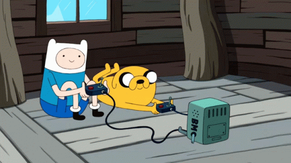{.w-100}

Phase de test des jeux en classe. (Ne pas expliquer son jeu)

1. Ouvrir son jeu sur Unity, ne pas démarrer
1. Changer de poste et démarrer le jeu
1. Lorsque vous avez terminé de jouer, faire stop sur unity
1. Écrire 2 rétroactions sur la feuille :
  - Ce que vous avez aimé
  - Ce qui doit être amélioré

## Post-mortem

!!! question "Qu'est-ce qui était le plus long à faire ?"

!!! question "Quelles limites avez-vous rencontrées ?"

!!! question "Qu'est-ce qui manquait à votre jeu ?"

## Raccourci

++v++ : Vertex Snap

++ctrl+shift++ + drag : L'objet se positionne à la surface d'un autre objet

## Boucle de jeu

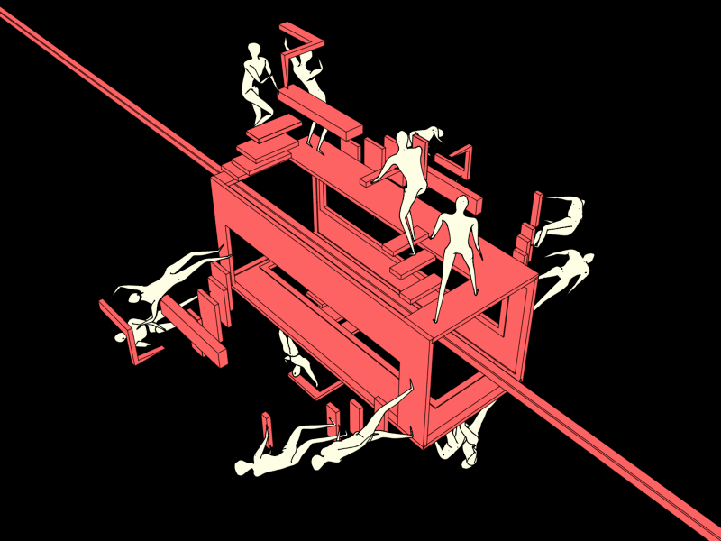{.w-100 .aspect-16-9}

La boucle de jeu[^gameloop] est la séquence d'action répétées tout au long de la partie. Il faut la concevoir avant de commencer le jeu. 

[^gameloop]: [Fondamentaux de la boucle de jeu : Un guide 2025 pour les développeurs](https://www.meshy.ai/fr/blog/game-loop)

C'est la base du gameplay.

!!! question "La question à poser"

    Qu'est-ce qui est amusant dans la gameloop ?

### 3 temps

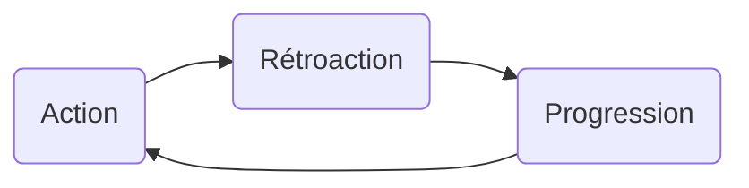
```mermaid
graph LR
    A(Action) --> B(Rétroaction)
    B --> C(Progression)
    C --> A
```

Exemples

* **Action** : ramasser, sauter, activer, éviter
* **Rétroaction** : un son, une lumière, un compteur qui monte
* **Progression** : une porte ouverte, une zone accessible

### 2 boucles

Un jeu n'a pas qu'une seule boucle. Il en a au moins deux.

| | Boucle **courte** | Boucle **longue** |
|---|---|---|
| Durée | Quelques secondes | Quelques minutes |
| Contenu | L'action de base, répétée | Un objectif franchi |
| Dans ton jeu | Explorer, ramasser, éviter, activer | Franchir une **porte** et changer de zone / scène |
| Si elle est ratée | Le jeu est ennuyant | Le jeu n'avance pas |

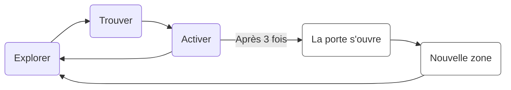
```mermaid
graph LR
    A(Explorer) --> B(Trouver)
    B --> C(Activer)
    C --> A
    C -->|Après 3 fois| D(La porte s'ouvre):::longue
    D --> E(Nouvelle zone):::longue
    E --> A

  classDef longue stroke:#666666,fill:transparent;
```

### Exemples de boucles

**Jeux de tir (FPS/TPS)**

| *Instant après instant* | *Minute après minute* | *Heure après heure* | *Jour après jour* |
| :--- | :--- | :--- | :--- |
| 1. Repérer l'ennemi 2. Tirer sur l'ennemi 3. Avancer *(↻ répéter)* | 1. Entrer dans une pièce 2. Obtenir des armes 3. Nettoyer la pièce *(↻ répéter)* | 1. Préparer l'équipement (Loadout) 2. Terminer les missions 3. Recevoir des améliorations *(↻ répéter)* | 1. Obtenir un nouveau personnage 2. Débloquer des succès 3. Dépenser des gemmes (cosmétiques) *(↻ répéter)* |

**Jeux de rôle (RPG)**

| *Instant après instant* | *Minute après minute* | *Heure après heure* | *Jour après jour* |
| :--- | :--- | :--- | :--- |
| 1. Observer les cibles 2. Choisir compétence + cible 3. Combattre 4. Recevoir de l'expérience *(↻ répéter)* | 1. Parcourir la pièce 2. Vaincre les ennemis 3. Piller les coffres *(↻ répéter)* | 1. Explorer les zones 2. Terminer les donjons 3. Gagner des niveaux et de l'or 4. Visiter les marchands *(↻ répéter)* | 1. Terminer les arcs narratifs 2. Réussir les défis 3. Vaincre les boss 4. Débloquer des talents *(↻ répéter)* |

**Metroidvania**

| *Instant après instant* | *Minute après minute* | *Heure après heure* | *Jour après jour* |
| :--- | :--- | :--- | :--- |
| 1. Courir, Esquiver, Vaincre 2. Choisir un outil, Franchir l'obstacle *(↻ répéter)* | 1. Explorer la pièce 2. Trouver des secrets 3. Ramasser le butin *(↻ répéter)* | 1. Terminer les niveaux 2. Trouver un nouvel outil 3. Vaincre de nouveaux ennemis 4. Revenir sur ses pas (Backtracking) *(↻ répéter)* | 1. Terminer les zones 2. Vaincre les boss 3. Progression de la base / Succès *(↻ répéter)* |

**Jeu de plateforme (Sidescroller)**

| *Instant après instant* | *Minute après minute* | *Heure après heure* | *Jour après jour* |
| :--- | :--- | :--- | :--- |
| 1. Courir 2. Sauter 3. Ramasser des pièces *(↻ répéter)* | 1. Terminer les écrans 2. Surmonter les dangers / ennemis *(↻ répéter)* | 1. Terminer les niveaux entiers 2. Vaincre les boss de zone 3. Découvrir des raccourcis *(↻ répéter)* | N / A |

**Jeux d'arène (MOBA)**

| *Instant après instant* | *Minute après minute* | *Heure après heure* | *Jour après jour* |
| :--- | :--- | :--- | :--- |
| 1. Déplacer le héros 2. Lancer des sorts 3. Achever les sbires (Last hit) *(↻ répéter)* | 1. Retourner à la base 2. Acheter des objets 3. Disputer les objectifs *(↻ répéter)* | 1. Jouer des parties 2. Progresser 3. Débloquer des statistiques *(↻ répéter)* | 1. Débloquer des champions 2. Essayer de nouvelles compos 3. Améliorer son niveau / rang *(↻ répéter)* |

## Notions d'interaction

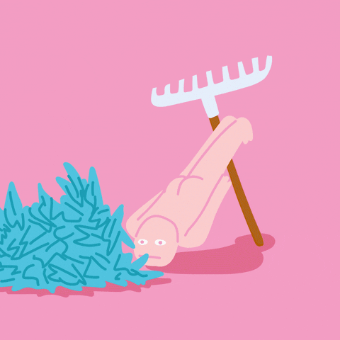{.w-100 .aspect-4-3}

<!-- * J'appuie sur un bouton et rien ne se passe → pas de réponse : frustration
* Le jeu répond sans que j'aie agi → cinématique, pas interaction
* J'agis, le jeu a détecté, mais ne me le montre pas → le pire cas : l'interacteur croit que ça n'a pas marché

!!! question "Discussion de groupe (5 min)"
    Quel est le plus **petit** jeu possible? Un bouton qui allume une lumière, est-ce un jeu? Qu'est-ce qui manque pour que ça le devienne? *(Indice : un objectif, une possibilité d'échec…)* -->

### L'interacteur

Au cinéma, on est spectateur, mais dans un jeu, on intervient avec des actions. 

Il faut donc penser le jeu sous forme d'actions plutôt que sous forme de récit.

### L'affordance

Ce qu'un objet **suggère** qu'on peut faire avec lui (sans explication).

<figure markdown>
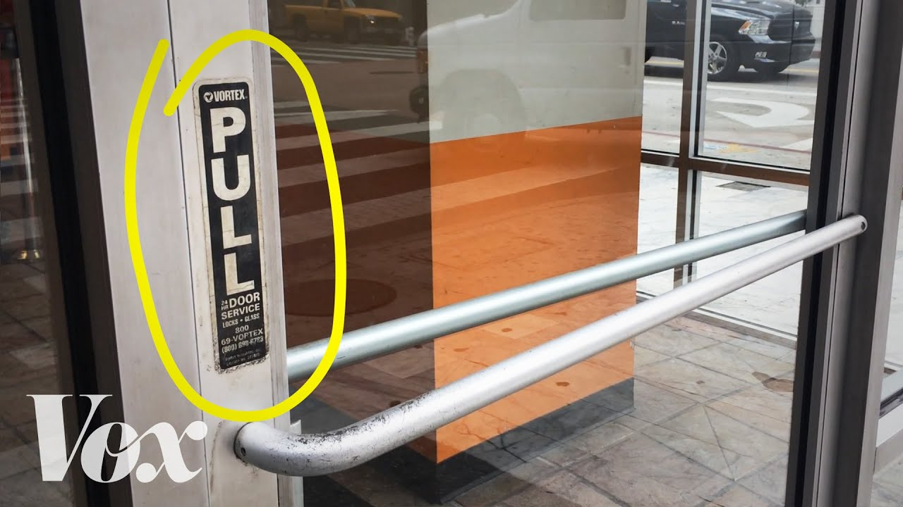{data-zoom-image .w-50}
<figcaption markdown>[:simple-youtube: Vox | « It's not you. Bad doors are everywhere. »](https://www.youtube.com/watch?v=yY96hTb8WgI)</figcaption>
</figure>

| Convention | Signification |
| ---------- | ------------- |
| Baril rouge | Explose si on tire dessus |
| Objet qui flotte et tourne | Ramasse-moi |
| Rebord de couleur | On peut interagir avec |
| Fissure dans un mur | Il y a un secret derrière |
| Lumière au bout d'un couloir | Le chemin est par là |

!!! question "Qu'est-ce qui, dans un niveau, dira au joueur « viens ici, ramasse-moi, méfie-toi » ?"

### L'engagement

<figure markdown>
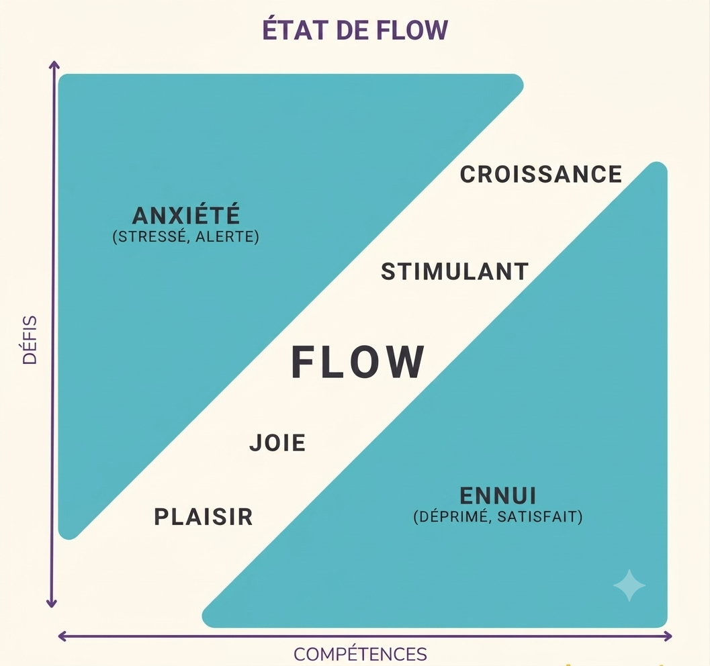{data-zoom-image .w-50}
</figure>

Pour garder l'engagement du joueur, on travaille la difficulté progressive d'un jeu.

Pas trop dur, mais pas trop facile (_flow_[^flow]) et surtout, une progression accompagnée d'apprentissages.

[^flow]: [Flow (psychologie)](https://en.wikipedia.org/wiki/Flow_(psychology))

### L'agentivité

<figure markdown>
{.w-50}
</figure>

Le sentiment que ses actions ont un impact existe à deux niveaux :

* **Micro** : chaque action reçoit une réponse immédiate : le bouton s'enfonce, le son confirme, la porte s'ouvre parce que **j'ai** trouvé la clé.
* **Macro** : mes choix changent la suite : fins multiples, chemins alternatifs. (non requis pour le cours)

## Condition de victoire

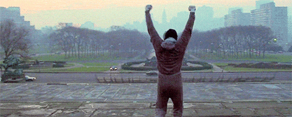{.w-100}

> « On gagne quand on a fini » ne se programme pas 🤷

| Vague | Programmable |
|---|---|
| « Quand on a exploré le niveau » | « Atteindre la zone de sortie » (trigger box) |
| « Quand on a ramassé des objets » | « Ramasser LES 3 gemmes » `if (gemmes >= 3)` |
| « Quand on survit au niveau » | « Survivre 60 secondes » `if (chrono >= 60)` |

Même exercice pour la **défaite**, si défaite il y a.

## La portée (_scope_)

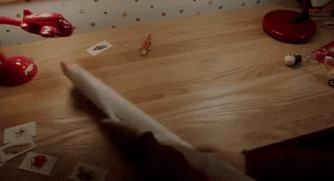{.w-100}

Prochain cours, il te restera **10 semaines** avec le dernier cours qui sera la présentation finale.

* Semaine 1 | 27 août
* Semaine 2 | 3 septembre
* Semaine 3 | 10 septembre
* **Semaine 4 | 17 septembre** 📍
* Semaine 5 | 24 septembre 👉 Remise du GDD
* Semaine 6 | 1 octobre
* Semaine 7 | 8 octobre 👉 Remise prototype
* Semaine 8 | 22 octobre  
* Semaine 9 | 29 octobre 👉 Remise tranche verticale
* Semaine 10 | 5 novembre  
* Semaine 11 | 12 novembre  
* Semaine 12 | 19 novembre 👉 Remise version Alpha
* Semaine 13 | 26 novembre  
* Semaine 14 | 3 décembre 👉 Remise version Beta
* Semaine 15 | 10 décembre : Présentation finale

## Narrer un jeu

> **Narrer** verbe 
> Faire le récit de (quelque chose), raconter

### Cercle de Dan Harmon (facultatif)

<figure markdown>
{.w-50 data-zoom-image}
</figure>

Créé par le scénariste de *Rick and Morty*, il résume chaque épisode en 1 phrase :

> Quelqu'un veut quelque chose, va le chercher, en paye le prix fort et revient changé

| Étape | Explication |
|---|---|
| :sunny:&nbsp;***You*** | Situation de départ. On comprend qui est le personnage principal et comment il se comporte dans son état naturel. | 
| :sunny:&nbsp;***Need*** | Le personnage veut, souhaite ou a besoin de quelque chose. |
| :white_sun_small_cloud:&nbsp;***Go***  | Il part à sa recherche et doit quitter sa zone de confort. |
| :cloud:&nbsp;***Search***  | Il doit s'adapter à cette nouvelle réalité. Il explore, via des détours, des impasses et il vit ses premiers échecs. |
| :cloud_rain:&nbsp;***Find***  | Le personnage trouve ce qu'il cherchait, mais ce n'est pas comme il pensait au point 2 |
| :cloud_lightning:&nbsp;***Take***  | Il obtient ce qu'il veut, mais en paye le prix ! |
| :white_sun_cloud:&nbsp;***Return***  | Il retourne à la situation de départ. |
| :sunny:&nbsp;***Changed***  | Le personnage n'est plus le même. Son aventure l'a changé. |

!!! tip "L'étape 6 (🌩 Take) doit être intense"

    S'il faut une clé pour ouvrir un coffre.
    
    Règle d'or : il ne faut surtout pas accéder **facilement** à cette clé. Ce serait ennuyant.
    
    Pour l'obtenir, il faudrait idéalement devoir kidnapper le ministre des clés et avoir la garde nationale sur le dos. Ou encore, faire un pacte avec le diable. Bref, il faut une «twist» pour rendre cette étape de l'histoire captivante.

#### :robot: R.O.B. 

| Étape | Niveau 1 |
| --- | --- |
| :sunny:&nbsp;***You*** | :robot: R.O.B., un petit robot ouvrier, nettoie le sol d'une usine. Tutoriel de déplacement du personnage |
| :sunny:&nbsp;***Need*** | L'usine s'arrête d'un coup. Un oiseau mécanique a volé la batterie centrale ! :robot: R.O.B. veut redémarrer son usine. |
| :white_sun_small_cloud:&nbsp;***Go*** | :robot: R.O.B. sort de l'usine par le toit. (L'environnement change : on passe de l'intérieur à l'extérieur, dans les nuages). |
| :cloud:&nbsp;***Search*** | :robot: R.O.B. affronte des bourrasques de vent, rate des sauts, meurt et recommence. Il doit maîtriser le dash pour avancer. |
| :cloud_rain:&nbsp;***Find*** | Il atteint le nid de l'oiseau et trouve la batterie brillante. Mais surprise : l'oiseau s'en servait pour couver ses oeufs électroniques. |
| :cloud_lightning:&nbsp;***Take*** | :robot: R.O.B. prend la batterie, mais le nid s'effondre et les oeufs éclatent. Il tombe dans le vide et perd un de ses bras dans la chute. Il est blessé et triste pour les oeufs. |
| :white_sun_cloud:&nbsp;***Return*** | Il atterrit lourdement au point de départ et constate que l'usine est déjà repartie et qu'il s'était trompé au sujet de l'oiseau. |
| :sunny:&nbsp;***Changed*** | :robot: R.O.B. essaye de retourner travailler avec un membre en moins, ce qui rend sa tâche difficile. |

### Narration environnementale

<figure markdown>
{.w-50}
<figcaption markdown>[Stray](https://www.playstation.com/fr-ca/games/stray/)</figcaption>
</figure>

La narration environnementale (_environmental storytelling_) est l'art de communiquer les étapes d'une histoire sans mot.

Peut être très efficace pour évoquer une émotion.

| Ce que tu veux raconter | ❌ En texte | ✅ En jeu |
|---|---|---|
| « Cet endroit était habité » | Un panneau qui l'explique | Des chaises renversées, une tasse de café encore chaude, un jouet par terre |
| « Il ne faut pas aller là » | « Attention, danger! » | Une lumière rouge clignote, un squelette à l'entrée, un son grave qui monte |
| « Tu as réussi quelque chose d'important » | « Bravo! Quête complétée » | La porte s'ouvre avec des confettis, un thème musical démarre, le ciel devient bleu |

## Contrôles 

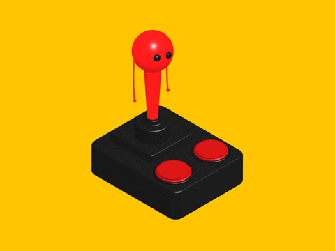{.w-100 .aspect-4-3}

Planifier les contrôles en fonction du type de jeu : 

- Première personne 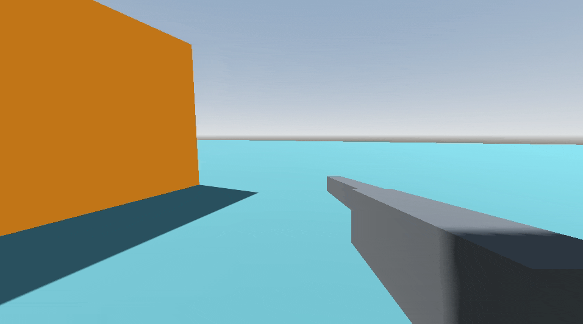{data-zoom-image .w-33}
- Troisième personne 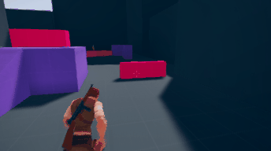{data-zoom-image .w-33}
- Autres (caméra qui suit un objet) : voiture, jeu 2.5D, boule 
{.h-auto .aspect-16-9}

{.h-auto .aspect-16-9}

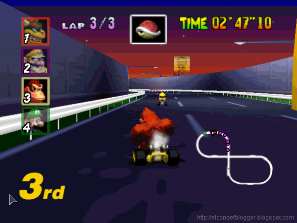{.aspect-16-9}

### Manette

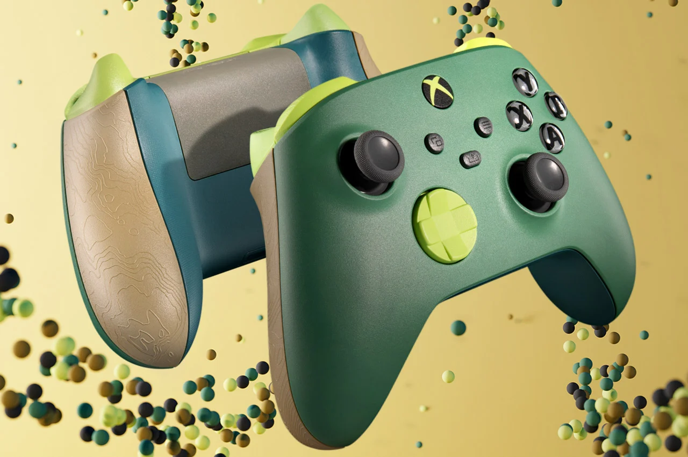{data-zoom-image .w-25}

Le [Character controller](./unity-assets/index.md) passe par le _Input System_ de Unity. Ça veut dire qu'on peut brancher une manette Xbox, appuyer sur *Play* et ça marche.

Par contre, pour se déplacer avec une manette dans les menus du jeu ça demande de configurer le _EventSystem_, on y reviendra.

### Borne d'arcade (optionnel)

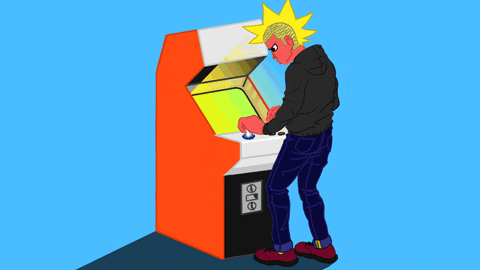{.w-50}

On a une **borne d'arcade** au département. L'avantage de concevoir son jeu pour cette plateforme est de faire partie du catalogue des jeux présentés dans les événements du département.

Contrôles de l'arcade :

> **4 directions. 2 boutons. C'est tout.**

Ce qui veut dire pas de caméra libre et un jeu `2.5D`

Pour tester le concept, on peut le faire simplement avec une manette XBOX en utilisant le D-pad (croix directionnelle) + 2 boutons.

## Devoirs

  {.aspect-4-3}

  <small>Travail</small> 
  **[Document de conception](./devoirs/gdd/index.md){.stretched-link .back}**

