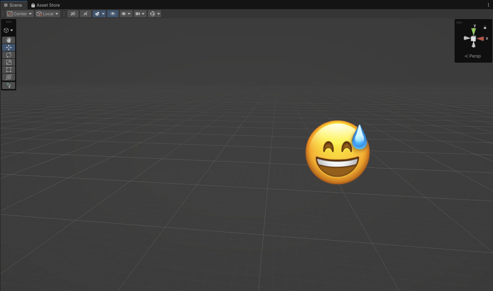
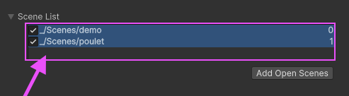

# Cours 4

!!! abstract ":material-check-decagram: Remise du jeu express — 15 %"
    **À déposer la veille du cours.** Environnement navigable, personnage contrôlable, physique, trigger, scènes, habillage, build.

!!! abstract ":material-check-decagram: Remise du GDD — 5 %"
    À la fin de la séance, après l'atelier et la validation. Le document est ensuite **verrouillé**.

## Test

Test des jeux en classe.

## Scene

{.h-auto}

Les scènes en Unity sont différents lieux ou interfaces qui sont traditionnellement séparés par un écran de chargement.

Pour créer une nouvelle scène, dans le dossier scène, clic-droit > `Create` > `Scene` > `Scene`.

!!! info "Skybox manquant ?"

    {data-zoom-image .w-25}

    `Window` > `Rendering` > `Lighting` > onglet `Environment` → `Skybox Material` : assigne `Default-Skybox`

### Changer de scène

Pour changer de scène, il faut d'abord configurer les scènes du build. On doit mentionner manuellement à Unity les scènes qui font officiellement parti de notre jeu.

- `File` > `Build Profiles`
- Dans la colonne de gauche, clic sur `Scene List`
- Il faut glisser manuellement les scènes de notre jeu dans cette case ! {data-zoom-image} 

Un fois les scènes ajoutées dans la liste, on peut utiliser un ETB (_Enhanced Trigger Box_) pour déclencher un changement de scène.

- Dans la liste des réponses, choisir `Load Scene`
- Dans `Load Level Name`, inscrire le nom **EXACTE** de la scène vers où il faut se diriger
- Play {data-zoom-image .w-10}

<!-- ## Déroulement de la séance

| Temps | Activité |
|---|---|
| 0h00 – 0h20 | Retour sur les jeux express remis |
| 0h20 – 1h00 | La boucle de jeu, la victoire, le scope, les 5 pièges |
| 1h00 – 1h30 | Techniques narratives |
| 1h30 – 1h45 | Pause |
| 1h45 – 2h35 | Atelier GDD + validation et verrouillage |
| 2h35 – 3h05 | GitHub : dépôt, devlog, Projects |
| 3h05 – 3h25 | Liste de sprint et colonne Won't |
| 3h25 – 3h35 | Démarrage du greybox | -->

## Retour sur les jeux express

## Concevoir

### La boucle de jeu : des verbes, pas une ambiance

### Les 4 notions d'interaction

#### L'interacteur

#### L'affordance

#### L'engagement

#### L'agentivité

### La condition de victoire

### Le scope : faisons le calcul ensemble

### Les 5 pièges classiques du GDD

### Le cahier des charges commun

## Raconter

### Techniques narratives

#### La narration environnementale

#### *Show, don't tell*

#### Raconter par le level design

#### La cinématique minimale

## Atelier GDD

### Écrire

### Valider : cinq minutes, et c'est verrouillé

## GitHub

### Le dépôt et le `.gitignore` Unity

### Le premier commit

### Le README comme devlog

### Le devlog : format imposé

### Créer le tableau GitHub Projects

## Planifier (un peu)

!!! warning "Ce n'est pas encore un backlog"
    Aujourd'hui : **8 cartes maximum**, un seul objectif — se rendre au prototype jouable du [cours 7](./cours07.md). Le vrai backlog s'écrit là-bas, une fois que le prototype existe et que tu sais ce que coûte une heure de ton propre travail.

### La liste de sprint

### La colonne `Won't` : trois choses que tu ne feras pas

## Démarrer

### Le greybox de ton niveau

Un greybox c'est l'équivalent d'un Wireframe en Web.

## Devoirs

<!-- Savoirs essentiels touchés (note pour l'enseignant) :

-->

<!--
================================================================
NOTES DE RÉDACTION — à supprimer une fois la séance écrite
================================================================
À rapatrier depuis .archive/ (voir .archive/MIGRATION.md) :
  - .archive/cours04.md  § La boucle de jeu : des verbes, pas une ambiance
                         § La condition de victoire
                         § Le scope : faisons le calcul ensemble
                         § Les 5 pièges classiques du GDD
                         § Le cahier des charges commun
                         § Atelier
  - .archive/cours05.md  § La validation : cinq minutes, et c'est verrouillé
                         § Le versionning : la ceinture de sécurité
                         § Le greyboxing : valider l'espace avant de le décorer
  - .archive/cours07.md  § Qu'est-ce qu'une interaction?
                         § Les 4 notions d'interaction
  - .archive/cours03.md  § Et maintenant, TON jeu : le GDD
  - .archive/exercices/cours04-atelier-gdd.md
  - .archive/exercices/cours05-demarrer-ton-jeu.md
  - devoirs/gdd.md et devoirs/gdd-jeu.md (pondération 5 % maintenant)

À écrire à neuf : techniques narratives, devlog (format imposé), tableau
GitHub Projects, liste de sprint + colonne Won't, grille de correction du
jeu express (15 %).

ATTENTION — séance sans presque pas de Unity. Terminer par le démarrage
du greybox pour que les élèves repartent avec l'éditeur ouvert.
================================================================
-->
